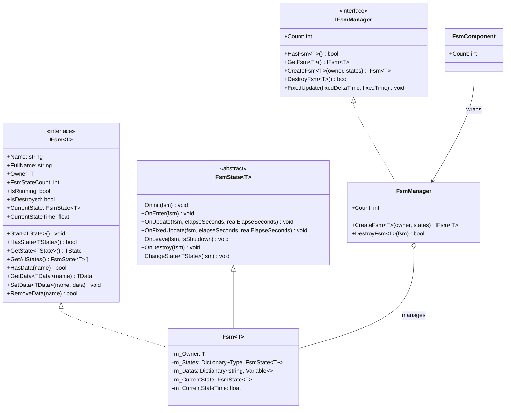

# APIリファレンス

本ドキュメントでは、GameFrameX Unity FSM有限状態機械システムの完全なAPIインターフェース、クラス、メソッドについて詳しく説明します。

## 概要

FSM（有限状態機械）モジュールは、功能齐全のゲーム状態管理能力を提供し、以下をサポートします：
- ジェネリック型安全な有限状態機械実装
- 状態ライフサイクル管理（初期化、エントリ、更新、离开、破棄）
- 状態間データ共有メカニズム
- Unityコンポーネント統合

## コアインターフェース

### IFsm<T>

有限状態機械インターフェース、状態機械のコア操作を定義します。

> Source: [IFsm.cs](https://github.com/GameFrameX/com.gameframex.unity.fsm/blob/main/Runtime/Fsm/IFsm.cs#L18-L179)

#### プロパティ

| プロパティ | タイプ | 説明 |
|------|------|------|
| `Name` | `string` | 有限状態機械の名称を取得 |
| `FullName` | `string` | 有限状態機械の完全な名称を取得（所有者タイプと名称を含む） |
| `Owner` | `T` | 有限状態機械の所有者オブジェクトを取得 |
| `FsmStateCount` | `int` | 有限状態機械内の状態数を取得 |
| `IsRunning` | `bool` | 有限状態機械が実行中かどうかを取得 |
| `IsDestroyed` | `bool` | 有限状態機械が破棄されたかどうかを取得 |
| `CurrentState` | `FsmState<T>` | 現在の有限状態機械の状態を取得 |
| `CurrentStateTime` | `float` | 現在の状態が継続している時間を取得（秒） |

#### メソッド

**Start**

```csharp
void Start<TState>() where TState : FsmState<T>
void Start(Type stateType)
```

有限状態機械を開始し、指定された状態に入ります。

**HasState**

```csharp
bool HasState<TState>() where TState : FsmState<T>
bool HasState(Type stateType)
```

指定された状態が存在するかどうかを確認します。

**GetState**

```csharp
TState GetState<TState>() where TState : FsmState<T>
FsmState<T> GetState(Type stateType)
```

指定されたタイプの状態インスタンスを取得します。

**GetAllStates**

```csharp
FsmState<T>[] GetAllStates()
void GetAllStates(List<FsmState<T>> results)
```

有限状態機械のすべての状態を取得します。

**データ操作**

```csharp
bool HasData(string name)
TData GetData<TData>(string name) where TData : Variable
Variable GetData(string name)
void SetData<TData>(string name, TData data) where TData : Variable
void SetData(string name, Variable data)
bool RemoveData(string name)
```

状態機械内部のデータアクセス操作、ジェネリックタイプのデータストレージをサポートします。

---

### IFsmManager

有限状態機械マネージャーインターフェース、すべての有限状態機械インスタンスの管理を担当します。

> Source: [IFsmManager.cs](https://github.com/GameFrameX/com.gameframex.unity.fsm/blob/main/Runtime/Fsm/IFsmManager.cs#L16-L184)

#### プロパティ

| プロパティ | タイプ | 説明 |
|------|------|------|
| `Count` | `int` | 現在管理している有限状態機械数を取得 |

#### メソッド

**HasFsm**

```csharp
bool HasFsm<T>() where T : class
bool HasFsm(Type ownerType)
bool HasFsm<T>(string name) where T : class
bool HasFsm(Type ownerType, string name)
```

指定された有限状態機械が存在するかどうかを確認します。

**GetFsm**

```csharp
IFsm<T> GetFsm<T>() where T : class
FsmBase GetFsm(Type ownerType)
IFsm<T> GetFsm<T>(string name) where T : class
FsmBase GetFsm(Type ownerType, string name)
```

指定された有限状態機械インスタンスを取得します。

**GetAllFsms**

```csharp
FsmBase[] GetAllFsms()
void GetAllFsms(List<FsmBase> results)
```

すべての有限状態機械を取得します。

**CreateFsm**

```csharp
IFsm<T> CreateFsm<T>(T owner, params FsmState<T>[] states) where T : class
IFsm<T> CreateFsm<T>(string name, T owner, params FsmState<T>[] states) where T : class
IFsm<T> CreateFsm<T>(T owner, List<FsmState<T>> states) where T : class
IFsm<T> CreateFsm<T>(string name, T owner, List<FsmState<T>> states) where T : class
```

新しい有限状態機械を作成します。

**DestroyFsm**

```csharp
bool DestroyFsm<T>() where T : class
bool DestroyFsm(Type ownerType)
bool DestroyFsm<T>(string name) where T : class
bool DestroyFsm(Type ownerType, string name)
bool DestroyFsm<T>(IFsm<T> fsm) where T : class
bool DestroyFsm(FsmBase fsm)
```

指定された有限状態機械を破棄します。

**FixedUpdate**

```csharp
void FixedUpdate(float fixedDeltaTime, float fixedTime)
```

すべての有限状態機械の固定更新をポーリングします。

---

## コアクラス

### FsmState<T>

有限状態機械状態ベースクラス、このクラスを継承して具体的な状態実装を作成します。

> Source: [FsmState.cs](https://github.com/GameFrameX/com.gameframex.unity.fsm/blob/main/Runtime/Fsm/FsmState.cs#L17-L136)

#### ライフサイクルメソッド

```csharp
protected internal virtual void OnInit(IFsm<T> fsm)
```

状態初期化時に呼び出され、状態関連データの初期化を実行できます。

```csharp
protected internal virtual void OnEnter(IFsm<T> fsm)
```

状態に入る時に呼び出され、状態に入る初期化ロジックを実行できます。

```csharp
protected internal virtual void OnUpdate(IFsm<T> fsm, float elapseSeconds, float realElapseSeconds)
```

状態ポーリング時に呼び出され、毎フレーム実行され、状態ロジックの更新に使用されます。

- `elapseSeconds`：論理経過時間
- `realElapseSeconds`：実際の経過時間

```csharp
protected internal virtual void OnFixedUpdate(IFsm<T> fsm, float elapseSeconds, float realElapseSeconds)
```

状態固定ポーリング時に呼び出され、固定時間間隔で更新します。

```csharp
protected internal virtual void OnLeave(IFsm<T> fsm, bool isShutdown)
```

状態を離れる時に呼び出されます。

- `isShutdown`：状態機械全体を閉じる時にトリガーされたかどうか

```csharp
protected internal virtual void OnDestroy(IFsm<T> fsm)
```

状態が破棄される時に呼び出され、リソースをクリーンアップします。

#### 状態切り替えメソッド

```csharp
public void ChangeToState<TState>(IFsm<T> fsm) where TState : FsmState<T>
protected void ChangeState<TState>(IFsm<T> fsm) where TState : FsmState<T>
protected void ChangeState(IFsm<T> fsm, Type stateType)
```

指定された状態に切り替えます。

---

### FsmComponent

Unityコンポーネント、Unityシーンに統合された状態機械マネージャー。

> Source: [FsmComponent.cs](https://github.com/GameFrameX/com.gameframex.unity.fsm/blob/main/Runtime/Fsm/FsmComponent.cs#L22-L268)

FsmComponentはUnity GameObjectコンポーネントであり、IFsmManagerと同じAPIインターフェースを提供し、Unityエディター内で直接使用できます。

#### プロパティ

| プロパティ | タイプ | 説明 |
|------|------|------|
| `Count` | `int` | 現在管理している有限状態機械数を取得 |

#### メソッド

FsmComponentはIFsmManagerと完全に一致するメソッドセットを提供します：

- `HasFsm<T>()`, `HasFsm(Type)`, `HasFsm<T>(string)`, `HasFsm(Type, string)`
- `GetFsm<T>()`, `GetFsm(Type)`, `GetFsm<T>(string)`, `GetFsm(Type, string)`
- `GetAllFsmList()`, `GetAllFsmList(List<FsmBase>)`
- `CreateFsm<T>(T, params FsmState<T>[])`, `CreateFsm<T>(string, T, params FsmState<T>[])`
- `CreateFsm<T>(T, List<FsmState<T>>)`, `CreateFsm<T>(string, T, List<FsmState<T>>)`
- `DestroyFsm<T>()`, `DestroyFsm(Type)`, `DestroyFsm<T>(string)`, `DestroyFsm(Type, string)`
- `DestroyFsm<T>(IFsm<T>)`, `DestroyFsm(FsmBase)`

---

## データタイプ

### Variable

有限状態機械で使用されるデータベースクラス。

> Source: [IFsm.cs](https://github.com/GameFrameX/com.gameframex.unity.fsm/blob/main/Runtime/Fsm/IFsm.cs#L148-L171)

状態機械は `Variable` を継承する任意の数据类型のストレージをサポートします：

```csharp
void SetData<TData>(string name, TData data) where TData : Variable
TData GetData<TData>(string name) where TData : Variable
```

---

## アーキテクチャ図



---

## 使用例

### 状態機械の作成

FsmComponent経由で状態機械を作成します：

```csharp
public class Character : MonoBehaviour
{
    private IFsm<Character> _fsm;
    
    private void Start()
    {
        var fsmComponent = GetComponent<FsmComponent>();
        _fsmComponent = fsmComponent.CreateFsm<Character>(this,
            new IdleState(),
            new RunState(),
            new JumpState());
        _fsm.Start<IdleState>();
    }
    
    private void Update()
    {
        // 状態機械はFsmComponentで自動的に更新される
    }
}
```

> Source: [FsmComponent.cs](https://github.com/GameFrameX/com.gameframex.unity.fsm/blob/main/Runtime/Fsm/FsmComponent.cs#L163-L166)

### 状態の定義

カスタム状態クラスを作成します：

```csharp
public class IdleState : FsmState<Character>
{
    protected internal override void OnEnter(IFsm<Character> fsm)
    {
        // 待機状態に入る
    }
    
    protected internal override void OnUpdate(IFsm<Character> fsm, float elapseSeconds, float realElapseSeconds)
    {
        // 状態を切り替える必要があるかどうか検出
        if (Input.GetKeyDown(KeyCode.Space))
        {
            ChangeState<JumpState>(fsm);
        }
    }
    
    protected internal override void OnLeave(IFsm<Character> fsm, bool isShutdown)
    {
        // 待機状態を離れる
    }
}
```

> Source: [FsmState.cs](https://github.com/GameFrameX/com.gameframex.unity.fsm/blob/main/Runtime/Fsm/FsmState.cs#L38-L69)

### データ共有

状態間でデータを共有します：

```csharp
// ある状態でデータを設定
fsm.SetData("health", new VarInt(100));
fsm.SetData("score", new VarInt(0));

// 別の状態でデータを読み取り
VarInt health = fsm.GetData<VarInt>("health");
int currentHealth = health.Value;
```

> Source: [Fsm.cs](https://github.com/GameFrameX/com.gameframex.unity.fsm/blob/main/Runtime/Fsm/Fsm.cs#L452-L481)

---

## 関連リンク

- [概要](./1-overview) - 有限状態機械システム概要
- [インストール](./2-installation) - インストールと設定ガイド
- [クイックスタート](./3-getting-started) - クイックスタート教程
- [コアコンセプト](./04.features.md) - コアコンセプト详解
- [トラブルシューティング](./6-troubleshooting) - よくある質問と解答
