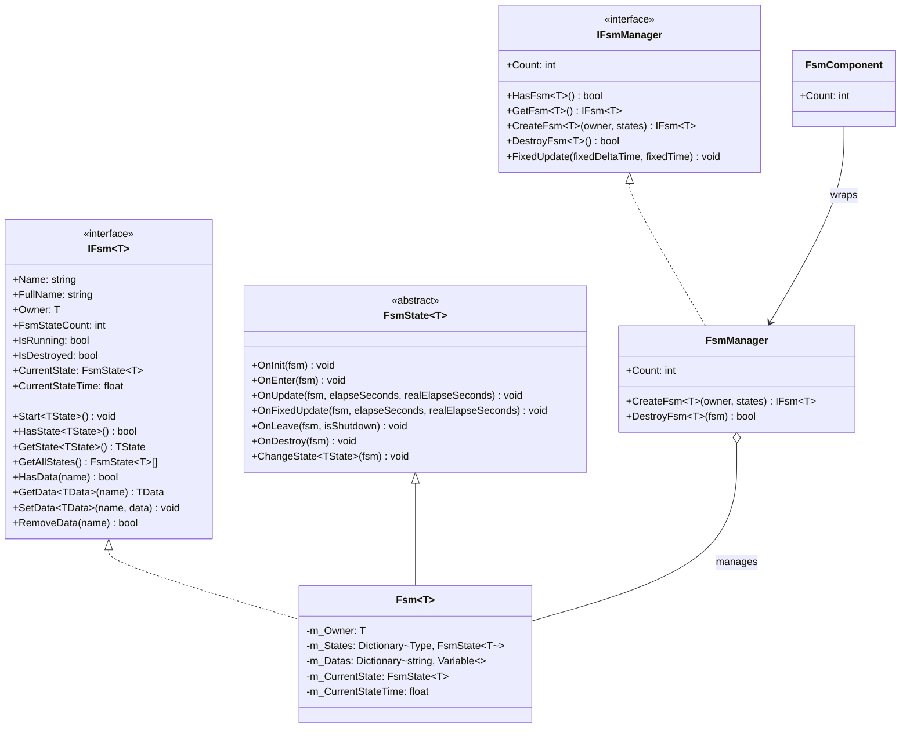

# API 参考

本文档详细列出了 GameFrameX Unity FSM 有限状態機械系统的完整 API インターフェース、クラス和メソッド。

## 概要

FSM（有限状態機械）模块提供します機能完善的ゲームステータス管理能力，サポート：
- 泛型クラス型安全的有限状態機械実装
- ステータス生命周期管理（初期化、进入、更新、离开、销毁）
- ステータス间数据共享机制
- Unity コンポーネント集成

## コアインターフェース

### IFsm<T>

有限状態機械インターフェース，定义ステータス机的コア操作。

> Source: [IFsm.cs](https://github.com/GameFrameX/com.gameframex.unity.fsm/blob/main/Runtime/Fsm/IFsm.cs#L18-L179)

#### プロパティ

| プロパティ | クラス型 | 説明 |
|------|------|------|
| `Name` | `string` | 取得有限状態機械名称 |
| `FullName` | `string` | 取得有限状態機械完整名称（包含持有者クラス型和名称） |
| `Owner` | `T` | 取得有限状態機械持有者对象 |
| `FsmStateCount` | `int` | 取得有限状態機械中ステータス的数量 |
| `IsRunning` | `bool` | 取得有限状態機械是否正在运行 |
| `IsDestroyed` | `bool` | 取得有限状態機械是否已被销毁 |
| `CurrentState` | `FsmState<T>` | 取得当前有限状態機械ステータス |
| `CurrentStateTime` | `float` | 取得当前ステータス已持续的时间（秒） |

#### メソッド

**Start**

```csharp
void Start<TState>() where TState : FsmState<T>
void Start(Type stateType)
```

开始有限状態機械，进入指定ステータス。

**HasState**

```csharp
bool HasState<TState>() where TState : FsmState<T>
bool HasState(Type stateType)
```

检查指定ステータス是否存在。

**GetState**

```csharp
TState GetState<TState>() where TState : FsmState<T>
FsmState<T> GetState(Type stateType)
```

取得指定クラス型的ステータスインスタンス。

**GetAllStates**

```csharp
FsmState<T>[] GetAllStates()
void GetAllStates(List<FsmState<T>> results)
```

取得有限状態機械的所有ステータス。

**数据操作**

```csharp
bool HasData(string name)
TData GetData<TData>(string name) where TData : Variable
Variable GetData(string name)
void SetData<TData>(string name, TData data) where TData : Variable
void SetData(string name, Variable data)
bool RemoveData(string name)
```

ステータス机内部数据存取操作，サポート泛型クラス型的数据存储。

---

### IFsmManager

有限状態機械管理器インターフェース，负责管理所有有限状態機械インスタンス。

> Source: [IFsmManager.cs](https://github.com/GameFrameX/com.gameframex.unity.fsm/blob/main/Runtime/Fsm/IFsmManager.cs#L16-L184)

#### プロパティ

| プロパティ | クラス型 | 説明 |
|------|------|------|
| `Count` | `int` | 取得当前管理的有限状態機械数量 |

#### メソッド

**HasFsm**

```csharp
bool HasFsm<T>() where T : class
bool HasFsm(Type ownerType)
bool HasFsm<T>(string name) where T : class
bool HasFsm(Type ownerType, string name)
```

检查指定有限状態機械是否存在。

**GetFsm**

```csharp
IFsm<T> GetFsm<T>() where T : class
FsmBase GetFsm(Type ownerType)
IFsm<T> GetFsm<T>(string name) where T : class
FsmBase GetFsm(Type ownerType, string name)
```

取得指定的有限状態機械インスタンス。

**GetAllFsms**

```csharp
FsmBase[] GetAllFsms()
void GetAllFsms(List<FsmBase> results)
```

取得所有有限状態機械。

**CreateFsm**

```csharp
IFsm<T> CreateFsm<T>(T owner, params FsmState<T>[] states) where T : class
IFsm<T> CreateFsm<T>(string name, T owner, params FsmState<T>[] states) where T : class
IFsm<T> CreateFsm<T>(T owner, List<FsmState<T>> states) where T : class
IFsm<T> CreateFsm<T>(string name, T owner, List<FsmState<T>> states) where T : class
```

作成新的有限状態機械。

**DestroyFsm**

```csharp
bool DestroyFsm<T>() where T : class
bool DestroyFsm(Type ownerType)
bool DestroyFsm<T>(string name) where T : class
bool DestroyFsm(Type ownerType, string name)
bool DestroyFsm<T>(IFsm<T> fsm) where T : class
bool DestroyFsm(FsmBase fsm)
```

销毁指定的有限状態機械。

**FixedUpdate**

```csharp
void FixedUpdate(float fixedDeltaTime, float fixedTime)
```

轮询所有有限状態機械的固定更新。

---

## コアクラス

### FsmState<T>

有限状態機械ステータス基クラス，继承此クラス以作成具体的ステータス実装。

> Source: [FsmState.cs](https://github.com/GameFrameX/com.gameframex.unity.fsm/blob/main/Runtime/Fsm/FsmState.cs#L17-L136)

#### 生命周期メソッド

```csharp
protected internal virtual void OnInit(IFsm<T> fsm)
```

ステータス初期化时呼び出し，可在此进行ステータス関連数据的初期化。

```csharp
protected internal virtual void OnEnter(IFsm<T> fsm)
```

ステータス进入时呼び出し，可在此执行进入ステータスの初期化論理。

```csharp
protected internal virtual void OnUpdate(IFsm<T> fsm, float elapseSeconds, float realElapseSeconds)
```

ステータス轮询时呼び出し，每帧执行，に使用ステータス逻辑更新。

- `elapseSeconds`: 逻辑流逝时间
- `realElapseSeconds`: 真实流逝时间

```csharp
protected internal virtual void OnFixedUpdate(IFsm<T> fsm, float elapseSeconds, float realElapseSeconds)
```

ステータス固定轮询时呼び出し，使用固定时间步长更新。

```csharp
protected internal virtual void OnLeave(IFsm<T> fsm, bool isShutdown)
```

ステータス离开时呼び出し。

- `isShutdown`: 是否是关闭整个ステータス机时触发

```csharp
protected internal virtual void OnDestroy(IFsm<T> fsm)
```

ステータス销毁时呼び出し，に使用清理リソース。

#### ステータス切换メソッド

```csharp
public void ChangeToState<TState>(IFsm<T> fsm) where TState : FsmState<T>
protected void ChangeState<TState>(IFsm<T> fsm) where TState : FsmState<T>
protected void ChangeState(IFsm<T> fsm, Type stateType)
```

切换到指定ステータス。

---

### FsmComponent

Unity コンポーネント，集成到 Unity シーン中的ステータス机管理器。

> Source: [FsmComponent.cs](https://github.com/GameFrameX/com.gameframex.unity.fsm/blob/main/Runtime/Fsm/FsmComponent.cs#L22-L268)

FsmComponent 是 Unity GameObject コンポーネント，提供与 IFsmManager 相同的 API インターフェース，可直接在 Unity 编辑器中使用。

#### プロパティ

| プロパティ | クラス型 | 説明 |
|------|------|------|
| `Count` | `int` | 取得当前管理的有限状態機械数量 |

#### メソッド

FsmComponent 提供します与 IFsmManager 完全一致的メソッド集合：

- `HasFsm<T>()`, `HasFsm(Type)`, `HasFsm<T>(string)`, `HasFsm(Type, string)`
- `GetFsm<T>()`, `GetFsm(Type)`, `GetFsm<T>(string)`, `GetFsm(Type, string)`
- `GetAllFsmList()`, `GetAllFsmList(List<FsmBase>)`
- `CreateFsm<T>(T, params FsmState<T>[])`, `CreateFsm<T>(string, T, params FsmState<T>[])`
- `CreateFsm<T>(T, List<FsmState<T>>)`, `CreateFsm<T>(string, T, List<FsmState<T>>)`
- `DestroyFsm<T>()`, `DestroyFsm(Type)`, `DestroyFsm<T>(string)`, `DestroyFsm(Type, string)`
- `DestroyFsm<T>(IFsm<T>)`, `DestroyFsm(FsmBase)`

---

## 数据クラス型

### Variable

有限状態機械中使用的数据基クラス。

> Source: [IFsm.cs](https://github.com/GameFrameX/com.gameframex.unity.fsm/blob/main/Runtime/Fsm/IFsm.cs#L148-L171)

ステータス机サポート存储任意を継承 `Variable` 的数据クラス型：

```csharp
void SetData<TData>(string name, TData data) where TData : Variable
TData GetData<TData>(string name) where TData : Variable
```

---

## 架构图



---

## 使用例

### 作成ステータス机

を通じて FsmComponent 作成ステータス机：

```csharp
public class Character : MonoBehaviour
{
    private IFsm<Character> _fsm;
    
    private void Start()
    {
        var fsmComponent = GetComponent<FsmComponent>();
        _fsmComponent = fsmComponent.CreateFsm<Character>(this,
            new IdleState(),
            new RunState(),
            new JumpState());
        _fsm.Start<IdleState>();
    }
    
    private void Update()
    {
        // ステータス机在 FsmComponent 中自动更新
    }
}
```

> Source: [FsmComponent.cs](https://github.com/GameFrameX/com.gameframex.unity.fsm/blob/main/Runtime/Fsm/FsmComponent.cs#L163-L166)

### 定义ステータス

作成自定义ステータスクラス：

```csharp
public class IdleState : FsmState<Character>
{
    protected internal override void OnEnter(IFsm<Character> fsm)
    {
        // 进入空闲ステータス
    }
    
    protected internal override void OnUpdate(IFsm<Character> fsm, float elapseSeconds, float realElapseSeconds)
    {
        // 检测是否必要切换ステータス
        if (Input.GetKeyDown(KeyCode.Space))
        {
            ChangeState<JumpState>(fsm);
        }
    }
    
    protected internal override void OnLeave(IFsm<Character> fsm, bool isShutdown)
    {
        // 离开空闲ステータス
    }
}
```

> Source: [FsmState.cs](https://github.com/GameFrameX/com.gameframex.unity.fsm/blob/main/Runtime/Fsm/FsmState.cs#L38-L69)

### 数据共享

在ステータス间共享数据：

```csharp
// 在某个ステータス中設定数据
fsm.SetData("health", new VarInt(100));
fsm.SetData("score", new VarInt(0));

// 在另一个ステータス中读取数据
VarInt health = fsm.GetData<VarInt>("health");
int currentHealth = health.Value;
```

> Source: [Fsm.cs](https://github.com/GameFrameX/com.gameframex.unity.fsm/blob/main/Runtime/Fsm/Fsm.cs#L452-L481)

---

## 関連リンク

- [概述](./1-overview) - 有限状態機械系统概述
- [安装](./2-installation) - 安装和配置指南
- [快速开始](./3-getting-started) - 快速上手教程
- [コア概念](./04.features.md) - コア概念详解
- [常见问题](./6-troubleshooting) - 常见问题与解答
