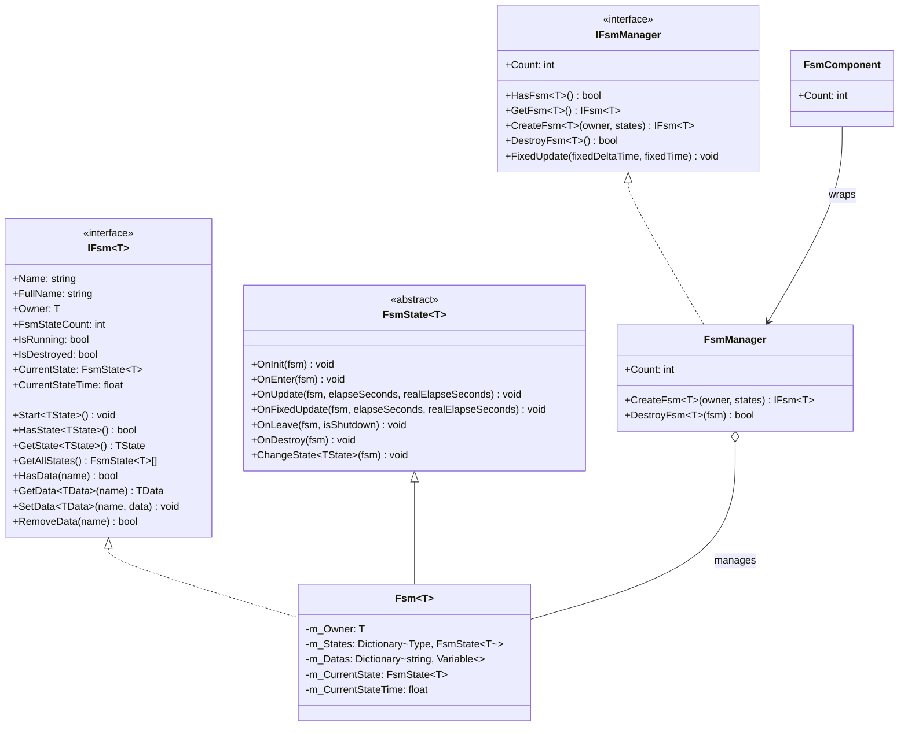

# API リファレンス

このドキュメント詳細列出了 GameFrameX Unity FSM 有限ステータス机系统的完全な API インターフェース、类和メソッド。

## 概要

FSM（有限ステータス机）モジュール提供します機能完善的游戏ステータス管理能力，サポート：
- ジェネリックタイプ安全的有限ステータス机実装
- ステータスライフサイクル管理（初期化、进入、アップデート、离开、破棄）
- ステータス间数据共享机制
- Unity コンポーネント集成

## コアインターフェース

### IFsm<T>

有限ステータス机インターフェース，定義ステータス机的コア操作。

> Source: [IFsm.cs](https://github.com/GameFrameX/com.gameframex.unity.fsm/blob/main/Runtime/Fsm/IFsm.cs#L18-L179)

#### プロパティ

| プロパティ | タイプ | 説明 |
|------|------|------|
| `Name` | `string` | 取得有限ステータス机名称 |
| `FullName` | `string` | 取得有限ステータス机完全な名称（パッケージ含持有者タイプ和名称） |
| `Owner` | `T` | 取得有限ステータス机持有者对象 |
| `FsmStateCount` | `int` | 取得有限ステータス机中ステータス的数量 |
| `IsRunning` | `bool` | 取得有限ステータス机是否〜中运行 |
| `IsDestroyed` | `bool` | 取得有限ステータス机是否已被破棄 |
| `CurrentState` | `FsmState<T>` | 取得当前有限ステータス机ステータス |
| `CurrentStateTime` | `float` | 取得当前ステータス已持续的时间（秒） |

#### メソッド

**Start**

```csharp
void Start<TState>() where TState : FsmState<T>
void Start(Type stateType)
```

开始有限ステータス机，进入指定ステータス。

**HasState**

```csharp
bool HasState<TState>() where TState : FsmState<T>
bool HasState(Type stateType)
```

確認指定ステータス是否存在。

**GetState**

```csharp
TState GetState<TState>() where TState : FsmState<T>
FsmState<T> GetState(Type stateType)
```

取得指定タイプ的ステータスインスタンス。

**GetAllStates**

```csharp
FsmState<T>[] GetAllStates()
void GetAllStates(List<FsmState<T>> results)
```

取得有限ステータス机的所有ステータス。

**数据操作**

```csharp
bool HasData(string name)
TData GetData<TData>(string name) where TData : Variable
Variable GetData(string name)
void SetData<TData>(string name, TData data) where TData : Variable
void SetData(string name, Variable data)
bool RemoveData(string name)
```

ステータス机内部数据存取操作，サポートジェネリックタイプ的数据存储。

---

### IFsmManager

有限ステータス机マネージャーインターフェース，负责管理所有有限ステータス机インスタンス。

> Source: [IFsmManager.cs](https://github.com/GameFrameX/com.gameframex.unity.fsm/blob/main/Runtime/Fsm/IFsmManager.cs#L16-L184)

#### プロパティ

| プロパティ | タイプ | 説明 |
|------|------|------|
| `Count` | `int` | 取得当前管理的有限ステータス机数量 |

#### メソッド

**HasFsm**

```csharp
bool HasFsm<T>() where T : class
bool HasFsm(Type ownerType)
bool HasFsm<T>(string name) where T : class
bool HasFsm(Type ownerType, string name)
```

確認指定有限ステータス机是否存在。

**GetFsm**

```csharp
IFsm<T> GetFsm<T>() where T : class
FsmBase GetFsm(Type ownerType)
IFsm<T> GetFsm<T>(string name) where T : class
FsmBase GetFsm(Type ownerType, string name)
```

取得指定的有限ステータス机インスタンス。

**GetAllFsms**

```csharp
FsmBase[] GetAllFsms()
void GetAllFsms(List<FsmBase> results)
```

取得所有有限ステータス机。

**CreateFsm**

```csharp
IFsm<T> CreateFsm<T>(T owner, params FsmState<T>[] states) where T : class
IFsm<T> CreateFsm<T>(string name, T owner, params FsmState<T>[] states) where T : class
IFsm<T> CreateFsm<T>(T owner, List<FsmState<T>> states) where T : class
IFsm<T> CreateFsm<T>(string name, T owner, List<FsmState<T>> states) where T : class
```

作成新的有限ステータス机。

**DestroyFsm**

```csharp
bool DestroyFsm<T>() where T : class
bool DestroyFsm(Type ownerType)
bool DestroyFsm<T>(string name) where T : class
bool DestroyFsm(Type ownerType, string name)
bool DestroyFsm<T>(IFsm<T> fsm) where T : class
bool DestroyFsm(FsmBase fsm)
```

破棄指定的有限ステータス机。

**FixedUpdate**

```csharp
void FixedUpdate(float fixedDeltaTime, float fixedTime)
```

轮询所有有限ステータス机的固定アップデート。

---

## コア类

### FsmState<T>

有限ステータス机ステータス基底クラス，継承此类以作成具体的ステータス実装。

> Source: [FsmState.cs](https://github.com/GameFrameX/com.gameframex.unity.fsm/blob/main/Runtime/Fsm/FsmState.cs#L17-L136)

#### ライフサイクルメソッド

```csharp
protected internal virtual void OnInit(IFsm<T> fsm)
```

ステータス初期化时呼び出し，可在此进行ステータス相关数据的初期化。

```csharp
protected internal virtual void OnEnter(IFsm<T> fsm)
```

ステータス进入时呼び出し，可在此执行进入ステータス的初期化逻辑。

```csharp
protected internal virtual void OnUpdate(IFsm<T> fsm, float elapseSeconds, float realElapseSeconds)
```

ステータス轮询时呼び出し，每帧执行，用于ステータス逻辑アップデート。

- `elapseSeconds`: 逻辑流逝时间
- `realElapseSeconds`: 真实流逝时间

```csharp
protected internal virtual void OnFixedUpdate(IFsm<T> fsm, float elapseSeconds, float realElapseSeconds)
```

ステータス固定轮询时呼び出し，使用固定时间步长アップデート。

```csharp
protected internal virtual void OnLeave(IFsm<T> fsm, bool isShutdown)
```

ステータス离开时呼び出し。

- `isShutdown`: 是否是閉じる整个ステータス机时トリガー

```csharp
protected internal virtual void OnDestroy(IFsm<T> fsm)
```

ステータス破棄时呼び出し，用于清理リソース。

#### ステータス切换メソッド

```csharp
public void ChangeToState<TState>(IFsm<T> fsm) where TState : FsmState<T>
protected void ChangeState<TState>(IFsm<T> fsm) where TState : FsmState<T>
protected void ChangeState(IFsm<T> fsm, Type stateType)
```

切换到指定ステータス。

---

### FsmComponent

Unity コンポーネント，集成到 Unity シーン中的ステータス机マネージャー。

> Source: [FsmComponent.cs](https://github.com/GameFrameX/com.gameframex.unity.fsm/blob/main/Runtime/Fsm/FsmComponent.cs#L22-L268)

FsmComponent 是 Unity GameObject コンポーネント，提供与 IFsmManager 相同的 API インターフェース，可直接在 Unity エディタ中使用。

#### プロパティ

| プロパティ | タイプ | 説明 |
|------|------|------|
| `Count` | `int` | 取得当前管理的有限ステータス机数量 |

#### メソッド

FsmComponent 提供します与 IFsmManager 完全一致的メソッド集合：

- `HasFsm<T>()`, `HasFsm(Type)`, `HasFsm<T>(string)`, `HasFsm(Type, string)`
- `GetFsm<T>()`, `GetFsm(Type)`, `GetFsm<T>(string)`, `GetFsm(Type, string)`
- `GetAllFsmList()`, `GetAllFsmList(List<FsmBase>)`
- `CreateFsm<T>(T, params FsmState<T>[])`, `CreateFsm<T>(string, T, params FsmState<T>[])`
- `CreateFsm<T>(T, List<FsmState<T>>)`, `CreateFsm<T>(string, T, List<FsmState<T>>)`
- `DestroyFsm<T>()`, `DestroyFsm(Type)`, `DestroyFsm<T>(string)`, `DestroyFsm(Type, string)`
- `DestroyFsm<T>(IFsm<T>)`, `DestroyFsm(FsmBase)`

---

## 数据タイプ

### Variable

有限ステータス机中使用的数据基底クラス。

> Source: [IFsm.cs](https://github.com/GameFrameX/com.gameframex.unity.fsm/blob/main/Runtime/Fsm/IFsm.cs#L148-L171)

ステータス机サポート存储任意継承自 `Variable` 的数据タイプ：

```csharp
void SetData<TData>(string name, TData data) where TData : Variable
TData GetData<TData>(string name) where TData : Variable
```

---

## アーキテクチャ图



---

## 使用例

### 作成ステータス机

通过 FsmComponent 作成ステータス机：

```csharp
public class Character : MonoBehaviour
{
    private IFsm<Character> _fsm;
    
    private void Start()
    {
        var fsmComponent = GetComponent<FsmComponent>();
        _fsmComponent = fsmComponent.CreateFsm<Character>(this,
            new IdleState(),
            new RunState(),
            new JumpState());
        _fsm.Start<IdleState>();
    }
    
    private void Update()
    {
        // 状态机在 FsmComponent 中自动更新
    }
}
```

> Source: [FsmComponent.cs](https://github.com/GameFrameX/com.gameframex.unity.fsm/blob/main/Runtime/Fsm/FsmComponent.cs#L163-L166)

### 定義ステータス

作成自定義ステータス类：

```csharp
public class IdleState : FsmState<Character>
{
    protected internal override void OnEnter(IFsm<Character> fsm)
    {
        // 进入空闲状态
    }
    
    protected internal override void OnUpdate(IFsm<Character> fsm, float elapseSeconds, float realElapseSeconds)
    {
        // 检测是否需要切换状态
        if (Input.GetKeyDown(KeyCode.Space))
        {
            ChangeState<JumpState>(fsm);
        }
    }
    
    protected internal override void OnLeave(IFsm<Character> fsm, bool isShutdown)
    {
        // 离开空闲状态
    }
}
```

> Source: [FsmState.cs](https://github.com/GameFrameX/com.gameframex.unity.fsm/blob/main/Runtime/Fsm/FsmState.cs#L38-L69)

### 数据共享

在ステータス间共享数据：

```csharp
// 在某个状态中设置数据
fsm.SetData("health", new VarInt(100));
fsm.SetData("score", new VarInt(0));

// 在另一个状态中读取数据
VarInt health = fsm.GetData<VarInt>("health");
int currentHealth = health.Value;
```

> Source: [Fsm.cs](https://github.com/GameFrameX/com.gameframex.unity.fsm/blob/main/Runtime/Fsm/Fsm.cs#L452-L481)

---

## 関連リンク

- [概要](./1-overview) - 有限ステータス机系统概要
- [インストール](./2-installation) - インストール和設定ガイド
- [快速开始](./3-getting-started) - 快速上手教程
- [コアコンセプト](./04.features.md) - コアコンセプト详解
- [常见問題](./6-troubleshooting) - 常见問題与解答
