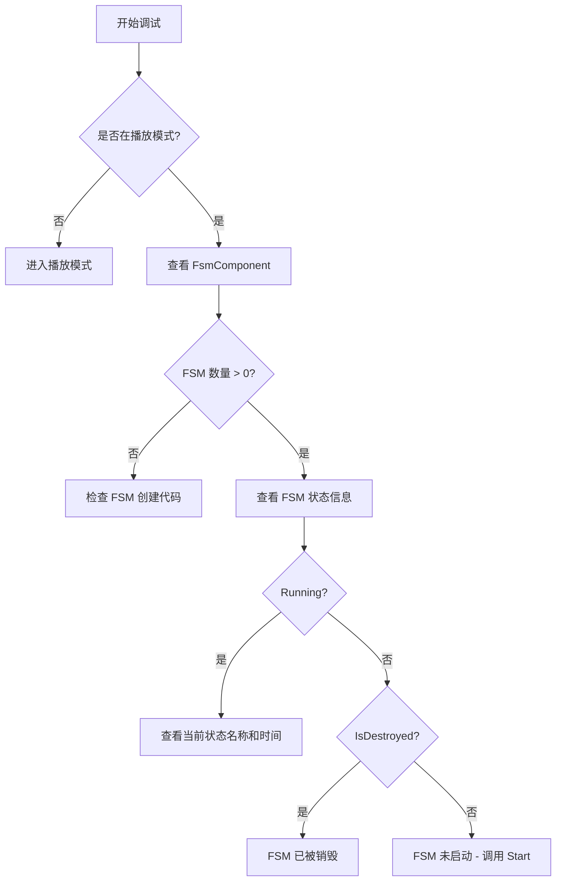

# よくある問題

このドキュメント收集了使用 GameFrameX Unity FSM 有限ステータス机コンポーネント时常见的エラー問題及其解決策。

## 概要

FSM（有限ステータス机）コンポーネント是 GameFrameX フレームワーク的コアモジュール之一，用于管理和控制游戏对象的ステータス转换。在使用过程中，開発者〜の可能性があります会遇到各种エラー和問題，このドキュメント旨在提供这些常见問題的診断メソッド和解決策。

## 汎用エラー

### 1. FSM マネージャー未初期化

**エラー情報：**
```
FSM manager is invalid.
```

**原因分析：**
此エラー表示 `FsmComponent` 无法从 `GameFrameworkEntry` 取得 `IFsmManager` モジュール。这通常是因为 Game Framework コアコンポーネント未正确初期化。

**解決策：**

1. 確認してください在シーン中追加了 `FsmComponent` コンポーネント：
```csharp
// 在 Unity 编辑器中，通过 Game Framework 菜单添加
// Game Framework -> Add Component -> Fsm
```

2. 確認してください Game Framework コアコンポーネント已正确初期化。在 `FsmComponent` 的 `Awake` メソッド中会自动取得 FSM マネージャー：
```csharp
// 源码位置: Runtime/Fsm/FsmComponent.cs
protected override void Awake()
{
    ImplementationComponentType = Utility.Assembly.GetType(componentType);
    InterfaceComponentType = typeof(IFsmManager);
    base.Awake();
    m_FsmManager = GameFrameworkEntry.GetModule<IFsmManager>();
    if (m_FsmManager == null)
    {
        Log.Fatal("FSM manager is invalid.");
        return;
    }
}
```

> Source: [FsmComponent.cs](https://github.com/GameFrameX/com.gameframex.unity.fsm/blob/main/Runtime/Fsm/FsmComponent.cs#L37-L48)

---

### 2. 作成 FSM 时 Owner 为空

**エラー情報：**
```
FSM owner is invalid.
```

**原因分析：**
作成有限ステータス机时，传入了 `null` 作为拥有者（owner）パラメータ。FSM 〜しなければなりません有一个有效的拥有者对象。

**解決策：**

確認してください作成 FSM 时传入有效的拥有者对象：

```csharp
// 错误示例
IFsm<MyCharacter> fsm = fsmComponent.CreateFsm<MyCharacter>(null, states);

// 正确示例
MyCharacter character = GetComponent<MyCharacter>();
IFsm<MyCharacter> fsm = fsmComponent.CreateFsm(character, states);
```

> Source: [Fsm.cs](https://github.com/GameFrameX/com.gameframex.unity.fsm/blob/main/Runtime/Fsm/Fsm.cs#L113-L116)

---

### 3. ステータス数组无效

**エラー情報：**
```
FSM states is invalid.
```

**原因分析：**
作成 FSM 时，ステータス数组为 `null` または长度为 0。FSM 至少〜する必要がありますパッケージ含一个ステータス。

**解決策：**

確認してください作成 FSM 时提供至少一个有效的ステータス：

```csharp
// 错误示例 - 状态数组为空
IFsm<MyCharacter> fsm = fsmComponent.CreateFsm(character);

// 正确示例 - 至少包含一个状态
IFsm<MyCharacter> fsm = fsmComponent.CreateFsm(character, 
    new IdleState(), 
    new MoveState()
);
```

> Source: [Fsm.cs](https://github.com/GameFrameX/com.gameframex.unity.fsm/blob/main/Runtime/Fsm/Fsm.cs#L118-L121)

---

### 4. 重复的ステータスタイプ

**エラー情報：**
```
FSM 'TypeNamePair' state 'StateType' is already exist.
```

**原因分析：**
在作成 FSM 时，尝试追加两个相同タイプ的ステータス。每个ステータスタイプ在同一个 FSM 中只能存在一个。

**解決策：**

確認してください每个ステータスタイプ只追加一次：

```csharp
// 错误示例 - 重复添加相同状态类型
IFsm<MyCharacter> fsm = fsmComponent.CreateFsm(character,
    new IdleState(),  // 第一次添加
    new IdleState()   // 重复添加 - 错误！
);

// 正确示例 - 每个状态类型只添加一次
IFsm<MyCharacter> fsm = fsmComponent.CreateFsm(character,
    new IdleState(),
    new MoveState(),
    new AttackState()
);
```

> Source: [Fsm.cs](https://github.com/GameFrameX/com.gameframex.unity.fsm/blob/main/Runtime/Fsm/Fsm.cs#L135-L138)

---

## ステータス机运行エラー

### 5. 重复启动 FSM

**エラー情報：**
```
FSM is running, can not start again.
```

**原因分析：**
尝试启动一个すでに在运行ステータス的 FSM。FSM 在运行期间不允许重复呼び出し `Start` メソッド。

**解決策：**

1. 在启动前確認 FSM 是否すでに在运行：
```csharp
IFsm<MyCharacter> fsm = fsmComponent.GetFsm<MyCharacter>();
if (fsm != null && !fsm.IsRunning)
{
    fsm.Start<IdleState>();
}
```

2. もし〜する必要があります重新开始，先破棄现有的 FSM：
```csharp
// 销毁现有 FSM
fsmComponent.DestroyFsm<MyCharacter>();
// 重新创建
IFsm<MyCharacter> fsm = fsmComponent.CreateFsm(character, new IdleState());
fsm.Start<IdleState>();
```

> Source: [Fsm.cs](https://github.com/GameFrameX/com.gameframex.unity.fsm/blob/main/Runtime/Fsm/Fsm.cs#L235-L238)

---

### 6. ステータス不存在

**エラー情報：**
```
FSM 'TypeNamePair' can not start state 'StateType' which is not exist.
```

**原因分析：**
尝试启动或切换到一个不存在的ステータス。该ステータス未被追加到 FSM 的ステータス列表中。

**解決策：**

1. 確認してください要启动/切换的ステータス已在作成 FSM 时追加：
```csharp
// 创建 FSM 时添加所有需要的状态
IFsm<MyCharacter> fsm = fsmComponent.CreateFsm(character,
    new IdleState(),
    new MoveState(),
    new AttackState()
);

// 启动已存在的状态
fsm.Start<IdleState>();

// 切换到已存在的状态 - 正确
fsm.GetState<AttackState>().ChangeToState<MoveState>(fsm);
```

2. 在切换ステータス前確認ステータス是否存在：
```csharp
if (fsm.HasState<MoveState>())
{
    fsm.GetState<AttackState>().ChangeToState<MoveState>(fsm);
}
```

> Source: [Fsm.cs](https://github.com/GameFrameX/com.gameframex.unity.fsm/blob/main/Runtime/Fsm/Fsm.cs#L241-L244)

---

### 7. 无效的ステータスタイプ

**エラー情報：**
```
State type 'StateType' is invalid.
```

**原因分析：**
传入的ステータスタイプ不是有效的 `FsmState<T>` 派生类。

**解決策：**

確認してくださいステータス类継承自 `FsmState<T>`：

```csharp
// 错误示例 - 普通类不能作为状态
public class MyClass { }

// 正确示例 - 必须继承 FsmState<T>
public class IdleState : FsmState<MyCharacter>
{
    protected internal override void OnEnter(IFsm<MyCharacter> fsm)
    {
        // 进入状态逻辑
    }
    
    protected internal override void OnUpdate(IFsm<MyCharacter> fsm, float elapseSeconds, float realElapseSeconds)
    {
        // 状态更新逻辑
    }
    
    protected internal override void OnLeave(IFsm<MyCharacter> fsm, bool isShutdown)
    {
        // 离开状态逻辑
    }
}
```

> Source: [Fsm.cs](https://github.com/GameFrameX/com.gameframex.unity.fsm/blob/main/Runtime/Fsm/Fsm.cs#L267-L270)

---

### 8. 当前ステータス无效，无法切换

**エラー情報：**
```
Current state is invalid.
```

**原因分析：**
尝试在 FSM 未启动或已被破棄时切换ステータス。

**解決策：**

確認してください FSM 〜中运行后再切换ステータス：

```csharp
// 错误示例 - FSM 未启动就尝试切换
IFsm<MyCharacter> fsm = fsmComponent.CreateFsm(character,
    new IdleState(),
    new MoveState()
);
// 未调用 Start 就尝试切换 - 错误！
fsm.GetState<IdleState>().ChangeToState<MoveState>(fsm);

// 正确示例 - 先启动 FSM
IFsm<MyCharacter> fsm = fsmComponent.CreateFsm(character,
    new IdleState(),
    new MoveState()
);
fsm.Start<IdleState>();  // 先启动

// 然后在状态中切换
protected internal override void OnUpdate(IFsm<MyCharacter> fsm, float elapseSeconds, float realElapseSeconds)
{
    if (shouldMove)
    {
        ChangeState<MoveState>(fsm);  // 正确：在状态内切换
    }
}
```

> Source: [Fsm.cs](https://github.com/GameFrameX/com.gameframex.unity.fsm/blob/main/Runtime/Fsm/Fsm.cs#L558-L567)

---

## 数据管理エラー

### 9. 重复作成同名 FSM

**エラー情報：**
```
Already exist FSM 'TypeNamePair'.
```

**原因分析：**
尝试作成一个已存在的 FSM（相同拥有者タイプ和名称）。

**解決策：**

1. 在作成前確認 FSM 是否已存在：
```csharp
if (!fsmComponent.HasFsm<MyCharacter>())
{
    IFsm<MyCharacter> fsm = fsmComponent.CreateFsm(character,
        new IdleState(),
        new MoveState()
    );
}
```

2. または先破棄现有的 FSM：
```csharp
fsmComponent.DestroyFsm<MyCharacter>();
IFsm<MyCharacter> fsm = fsmComponent.CreateFsm(character,
    new IdleState(),
    new MoveState()
);
```

> Source: [FsmManager.cs](https://github.com/GameFrameX/com.gameframex.unity.fsm/blob/main/Runtime/Fsm/FsmManager.cs#L284-L287)

---

### 10. 无效的数据名称

**エラー情報：**
```
Data name is invalid.
```

**原因分析：**
使用 `null` 或空字符串作为 FSM 数据的键名。

**解決策：**

始终使用有效的字符串作为数据键：

```csharp
// 错误示例
fsm.SetData<string>(null, "value");
fsm.SetData<string>("", "value");

// 正确示例
fsm.SetData<string>("health", 100);
fsm.SetData<float>("speed", 5.0f);
```

> Source: [Fsm.cs](https://github.com/GameFrameX/com.gameframex.unity.fsm/blob/main/Runtime/Fsm/Fsm.cs#L396-L399)

---

### 11. 无效的結果パラメータ

**エラー情報：**
```
Results is invalid.
```

**原因分析：**
传入 `null` 作为存储結果的可变列表パラメータ。

**解決策：**

確認してください传入有效的列表对象：

```csharp
// 错误示例
List<FsmBase> fsms = null;
fsmComponent.GetAllFsmList(fsms);

// 正确示例
List<FsmBase> fsms = new List<FsmBase>();
fsmComponent.GetAllFsmList(fsms);
```

> Source: [Fsm.cs](https://github.com/GameFrameX/com.gameframex.unity.fsm/blob/main/Runtime/Fsm/Fsm.cs#L377-L380)

---

## Unity エディタ相关問題

### 12. FsmComponent 在エディタ中不显示

**問題説明：**
在 Unity エディタ中追加了 FsmComponent，但在 Inspector パネル中看不到 FSM 情報。

**原因分析：**
`FsmComponentInspector` 仅在ランタイム显示情報，且〜する必要があります在游戏物体层级中。

**解決策：**

1. 確認してください在 **Play Mode（再生モード）** 下確認：
```csharp
// 源码位置: Editor/Inspector/FsmComponentInspector.cs
public override void OnInspectorGUI()
{
    if (!EditorApplication.isPlaying)
    {
        EditorGUILayout.HelpBox("Available during runtime only.", MessageType.Info);
        return;
    }
    // ...
}
```

2. 確認してください FsmComponent 附加在シーン中的游戏物体上，而不是预制体上：
```csharp
// Inspector 会检查游戏物体是否在层级面板中
if (IsPrefabInHierarchy(t.gameObject))
{
    // 显示 FSM 信息
}
```

> Source: [FsmComponentInspector.cs](https://github.com/GameFrameX/com.gameframex.unity.fsm/blob/main/Editor/Inspector/FsmComponentInspector.cs#L21-L25)

---

## デバッグ技巧

### 使用 FsmComponentInspector 確認 FSM ステータス

在 Unity エディタ的再生モード下，〜できます確認所有 FSM 的实时ステータス：

1. 在シーン中追加 `FsmComponent` コンポーネント
2. 进入再生モード
3. 选择带有 `FsmComponent` 的游戏物体
4. 在 Inspector 中確認 FSM 数量和每个 FSM 的ステータス



### 常见 FSM ステータス説明

| プロパティ | 説明 |
|------|------|
| `IsRunning` | FSM 是否〜中运行（已呼び出し Start） |
| `IsDestroyed` | FSM 是否已被破棄 |
| `CurrentStateName` | 当前ステータス的完全なタイプ名称 |
| `CurrentStateTime` | 当前ステータス已持续的时间（秒） |

---

## ベストプラクティス

### 1. 始终確認 FSM 是否存在后再操作

```csharp
// 推荐做法
if (fsmComponent.HasFsm<MyCharacter>())
{
    var fsm = fsmComponent.GetFsm<MyCharacter>();
    // 操作 FSM
}
```

### 2. 正确管理 FSM ライフサイクル

```csharp
// 创建
IFsm<MyCharacter> fsm = fsmComponent.CreateFsm(owner, states);
fsm.Start<IdleState>();

// 使用
// ... 游戏逻辑 ...

// 销毁
fsmComponent.DestroyFsm(fsm);
```

### 3. 使用 FsmState 内置メソッド切换ステータス

```csharp
// 推荐：在状态类中使用受保护的方法
protected internal override void OnUpdate(IFsm<MyCharacter> fsm, float elapseSeconds, float realElapseSeconds)
{
    // 使用受保护的 ChangeState 方法
    if (someCondition)
    {
        ChangeState<NextState>(fsm);
    }
}
```

---

## 関連リンク

- [概要](./1-overview) - FSM コンポーネント概要
- [インストール](./2-installation) - インストール和設定
- [快速开始](./3-getting-started) - 快速上手ガイド
- [コアコンセプト](./04.features.md) - コアコンセプト详解
- [API リファレンス](./5-api-reference) - 完全な API ドキュメント
