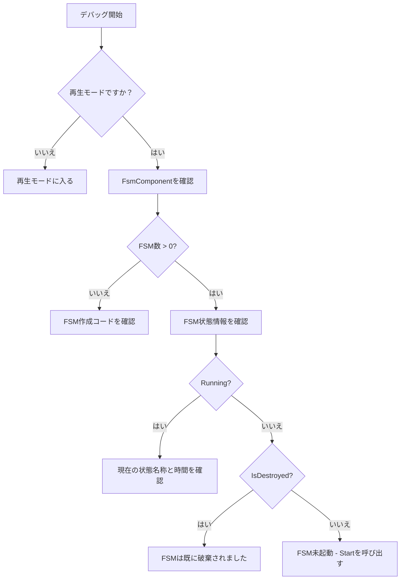

# トラブルシューティング

本ドキュメントでは、GameFrameX Unity FSM有限状態機械コンポーネントを使用する際に頻繁に发生するエラー問題と、その解決策を収集しています。

## 概要

FSM（有限状態機械）コンポーネントはGameFrameXフレームワークのコアモジュールの1つであり、ゲームオブジェクトの状態切り替えの管理と制御に使用されます。使用中に開発者は各样的エラーや問題に直面する可能性があります，本ドキュメントはこれらのよくある質問の診断方法和解決策を提供することを目的としています。

## 汎用エラー

### 1. FSMマネージャーが初期化されていない

**エラーメッセージ：**
```
FSM manager is invalid.
```

**原因分析：**
このエラーは、`FsmComponent`が`GameFrameworkEntry`から`IFsmManager`モジュールを取得できないことを示します。これは通常、Game Frameworkコアコンポーネントが正しく初期化されていないためです。

**解決策：**

1. シーンに`FsmComponent`コンポーネントが追加されていることを確認します：
```csharp
// Unityエディター内で、Game Frameworkメニューを通じて追加
// Game Framework -> Add Component -> Fsm
```

2. Game Frameworkコアコンポーネントが正しく初期化されていることを確認します。`FsmComponent`の`Awake`メソッドではFSMマネージャーが自動的に取得されます：
```csharp
// ソースコードの場所: Runtime/Fsm/FsmComponent.cs
protected override void Awake()
{
    ImplementationComponentType = Utility.Assembly.GetType(componentType);
    InterfaceComponentType = typeof(IFsmManager);
    base.Awake();
    m_FsmManager = GameFrameworkEntry.GetModule<IFsmManager>();
    if (m_FsmManager == null)
    {
        Log.Fatal("FSM manager is invalid.");
        return;
    }
}
```

> Source: [FsmComponent.cs](https://github.com/GameFrameX/com.gameframex.unity.fsm/blob/main/Runtime/Fsm/FsmComponent.cs#L37-L48)

---

### 2. FSM作成時のOwnerがnull

**エラーメッセージ：**
```
FSM owner is invalid.
```

**原因分析：**
有限状態機械を作成する際、`null`が所有者（owner）パラメータとして渡されました。FSMには有効な所有者オブジェクトが必要です。

**解決策：**

FSM作成时有効な所有者オブジェクトが渡されていることを確認します：

```csharp
// 錯誤示例
IFsm<MyCharacter> fsm = fsmComponent.CreateFsm<MyCharacter>(null, states);

// 正しい示例
MyCharacter character = GetComponent<MyCharacter>();
IFsm<MyCharacter> fsm = fsmComponent.CreateFsm(character, states);
```

> Source: [Fsm.cs](https://github.com/GameFrameX/com.gameframex.unity.fsm/blob/main/Runtime/Fsm/Fsm.cs#L113-L116)

---

### 3. 状態配列が無効

**エラーメッセージ：**
```
FSM states is invalid.
```

**原因分析：**
FSMを作成する際、状態配列が`null`または長さが0です。FSMには少なくとも1つの状態が必要です。

**解決策：**

FSM作成時に少なくとも1つの有効な状態が提供されていることを確認します：

```csharp
// 錯誤示例 - 状態配列が空
IFsm<MyCharacter> fsm = fsmComponent.CreateFsm(character);

// 正しい示例 - 少なくとも1つの状態を含む
IFsm<MyCharacter> fsm = fsmComponent.CreateFsm(character, 
    new IdleState(), 
    new MoveState()
);
```

> Source: [Fsm.cs](https://github.com/GameFrameX/com.gameframex.unity.fsm/blob/main/Runtime/Fsm/Fsm.cs#L118-L121)

---

### 4. 重複した状態タイプ

**エラーメッセージ：**
```
FSM 'TypeNamePair' state 'StateType' is already exist.
```

**原因分析：**
FSMを作成する際、同じタイプの状態を2つ追加しようとしました。同じFSM内の各状態タイプは1つのみが存在できます。

**解決策：**

各状態タイプが1回のみ追加されていることを確認します：

```csharp
// 錯誤示例 - 同じ状態タイプを重複して追加
IFsm<MyCharacter> fsm = fsmComponent.CreateFsm(character,
    new IdleState(),  // 最初の追加
    new IdleState()   // 重複追加 - エラー！
);

// 正しい示例 - 各状態タイプは1回のみ追加
IFsm<MyCharacter> fsm = fsmComponent.CreateFsm(character,
    new IdleState(),
    new MoveState(),
    new AttackState()
);
```

> Source: [Fsm.cs](https://github.com/GameFrameX/com.gameframex.unity.fsm/blob/main/Runtime/Fsm/Fsm.cs#L135-L138)

---

## 状態機械実行エラー

### 5. 重複してFSMを起動

**エラーメッセージ：**
```
FSM is running, can not start again.
```

**原因分析：**
実行中のFSMを起動しようとしました。FSMは実行中に`Start`メソッドの重複呼び出しを許可しません。

**解決策：**

1. 起動前にFSMが既に実行中かどうかを確認します：
```csharp
IFsm<MyCharacter> fsm = fsmComponent.GetFsm<MyCharacter>();
if (fsm != null && !fsm.IsRunning)
{
    fsm.Start<IdleState>();
}
```

2. 重新開始する必要がある場合は、先に既存のFSMを破棄します：
```csharp
// 既存のFSMを破棄
fsmComponent.DestroyFsm<MyCharacter>();
// 重新作成
IFsm<MyCharacter> fsm = fsmComponent.CreateFsm(character, new IdleState());
fsm.Start<IdleState>();
```

> Source: [Fsm.cs](https://github.com/GameFrameX/com.gameframex.unity.fsm/blob/main/Runtime/Fsm/Fsm.cs#L235-L238)

---

### 6. 状態が存在しない

**エラーメッセージ：**
```
FSM 'TypeNamePair' can not start state 'StateType' which is not exist.
```

**原因分析：**
存在しない状態を起動または切り替えしようとしました。その状態がFSMの状態リストに追加されていません。

**解決策：**

1. 起動/切り替えようとする状態がFSM作成時に追加されていることを確認します：
```csharp
// FSM作成時にすべての必要な 상태を追加
IFsm<MyCharacter> fsm = fsmComponent.CreateFsm(character,
    new IdleState(),
    new MoveState(),
    new AttackState()
);

// 存在する状態を起動
fsm.Start<IdleState>();

// 存在する状態に切り替え - 正しい
fsm.GetState<AttackState>().ChangeToState<MoveState>(fsm);
```

2. 状態を切り替える前に、その状態がが存在するかを確認します：
```csharp
if (fsm.HasState<MoveState>())
{
    fsm.GetState<AttackState>().ChangeToState<MoveState>(fsm);
}
```

> Source: [Fsm.cs](https://github.com/GameFrameX/com.gameframex.unity.fsm/blob/main/Runtime/Fsm/Fsm.cs#L241-L244)

---

### 7. 無効な状態タイプ

**エラーメッセージ：**
```
State type 'StateType' is invalid.
```

**原因分析：**
渡された状態タイプは有効な`FsmState<T>`派生クラスではありません。

**解決策：**

状態クラスが`FsmState<T>`を継承していることを確認します：

```csharp
// 錯誤示例 - 通常のクラスは状態になれない
public class MyClass { }

// 正しい示例 - FsmState<T>を継承する必要がある
public class IdleState : FsmState<MyCharacter>
{
    protected internal override void OnEnter(IFsm<MyCharacter> fsm)
    {
        // 状態に入るロジック
    }
    
    protected internal override void OnUpdate(IFsm<MyCharacter> fsm, float elapseSeconds, float realElapseSeconds)
    {
        // 状態更新ロジック
    }
    
    protected internal override void OnLeave(IFsm<MyCharacter> fsm, bool isShutdown)
    {
        // 状態を離れるロジック
    }
}
```

> Source: [Fsm.cs](https://github.com/GameFrameX/com.gameframex.unity.fsm/blob/main/Runtime/Fsm/Fsm.cs#L267-L270)

---

### 8. 現在の状態が無効で切り替えられない

**エラーメッセージ：**
```
Current state is invalid.
```

**原因分析：**
FSMが起動されていないか、既に破棄された状態で状態を切り替えようとしました。

**解決策：**

FSMが実行中である状態で状態を切り替えることを確認します：

```csharp
// 錯誤示例 - FSMが起動されていないのに切り替えようとする
IFsm<MyCharacter> fsm = fsmComponent.CreateFsm(character,
    new IdleState(),
    new MoveState()
);
// Startを呼び出さずに切り替えようとする - エラー！
fsm.GetState<IdleState>().ChangeToState<MoveState>(fsm);

// 正しい示例 - 先にFSMを起動
IFsm<MyCharacter> fsm = fsmComponent.CreateFsm(character,
    new IdleState(),
    new MoveState()
);
fsm.Start<IdleState>();  // 先に起動

// 次に状態で切り替え
protected internal override void OnUpdate(IFsm<MyCharacter> fsm, float elapseSeconds, float realElapseSeconds)
{
    if (shouldMove)
    {
        ChangeState<MoveState>(fsm);  // 正しい：状態内で切り替え
    }
}
```

> Source: [Fsm.cs](https://github.com/GameFrameX/com.gameframex.unity.fsm/blob/main/Runtime/Fsm/Fsm.cs#L558-L567)

---

## データ管理エラー

### 9. 同名のFSMを重複作成

**エラーメッセージ：**
```
Already exist FSM 'TypeNamePair'.
```

**原因分析：**
既に存在するFSM（同じ所有者タイプと名称）を作成しようとしました。

**解決策：**

1. 作成前にFSMが既に存在するかどうかを確認します：
```csharp
if (!fsmComponent.HasFsm<MyCharacter>())
{
    IFsm<MyCharacter> fsm = fsmComponent.CreateFsm(character,
        new IdleState(),
        new MoveState()
    );
}
```

2. または先に既存のFSMを破棄します：
```csharp
fsmComponent.DestroyFsm<MyCharacter>();
IFsm<MyCharacter> fsm = fsmComponent.CreateFsm(character,
    new IdleState(),
    new MoveState()
);
```

> Source: [FsmManager.cs](https://github.com/GameFrameX/com.gameframex.unity.fsm/blob/main/Runtime/Fsm/FsmManager.cs#L284-L287)

---

### 10. 無効なデータ名称

**エラーメッセージ：**
```
Data name is invalid.
```

**原因分析：**
`null`または空字符串をFSMデータのキー名として使用しました。

**解決策：**

常に有効な文字列をデータのキーとして使用します：

```csharp
// 錯誤示例
fsm.SetData<string>(null, "value");
fsm.SetData<string>("", "value");

// 正しい示例
fsm.SetData<string>("health", 100);
fsm.SetData<float>("speed", 5.0f);
```

> Source: [Fsm.cs](https://github.com/GameFrameX/com.gameframex.unity.fsm/blob/main/Runtime/Fsm/Fsm.cs#L396-L399)

---

### 11. 無効な結果パラメータ

**エラーメッセージ：**
```
Results is invalid.
```

**原因分析：**
可变リストパラメータとして`null`を渡しました。

**解決策：**

有効なリストオブジェクトが渡されていることを確認します：

```csharp
// 錯誤示例
List<FsmBase> fsms = null;
fsmComponent.GetAllFsmList(fsms);

// 正しい示例
List<FsmBase> fsms = new List<FsmBase>();
fsmComponent.GetAllFsmList(fsms);
```

> Source: [Fsm.cs](https://github.com/GameFrameX/com.gameframex.unity.fsm/blob/main/Runtime/Fsm/Fsm.cs#L377-L380)

---

## Unityエディター関連問題

### 12. FsmComponentがエディターに表示されない

**問題の説明：**
UnityエディターにFsmComponentを追加しましたが、InspectorパネルにFSM情報が表示されません。

**原因分析：**
`FsmComponentInspector`は実行時のみ情報を表示し、游戏物体階層にある必要があります。

**解決策：**

1. **Play Mode（再生モード）** で確認していることを確認します：
```csharp
// ソースコードの場所: Editor/Inspector/FsmComponentInspector.cs
public override void OnInspectorGUI()
{
    if (!EditorApplication.isPlaying)
    {
        EditorGUILayout.HelpBox("Available during runtime only.", MessageType.Info);
        return;
    }
    // ...
}
```

2. FsmComponentがシーン内のゲームオブジェクトに附加されていることを確認し、プレハブにはません：
```csharp
// Inspectorはゲームオブジェクトが階層パネルにあるかどうかを確認
if (IsPrefabInHierarchy(t.gameObject))
{
    // FSM情報を表示
}
```

> Source: [FsmComponentInspector.cs](https://github.com/GameFrameX/com.gameframex.unity.fsm/blob/main/Editor/Inspector/FsmComponentInspector.cs#L21-L25)

---

## デバッグコツ

### FsmComponentInspectorを使用してFSM状態を確認

Unityエディターの再生モードでは、すべてのFSMのリアルタイム状態を確認できます：

1. シーンに`FsmComponent`コンポーネントを追加
2. 再生モードに入る
3. `FsmComponent`を持つゲームオブジェクトを選択
4. InspectorでFSM数と各FSMの状態を確認



### 一般的なFSM状態の説明

| プロパティ | 説明 |
|------|------|
| `IsRunning` | FSMが実行中かどうか（Startが呼び出された） |
| `IsDestroyed` | FSMが既に破棄されたかどうか |
| `CurrentStateName` | 現在の状態の完全なタイプ名称 |
| `CurrentStateTime` | 現在の状態が継続している時間（秒） |

---

## ベストプラクティス

### 1. 操作前に常にFSMが存在するか確認

```csharp
// 推奨做法
if (fsmComponent.HasFsm<MyCharacter>())
{
    var fsm = fsmComponent.GetFsm<MyCharacter>();
    // FSM操作
}
```

### 2. FSMライフサイクルを正しく管理

```csharp
// 作成
IFsm<MyCharacter> fsm = fsmComponent.CreateFsm(owner, states);
fsm.Start<IdleState>();

// 使用
// ... ゲームロジック ...

// 破棄
fsmComponent.DestroyFsm(fsm);
```

### 3. FsmState内置メソッドを使用して状態を切り替え

```csharp
// 推奨：状態クラス内で保護されたメソッドを使用
protected internal override void OnUpdate(IFsm<MyCharacter> fsm, float elapseSeconds, float realElapseSeconds)
{
    // 保護されたChangeStateメソッドを使用
    if (someCondition)
    {
        ChangeState<NextState>(fsm);
    }
}
```

---

## 関連リンク

- [概要](./1-overview) - FSMコンポーネント概要
- [インストール](./2-installation) - インストールと設定
- [クイックスタート](./3-getting-started) - クイックスタートガイド
- [コアコンセプト](./04.features.md) - コアコンセプト詳解
- [APIリファレンス](./5-api-reference) - 完全なAPIドキュメント
