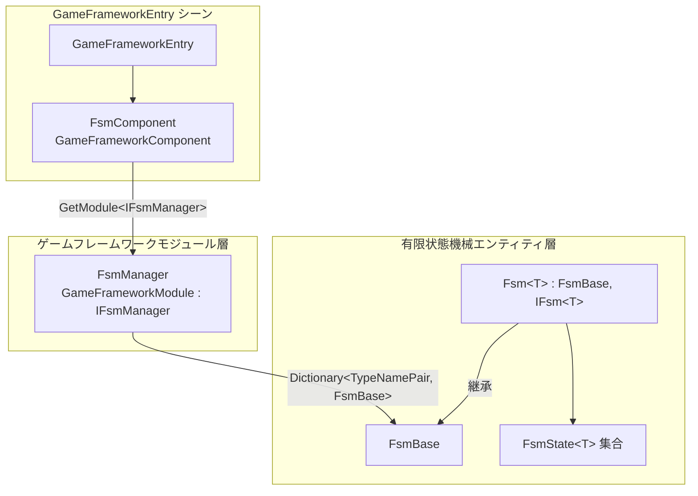

# 動作原理の概要:コンポーネント、マネージャー、FSM の三層構造

GameFrameX FSM は Unity において三層構造で組織されています。**コンポーネント層（FsmComponent）** は GameFramework のエントリにアタッチされ、外部からの呼び出しを担当します。**管理層（FsmManager）** は `GameFrameworkModule` として、登録されたすべての FSM を統一的にポーリングします。**状態機械層（Fsm<T> / FsmState<T>）** が実際の所有者であり、状態の集合と状態遷移ロジックを持つ実体です。この三層を理解すれば、FSM の作成、ポーリング、破棄は、コンポーネントエントリから具体的な状態機械へと至る標準的なパスとなります。

## クイックスタート

1. GameFramework 起動シーンの `GameFrameworkEntry` オブジェクトに `GameFrameX/FSM` コンポーネントを追加します（`[AddComponentMenu("GameFrameX/FSM")]` によって自動的にメニュー登録されます）。
2. `GameEntry.GetComponent<FsmComponent>()` でコンポーネントを取得し、`CreateFsm` を呼び出して有限状態機械を作成します。
3. `IFsmManager` インターフェースまたは `FsmComponent` が提供する `HasFsm`、`GetFsm`、`DestroyFsm` などのメソッドを用いて、FSM の検索、ポーリング、破棄を行います。

コンポーネントは `Awake()` 段階で `GameFrameworkEntry` から `IFsmManager` モジュールを取得し、参照をキャッシュします:

```csharp
// Runtime/Fsm/FsmComponent.cs#L63-L74
protected override void Awake()
{
    ImplementationComponentType = Utility.Assembly.GetType(componentType);
    InterfaceComponentType = typeof(IFsmManager);
    base.Awake();
    m_FsmManager = GameFrameworkEntry.GetModule<IFsmManager>();
    if (m_FsmManager == null)
    {
        Log.Fatal("FSM manager is invalid.");
        return;
    }
}
```

出典:[FsmComponent.cs#L63-L74](https://github.com/GameFrameX/com.gameframex.unity.fsm/blob/main/Runtime/Fsm/FsmComponent.cs#L63-L74)

## 動作原理の概要

各層の責務は以下の通りです。データと呼び出しは「コンポーネント → マネージャー → FSM エンティティ」の流れで上から下へと伝わります。



| 層 | 型 | 主な責務 |
|----|------|----------|
| コンポーネント層 | `FsmComponent : GameFrameworkComponent` | `CreateFsm` / `GetFsm` / `DestroyFsm` などの高レベル API を公開し、`FixedUpdate` で固定ステップをマネージャーに転送する |
| 管理層 | `FsmManager : GameFrameworkModule, IFsmManager` | `Dictionary<TypeNamePair, FsmBase>` を維持し、`Priority` に従ってポーリングに入り、すべての FSM の `Update` / `FixedUpdate` を駆動する |
| エンティティ層 | `FsmBase` とジェネリックサブクラス `Fsm<T> : IFsm<T>` | owner、状態辞書 `m_States`、データ辞書 `m_Datas`、当前状態 `m_CurrentState`、滞在時間 `m_CurrentStateTime` を保持し、状態遷移を実行する |

- **コンポーネント層**:`[GameFrameXAutoComponent(-6000)]` と `[AddComponentMenu("GameFrameX/FSM")]` によって、GameFramework に自動的にロードされ、Inspector メニューに表示されます。すべての外部エントリはここを経由し、内部では `m_FsmManager` に転送されます。
- **管理層**:`Priority` は `1` を返します（値が大きいほど優先度が高くなります）。`Update` / `FixedUpdate` ではスナップショット（`m_TempFsms` / `m_TempFixedFsms` にコピー）を走査してから各 FSM を呼び出すため、走査中のコレクション変更を回避できます。
- **エンティティ層**:それぞれの具体的な `Fsm<T>` は自身の owner 型 `T` と `FsmState<T>` の集合を保持しており、`ChangeState<TState>()` で状態間を遷移し、`CurrentStateTime` を記録して「特定状態にどのくらいの時間滞在したか」といった判定に使用します。

## 次に

- 最初の状態機械を作成して起動する完全な例については、《有限状態機械の作成方法》を参照してください。
- 状態クラス `FsmState<T>` のライフサイクルコールバックと変数データについては、《状態クラスと変数使用クイックリファレンス》を参照してください。
- Inspector デバッグとエディタ拡張については、《FsmComponent Inspector 説明》を参照してください。

## 関連リンク

- [FsmComponent.cs](https://github.com/GameFrameX/com.gameframex.unity.fsm/blob/main/Runtime/Fsm/FsmComponent.cs)
- [FsmManager.cs](https://github.com/GameFrameX/com.gameframex.unity.fsm/blob/main/Runtime/Fsm/FsmManager.cs)
- [Fsm.cs](https://github.com/GameFrameX/com.gameframex.unity.fsm/blob/main/Runtime/Fsm/Fsm.cs)
- [FsmBase.cs](https://github.com/GameFrameX/com.gameframex.unity.fsm/blob/main/Runtime/Fsm/FsmBase.cs)
- [IFsmManager.cs](https://github.com/GameFrameX/com.gameframex.unity.fsm/blob/main/Runtime/Fsm/IFsmManager.cs)
- [IFsm.cs](https://github.com/GameFrameX/com.gameframex.unity.fsm/blob/main/Runtime/Fsm/IFsm.cs)
- [FsmState.cs](https://github.com/GameFrameX/com.gameframex.unity.fsm/blob/main/Runtime/Fsm/FsmState.cs)