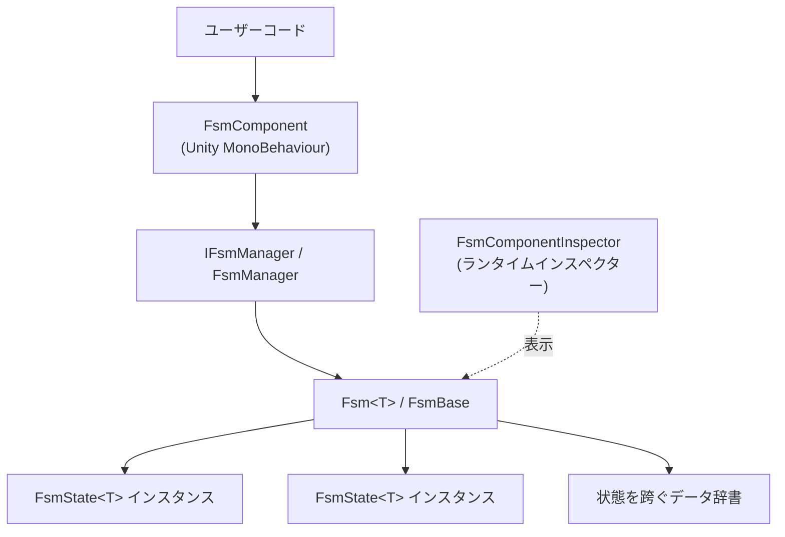

# GameFrameX FSM とは

GameFrameX FSM は、GameFrameX フレームワークが提供する汎用有限状態機械(Finite State Machine)モジュールであり、Unity でオブジェクトの状態生成、ライフサイクル、状態遷移を型安全に管理するために使用されます。これは GameFrameX フレームワークのサブモジュールであり、`FsmComponent` を通じて GameFrameX コンポーネントシステムに接続して使用する必要があります。

## クイックスタート

### 1. パッケージのインストール

Unity プロジェクトの `Packages/manifest.json` に以下の `scopedRegistries` と依存関係を追加します:

```json
{
  "scopedRegistries": [
    {
      "name": "GameFrameX",
      "url": "https://gameframex.upm.alianblank.uk",
      "scopes": [
        "com.gameframex"
      ]
    }
  ],
  "dependencies": {
    "com.gameframex.unity.fsm": "1.1.1"
  }
}
```

ソース: [README.md](https://github.com/GameFrameX/com.gameframex.unity.fsm/blob/main/README.md#L44-L63)

Git URL(`https://github.com/gameframex/com.gameframex.unity.fsm.git`)から直接、もしくは `Packages` ディレクトリにクローンしてインストールすることもできます。

### 2. 状態の定義

`FsmState<T>` を継承し、ライフサイクルメソッドをオーバーライドします。`T` は状態機械の所有者型です:

```csharp
using GameFrameX.Fsm;

public class IdleState : FsmState<Player>
{
    protected override void OnEnter(IFsm<Player> fsm)
    {
        // Idle に入るときにトリガー
    }

    protected override void OnUpdate(IFsm<Player> fsm, float elapseSeconds, float realElapseSeconds)
    {
        // 毎フレームポーリング
        if (Input.GetKeyDown(KeyCode.W))
        {
            ChangeState<MoveState>(fsm);
        }
    }

    protected override void OnLeave(IFsm<Player> fsm, bool isShutdown)
    {
        // Idle を離れるときにトリガー
    }
}
```

ソース: [README.md](https://github.com/GameFrameX/com.gameframex.unity.fsm/blob/main/README.md#L101-L123), [FsmState.cs](https://github.com/GameFrameX/com.gameframex.unity.fsm/blob/main/Runtime/Fsm/FsmState.cs#L41-L67)

### 3. FSM の作成と起動

`GameEntry.GetComponent<FsmComponent>()` でコンポーネントを取得し、`CreateFsm` で状態の集合を組み立てて `Start<TState>` で起動します:

```csharp
var fsmComponent = GameEntry.GetComponent<FsmComponent>();
IFsm<Player> fsm = fsmComponent.CreateFsm(player, new IdleState(), new MoveState());
fsm.Start<IdleState>();
```

ソース: [README.md](https://github.com/GameFrameX/com.gameframex.unity.fsm/blob/main/README.md#L127-L136), [FsmComponent.cs](https://github.com/GameFrameX/com.gameframex.unity.fsm/blob/main/Runtime/Fsm/FsmComponent.cs#L204-L222)

### 4. 状態を跨ぐデータアクセス(オプション)

`SetData` / `GetData<T>` を使用して状態間でデータを共有します。内部ではオブジェクトプールを利用してゼロ GC を実現しています:

```csharp
fsm.SetData("Health", 100);
int hp = fsm.GetData<int>("Health");

if (fsm.HasData("Health"))
{
    fsm.RemoveData("Health");
}
```

ソース: [README.md](https://github.com/GameFrameX/com.gameframex.unity.fsm/blob/main/README.md#L140-L149)

## 動作原理の概要

FSM モジュールは 3 つの層で構成されています。コンポーネント層は外部 API の公開を担当し、マネージャー層は実行中のすべての FSM を保持してその `Update` / `FixedUpdate` を駆動し、状態機械層は具体的な状態の集合と状態を跨ぐデータを管理します。



- `FsmComponent` は `GameFrameworkComponent` を継承し、`GameFramework` エントリオブジェクトにアタッチされます。コンポーネントの優先度は `-6000` です([FsmComponent.cs#L46-L47](https://github.com/GameFrameX/com.gameframex.unity.fsm/blob/main/Runtime/Fsm/FsmComponent.cs#L46-L47))。
- `FsmManager` はすべての FSM インスタンスを保持し、ポーリングスケジューリングを行います。`Update` / `FixedUpdate` のデュアルパスは `FsmComponent.FixedUpdate` で駆動されます([FsmComponent.cs#L76-L84](https://github.com/GameFrameX/com.gameframex.unity.fsm/blob/main/Runtime/Fsm/FsmComponent.cs#L76-L84))。
- `FsmState<T>` は 6 つのライフサイクルフックを公開しています:`OnInit`、`OnEnter`、`OnUpdate`、`OnFixedUpdate`、`OnLeave`、`OnDestroy`。
- Editor ディレクトリの `FsmComponentInspector` は、Play モードで現在の状態と実行経過時間をリアルタイムに表示するインスペクターを提供します。

## 次に進む

- 最初の状態機械の実装方法:タスクページ「FSM の作成と起動方法」を参照
- 状態を跨ぐデータの受け渡しでエラーが発生した場合:トラブルシューティングページの関連項目を参照
- すべての API クイックリファレンス:リファレンスページ「IFsm / FsmState API クイックリファレンス」を参照