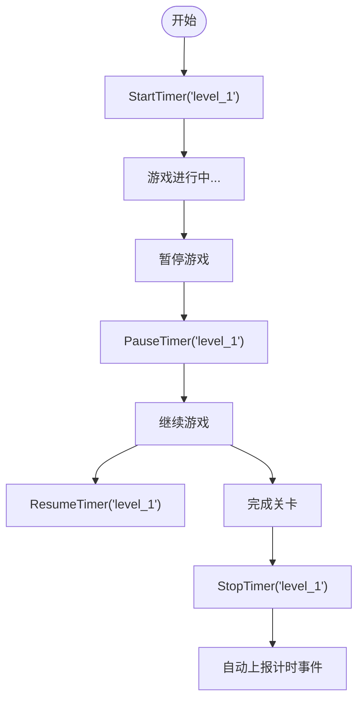

# プラグイン介绍

`GameFrameX.GameAnalytics` 是 GameFrameX 游戏フレームワーク中的游戏数据分析コンポーネント，为 Unity 游戏開発者提供統一された的イベント上报和计时機能インターフェース。该プラグイン采用モジュール化設計，サポート柔軟拡張多种第3方数据分析后端。

## 概要

GameAnalytics コンポーネント是游戏フレームワーク的コアモジュール之一，专门用于解决游戏数据分析的集成問題。在游戏开发中，開発者通常〜する必要があります集成多个数据分析プラットフォーム（如友盟、Firebase、Adjust 等），每个プラットフォーム都有各自的 SDK 和 API，这会导致コード重复和维护困难。

GameAnalytics コンポーネント通过定義統一された的インターフェース（`IGameAnalyticsManager`）和抽象基底クラス（`BaseGameAnalyticsManager`），将各种数据分析プラットフォーム的共性機能抽象出来。開発者只需呼び出し統一された的 API，つまり可同時に向多个数据分析プラットフォーム发送イベント，大大簡素化了多プラットフォーム数据埋点的工作。

### コア特性

- **統一されたインターフェース**：提供一套標準的 API，サポートイベント上报、计时器、公共プロパティ等機能
- **多后端サポート**：通过提供者モード，可同時に接入多个数据分析プラットフォーム
- **自动初期化**：サポート在コンポーネント启用时自动初期化，也サポート手动控制初期化时机
- **设备情報采集**：自动采集设备型号、操作系统、屏幕分辨率、网络タイプ等基本情報
- **计时機能**：提供完全な的イベント计时能力，用于分析游戏内各种操作的耗时

### バージョン情報

- 当前バージョン：1.2.0
- 首次リリース：2024年4月10日

## アーキテクチャ設計

GameAnalytics コンポーネント采用经典的分层アーキテクチャ設計，从上到下分为三个层次：コンポーネント層、マネージャー层和実装層。

```mermaid
flowchart TD
    subgraph ComponentLayer["组件层 (Unity Component)"]
        GAC[GameAnalyticsComponent]
    end

    subgraph ManagerLayer["管理器层 (Manager Interface)"]
        IGAM[IGameAnalyticsManager]
        BGAM[BaseGameAnalyticsManager]
    end

    subgraph ImplementationLayer["实现层 (Provider)"]
        Provider1[Analytics Provider 1]
        Provider2[Analytics Provider 2]
        ProviderN[Analytics Provider N]
    end

    subgraph GameFramework["GameFrameX 框架"]
        GFM[GameFrameworkModule]
    end

    GAC --> IGAM
    IGAM <|.. BGAM
    BGAM --> GFM
    BGAM -.-> Provider1
    BGAM -.-> Provider2
    BGAM -.-> ProviderN
```

### 各层职责

**コンポーネント層 (GameAnalyticsComponent)**

コンポーネント層是 Unity 层面的入口点，継承自 `GameFrameworkComponent`。该コンポーネント挂载到シーン中的 GameObject 上つまり可使用，主な负责：

- 在 `OnEnable` 时自动呼び出し初期化メソッド
- 管理多个 `IGameAnalyticsManager` インスタンス的集合
- 将 API 呼び出し分发到所有已登録的分析提供者
- 提供パラメータ検証和初期化ステータス確認

> Source: [GameAnalyticsComponent.cs](https://github.com/GameFrameX/com.gameframex.unity.gameanalytics/blob/main/Runtime/GameAnalytics/GameAnalyticsComponent.cs#L14-L80)

**マネージャー层 (IGameAnalyticsManager / BaseGameAnalyticsManager)**

インターフェース層定義了所有分析機能的標準规范，含みます：

- 初期化メソッド（自动初期化和手动初期化）
- イベント上报メソッド（4种オーバーロード）
- 计时器メソッド（开始、暂停、恢复、结束）
- 公共プロパティ管理（設定、取得、清除）
- プレイヤーID設定

抽象基底クラス `BaseGameAnalyticsManager` 継承自 `GameFrameworkModule`，実装了インターフェース中的一些汎用機能，如公共プロパティ管理、设备情報自动采集等。

> Source: [IGameAnalyticsManager.cs](https://github.com/GameFrameX/com.gameframex.unity.gameanalytics/blob/main/Runtime/GameAnalytics/IGameAnalyticsManager.cs#L8-L105)

> Source: [BaseGameAnalyticsManager.cs](https://github.com/GameFrameX/com.gameframex.unity.gameanalytics/blob/main/Runtime/GameAnalytics/BaseGameAnalyticsManager.cs#L10-L203)

**実装層 (Analytics Provider)**

実装層是具体的数据分析プラットフォーム适配器，継承自 `BaseGameAnalyticsManager`。開発者〜できます実装自己的分析提供者，或集成第3方 SDK 的适配器。每个提供者独立运作，コンポーネント層会同時に向所有已登録的提供者发送イベント。

### イベント流向


イベント从開発者コード发出后，まず到达 `GameAnalyticsComponent`，コンポーネント確認初期化ステータス后，将イベント同時に分发给所有已登録的分析提供者，実装一次上报多端受信的效果。

## コア機能

### イベント上报

イベント上报是数据分析的基本，GameAnalytics コンポーネント提供します四种イベント上报方法，以满足不同シーン的需求：

**シンプルイベント**：仅パッケージ含イベント名称，用于记录某个动作的发生。

```csharp
gameAnalyticsComponent.Event("game_start");
```

**数值イベント**：在イベント名称基本上追加数值，可用于统计次数、分数等量化指标。

```csharp
gameAnalyticsComponent.Event("level_complete", 5);
```

**自定義フィールドイベント**：在イベント中附加额外的键值对情報，用于更精细的数据分析。

```csharp
var customFields = new Dictionary<string, object>
{
    { "chapter", "chapter_1" },
    { "difficulty", "hard" }
};
gameAnalyticsComponent.Event("battle_end", customFields);
```

**数值+自定義フィールドイベント**：结合数值和自定義フィールド的完全なイベントフォーマット。

```csharp
gameAnalyticsComponent.Event("purchase", 99.99f, customFields);
```

### 计时器機能

计时器機能用于精确测量游戏内各种操作的耗时，常见用途含みます关卡完成时间、界面ロード时间、任务执行时间等。



计时器サポート暂停和恢复機能，つまり使プレイヤー暂时离开，计时也不会丢失。计时结束后，コンポーネント会自动将耗时作为イベント值上报到数据分析プラットフォーム。

### 公共プロパティ

公共プロパティ是指每次上报イベント时都会自动携带的基本情報。GameAnalytics コンポーネント会自动采集以下设备情報：

| プロパティ名称 | 説明 | 例值 |
|---------|------|-------|
| device_id | 设备唯一标识符 | ABC123... |
| device_model | 设备型号 | iPhone 14 Pro |
| device_type | 设备タイプ | Handheld |
| os | 操作系统 | iOS 17.0 |
| app_version | 应用バージョン号 | 1.2.0 |
| unity_version | Unity 引擎バージョン | 2022.3.15f1 |
| platform | 运行プラットフォーム | iOS |
| processor_type | 処理器タイプ | Apple A16 |
| processor_count | CPU コア数 | 6 |
| system_memory_size | 系统内存大小(MB) | 6144 |
| graphics_device_name | 显卡名称 | Apple GPU |
| screen_width | 屏幕宽度(像素) | 1179 |
| screen_height | 屏幕高度(像素) | 2556 |
| screen_dpi | 屏幕DPI | 460 |
| network_type | 网络タイプ | WiFi |
| system_language | 系统语言 | Chinese |

> Source: [BaseGameAnalyticsManager.cs](https://github.com/GameFrameX/com.gameframex.unity.gameanalytics/blob/main/Runtime/GameAnalytics/BaseGameAnalyticsManager.cs#L88-L144)

開発者也〜できます通过 `SetPublicProperties` メソッド追加自定義的公共プロパティ，这些プロパティ会在每次イベント上报时自动附带。

### プレイヤーID管理

通过 `SetPlayerId` メソッド〜できます設定プレイヤー标识符，用于关联同一个プレイヤー在游戏中的所有行为数据。这对于ユーザー行为分析、留存统计等シーン非常重要な。

```csharp
// 登录成功后设置玩家ID
gameAnalyticsComponent.SetPlayerId(playerId);
```

## 使用方法

### インストール

プラグインサポート多种インストール方法：

1. **通过 manifest.json 追加依赖**：在プロジェクト的 `Packages/manifest.json` ファイル中的 `dependencies` 节点下追加：
   ```json
   {"com.gameframex.unity.gameanalytics": "https://github.com/GameFrameX/com.gameframex.unity.gameanalytics.git"}
   ```

2. **通过 Unity Package Manager**：在 Unity エディタ中选择 `Window > Package Manager`，点击 `+` 号，选择 `Add package from git URL`，输入：`https://github.com/GameFrameX/com.gameframex.unity.gameanalytics.git`

3. **直接放置ソースコード**：将リポジトリ下载后放置到 Unity プロジェクト的 `Packages` ディレクトリ下，系统会自动识别ロード。

### 快速設定

1. 在 Unity シーン中作成一个空的 GameObject
2. 在该 GameObject 上追加 `GameAnalyticsComponent` コンポーネント（メニュー路径：`Game Framework > GameAnalytics`）
3. 在 Inspector パネル中設定分析提供者列表，追加〜する必要があります使用的分析プラットフォーム
4. 設定各提供者的相关パラメータ

> Source: [GameAnalyticsComponentInspector.cs](https://github.com/GameFrameX/com.gameframex.unity.gameanalytics/blob/main/Editor/Inspector/GameAnalyticsComponentInspector.cs#L18-L68)

### 基本使用例

```csharp
using GameFrameX.GameAnalytics.Runtime;
using UnityEngine;

public class GameAnalyticsExample : MonoBehaviour
{
    private GameAnalyticsComponent _gameAnalytics;

    private void Awake()
    {
        // 获取组件（通常通过框架获取）
        _gameAnalytics = UnityEngine.Object.FindObjectOfType<GameAnalyticsComponent>();
    }

    private void Start()
    {
        // 上报游戏开始事件
        _gameAnalytics.Event("game_start");
        
        // 开始关卡计时
        _gameAnalytics.StartTimer("level_1");
    }

    private void OnLevelComplete(int levelId)
    {
        // 上报关卡完成事件
        _gameAnalytics.Event($"level_{levelId}_complete", 1.0f);
        
        // 停止关卡计时
        _gameAnalytics.StopTimer($"level_{levelId}");
    }
}
```

## 関連リンク

- [インストールガイド](./2-installation.index)
- [快速开始](./3-getting-started.index)
- [コアアーキテクチャ](./04.features.md)
- [API リファレンス](./5-api-reference.index)
- [エディタ設定](./6-configuration.index)
- [故障排除](./7-troubleshooting.index)
- [GitHub リポジトリ](https://github.com/GameFrameX/com.gameframex.unity.gameanalytics.git)
- [GameFrameX 官网](https://gameframework.cn/)
