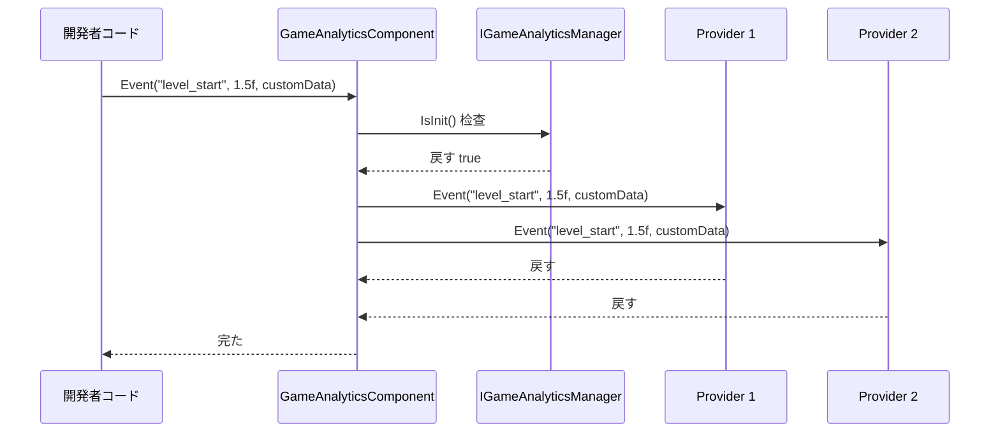
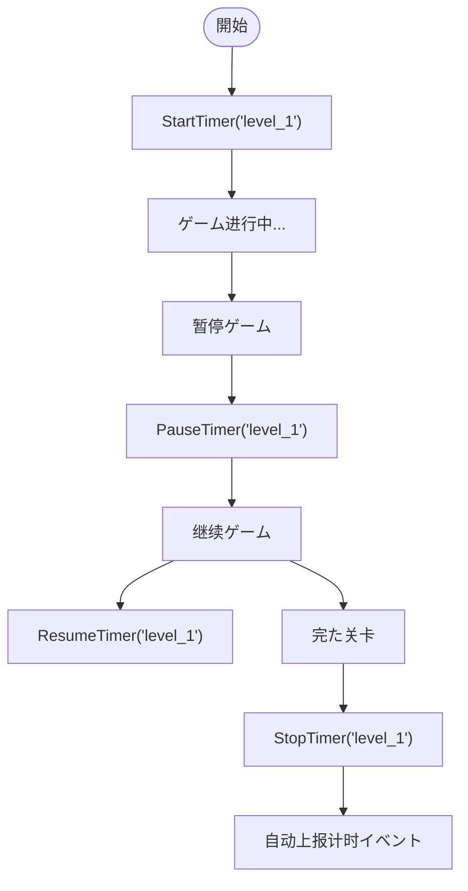

# 

`GameFrameX.GameAnalytics` は GameFrameX ゲームフレームワークのゲームデータコンポーネント， Unity ゲームのイベントとインターフェース。モジュール，サポートデータ。

## 

GameAnalytics コンポーネントはゲームフレームワークのコアモジュール，にゲームデータの。にゲーム，データプラットフォーム（、Firebase、Adjust ），プラットフォームの SDK と API，コードと。

GameAnalytics コンポーネントをじてのインターフェース（`IGameAnalyticsManager`）とクラス（`BaseGameAnalyticsManager`），データプラットフォームの。びしの API，データプラットフォームイベント，たプラットフォームデータの。

### コア

- **インターフェース**：の API，サポートイベント、、プロパティ
- **サポート**：をじて，データプラットフォーム
- ****：サポートにコンポーネント，サポート
- ****：、、、ネットワークタイプ
- ****：のイベント，にゲームの

### バージョン

- バージョン：1.2.0
- ：2024410

## アーキテクチャ

GameAnalytics コンポーネントのアーキテクチャ，：コンポーネント、マネージャーと。

```mermaid
flowchart TD
    subgraph ComponentLayer["コンポーネント层 (Unity Component)"]
        GAC[GameAnalyticsComponent]
    end

    subgraph ManagerLayer["マネージャー层 (Manager Interface)"]
        IGAM[IGameAnalyticsManager]
        BGAM[BaseGameAnalyticsManager]
    end

    subgraph ImplementationLayer["实现层 (Provider)"]
        Provider1[Analytics Provider 1]
        Provider2[Analytics Provider 2]
        ProviderN[Analytics Provider N]
    end

    subgraph GameFramework["GameFrameX フレームワーク"]
        GFM[GameFrameworkModule]
    end

    GAC --> IGAM
    IGAM <|.. BGAM
    BGAM --> GFM
    BGAM -.-> Provider1
    BGAM -.-> Provider2
    BGAM -.-> ProviderN
```

### 

**コンポーネント (GameAnalyticsComponent)**

コンポーネントは Unity の， `GameFrameworkComponent`。コンポーネントの GameObject ，：

- に `OnEnable` びしメソッド
-  `IGameAnalyticsManager` の
-  API びしの
- パラメータと

> Source: [GameAnalyticsComponent.cs](https://github.com/GameFrameX/com.gameframex.unity.gameanalytics/blob/main/Runtime/GameAnalytics/GameAnalyticsComponent.cs#L14-L80)

**マネージャー (IGameAnalyticsManager / BaseGameAnalyticsManager)**

インターフェースたの，：

- メソッド（と）
- イベントメソッド（4）
- メソッド（、、、た）
- プロパティ（、、）
- ID

クラス `BaseGameAnalyticsManager`  `GameFrameworkModule`，たインターフェースの，プロパティ、。

> Source: [IGameAnalyticsManager.cs](https://github.com/GameFrameX/com.gameframex.unity.gameanalytics/blob/main/Runtime/GameAnalytics/IGameAnalyticsManager.cs#L8-L105)

> Source: [BaseGameAnalyticsManager.cs](https://github.com/GameFrameX/com.gameframex.unity.gameanalytics/blob/main/Runtime/GameAnalytics/BaseGameAnalyticsManager.cs#L10-L203)

** (Analytics Provider)**

はのデータプラットフォーム， `BaseGameAnalyticsManager`。の， SDK の。，コンポーネントのイベント。

### イベント



イベントコード， `GameAnalyticsComponent`，コンポーネント，イベントの，の。

## コア

### イベント

イベントはデータの，GameAnalytics コンポーネントたイベント，の：

**シンプルイベント**：むイベント，にの。

```csharp
gameAnalyticsComponent.Event("game_start");
```

**イベント**：にイベント，に、。

```csharp
gameAnalyticsComponent.Event("level_complete", 5);
```

**カスタマイズイベント**：にイベントの，にのデータ。

```csharp
var customFields = new Dictionary<string, object>
{
    { "chapter", "chapter_1" },
    { "difficulty", "hard" }
};
gameAnalyticsComponent.Event("battle_end", customFields);
```

**+カスタマイズイベント**：とカスタマイズのイベント。

```csharp
gameAnalyticsComponent.Event("purchase", 99.99f, customFields);
```

### 

にゲームの，た、ロード、。



サポートと，，。た，コンポーネントイベントデータプラットフォーム。

### プロパティ

プロパティはイベントの。GameAnalytics コンポーネント：

| プロパティ |  |  |
|---------|------|-------|
| device_id |  | ABC123... |
| device_model |  | iPhone 14 Pro |
| device_type | タイプ | Handheld |
| os |  | iOS 17.0 |
| app_version | バージョン | 1.2.0 |
| unity_version | Unity バージョン | 2022.3.15f1 |
| platform | プラットフォーム | iOS |
| processor_type | タイプ | Apple A16 |
| processor_count | CPU コア | 6 |
| system_memory_size | (MB) | 6144 |
| graphics_device_name |  | Apple GPU |
| screen_width | () | 1179 |
| screen_height | () | 2556 |
| screen_dpi | DPI | 460 |
| network_type | ネットワークタイプ | WiFi |
| system_language |  | Chinese |

> Source: [BaseGameAnalyticsManager.cs](https://github.com/GameFrameX/com.gameframex.unity.gameanalytics/blob/main/Runtime/GameAnalytics/BaseGameAnalyticsManager.cs#L88-L144)

をじて `SetPublicProperties` メソッドカスタマイズのプロパティ，プロパティにイベント。

### ID

をじて `SetPlayerId` メソッド，ににゲームのデータ。、。

```csharp
// 登录成功后設定玩家ID
gameAnalyticsComponent.SetPlayerId(playerId);
```

## 

### インストール

サポートインストールメソッド：

1. **をじて manifest.json **：にプロジェクトの `Packages/manifest.json` ファイルの `dependencies` ：
   ```json
   {"com.gameframex.unity.gameanalytics": "https://github.com/GameFrameX/com.gameframex.unity.gameanalytics.git"}
   ```

2. **をじて Unity Package Manager**：に Unity エディター `Window > Package Manager`， `+` ， `Add package from git URL`，：`https://github.com/GameFrameX/com.gameframex.unity.gameanalytics.git`

3. ****：リポジトリ Unity プロジェクトの `Packages` ディレクトリ，ロード。

### 

1. に Unity の GameObject
2. に GameObject  `GameAnalyticsComponent` コンポーネント（パス：`Game Framework > GameAnalytics`）
3. に Inspector ，のプラットフォーム
4. のパラメータ

> Source: [GameAnalyticsComponentInspector.cs](https://github.com/GameFrameX/com.gameframex.unity.gameanalytics/blob/main/Editor/Inspector/GameAnalyticsComponentInspector.cs#L18-L68)

### 

```csharp
using GameFrameX.GameAnalytics.Runtime;
using UnityEngine;

public class GameAnalyticsExample : MonoBehaviour
{
    private GameAnalyticsComponent _gameAnalytics;

    private void Awake()
    {
        // 获取コンポーネント（通常を通じてフレームワーク获取）
        _gameAnalytics = UnityEngine.Object.FindObjectOfType<GameAnalyticsComponent>();
    }

    private void Start()
    {
        // 上报ゲーム開始イベント
        _gameAnalytics.Event("game_start");
        
        // 開始关卡计时
        _gameAnalytics.StartTimer("level_1");
    }

    private void OnLevelComplete(int levelId)
    {
        // 上报关卡完たイベント
        _gameAnalytics.Event($"level_{levelId}_complete", 1.0f);
        
        // 停止关卡计时
        _gameAnalytics.StopTimer($"level_{levelId}");
    }
}
```

## リンク

- [インストールガイド](./2-installation.index)
- [クイックスタート](./3-getting-started.index)
- [コアアーキテクチャ](./04.features.md)
- [API リファレンス](./5-api-reference.index)
- [エディター](./6-configuration.index)
- [](./7-troubleshooting.index)
- [GitHub リポジトリ](https://github.com/GameFrameX/com.gameframex.unity.gameanalytics.git)
- [GameFrameX サイト](https://gameframework.cn/)
