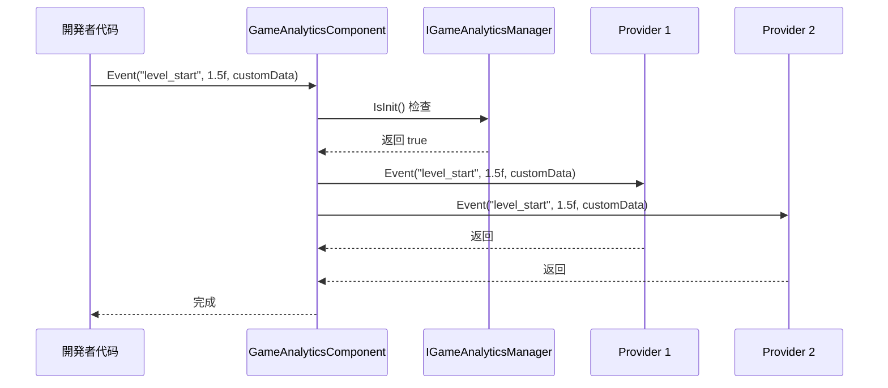
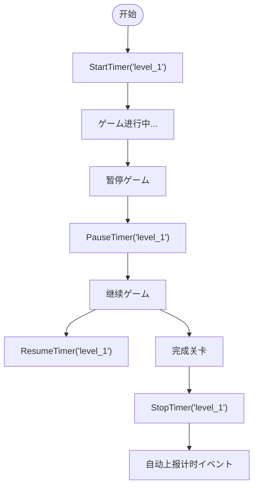

# 插件介绍

`GameFrameX.GameAnalytics` 是 GameFrameX ゲームフレームワーク中的ゲーム数据分析コンポーネント，为 Unity ゲーム開発者提供统一的イベント上报和计时機能インターフェース。该插件采用モジュラー設計，サポート灵活扩展多种第三方数据分析后端。

## 概要

GameAnalytics コンポーネント是ゲームフレームワーク的コア模块之一，专门に使用解决ゲーム数据分析的集成问题。在ゲーム开发中，開発者通常必要集成多个数据分析平台（如友盟、Firebase、Adjust 等），每个平台都有各自的 SDK 和 API，这会导致代码重复和维护困难。

GameAnalytics コンポーネントを通じて定义统一的インターフェース（`IGameAnalyticsManager`）和抽象基底クラス（`BaseGameAnalyticsManager`），将各种数据分析平台的共性機能抽象出来。開発者只需呼び出し统一的 API，即可同时向多个数据分析平台发送イベント，大大简化了多平台数据埋点的工作。

### コア機能

- **统一インターフェース**：提供一套标准的 API，サポートイベント上报、タイマー、公共プロパティ等機能
- **多后端サポート**：を通じて提供者模式，可同时接入多个数据分析平台
- **自动初期化**：サポート在コンポーネント启用时自动初期化，也サポート手动控制初期化时机
- **设备信息采集**：自动采集设备型号、操作系统、屏幕分辨率、网络クラス型等基础信息
- **计时機能**：提供完整的イベント计时能力，に使用分析ゲーム内各种操作的耗时

### バージョン情報

- 当前版本：1.2.0
- 首次发布：2024年4月10日

## アーキテクチャ設計

GameAnalytics コンポーネント采用经典的分层アーキテクチャ設計，从上到下分为三个层次：コンポーネント层、管理器层和実装层。

```mermaid
flowchart TD
    subgraph ComponentLayer["コンポーネント层 (Unity Component)"]
        GAC[GameAnalyticsComponent]
    end

    subgraph ManagerLayer["管理器层 (Manager Interface)"]
        IGAM[IGameAnalyticsManager]
        BGAM[BaseGameAnalyticsManager]
    end

    subgraph ImplementationLayer["実装层 (Provider)"]
        Provider1[Analytics Provider 1]
        Provider2[Analytics Provider 2]
        ProviderN[Analytics Provider N]
    end

    subgraph GameFramework["GameFrameX フレームワーク"]
        GFM[GameFrameworkModule]
    end

    GAC --> IGAM
    IGAM <|.. BGAM
    BGAM --> GFM
    BGAM -.-> Provider1
    BGAM -.-> Provider2
    BGAM -.-> ProviderN
```

### 各层职责

**コンポーネント层 (GameAnalyticsComponent)**

コンポーネント层是 Unity 层面的エントリーポイント点，を継承 `GameFrameworkComponent`。该コンポーネント挂载到シーン中的 GameObject 上即可使用，主要负责：

- 在 `OnEnable` 时自動的に初期化メソッドを呼び出します
- 管理多个 `IGameAnalyticsManager` インスタンス的集合
- 将 API 呼び出し分发到所有已注册的分析提供者
- 提供参数验证和初期化ステータス检查

> Source: [GameAnalyticsComponent.cs](https://github.com/GameFrameX/com.gameframex.unity.gameanalytics/blob/main/Runtime/GameAnalytics/GameAnalyticsComponent.cs#L14-L80)

**管理器层 (IGameAnalyticsManager / BaseGameAnalyticsManager)**

インターフェース层定义了所有分析機能的标准规范，包括：

- 初期化メソッド（自动初期化和手动初期化）
- イベント上报メソッド（4种重载）
- タイマーメソッド（开始、暂停、恢复、结束）
- 公共プロパティ管理（設定、取得、清除）
- 玩家ID設定

抽象基底クラス `BaseGameAnalyticsManager` を継承 `GameFrameworkModule`，実装了インターフェース中的一些通用機能，如公共プロパティ管理、设备信息自动采集等。

> Source: [IGameAnalyticsManager.cs](https://github.com/GameFrameX/com.gameframex.unity.gameanalytics/blob/main/Runtime/GameAnalytics/IGameAnalyticsManager.cs#L8-L105)

> Source: [BaseGameAnalyticsManager.cs](https://github.com/GameFrameX/com.gameframex.unity.gameanalytics/blob/main/Runtime/GameAnalytics/BaseGameAnalyticsManager.cs#L10-L203)

**実装层 (Analytics Provider)**

実装层是具体的数据分析平台适配器，を継承 `BaseGameAnalyticsManager`。開発者可能実装自己的分析提供者，或集成第三方 SDK 的适配器。每个提供者独立运作，コンポーネント层会同时向所有已注册的提供者发送イベント。

### イベント流向



イベント从開発者代码发出后，首先到达 `GameAnalyticsComponent`，コンポーネント检查初期化ステータス后，将イベント同时分发给所有已注册的分析提供者，実装一次上报多端接收的效果。

## コア機能

### イベント上报

イベント上报是数据分析的基础，GameAnalytics コンポーネント提供します四种イベント上报方法，以满足不同シーン的需求：

**简单イベント**：仅包含イベント名称，に使用记录某个动作的发生。

```csharp
gameAnalyticsComponent.Event("game_start");
```

**数值イベント**：在イベント名称基础上添加数值，可に使用统计次数、分数等量化指标。

```csharp
gameAnalyticsComponent.Event("level_complete", 5);
```

**自定义字段イベント**：在イベント中附加额外的键值对信息，に使用更精细的数据分析。

```csharp
var customFields = new Dictionary<string, object>
{
    { "chapter", "chapter_1" },
    { "difficulty", "hard" }
};
gameAnalyticsComponent.Event("battle_end", customFields);
```

**数值+自定义字段イベント**：结合数值和自定义字段的完整イベント格式。

```csharp
gameAnalyticsComponent.Event("purchase", 99.99f, customFields);
```

### タイマー機能

タイマー機能に使用精确测量ゲーム内各种操作的耗时，常见用途包括关卡完成时间、界面加载时间、任务执行时间等。



タイマーサポート暂停和恢复機能，即使玩家暂时离开，计时也不会丢失。计时结束后，コンポーネント会自动将耗时作为イベント值上报到数据分析平台。

### 公共プロパティ

公共プロパティ是指每次上报イベント时都会自动携带的基础信息。GameAnalytics コンポーネント会自动采集以下设备信息：

| プロパティ名称 | 説明 | 示例值 |
|---------|------|-------|
| device_id | 设备唯一标识符 | ABC123... |
| device_model | 设备型号 | iPhone 14 Pro |
| device_type | 设备クラス型 | Handheld |
| os | 操作系统 | iOS 17.0 |
| app_version | 应用版本号 | 1.2.0 |
| unity_version | Unity 引擎版本 | 2022.3.15f1 |
| platform | 运行平台 | iOS |
| processor_type | 处理器クラス型 | Apple A16 |
| processor_count | CPU コア数 | 6 |
| system_memory_size | 系统内存大小(MB) | 6144 |
| graphics_device_name | 显卡名称 | Apple GPU |
| screen_width | 屏幕宽度(像素) | 1179 |
| screen_height | 屏幕高度(像素) | 2556 |
| screen_dpi | 屏幕DPI | 460 |
| network_type | 网络クラス型 | WiFi |
| system_language | 系统语言 | Chinese |

> Source: [BaseGameAnalyticsManager.cs](https://github.com/GameFrameX/com.gameframex.unity.gameanalytics/blob/main/Runtime/GameAnalytics/BaseGameAnalyticsManager.cs#L88-L144)

開発者也可能を通じて `SetPublicProperties` メソッド添加自定义的公共プロパティ，这些プロパティ会在每次イベント上报时自动附带。

### 玩家ID管理

を通じて `SetPlayerId` メソッド可能設定玩家标识符，に使用关联同一个玩家在ゲーム中的所有行为数据。这对于用户行为分析、留存统计等シーン非常重要。

```csharp
// 登录成功后設定玩家ID
gameAnalyticsComponent.SetPlayerId(playerId);
```

## 使用メソッド

### 安装

插件サポート多种安装方法：

1. **を通じて manifest.json 添加依赖**：在プロジェクト的 `Packages/manifest.json` ファイル内の `dependencies` ノードに追加：
   ```json
   {"com.gameframex.unity.gameanalytics": "https://github.com/GameFrameX/com.gameframex.unity.gameanalytics.git"}
   ```

2. **を通じて Unity Package Manager**：在 Unity 编辑器中选择 `Window > Package Manager`，点击 `+` 号，选择 `Add package from git URL`，输入：`https://github.com/GameFrameX/com.gameframex.unity.gameanalytics.git`

3. **直接放置源码**：将仓库ダウンロード后放置到 Unity プロジェクト的 `Packages` ディレクトリ下，系统会自动识别加载。

### 快速配置

1. 在 Unity シーン中作成一个空的 GameObject
2. 在该 GameObject 上添加 `GameAnalyticsComponent` コンポーネント（菜单路径：`Game Framework > GameAnalytics`）
3. 在 Inspector 面板中配置分析提供者列表，添加必要使用的分析平台
4. 設定各提供者的関連参数

> Source: [GameAnalyticsComponentInspector.cs](https://github.com/GameFrameX/com.gameframex.unity.gameanalytics/blob/main/Editor/Inspector/GameAnalyticsComponentInspector.cs#L18-L68)

### 基本使用示例

```csharp
using GameFrameX.GameAnalytics.Runtime;
using UnityEngine;

public class GameAnalyticsExample : MonoBehaviour
{
    private GameAnalyticsComponent _gameAnalytics;

    private void Awake()
    {
        // 取得コンポーネント（通常を通じてフレームワーク取得）
        _gameAnalytics = UnityEngine.Object.FindObjectOfType<GameAnalyticsComponent>();
    }

    private void Start()
    {
        // 上报ゲーム开始イベント
        _gameAnalytics.Event("game_start");
        
        // 开始关卡计时
        _gameAnalytics.StartTimer("level_1");
    }

    private void OnLevelComplete(int levelId)
    {
        // 上报关卡完成イベント
        _gameAnalytics.Event($"level_{levelId}_complete", 1.0f);
        
        // 停止关卡计时
        _gameAnalytics.StopTimer($"level_{levelId}");
    }
}
```

## 関連リンク

- [安装指南](./2-installation.index)
- [快速开始](./3-getting-started.index)
- [コア架构](./04.features.md)
- [API 参考](./5-api-reference.index)
- [编辑器配置](./6-configuration.index)
- [故障排除](./7-troubleshooting.index)
- [GitHub 仓库](https://github.com/GameFrameX/com.gameframex.unity.gameanalytics.git)
- [GameFrameX 官网](https://gameframework.cn/)
