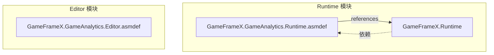
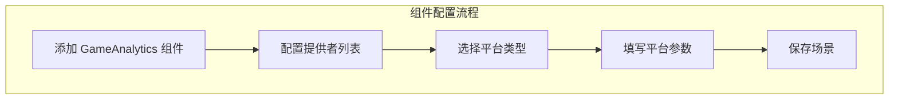

# インストールガイド

このドキュメント詳細介绍如何将 GameFrameX GameAnalytics 游戏数据分析コンポーネントインストール到您的 Unity プロジェクト中。

## 概要

GameFrameX GameAnalytics コンポーネント是 Unity 游戏フレームワーク的コアモジュール之一，用于集成游戏数据分析機能。该コンポーネントサポート多种数据分析プラットフォーム的接入，提供統一された的イベント上报インターフェース和计时機能，方便開発者在不同数据分析プラットフォーム之间切换或同時に使用多个プラットフォーム。

**前置要求：**
- Unity 2017.1 或更高バージョン
- 已インストール GameFrameX Runtime コア库

## インストールメソッド

GameFrameX GameAnalytics コンポーネントサポート三种インストール方法，您〜できます根据プロジェクト需求选择最适合的メソッド。

### 方法一：通过 manifest.json インストール

在您的 Unity プロジェクト中，找到 `Packages` ファイル夹下的 `manifest.json` ファイル，在 `dependencies` 节点下追加以下内容：

```json
{
  "dependencies": {
    "com.gameframex.unity.gameanalytics": "https://github.com/GameFrameX/com.gameframex.unity.gameanalytics.git"
  }
}
```

> Source: [README.md](https://github.com/GameFrameX/com.gameframex.unity.gameanalytics/blob/main/README.md#L150-L156)

変更完成后，Unity 会自动下载并インストール该パッケージ。

### 方法二：通过 Unity Package Manager インストール

1. 打开 Unity エディタ
2. 选择メニュー `Window` → `Package Manager`
3. 点击左上角的 `+` ボタン
4. 选择 `Add package from git URL...`
5. 输入以下 Git URL：
   ```
   https://github.com/GameFrameX/com.gameframex.unity.gameanalytics.git
   ```
6. 点击 `Add` ボタン等待インストール完成

> Source: [README.md](https://github.com/GameFrameX/com.gameframex.unity.gameanalytics/blob/main/README.md#L156)

### 方法三：直接下载インストール

1. 从 GitHub リポジトリ下载最新的 Release バージョン或克隆整个リポジトリ
2. 将下载的ファイル夹复制到 Unity プロジェクト的 `Packages` ディレクトリ下
3. Unity 会自动识别并ロード该パッケージ

## インストールの確認

インストール完成后，您〜できます通过以下方法検証是否インストール成功：

### 確認 Package Manager

在 Unity Package Manager ウィンドウ中，確認 `Game Frame X Game Analytics` 已出现在パッケージ列表中，かつ显示正确的バージョン号。

```json
{
  "name": "com.gameframex.unity.gameanalytics",
  "version": "1.2.0"
}
```

> Source: [package.json](https://github.com/GameFrameX/com.gameframex.unity.gameanalytics/blob/main/package.json#L1-L6)

### 確認アセンブリ定義

確認以下アセンブリ定義ファイル已正确ロード：



> Source: [GameFrameX.GameAnalytics.Runtime.asmdef](https://github.com/GameFrameX/com.gameframex.unity.gameanalytics/blob/main/Runtime/GameFrameX.GameAnalytics.Runtime.asmdef#L3-L5)

## コンポーネント設定

インストール完成后，〜する必要があります在 Unity シーン中追加 GameAnalytics コンポーネント进行設定。

### 追加コンポーネント

1. 在 Unity エディタ中，作成或打开一个シーン
2. 在 Hierarchy パネル中，选择一个 GameObject（或作成新对象）
3. 在 Inspector パネル中，点击 `Add Component` ボタン
4. 検索并选择 `GameAnalytics` コンポーネント
5. コンポーネント将自动追加到选定的 GameObject 上

> Source: [GameAnalyticsComponent.cs](https://github.com/GameFrameX/com.gameframex.unity.gameanalytics/blob/main/Runtime/GameAnalytics/GameAnalyticsComponent.cs#L13-L14)

### 設定分析提供者

GameAnalytics コンポーネントサポート設定多个数据分析提供者。在 Inspector パネル中：

```csharp
[DisallowMultipleComponent]
[AddComponentMenu("Game Framework/GameAnalytics")]
public sealed class GameAnalyticsComponent : GameFrameworkComponent
```

> Source: [GameAnalyticsComponent.cs](https://github.com/GameFrameX/com.gameframex.unity.gameanalytics/blob/main/Runtime/GameAnalytics/GameAnalyticsComponent.cs#L12-L14)

1. 找到 **游戏数据分析コンポーネント列表** プロパティ
2. 点击 `+` ボタン追加新的提供者
3. 从下拉メニュー中选择要使用的数据分析プラットフォームタイプ
4. 根据所选プラットフォーム填写相应的設定パラメータ



## 依赖项説明

GameFrameX GameAnalytics コンポーネント依赖于以下モジュール：

| 依赖项 | 説明 | 必需 |
|--------|------|------|
| GameFrameX.Runtime | コアランタイム库 | 是 |

> Source: [GameFrameX.GameAnalytics.Runtime.asmdef](https://github.com/GameFrameX/com.gameframex.unity.gameanalytics/blob/main/Runtime/GameFrameX.GameAnalytics.Runtime.asmdef)

**重要なヒント：** 確認してください您已インストール GameFrameX Runtime コア库，否则コンポーネント将无法正常工作。

## 快速検証

インストール和設定完成后，〜できます通过以下コード検証コンポーネント是否正常工作：

```csharp
using GameFrameX.GameAnalytics.Runtime;

// 获取组件实例
var gameAnalytics = UnityEngine.GameObject.FindObjectOfType<GameAnalyticsComponent>();

// 检查是否初始化成功
if (gameAnalytics != null)
{
    // 上报测试事件
    gameAnalytics.Event("test_event");
    UnityEngine.Debug.Log("GameAnalytics 组件安装成功！");
}
```

> Source: [GameAnalyticsComponent.cs](https://github.com/GameFrameX/com.gameframex.unity.gameanalytics/blob/main/Runtime/GameAnalytics/GameAnalyticsComponent.cs#L246-L265)

## よくある問題

### インストール后コンパイル报错

もし遇到コンパイルエラー，请確認：
1. 是否已正确インストール GameFrameX Runtime
2. Unity バージョン是否符合要求（2017.1+）
3. manifest.json 语法是否正确

### コンポーネント无法追加到シーン

確認してください：
1. 已正确导入パッケージ
2. 在 Runtime ファイル夹下有正确的アセンブリ定義
3. Unity プロジェクト已刷新（有时〜する必要があります重启エディタ）

### Inspector パネル設定不显示

もし Inspector 中看不到 GameAnalytics コンポーネント的設定パネル，〜の可能性があります〜する必要があります：
1. 重新导入パッケージ
2. 確認 Editor アセンブリ是否正确ロード
3. 確認 Unity Editor バージョン兼容性

## 関連リンク

- [プラグイン介绍](../1-overview/index) - 理解する更多关于 GameAnalytics コンポーネント的機能特性
- [快速开始](../3-getting-started/index) - 开始使用 GameAnalytics 进行数据上报
- [コアアーキテクチャ](./04.features.md) - 理解するコンポーネント的内部アーキテクチャ設計
- [エディタ設定](../6-configuration/index) - 詳細理解するエディタ設定オプション
- [故障排除](../7-troubleshooting/index) - 常见問題与解決策
