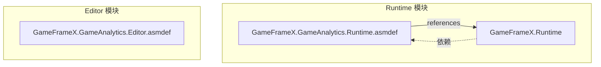
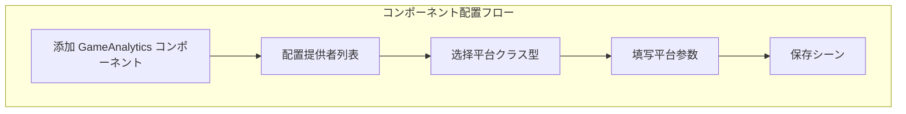

# 安装指南

本文档详细介绍如何将 GameFrameX GameAnalytics ゲーム数据分析コンポーネント安装到您的 Unity プロジェクト中。

## 概要

GameFrameX GameAnalytics コンポーネント是 Unity ゲームフレームワーク的コア模块之一，に使用集成ゲーム数据分析機能。该コンポーネントサポート多种数据分析平台的接入，提供统一的イベント上报インターフェース和计时機能，方便開発者在不同数据分析平台之间切换或同时使用多个平台。

**前置要求：**
- Unity 2017.1 或更高版本
- 已安装 GameFrameX Runtime コア库

## インストールメソッド

GameFrameX GameAnalytics コンポーネントサポート三种安装方法，您可能に基づいてプロジェクト需求选择最适合的メソッド。

### メソッド一：を通じて manifest.json 安装

在您的 Unity プロジェクト中，找到 `Packages` ファイル夹下的 `manifest.json` ファイル，在 `dependencies` ノードに追加以下の内容：

```json
{
  "dependencies": {
    "com.gameframex.unity.gameanalytics": "https://github.com/GameFrameX/com.gameframex.unity.gameanalytics.git"
  }
}
```

> Source: [README.md](https://github.com/GameFrameX/com.gameframex.unity.gameanalytics/blob/main/README.md#L150-L156)

修改完成后，Unity 会自动ダウンロード并安装该包。

### メソッド二：を通じて Unity Package Manager 安装

1. 打开 Unity 编辑器
2. 选择菜单 `Window` → `Package Manager`
3. 点击左上角的 `+` 按钮
4. 选择 `Add package from git URL...`
5. 输入以下 Git URL：
   ```
   https://github.com/GameFrameX/com.gameframex.unity.gameanalytics.git
   ```
6. 点击 `Add` 按钮等待安装完成

> Source: [README.md](https://github.com/GameFrameX/com.gameframex.unity.gameanalytics/blob/main/README.md#L156)

### メソッド三：直接ダウンロード安装

1. 从 GitHub 仓库ダウンロード最新的 Release 版本或克隆整个仓库
2. 将ダウンロード的ファイル夹复制到 Unity プロジェクト的 `Packages` ディレクトリ下
3. Unity 会自动识别并加载该包

## 安装验证

インストール完了後，您以下のメソッドで確認可能是否インストール成功：

### 检查 Package Manager

在 Unity Package Manager 窗口中，确认 `Game Frame X Game Analytics` 已出现在包列表中，并且显示正确的版本号。

```json
{
  "name": "com.gameframex.unity.gameanalytics",
  "version": "1.2.0"
}
```

> Source: [package.json](https://github.com/GameFrameX/com.gameframex.unity.gameanalytics/blob/main/package.json#L1-L6)

### 检查程序集定义

确认以下程序集定义ファイル已正确加载：



> Source: [GameFrameX.GameAnalytics.Runtime.asmdef](https://github.com/GameFrameX/com.gameframex.unity.gameanalytics/blob/main/Runtime/GameFrameX.GameAnalytics.Runtime.asmdef#L3-L5)

## コンポーネント配置

インストール完了後，必要在 Unity シーン中添加 GameAnalytics コンポーネント进行配置。

### 添加コンポーネント

1. 在 Unity 编辑器中，作成或打开一个シーン
2. 在 Hierarchy 面板中，选择一个 GameObject（或作成新对象）
3. 在 Inspector 面板中，点击 `Add Component` 按钮
4. 搜索并选择 `GameAnalytics` コンポーネント
5. コンポーネント将自动添加到选定的 GameObject 上

> Source: [GameAnalyticsComponent.cs](https://github.com/GameFrameX/com.gameframex.unity.gameanalytics/blob/main/Runtime/GameAnalytics/GameAnalyticsComponent.cs#L13-L14)

### 設定分析提供者

GameAnalytics コンポーネントサポート配置多个数据分析提供者。在 Inspector 面板中：

```csharp
[DisallowMultipleComponent]
[AddComponentMenu("Game Framework/GameAnalytics")]
public sealed class GameAnalyticsComponent : GameFrameworkComponent
```

> Source: [GameAnalyticsComponent.cs](https://github.com/GameFrameX/com.gameframex.unity.gameanalytics/blob/main/Runtime/GameAnalytics/GameAnalyticsComponent.cs#L12-L14)

1. 找到 **ゲーム数据分析コンポーネント列表** プロパティ
2. 点击 `+` 按钮添加新的提供者
3. 从下拉菜单中选择要使用的数据分析平台クラス型
4. に基づいて所选平台填写相应的配置参数



## 依赖项説明

GameFrameX GameAnalytics コンポーネント依赖于以下模块：

| 依赖项 | 説明 | 必須 |
|--------|------|------|
| GameFrameX.Runtime | コア运行时库 | 是 |

> Source: [GameFrameX.GameAnalytics.Runtime.asmdef](https://github.com/GameFrameX/com.gameframex.unity.gameanalytics/blob/main/Runtime/GameFrameX.GameAnalytics.Runtime.asmdef)

**重要ヒント：** 确保您已安装 GameFrameX Runtime コア库，否则コンポーネント将无法正常工作。

## 快速验证

安装和配置完成后，可能を通じて以下代码验证コンポーネント正常に動作しているか：

```csharp
using GameFrameX.GameAnalytics.Runtime;

// 取得コンポーネントインスタンス
var gameAnalytics = UnityEngine.GameObject.FindObjectOfType<GameAnalyticsComponent>();

// 检查是否初期化成功
if (gameAnalytics != null)
{
    // 上报测试イベント
    gameAnalytics.Event("test_event");
    UnityEngine.Debug.Log("GameAnalytics コンポーネントインストール成功！");
}
```

> Source: [GameAnalyticsComponent.cs](https://github.com/GameFrameX/com.gameframex.unity.gameanalytics/blob/main/Runtime/GameAnalytics/GameAnalyticsComponent.cs#L246-L265)

## よくある質問

### 安装后编译报错

如果遇到编译错误，お願いします检查：
1. 是否已正确安装 GameFrameX Runtime
2. Unity 版本是否符合要求（2017.1+）
3. manifest.json 语法是否正确

### コンポーネント无法添加到シーン

确保：
1. 已正确导入包
2. 在 Runtime ファイル夹下有正确的程序集定义
3. Unity プロジェクト已刷新（有时必要重启编辑器）

### Inspector 面板配置不显示

如果 Inspector 中看不到 GameAnalytics コンポーネント的配置面板，可能必要：
1. パッケージを再インポート
2. 检查 Editor 程序集是否正确加载
3. 确认 Unity Editor 版本兼容性

## 関連リンク

- [插件介绍](../1-overview/index) - 了解更多关于 GameAnalytics コンポーネント的機能特性
- [快速开始](../3-getting-started/index) - 开始使用 GameAnalytics 进行数据上报
- [コア架构](./04.features.md) - 了解コンポーネント的内部アーキテクチャ設計
- [编辑器配置](../6-configuration/index) - 详细了解编辑器配置选项
- [故障排除](../7-troubleshooting/index) - 常见问题与解決策
