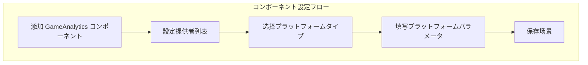

# インストールガイド

ドキュメント GameFrameX GameAnalytics ゲームデータコンポーネントインストールの Unity プロジェクト。

## 

GameFrameX GameAnalytics コンポーネントは Unity ゲームフレームワークのコアモジュール，にゲームデータ。コンポーネントサポートデータプラットフォームの，のイベントインターフェースと，にデータプラットフォームプラットフォーム。

**：**
- Unity 2017.1 バージョン
- インストール GameFrameX Runtime コア

## インストールメソッド

GameFrameX GameAnalytics コンポーネントサポートインストールメソッド，プロジェクトのメソッド。

### ：をじて manifest.json インストール

にの Unity プロジェクト， `Packages` ファイルの `manifest.json` ファイル，に `dependencies` ：

```json
{
  "dependencies": {
    "com.gameframex.unity.gameanalytics": "https://github.com/GameFrameX/com.gameframex.unity.gameanalytics.git"
  }
}
```

> Source: [README.md](https://github.com/GameFrameX/com.gameframex.unity.gameanalytics/blob/main/README.md#L150-L156)

た，Unity インストール。

### ：をじて Unity Package Manager インストール

1.  Unity エディター
2.  `Window` → `Package Manager`
3. の `+` 
4.  `Add package from git URL...`
5.  Git URL：
   ```
   https://github.com/GameFrameX/com.gameframex.unity.gameanalytics.git
   ```
6.  `Add` インストールた

> Source: [README.md](https://github.com/GameFrameX/com.gameframex.unity.gameanalytics/blob/main/README.md#L156)

### ：インストール

1.  GitHub リポジトリの Release バージョンリポジトリ
2. のファイル Unity プロジェクトの `Packages` ディレクトリ
3. Unity ロード

## インストール

インストールた，をじてはインストール：

###  Package Manager

に Unity Package Manager ， `Game Frame X Game Analytics` に，のバージョン。

```json
{
  "name": "com.gameframex.unity.gameanalytics",
  "version": "1.2.0"
}
```

> Source: [package.json](https://github.com/GameFrameX/com.gameframex.unity.gameanalytics/blob/main/package.json#L1-L6)

### 

ファイルロード：


> Source: [GameFrameX.GameAnalytics.Runtime.asmdef](https://github.com/GameFrameX/com.gameframex.unity.gameanalytics/blob/main/Runtime/GameFrameX.GameAnalytics.Runtime.asmdef#L3-L5)

## コンポーネント

インストールた，に Unity  GameAnalytics コンポーネント。

### コンポーネント

1. に Unity エディター，
2. に Hierarchy ， GameObject（）
3. に Inspector ， `Add Component` 
4.  `GameAnalytics` コンポーネント
5. コンポーネントの GameObject 

> Source: [GameAnalyticsComponent.cs](https://github.com/GameFrameX/com.gameframex.unity.gameanalytics/blob/main/Runtime/GameAnalytics/GameAnalyticsComponent.cs#L13-L14)

### 

GameAnalytics コンポーネントサポートデータ。に Inspector ：

```csharp
[DisallowMultipleComponent]
[AddComponentMenu("Game Framework/GameAnalytics")]
public sealed class GameAnalyticsComponent : GameFrameworkComponent
```

> Source: [GameAnalyticsComponent.cs](https://github.com/GameFrameX/com.gameframex.unity.gameanalytics/blob/main/Runtime/GameAnalytics/GameAnalyticsComponent.cs#L12-L14)

1.  **ゲームデータコンポーネント** プロパティ
2.  `+` の
3. のデータプラットフォームタイプ
4. プラットフォームのパラメータ



## 

GameFrameX GameAnalytics コンポーネントモジュール：

|  |  |  |
|--------|------|------|
| GameFrameX.Runtime | コア | は |

> Source: [GameFrameX.GameAnalytics.Runtime.asmdef](https://github.com/GameFrameX/com.gameframex.unity.gameanalytics/blob/main/Runtime/GameFrameX.GameAnalytics.Runtime.asmdef)

**：** インストール GameFrameX Runtime コア，コンポーネント。

## 

インストールとた，をじてコードコンポーネントは：

```csharp
using GameFrameX.GameAnalytics.Runtime;

// 获取コンポーネント实例
var gameAnalytics = UnityEngine.GameObject.FindObjectOfType<GameAnalyticsComponent>();

// 检查は否初始化成功
if (gameAnalytics != null)
{
    // 上报テストイベント
    gameAnalytics.Event("test_event");
    UnityEngine.Debug.Log("GameAnalytics コンポーネントインストール成功！");
}
```

> Source: [GameAnalyticsComponent.cs](https://github.com/GameFrameX/com.gameframex.unity.gameanalytics/blob/main/Runtime/GameAnalytics/GameAnalyticsComponent.cs#L246-L265)

## よくある

### インストールコンパイル

コンパイルエラー，：
1. はインストール GameFrameX Runtime
2. Unity バージョンは（2017.1+）
3. manifest.json は

### コンポーネント

：
1. 
2. に Runtime ファイルの
3. Unity プロジェクト（エディター）

### Inspector 

 Inspector  GameAnalytics コンポーネントの，：
1. 
2.  Editor はロード
3.  Unity Editor バージョン

## リンク

- [](../1-overview/index) - た GameAnalytics コンポーネントの
- [クイックスタート](../3-getting-started/index) -  GameAnalytics データ
- [コアアーキテクチャ](./04.features.md) - たコンポーネントのアーキテクチャ
- [エディター](../6-configuration/index) - たエディターオプション
- [](../7-troubleshooting/index) - よくあると
