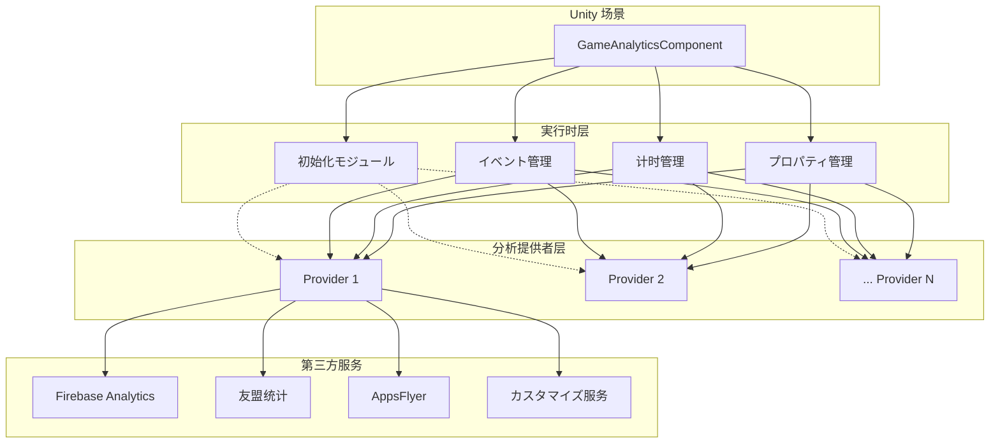
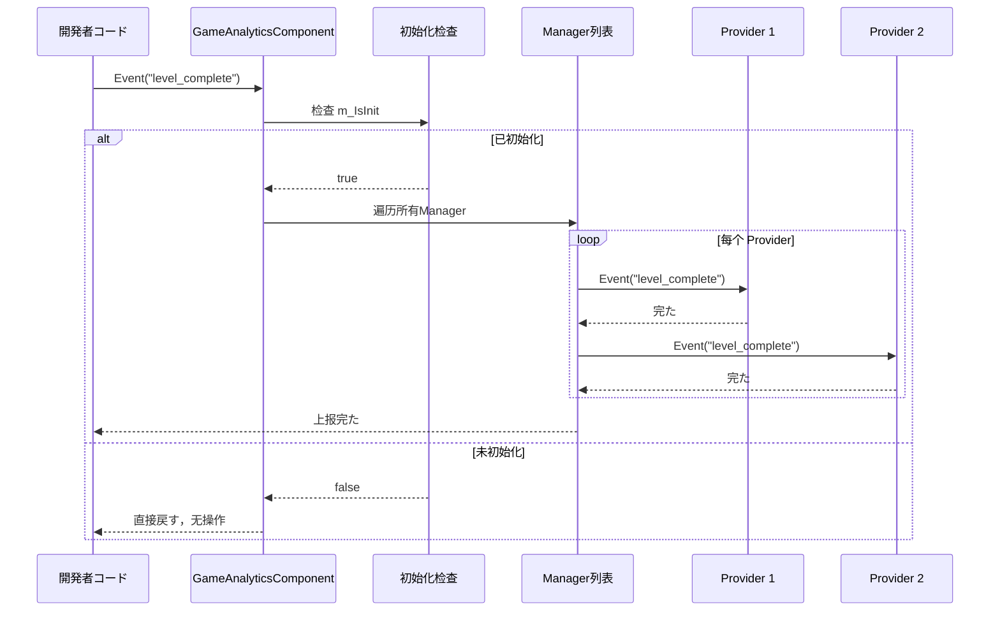

# クイックスタート

ガイド GameAnalytics コンポーネントゲームデータ。をじて，たに Unity プロジェクトコンポーネント、，コアイベントと。

## 

GameAnalytics コンポーネントは GameFrameX フレームワークの，にゲームデータ。たのイベントインターフェース，サポート（ Firebase、UMeng、AppsFlyer ）の。

コンポーネントコア：
- **サポート**：をじて，データの
- ****：コンポーネント，びし
- **のイベント**：サポートシンプルイベント、イベント、カスタマイズイベント

## アーキテクチャ



，GameAnalyticsComponent は Unity のコアコンポーネント，モジュール：、イベント、とプロパティ。モジュールをじてのインターフェースと，データの。

## コアフロー

### イベントフロー

びし Event メソッドイベント，データフロー：



フローたにコンポーネントイベント，たびしのデータ。

## ガイド

### ：コンポーネント

に Unity エディター，ステップ GameAnalytics コンポーネント：

1. に GameObject，の GameObject
2. に Inspector ， **Add Component** 
3. に "GameAnalytics"  "ゲームデータ"
4.  **Game Framework > GameAnalytics** コンポーネント

> Source: [GameAnalyticsComponent.cs](https://github.com/GameFrameX/com.gameframex.unity.gameanalytics/blob/main/Runtime/GameAnalytics/GameAnalyticsComponent.cs#L14-L15)

コンポーネント， `GameFrameworkComponent` クラス，は GameFrameX フレームワークのコンポーネントクラス。

### ：

コンポーネント，に Inspector ：

1. の GameAnalytics GameObject
2. に Inspector  **ゲームデータコンポーネント** プロパティ
3. の **+** の
4.  **ComponentType** のクラス
5. の，のパラメータ（ App ID、App Key ）

```csharp
// コンポーネント設定のデータ構造定义
[Serializable]
public class GameAnalyticsComponentProvider
{
    /// <summary>
    /// 实现コンポーネントタイプ
    /// </summary>
    public string ComponentType;

    /// <summary>
    /// 这个は给エディター用の
    /// </summary>
    public int ComponentTypeNameIndex = 0;

    /// <summary>
    /// パラメータ
    /// </summary>
    public List<GameAnalyticsComponentParamKV> Setting = new List<GameAnalyticsComponentParamKV>();
}
```

> Source: [GameAnalyticsComponent.cs](https://github.com/GameFrameX/com.gameframex.unity.gameanalytics/blob/main/Runtime/GameAnalytics/GameAnalyticsComponent.cs#L361-L378)

### ：にコード

はにゲームコード GameAnalytics コンポーネントの：

#### コンポーネント

```csharp
using GameFrameX.GameAnalytics.Runtime;

// 获取 GameAnalyticsComponent 实例
var gameAnalytics = UnityEngine.GameObject.FindObjectOfType<GameAnalyticsComponent>();
```

> Source: [GameAnalyticsComponent.cs](https://github.com/GameFrameX/com.gameframex.unity.gameanalytics/blob/main/Runtime/GameAnalytics/GameAnalyticsComponent.cs#L14-L25)

#### 

コンポーネントに `OnEnable()` 。た，`m_IsInit`  `true`。イベントメソッド：

```csharp
public void Event(string eventName)
{
    GameFrameworkGuard.NotNullOrEmpty(eventName, nameof(eventName));
    if (!m_IsInit)
    {
        return;  // 未初始化时直接戻す，不実行任何操作
    }
    // ... イベント上报逻辑
}
```

> Source: [GameAnalyticsComponent.cs](https://github.com/GameFrameX/com.gameframex.unity.gameanalytics/blob/main/Runtime/GameAnalytics/GameAnalyticsComponent.cs#L246-L265)

たコンポーネントに，たにの。

## 

### イベント

GameAnalytics コンポーネントたイベントメソッド，の：

#### 1. シンプルイベント

にむデータのシンプルイベント，、：

```csharp
/// <summary>
/// 上报イベント
/// </summary>
/// <param name="eventName">イベント名称</param>
public void Event(string eventName)
```

**：**

```csharp
// 上报玩家完た关卡のイベント
gameAnalytics.Event("level_complete");

// 上报玩家进入商店のイベント
gameAnalytics.Event("enter_shop");
```

> Source: [GameAnalyticsComponent.cs](https://github.com/GameFrameX/com.gameframex.unity.gameanalytics/blob/main/Runtime/GameAnalytics/GameAnalyticsComponent.cs#L242-L265)

#### 2. のイベント

にのイベント，、、：

```csharp
/// <summary>
/// 上报带有数值のイベント
/// </summary>
/// <param name="eventName">イベント名称</param>
/// <param name="eventValue">イベント数值</param>
public void Event(string eventName, float eventValue)
```

**：**

```csharp
// 上报玩家得分
gameAnalytics.Event("score", 1500.5f);

// 上报玩家等级
gameAnalytics.Event("player_level", 10f);
```

> Source: [GameAnalyticsComponent.cs](https://github.com/GameFrameX/com.gameframex.unity.gameanalytics/blob/main/Runtime/GameAnalytics/GameAnalyticsComponent.cs#L267-L291)

#### 3. カスタマイズのイベント

にカスタマイズのイベント，のデータ：

```csharp
/// <summary>
/// 上报カスタマイズ字段のイベント
/// </summary>
/// <param name="eventName">イベント名称</param>
/// <param name="customF">カスタマイズ字段</param>
public void Event(string eventName, Dictionary<string, object> customF)
```

**：**

```csharp
// 上报关卡完たイベント，带カスタマイズ字段
var customFields = new Dictionary<string, object>
{
    { "level_id", "level_05" },
    { "difficulty", "hard" },
    { "stars", 3 }
};
gameAnalytics.Event("level_complete", customFields);
```

> Source: [GameAnalyticsComponent.cs](https://github.com/GameFrameX/com.gameframex.unity.gameanalytics/blob/main/Runtime/GameAnalytics/GameAnalyticsComponent.cs#L293-L324)

#### 4. とカスタマイズのイベント

はのイベントメソッド，むとカスタマイズ：

```csharp
/// <summary>
/// 上报带有数值とカスタマイズ字段のイベント
/// </summary>
/// <param name="eventName">イベント名称</param>
/// <param name="eventValue">イベント数值</param>
/// <param name="customF">カスタマイズ字段</param>
public void Event(string eventName, float eventValue, Dictionary<string, object> customF)
```

**：**

```csharp
// 上报购买イベント，含む消费金额と商品信息
var purchaseInfo = new Dictionary<string, object>
{
    { "item_id", "gem_pack_100" },
    { "currency", "USD" }
};
gameAnalytics.Event("purchase", 0.99f, purchaseInfo);
```

> Source: [GameAnalyticsComponent.cs](https://github.com/GameFrameX/com.gameframex.unity.gameanalytics/blob/main/Runtime/GameAnalytics/GameAnalyticsComponent.cs#L326-L358)

### 

ゲーム，にたの。ゲームと。

#### 

```csharp
/// <summary>
/// 開始计时
/// </summary>
/// <param name="eventName">イベント名称</param>
public void StartTimer(string eventName)
```

**：**

```csharp
// 玩家開始挑战关卡时開始计时
gameAnalytics.StartTimer("level_05");
```

> Source: [GameAnalyticsComponent.cs](https://github.com/GameFrameX/com.gameframex.unity.gameanalytics/blob/main/Runtime/GameAnalytics/GameAnalyticsComponent.cs#L156-L179)

#### 

```csharp
/// <summary>
/// 暂停计时
/// </summary>
/// <param name="eventName">イベント名称</param>
public void PauseTimer(string eventName)
```

ゲーム：

```csharp
// 玩家暂停ゲーム时暂停计时
gameAnalytics.PauseTimer("level_05");
```

> Source: [GameAnalyticsComponent.cs](https://github.com/GameFrameX/com.gameframex.unity.gameanalytics/blob/main/Runtime/GameAnalytics/GameAnalyticsComponent.cs#L181-L197)

#### 

```csharp
/// <summary>
/// 恢复计时
/// </summary>
/// <param name="eventName">イベント名称</param>
public void ResumeTimer(string eventName)
```

ゲーム：

```csharp
// 玩家恢复ゲーム时恢复计时
gameAnalytics.ResumeTimer("level_05");
```

> Source: [GameAnalyticsComponent.cs](https://github.com/GameFrameX/com.gameframex.unity.gameanalytics/blob/main/Runtime/GameAnalytics/GameAnalyticsComponent.cs#L199-L215)

#### た

```csharp
/// <summary>
/// 終た计时
/// </summary>
/// <param name="eventName">イベント名称</param>
public void StopTimer(string eventName)
```

た：

```csharp
// 玩家完た关卡时停止计时
gameAnalytics.StopTimer("level_05");
```

> Source: [GameAnalyticsComponent.cs](https://github.com/GameFrameX/com.gameframex.unity.gameanalytics/blob/main/Runtime/GameAnalytics/GameAnalyticsComponent.cs#L217-L240)

### 

#### ID

にのイベントデータ：

```csharp
/// <summary>
/// 設定玩家ID
/// </summary>
/// <param name="playerId">玩家ID</param>
public void SetPlayerId(string playerId)
```

**：**

```csharp
// 玩家登录后設定玩家ID
gameAnalytics.SetPlayerId("player_12345");
```

> Source: [GameAnalyticsComponent.cs](https://github.com/GameFrameX/com.gameframex.unity.gameanalytics/blob/main/Runtime/GameAnalytics/GameAnalyticsComponent.cs#L32-L42)

### プロパティ

プロパティのイベント，。

#### プロパティ

```csharp
/// <summary>
/// 設定公共プロパティ
/// </summary>
/// <param name="key">Key</param>
/// <param name="value">值</param>
public void SetPublicProperties(string key, object value)
```

**：**

```csharp
// 設定玩家のVIP等级
gameAnalytics.SetPublicProperties("vip_level", 5);

// 設定玩家所にの服务器
gameAnalytics.SetPublicProperties("server", "us_west");
```

> Source: [GameAnalyticsComponent.cs](https://github.com/GameFrameX/com.gameframex.unity.gameanalytics/blob/main/Runtime/GameAnalytics/GameAnalyticsComponent.cs#L102-L119)

#### プロパティ

```csharp
/// <summary>
/// 获取公共プロパティ
/// </summary>
/// <returns></returns>
public Dictionary<string, object> GetPublicProperties()
```

#### プロパティ

```csharp
/// <summary>
/// 清除公共プロパティ
/// </summary>
public void ClearPublicProperties()
```

> Source: [GameAnalyticsComponent.cs](https://github.com/GameFrameX/com.gameframex.unity.gameanalytics/blob/main/Runtime/GameAnalytics/GameAnalyticsComponent.cs#L120-L154)

### 

コンポーネントプロパティ：

| プロパティ |  | データ |
|---------|------|---------|
| device_id |  | SystemInfo.deviceUniqueIdentifier |
| device_model |  | SystemInfo.deviceModel |
| device_type | タイプ | SystemInfo.deviceType |
| os |  | SystemInfo.operatingSystem |
| app_version | バージョン | Application.version |
| unity_version | Unityバージョン | Application.unityVersion |
| platform | プラットフォーム | Application.platform |
| processor_type | タイプ | SystemInfo.processorType |
| processor_count | コア | SystemInfo.processorCount |
| system_memory_size |  | SystemInfo.systemMemorySize |
| graphics_device_name |  | SystemInfo.graphicsDeviceName |
| screen_width |  | Screen.width |
| screen_height |  | Screen.height |
| screen_dpi | DPI | Screen.dpi |
| network_type | ネットワークタイプ | Application.internetReachability |
| system_language |  | Application.systemLanguage |

> Source: [BaseGameAnalyticsManager.cs](https://github.com/GameFrameX/com.gameframex.unity.gameanalytics/blob/main/Runtime/GameAnalytics/BaseGameAnalyticsManager.cs#L85-L144)

## 

はのゲーム，たにプロジェクト GameAnalytics コンポーネント：

```csharp
using System.Collections.Generic;
using UnityEngine;
using GameFrameX.GameAnalytics.Runtime;

public class GameAnalyticsExample : MonoBehaviour
{
    private GameAnalyticsComponent _gameAnalytics;

    private void Awake()
    {
        // 获取 GameAnalytics コンポーネント实例
        _gameAnalytics = GetComponent<GameAnalyticsComponent>();
        
        if (_gameAnalytics == null)
        {
            Debug.LogError("GameAnalyticsComponent not found!");
            return;
        }
        
        // 設定玩家ID
        _gameAnalytics.SetPlayerId("player_10001");
        
        // 設定公共プロパティ
        _gameAnalytics.SetPublicProperties("vip_level", 3);
        _gameAnalytics.SetPublicProperties("server", "asia_east");
    }

    private void Start()
    {
        // 上报玩家进入ゲーム
        _gameAnalytics.Event("game_start");
    }

    public void OnLevelStart(string levelId)
    {
        // 開始关卡计时
        _gameAnalytics.StartTimer($"level_{levelId}");
        
        // 上报关卡開始イベント
        var customFields = new Dictionary<string, object>
        {
            { "level_id", levelId },
            { "difficulty", "normal" }
        };
        _gameAnalytics.Event("level_start", customFields);
    }

    public void OnLevelComplete(string levelId, int score, int stars)
    {
        // 停止关卡计时
        _gameAnalytics.StopTimer($"level_{levelId}");
        
        // 上报关卡完たイベント（带数值とカスタマイズ字段）
        var customFields = new Dictionary<string, object>
        {
            { "level_id", levelId },
            { "stars", stars }
        };
        _gameAnalytics.Event("level_complete", score, customFields);
    }

    public void OnPurchase(string itemId, float price, string currency)
    {
        // 上报购买イベント
        var customFields = new Dictionary<string, object>
        {
            { "item_id", itemId },
            { "currency", currency }
        };
        _gameAnalytics.Event("purchase", price, customFields);
    }

    public void OnPlayerLevelUp(int newLevel)
    {
        // 更新VIP等级公共プロパティ
        _gameAnalytics.SetPublicProperties("player_level", newLevel);
        
        // 上报升级イベント
        _gameAnalytics.Event("level_up", newLevel);
    }
}
```

たコンポーネントの：
1. に `Awake` コンポーネントIDとプロパティ
2. にゲームフロー（、た、）イベント
3. た

## オプション

### 

デフォルト，コンポーネントに `OnEnable()` 。はの：

```csharp
private void OnEnable()
{
    Init();
}
```

> Source: [GameAnalyticsComponent.cs](https://github.com/GameFrameX/com.gameframex.unity.gameanalytics/blob/main/Runtime/GameAnalytics/GameAnalyticsComponent.cs#L27-L30)

### 

に，：

```csharp
/// <summary>
/// 手动初始化
/// </summary>
/// <param name="extraArgs">额外の初始化パラメータ</param>
public void ManualInit(Dictionary<string, string> extraArgs)
```

**：**

```csharp
// に玩家登录完た后手动初始化
var extraArgs = new Dictionary<string, string>
{
    { "user_token", userToken },
    { "init_time", System.DateTime.Now.ToString() }
};
gameAnalytics.ManualInit(extraArgs);
```

> Source: [GameAnalyticsComponent.cs](https://github.com/GameFrameX/com.gameframex.unity.gameanalytics/blob/main/Runtime/GameAnalytics/GameAnalyticsComponent.cs#L82-L100)

## 

### 1. イベント

のイベント，データの：

- と：`level_complete`, `purchase_success`
- ：`game_start`, `tutorial_finish`
- と

### 2. プロパティの

プロパティにゲームの：
- ID
- VIP
- 
- 

### 3. シーン

に：
- た
- た
- 
- 

### 4. 

イベントメソッド `m_IsInit` 。コンポーネント，メソッドす。たにびし。

## リンク

- [](./1-overview) - た GameAnalytics の
- [インストールガイド](./2-installation) - のインストールステップ
- [コアアーキテクチャ](./04.features.md) - たフレームワークのコアアーキテクチャ
- [API インターフェース](./5-api-reference) - の API リファレンスドキュメント
- [エディター](./6-configuration) - エディター
- [](./7-troubleshooting) - よくあると
