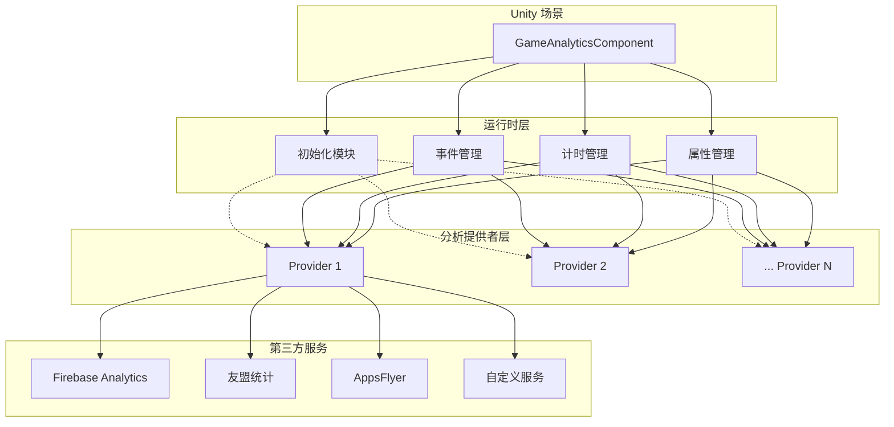
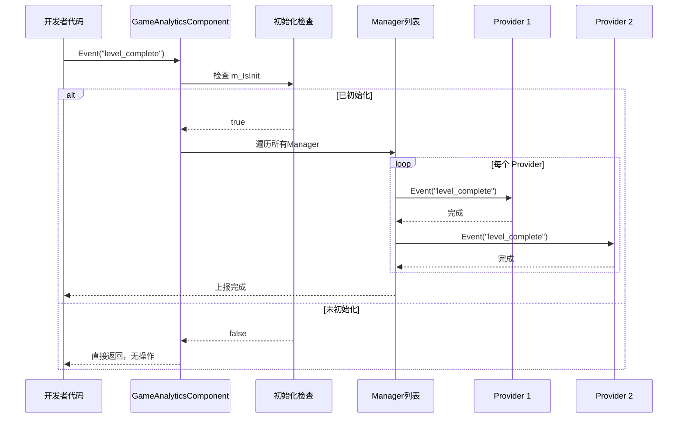

# クイックスタート

本ガイド将帮助您快速集成并使用 GameAnalytics コンポーネント进行游戏数据分析。通过本章节，您将理解する如何在 Unity プロジェクト中追加コンポーネント、設定分析提供者，および使用コア機能进行イベント上报和计时。

## 概要

GameAnalytics コンポーネント是 GameFrameX フレームワーク的一部分，专门用于游戏数据分析。它提供します統一された的イベント上报インターフェース，サポート多个第3方分析服务（如 Firebase、UMeng、AppsFlyer 等）的集成。

该コンポーネント設計遵循以下コア原则：
- **多提供者サポート**：通过列表設定多个分析服务，数据会按顺序上报到所有已設定的服务
- **自动初期化**：コンポーネント挂载到シーン后自动初期化，无需手动呼び出し
- **柔軟的イベント上报**：サポートシンプルイベント、带数值イベント、带自定義フィールドイベント等多种形式

## アーキテクチャ概览



如上图所示，GameAnalyticsComponent 是位于 Unity シーン中的コアコンポーネント，它管理四个主なモジュール：初期化、イベント管理、计时管理和プロパティ管理。这些モジュール通过統一された的インターフェース与多个分析提供者进行交互，最终将数据上报到不同的第3方分析服务。

## コアフロー

### イベント上报フロー

当您呼び出し Event メソッド上报イベント时，数据会经过以下フロー：



此フロー確認してください了只有在コンポーネント正确初期化后才会执行イベント上报，避免了因过早呼び出し导致的数据丢失。

## 使用ガイド

### 第1步：追加コンポーネント到シーン

在 Unity エディタ中，按照以下ステップ追加 GameAnalytics コンポーネント：

1. 在シーン中作成一个空 GameObject，または选择现有的 GameObject
2. 在 Inspector パネル中，点击 **Add Component** ボタン
3. 在検索框中输入 "GameAnalytics" 或 "游戏数据分析"
4. 选择 **Game Framework > GameAnalytics** コンポーネント

> Source: [GameAnalyticsComponent.cs](https://github.com/GameFrameX/com.gameframex.unity.gameanalytics/blob/main/Runtime/GameAnalytics/GameAnalyticsComponent.cs#L14-L15)

コンポーネント追加后，会自动継承 `GameFrameworkComponent` 基底クラス，这是 GameFrameX フレームワーク的標準コンポーネント基底クラス。

### 第2步：設定分析提供者

追加コンポーネント后，〜する必要があります在 Inspector パネル中設定分析提供者：

1. 选中シーン中的 GameAnalytics GameObject
2. 在 Inspector 中找到 **游戏数据分析コンポーネント列表** プロパティ
3. 点击列表左下角的 **+** ボタン追加新的提供者
4. 从 **ComponentType** 下拉メニュー中选择具体的分析服务実装类
5. 根据选择的分析服务，設定相应的パラメータ（如 App ID、App Key 等）

```csharp
// 组件配置的数据结构定义
[Serializable]
public class GameAnalyticsComponentProvider
{
    /// <summary>
    /// 实现组件类型
    /// </summary>
    public string ComponentType;

    /// <summary>
    /// 这个是给编辑器用的
    /// </summary>
    public int ComponentTypeNameIndex = 0;

    /// <summary>
    /// 参数
    /// </summary>
    public List<GameAnalyticsComponentParamKV> Setting = new List<GameAnalyticsComponentParamKV>();
}
```

> Source: [GameAnalyticsComponent.cs](https://github.com/GameFrameX/com.gameframex.unity.gameanalytics/blob/main/Runtime/GameAnalytics/GameAnalyticsComponent.cs#L361-L378)

### 第3步：在コード中使用

以下是在游戏コード中使用 GameAnalytics コンポーネント的各种方法：

#### 取得コンポーネントインスタンス

```csharp
using GameFrameX.GameAnalytics.Runtime;

// 获取 GameAnalyticsComponent 实例
var gameAnalytics = UnityEngine.GameObject.FindObjectOfType<GameAnalyticsComponent>();
```

> Source: [GameAnalyticsComponent.cs](https://github.com/GameFrameX/com.gameframex.unity.gameanalytics/blob/main/Runtime/GameAnalytics/GameAnalyticsComponent.cs#L14-L25)

#### 初期化ステータス確認

コンポーネント在 `OnEnable()` 时会自动初期化。初期化完成后，`m_IsInit` 标志会被設定为 `true`。所有イベント上报メソッド都会確認此标志：

```csharp
public void Event(string eventName)
{
    GameFrameworkGuard.NotNullOrEmpty(eventName, nameof(eventName));
    if (!m_IsInit)
    {
        return;  // 未初始化时直接返回，不执行任何操作
    }
    // ... 事件上报逻辑
}
```

> Source: [GameAnalyticsComponent.cs](https://github.com/GameFrameX/com.gameframex.unity.gameanalytics/blob/main/Runtime/GameAnalytics/GameAnalyticsComponent.cs#L246-L265)

这种設計確認してください了コンポーネント在未正确初期化时不会执行任何操作，避免了潜在的空参照例外。

## 機能详解

### イベント上报

GameAnalytics コンポーネント提供します四种イベント上报メソッド，满足不同シーン的需求：

#### 1. シンプルイベント上报

用于上报不パッケージ含任何附加数据的シンプルイベント，例えばユーザー点击ボタン、进入某个页面等：

```csharp
/// <summary>
/// 上报事件
/// </summary>
/// <param name="eventName">事件名称</param>
public void Event(string eventName)
```

**使用例：**

```csharp
// 上报玩家完成关卡的事件
gameAnalytics.Event("level_complete");

// 上报玩家进入商店的事件
gameAnalytics.Event("enter_shop");
```

> Source: [GameAnalyticsComponent.cs](https://github.com/GameFrameX/com.gameframex.unity.gameanalytics/blob/main/Runtime/GameAnalytics/GameAnalyticsComponent.cs#L242-L265)

#### 2. 带数值的イベント上报

用于上报〜する必要があります记录数值的イベント，例えば得分、等级、金币数量等：

```csharp
/// <summary>
/// 上报带有数值的事件
/// </summary>
/// <param name="eventName">事件名称</param>
/// <param name="eventValue">事件数值</param>
public void Event(string eventName, float eventValue)
```

**使用例：**

```csharp
// 上报玩家得分
gameAnalytics.Event("score", 1500.5f);

// 上报玩家等级
gameAnalytics.Event("player_level", 10f);
```

> Source: [GameAnalyticsComponent.cs](https://github.com/GameFrameX/com.gameframex.unity.gameanalytics/blob/main/Runtime/GameAnalytics/GameAnalyticsComponent.cs#L267-L291)

#### 3. 带自定義フィールド的イベント上报

用于上报〜する必要があります携带自定義维度的イベント，便于后续进行更精细的数据分析：

```csharp
/// <summary>
/// 上报自定义字段的事件
/// </summary>
/// <param name="eventName">事件名称</param>
/// <param name="customF">自定义字段</param>
public void Event(string eventName, Dictionary<string, object> customF)
```

**使用例：**

```csharp
// 上报关卡完成事件，带自定义字段
var customFields = new Dictionary<string, object>
{
    { "level_id", "level_05" },
    { "difficulty", "hard" },
    { "stars", 3 }
};
gameAnalytics.Event("level_complete", customFields);
```

> Source: [GameAnalyticsComponent.cs](https://github.com/GameFrameX/com.gameframex.unity.gameanalytics/blob/main/Runtime/GameAnalytics/GameAnalyticsComponent.cs#L293-L324)

#### 4. 带数值和自定義フィールド的イベント上报

这是機能最全的イベント上报メソッド，同時にパッケージ含数值和自定義维度：

```csharp
/// <summary>
/// 上报带有数值和自定义字段的事件
/// </summary>
/// <param name="eventName">事件名称</param>
/// <param name="eventValue">事件数值</param>
/// <param name="customF">自定义字段</param>
public void Event(string eventName, float eventValue, Dictionary<string, object> customF)
```

**使用例：**

```csharp
// 上报购买事件，包含消费金额和商品信息
var purchaseInfo = new Dictionary<string, object>
{
    { "item_id", "gem_pack_100" },
    { "currency", "USD" }
};
gameAnalytics.Event("purchase", 0.99f, purchaseInfo);
```

> Source: [GameAnalyticsComponent.cs](https://github.com/GameFrameX/com.gameframex.unity.gameanalytics/blob/main/Runtime/GameAnalytics/GameAnalyticsComponent.cs#L326-L358)

### 计时機能

游戏分析中，计时機能用于测量プレイヤー完成特定任务或关卡所花费的时间。这对于分析游戏难度和プレイヤー行为非常重要な。

#### 开始计时

```csharp
/// <summary>
/// 开始计时
/// </summary>
/// <param name="eventName">事件名称</param>
public void StartTimer(string eventName)
```

**使用例：**

```csharp
// 玩家开始挑战关卡时开始计时
gameAnalytics.StartTimer("level_05");
```

> Source: [GameAnalyticsComponent.cs](https://github.com/GameFrameX/com.gameframex.unity.gameanalytics/blob/main/Runtime/GameAnalytics/GameAnalyticsComponent.cs#L156-L179)

#### 暂停计时

```csharp
/// <summary>
/// 暂停计时
/// </summary>
/// <param name="eventName">事件名称</param>
public void PauseTimer(string eventName)
```

当プレイヤー暂停游戏或离开当前シーン时使用：

```csharp
// 玩家暂停游戏时暂停计时
gameAnalytics.PauseTimer("level_05");
```

> Source: [GameAnalyticsComponent.cs](https://github.com/GameFrameX/com.gameframex.unity.gameanalytics/blob/main/Runtime/GameAnalytics/GameAnalyticsComponent.cs#L181-L197)

#### 恢复计时

```csharp
/// <summary>
/// 恢复计时
/// </summary>
/// <param name="eventName">事件名称</param>
public void ResumeTimer(string eventName)
```

プレイヤー恢复游戏后继续计时：

```csharp
// 玩家恢复游戏时恢复计时
gameAnalytics.ResumeTimer("level_05");
```

> Source: [GameAnalyticsComponent.cs](https://github.com/GameFrameX/com.gameframex.unity.gameanalytics/blob/main/Runtime/GameAnalytics/GameAnalyticsComponent.cs#L199-L215)

#### 结束计时并上报

```csharp
/// <summary>
/// 结束计时
/// </summary>
/// <param name="eventName">事件名称</param>
public void StopTimer(string eventName)
```

プレイヤー完成关卡或放弃时停止计时：

```csharp
// 玩家完成关卡时停止计时
gameAnalytics.StopTimer("level_05");
```

> Source: [GameAnalyticsComponent.cs](https://github.com/GameFrameX/com.gameframex.unity.gameanalytics/blob/main/Runtime/GameAnalytics/GameAnalyticsComponent.cs#L217-L240)

### プレイヤー管理

#### 設定プレイヤーID

用于关联特定プレイヤー的所有イベント数据：

```csharp
/// <summary>
/// 设置玩家ID
/// </summary>
/// <param name="playerId">玩家ID</param>
public void SetPlayerId(string playerId)
```

**使用例：**

```csharp
// 玩家登录后设置玩家ID
gameAnalytics.SetPlayerId("player_12345");
```

> Source: [GameAnalyticsComponent.cs](https://github.com/GameFrameX/com.gameframex.unity.gameanalytics/blob/main/Runtime/GameAnalytics/GameAnalyticsComponent.cs#L32-L42)

### 公共プロパティ

公共プロパティ会自动附加到所有上报的イベント中，便于进行多维度分析。

#### 設定公共プロパティ

```csharp
/// <summary>
/// 设置公共属性
/// </summary>
/// <param name="key">Key</param>
/// <param name="value">值</param>
public void SetPublicProperties(string key, object value)
```

**使用例：**

```csharp
// 设置玩家的VIP等级
gameAnalytics.SetPublicProperties("vip_level", 5);

// 设置玩家所在的服务器
gameAnalytics.SetPublicProperties("server", "us_west");
```

> Source: [GameAnalyticsComponent.cs](https://github.com/GameFrameX/com.gameframex.unity.gameanalytics/blob/main/Runtime/GameAnalytics/GameAnalyticsComponent.cs#L102-L119)

#### 取得公共プロパティ

```csharp
/// <summary>
/// 获取公共属性
/// </summary>
/// <returns></returns>
public Dictionary<string, object> GetPublicProperties()
```

#### 清除公共プロパティ

```csharp
/// <summary>
/// 清除公共属性
/// </summary>
public void ClearPublicProperties()
```

> Source: [GameAnalyticsComponent.cs](https://github.com/GameFrameX/com.gameframex.unity.gameanalytics/blob/main/Runtime/GameAnalytics/GameAnalyticsComponent.cs#L120-L154)

### 自动设备情報收集

コンポーネント会自动收集以下设备情報并追加到公共プロパティ中：

| プロパティ名称 | 説明 | 数据来源 |
|---------|------|---------|
| device_id | 设备唯一标识符 | SystemInfo.deviceUniqueIdentifier |
| device_model | 设备型号 | SystemInfo.deviceModel |
| device_type | 设备タイプ | SystemInfo.deviceType |
| os | 操作系统 | SystemInfo.operatingSystem |
| app_version | 应用バージョン | Application.version |
| unity_version | Unityバージョン | Application.unityVersion |
| platform | プラットフォーム | Application.platform |
| processor_type | 処理器タイプ | SystemInfo.processorType |
| processor_count | 処理器コア数 | SystemInfo.processorCount |
| system_memory_size | 系统内存大小 | SystemInfo.systemMemorySize |
| graphics_device_name | 显卡名称 | SystemInfo.graphicsDeviceName |
| screen_width | 屏幕宽度 | Screen.width |
| screen_height | 屏幕高度 | Screen.height |
| screen_dpi | 屏幕DPI | Screen.dpi |
| network_type | 网络タイプ | Application.internetReachability |
| system_language | 系统语言 | Application.systemLanguage |

> Source: [BaseGameAnalyticsManager.cs](https://github.com/GameFrameX/com.gameframex.unity.gameanalytics/blob/main/Runtime/GameAnalytics/BaseGameAnalyticsManager.cs#L85-L144)

## 完全な使用例

以下は完全な的游戏脚本例，表示了如何在实际プロジェクト中使用 GameAnalytics コンポーネント：

```csharp
using System.Collections.Generic;
using UnityEngine;
using GameFrameX.GameAnalytics.Runtime;

public class GameAnalyticsExample : MonoBehaviour
{
    private GameAnalyticsComponent _gameAnalytics;

    private void Awake()
    {
        // 获取 GameAnalytics 组件实例
        _gameAnalytics = GetComponent<GameAnalyticsComponent>();
        
        if (_gameAnalytics == null)
        {
            Debug.LogError("GameAnalyticsComponent not found!");
            return;
        }
        
        // 设置玩家ID
        _gameAnalytics.SetPlayerId("player_10001");
        
        // 设置公共属性
        _gameAnalytics.SetPublicProperties("vip_level", 3);
        _gameAnalytics.SetPublicProperties("server", "asia_east");
    }

    private void Start()
    {
        // 上报玩家进入游戏
        _gameAnalytics.Event("game_start");
    }

    public void OnLevelStart(string levelId)
    {
        // 开始关卡计时
        _gameAnalytics.StartTimer($"level_{levelId}");
        
        // 上报关卡开始事件
        var customFields = new Dictionary<string, object>
        {
            { "level_id", levelId },
            { "difficulty", "normal" }
        };
        _gameAnalytics.Event("level_start", customFields);
    }

    public void OnLevelComplete(string levelId, int score, int stars)
    {
        // 停止关卡计时
        _gameAnalytics.StopTimer($"level_{levelId}");
        
        // 上报关卡完成事件（带数值和自定义字段）
        var customFields = new Dictionary<string, object>
        {
            { "level_id", levelId },
            { "stars", stars }
        };
        _gameAnalytics.Event("level_complete", score, customFields);
    }

    public void OnPurchase(string itemId, float price, string currency)
    {
        // 上报购买事件
        var customFields = new Dictionary<string, object>
        {
            { "item_id", itemId },
            { "currency", currency }
        };
        _gameAnalytics.Event("purchase", price, customFields);
    }

    public void OnPlayerLevelUp(int newLevel)
    {
        // 更新VIP等级公共属性
        _gameAnalytics.SetPublicProperties("player_level", newLevel);
        
        // 上报升级事件
        _gameAnalytics.Event("level_up", newLevel);
    }
}
```

这个例表示了コンポーネント的典型使用モード：
1. 在 `Awake` 中取得コンポーネント参照并設定プレイヤーID和公共プロパティ
2. 在游戏フロー关键点（开始、完成、购买等）上报イベント
3. 使用计时機能测量关卡完成时间

## 初期化オプション

### 自动初期化

デフォルト情况下，コンポーネント在 `OnEnable()` 时自动初期化。这是推奨的初期化方法：

```csharp
private void OnEnable()
{
    Init();
}
```

> Source: [GameAnalyticsComponent.cs](https://github.com/GameFrameX/com.gameframex.unity.gameanalytics/blob/main/Runtime/GameAnalytics/GameAnalyticsComponent.cs#L27-L30)

### 手动初期化

もし您〜する必要があります在特定时机初期化，〜できます使用手动初期化：

```csharp
/// <summary>
/// 手动初始化
/// </summary>
/// <param name="extraArgs">额外的初始化参数</param>
public void ManualInit(Dictionary<string, string> extraArgs)
```

**使用例：**

```csharp
// 在玩家登录完成后手动初始化
var extraArgs = new Dictionary<string, string>
{
    { "user_token", userToken },
    { "init_time", System.DateTime.Now.ToString() }
};
gameAnalytics.ManualInit(extraArgs);
```

> Source: [GameAnalyticsComponent.cs](https://github.com/GameFrameX/com.gameframex.unity.gameanalytics/blob/main/Runtime/GameAnalytics/GameAnalyticsComponent.cs#L82-L100)

## ベストプラクティス

### 1. イベント命名规范

お勧め使用統一された的命名规范来命名イベント，以確認してください数据分析的准确性：

- 使用小写字母和下划线：`level_complete`, `purchase_success`
- 保持シンプル但具有説明性：`game_start`, `tutorial_finish`
- 避免特殊字符和中文

### 2. 公共プロパティ的合理使用

公共プロパティ适合存储在游戏会话期间不会变化的情報：
- プレイヤーID
- VIP等级
- 服务器区域
- 渠道情報

### 3. 计时器使用シーン

计时器特别適しています以下シーン：
- 关卡完成时间
- 教程完成时间
- 特定操作耗时
- 页面停留时间

### 4. 初期化確認

所有イベント上报メソッド都会確認 `m_IsInit` ステータス。もしコンポーネント未正确初期化，メソッド将直接返す而不执行任何操作。这確認してください了つまり使在初期化前呼び出し也不会抛出例外。

## 関連リンク

- [プラグイン介绍](./1-overview) - 理解する GameAnalytics プラグイン的完全な介绍
- [インストールガイド](./2-installation) - 確認詳細的インストールステップ
- [コアアーキテクチャ](./04.features.md) - 深入理解するフレームワーク的コアアーキテクチャ設計
- [API インターフェース](./5-api-reference) - 完全な的 API リファレンスドキュメント
- [エディタ設定](./6-configuration) - エディタ設定説明
- [故障排除](./7-troubleshooting) - 常见問題与解決策
