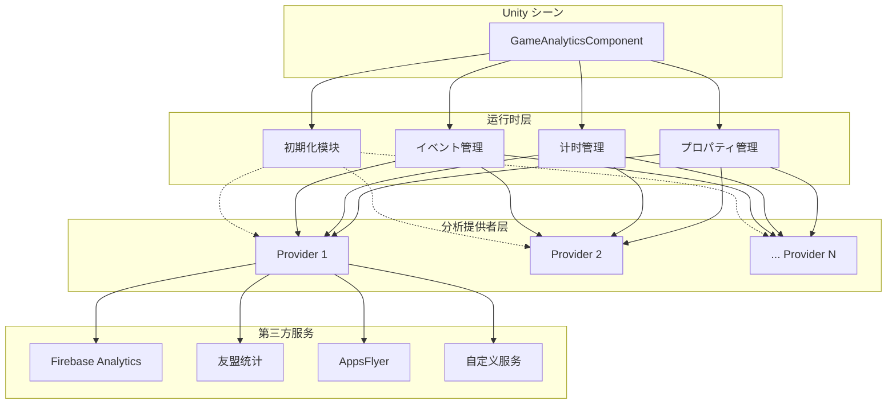

# 快速开始

本指南将帮助您快速集成并使用 GameAnalytics コンポーネント进行ゲーム数据分析。を通じて本章节，您将了解如何在 Unity プロジェクト中添加コンポーネント、配置分析提供者，以及使用コア機能进行イベント上报和计时。

## 概要

GameAnalytics コンポーネント是 GameFrameX フレームワーク的一部分，专门に使用ゲーム数据分析。它提供します统一的イベント上报インターフェース，サポート多个第三方分析服务（如 Firebase、UMeng、AppsFlyer 等）的集成。

该コンポーネント设计遵循以下コア原则：
- **多提供者サポート**：を通じて列表配置多个分析服务，数据会按顺序上报到所有已配置的服务
- **自动初期化**：コンポーネント挂载到シーン后自动初期化，无需手动呼び出し
- **灵活的イベント上报**：サポート简单イベント、带数值イベント、带自定义字段イベント等多种形式

## アーキテクチャ概要



如上图所示，GameAnalyticsComponent 是位于 Unity シーン中的コアコンポーネント，它管理四个主要模块：初期化、イベント管理、计时管理和プロパティ管理。这些模块を通じて统一的インターフェース与多个分析提供者进行交互，最终将数据上报到不同的第三方分析服务。

## コアフロー

### イベント上报フロー

当您呼び出し Event メソッド上报イベント时，数据会经过以下フロー：


此フロー确保了只有在コンポーネント正确初期化后才会执行イベント上报，避免了因过早呼び出し导致的数据丢失。

## 使用ガイド

### 第一步：添加コンポーネント到シーン

在 Unity 编辑器中，按照以下手順添加 GameAnalytics コンポーネント：

1. 在シーン中作成一个空 GameObject，或者选择现有的 GameObject
2. 在 Inspector 面板中，点击 **Add Component** 按钮
3. 在搜索框中输入 "GameAnalytics" 或 "ゲーム数据分析"
4. 选择 **Game Framework > GameAnalytics** コンポーネント

> Source: [GameAnalyticsComponent.cs](https://github.com/GameFrameX/com.gameframex.unity.gameanalytics/blob/main/Runtime/GameAnalytics/GameAnalyticsComponent.cs#L14-L15)

コンポーネント添加后，会自动继承 `GameFrameworkComponent` 基クラス，这是 GameFrameX フレームワーク的标准コンポーネント基クラス。

### 第二步：配置分析提供者

添加コンポーネント后，必要在 Inspector 面板中配置分析提供者：

1. 選択シーン中的 GameAnalytics GameObject
2. 在 Inspector 中找到 **ゲーム数据分析コンポーネント列表** プロパティ
3. 点击列表左下角的 **+** 按钮添加新的提供者
4. 从 **ComponentType** 下拉菜单中选择具体的分析服务実装クラス
5. に基づいて选择的分析服务，配置相应的参数（如 App ID、App Key 等）

```csharp
// コンポーネント配置的数据结构定义
[Serializable]
public class GameAnalyticsComponentProvider
{
    /// <summary>
    /// 実装コンポーネントタイプ
    /// </summary>
    public string ComponentType;

    /// <summary>
    /// 这个是给编辑器用的
    /// </summary>
    public int ComponentTypeNameIndex = 0;

    /// <summary>
    /// 参数
    /// </summary>
    public List<GameAnalyticsComponentParamKV> Setting = new List<GameAnalyticsComponentParamKV>();
}
```

> Source: [GameAnalyticsComponent.cs](https://github.com/GameFrameX/com.gameframex.unity.gameanalytics/blob/main/Runtime/GameAnalytics/GameAnalyticsComponent.cs#L361-L378)

### 第三步：在代码中使用

以下是在ゲーム代码中使用 GameAnalytics コンポーネント的各种方法：

#### 取得コンポーネントインスタンス

```csharp
using GameFrameX.GameAnalytics.Runtime;

// 取得 GameAnalyticsComponent インスタンス
var gameAnalytics = UnityEngine.GameObject.FindObjectOfType<GameAnalyticsComponent>();
```

> Source: [GameAnalyticsComponent.cs](https://github.com/GameFrameX/com.gameframex.unity.gameanalytics/blob/main/Runtime/GameAnalytics/GameAnalyticsComponent.cs#L14-L25)

#### 初期化ステータス检查

コンポーネント在 `OnEnable()` 时会自动初期化。初期化完成后，`m_IsInit` 标志会被設定为 `true`。所有イベント上报メソッド都会检查此标志：

```csharp
public void Event(string eventName)
{
    GameFrameworkGuard.NotNullOrEmpty(eventName, nameof(eventName));
    if (!m_IsInit)
    {
        return;  // 未初期化时直接返回，不执行任何操作
    }
    // ... イベント上报逻辑
}
```

> Source: [GameAnalyticsComponent.cs](https://github.com/GameFrameX/com.gameframex.unity.gameanalytics/blob/main/Runtime/GameAnalytics/GameAnalyticsComponent.cs#L246-L265)

这种设计确保了コンポーネント在未正确初期化时不会执行任何操作，避免了潜在的空引用異常。

## 機能详解

### イベント上报

GameAnalytics コンポーネント提供します四种イベント上报メソッド，满足不同シーン的需求：

#### 1. 简单イベント上报

に使用上报不包含任何附加数据的简单イベント，例如用户点击按钮、进入某个页面等：

```csharp
/// <summary>
/// 上报イベント
/// </summary>
/// <param name="eventName">イベント名称</param>
public void Event(string eventName)
```

**使用示例：**

```csharp
// 上报玩家完成关卡的イベント
gameAnalytics.Event("level_complete");

// 上报玩家进入商店的イベント
gameAnalytics.Event("enter_shop");
```

> Source: [GameAnalyticsComponent.cs](https://github.com/GameFrameX/com.gameframex.unity.gameanalytics/blob/main/Runtime/GameAnalytics/GameAnalyticsComponent.cs#L242-L265)

#### 2. 带数值的イベント上报

に使用上报必要记录数值的イベント，例如得分、等级、金币数量等：

```csharp
/// <summary>
/// 上报带有数值的イベント
/// </summary>
/// <param name="eventName">イベント名称</param>
/// <param name="eventValue">イベント数值</param>
public void Event(string eventName, float eventValue)
```

**使用示例：**

```csharp
// 上报玩家得分
gameAnalytics.Event("score", 1500.5f);

// 上报玩家等级
gameAnalytics.Event("player_level", 10f);
```

> Source: [GameAnalyticsComponent.cs](https://github.com/GameFrameX/com.gameframex.unity.gameanalytics/blob/main/Runtime/GameAnalytics/GameAnalyticsComponent.cs#L267-L291)

#### 3. 带自定义字段的イベント上报

に使用上报必要携带自定义维度的イベント，便于后续进行更精细的数据分析：

```csharp
/// <summary>
/// 上报自定义字段的イベント
/// </summary>
/// <param name="eventName">イベント名称</param>
/// <param name="customF">自定义字段</param>
public void Event(string eventName, Dictionary<string, object> customF)
```

**使用示例：**

```csharp
// 上报关卡完成イベント，带自定义字段
var customFields = new Dictionary<string, object>
{
    { "level_id", "level_05" },
    { "difficulty", "hard" },
    { "stars", 3 }
};
gameAnalytics.Event("level_complete", customFields);
```

> Source: [GameAnalyticsComponent.cs](https://github.com/GameFrameX/com.gameframex.unity.gameanalytics/blob/main/Runtime/GameAnalytics/GameAnalyticsComponent.cs#L293-L324)

#### 4. 带数值和自定义字段的イベント上报

这是機能最全的イベント上报メソッド，同时包含数值和自定义维度：

```csharp
/// <summary>
/// 上报带有数值和自定义字段的イベント
/// </summary>
/// <param name="eventName">イベント名称</param>
/// <param name="eventValue">イベント数值</param>
/// <param name="customF">自定义字段</param>
public void Event(string eventName, float eventValue, Dictionary<string, object> customF)
```

**使用示例：**

```csharp
// 上报购买イベント，包含消费金额和商品信息
var purchaseInfo = new Dictionary<string, object>
{
    { "item_id", "gem_pack_100" },
    { "currency", "USD" }
};
gameAnalytics.Event("purchase", 0.99f, purchaseInfo);
```

> Source: [GameAnalyticsComponent.cs](https://github.com/GameFrameX/com.gameframex.unity.gameanalytics/blob/main/Runtime/GameAnalytics/GameAnalyticsComponent.cs#L326-L358)

### 计时機能

ゲーム分析中，计时機能に使用测量玩家完成特定任务或关卡所花费的时间。这对于分析ゲーム难度和玩家行为非常重要。

#### 始め方计时

```csharp
/// <summary>
/// 开始计时
/// </summary>
/// <param name="eventName">イベント名称</param>
public void StartTimer(string eventName)
```

**使用示例：**

```csharp
// 玩家开始挑战关卡时开始计时
gameAnalytics.StartTimer("level_05");
```

> Source: [GameAnalyticsComponent.cs](https://github.com/GameFrameX/com.gameframex.unity.gameanalytics/blob/main/Runtime/GameAnalytics/GameAnalyticsComponent.cs#L156-L179)

#### 暂停计时

```csharp
/// <summary>
/// 暂停计时
/// </summary>
/// <param name="eventName">イベント名称</param>
public void PauseTimer(string eventName)
```

当玩家暂停ゲーム或离开当前シーン时使用：

```csharp
// 玩家暂停ゲーム时暂停计时
gameAnalytics.PauseTimer("level_05");
```

> Source: [GameAnalyticsComponent.cs](https://github.com/GameFrameX/com.gameframex.unity.gameanalytics/blob/main/Runtime/GameAnalytics/GameAnalyticsComponent.cs#L181-L197)

#### 恢复计时

```csharp
/// <summary>
/// 恢复计时
/// </summary>
/// <param name="eventName">イベント名称</param>
public void ResumeTimer(string eventName)
```

玩家恢复ゲーム后继续计时：

```csharp
// 玩家恢复ゲーム时恢复计时
gameAnalytics.ResumeTimer("level_05");
```

> Source: [GameAnalyticsComponent.cs](https://github.com/GameFrameX/com.gameframex.unity.gameanalytics/blob/main/Runtime/GameAnalytics/GameAnalyticsComponent.cs#L199-L215)

#### 结束计时并上报

```csharp
/// <summary>
/// 结束计时
/// </summary>
/// <param name="eventName">イベント名称</param>
public void StopTimer(string eventName)
```

玩家完成关卡或放弃时停止计时：

```csharp
// 玩家完成关卡时停止计时
gameAnalytics.StopTimer("level_05");
```

> Source: [GameAnalyticsComponent.cs](https://github.com/GameFrameX/com.gameframex.unity.gameanalytics/blob/main/Runtime/GameAnalytics/GameAnalyticsComponent.cs#L217-L240)

### 玩家管理

#### 設定玩家ID

に使用关联特定玩家的所有イベント数据：

```csharp
/// <summary>
/// 設定玩家ID
/// </summary>
/// <param name="playerId">玩家ID</param>
public void SetPlayerId(string playerId)
```

**使用示例：**

```csharp
// 玩家登录后設定玩家ID
gameAnalytics.SetPlayerId("player_12345");
```

> Source: [GameAnalyticsComponent.cs](https://github.com/GameFrameX/com.gameframex.unity.gameanalytics/blob/main/Runtime/GameAnalytics/GameAnalyticsComponent.cs#L32-L42)

### 公共プロパティ

公共プロパティ会自动附加到所有上报的イベント中，便于进行多维度分析。

#### 設定公共プロパティ

```csharp
/// <summary>
/// 設定公共プロパティ
/// </summary>
/// <param name="key">Key</param>
/// <param name="value">值</param>
public void SetPublicProperties(string key, object value)
```

**使用示例：**

```csharp
// 設定玩家的VIP等级
gameAnalytics.SetPublicProperties("vip_level", 5);

// 設定玩家所在的服务器
gameAnalytics.SetPublicProperties("server", "us_west");
```

> Source: [GameAnalyticsComponent.cs](https://github.com/GameFrameX/com.gameframex.unity.gameanalytics/blob/main/Runtime/GameAnalytics/GameAnalyticsComponent.cs#L102-L119)

#### 取得公共プロパティ

```csharp
/// <summary>
/// 取得公共プロパティ
/// </summary>
/// <returns></returns>
public Dictionary<string, object> GetPublicProperties()
```

#### 清除公共プロパティ

```csharp
/// <summary>
/// 清除公共プロパティ
/// </summary>
public void ClearPublicProperties()
```

> Source: [GameAnalyticsComponent.cs](https://github.com/GameFrameX/com.gameframex.unity.gameanalytics/blob/main/Runtime/GameAnalytics/GameAnalyticsComponent.cs#L120-L154)

### 自动设备信息收集

コンポーネント会自动收集以下设备信息并添加到公共プロパティ中：

| プロパティ名称 | 説明 | 数据来源 |
|---------|------|---------|
| device_id | 设备唯一标识符 | SystemInfo.deviceUniqueIdentifier |
| device_model | 设备型号 | SystemInfo.deviceModel |
| device_type | 设备クラス型 | SystemInfo.deviceType |
| os | 操作系统 | SystemInfo.operatingSystem |
| app_version | 应用版本 | Application.version |
| unity_version | Unity版本 | Application.unityVersion |
| platform | 平台 | Application.platform |
| processor_type | 处理器クラス型 | SystemInfo.processorType |
| processor_count | 处理器コア数 | SystemInfo.processorCount |
| system_memory_size | 系统内存大小 | SystemInfo.systemMemorySize |
| graphics_device_name | 显卡名称 | SystemInfo.graphicsDeviceName |
| screen_width | 屏幕宽度 | Screen.width |
| screen_height | 屏幕高度 | Screen.height |
| screen_dpi | 屏幕DPI | Screen.dpi |
| network_type | 网络クラス型 | Application.internetReachability |
| system_language | 系统语言 | Application.systemLanguage |

> Source: [BaseGameAnalyticsManager.cs](https://github.com/GameFrameX/com.gameframex.unity.gameanalytics/blob/main/Runtime/GameAnalytics/BaseGameAnalyticsManager.cs#L85-L144)

## 完整使用示例

以下は完整的ゲーム脚本示例，展示了如何在实际プロジェクト中使用 GameAnalytics コンポーネント：

```csharp
using System.Collections.Generic;
using UnityEngine;
using GameFrameX.GameAnalytics.Runtime;

public class GameAnalyticsExample : MonoBehaviour
{
    private GameAnalyticsComponent _gameAnalytics;

    private void Awake()
    {
        // 取得 GameAnalytics コンポーネントインスタンス
        _gameAnalytics = GetComponent<GameAnalyticsComponent>();
        
        if (_gameAnalytics == null)
        {
            Debug.LogError("GameAnalyticsComponent not found!");
            return;
        }
        
        // 設定玩家ID
        _gameAnalytics.SetPlayerId("player_10001");
        
        // 設定公共プロパティ
        _gameAnalytics.SetPublicProperties("vip_level", 3);
        _gameAnalytics.SetPublicProperties("server", "asia_east");
    }

    private void Start()
    {
        // 上报玩家进入ゲーム
        _gameAnalytics.Event("game_start");
    }

    public void OnLevelStart(string levelId)
    {
        // 开始关卡计时
        _gameAnalytics.StartTimer($"level_{levelId}");
        
        // 上报关卡开始イベント
        var customFields = new Dictionary<string, object>
        {
            { "level_id", levelId },
            { "difficulty", "normal" }
        };
        _gameAnalytics.Event("level_start", customFields);
    }

    public void OnLevelComplete(string levelId, int score, int stars)
    {
        // 停止关卡计时
        _gameAnalytics.StopTimer($"level_{levelId}");
        
        // 上报关卡完成イベント（带数值和自定义字段）
        var customFields = new Dictionary<string, object>
        {
            { "level_id", levelId },
            { "stars", stars }
        };
        _gameAnalytics.Event("level_complete", score, customFields);
    }

    public void OnPurchase(string itemId, float price, string currency)
    {
        // 上报购买イベント
        var customFields = new Dictionary<string, object>
        {
            { "item_id", itemId },
            { "currency", currency }
        };
        _gameAnalytics.Event("purchase", price, customFields);
    }

    public void OnPlayerLevelUp(int newLevel)
    {
        // 更新VIP等级公共プロパティ
        _gameAnalytics.SetPublicProperties("player_level", newLevel);
        
        // 上报升级イベント
        _gameAnalytics.Event("level_up", newLevel);
    }
}
```

这个示例展示了コンポーネント的典型使用模式：
1. 在 `Awake` 中取得コンポーネント引用并設定玩家ID和公共プロパティ
2. 在ゲームフロー关键点（开始、完成、购买等）上报イベント
3. 使用计时機能测量关卡完成时间

## 初期化选项

### 自动初期化

默认情况下，コンポーネント在 `OnEnable()` 时自动初期化。这是推荐的初期化方法：

```csharp
private void OnEnable()
{
    Init();
}
```

> Source: [GameAnalyticsComponent.cs](https://github.com/GameFrameX/com.gameframex.unity.gameanalytics/blob/main/Runtime/GameAnalytics/GameAnalyticsComponent.cs#L27-L30)

### 手动初期化

如果您必要在特定时机初期化，可能使用手动初期化：

```csharp
/// <summary>
/// 手动初期化
/// </summary>
/// <param name="extraArgs">额外的初期化参数</param>
public void ManualInit(Dictionary<string, string> extraArgs)
```

**使用示例：**

```csharp
// 在玩家登录完成后手动初期化
var extraArgs = new Dictionary<string, string>
{
    { "user_token", userToken },
    { "init_time", System.DateTime.Now.ToString() }
};
gameAnalytics.ManualInit(extraArgs);
```

> Source: [GameAnalyticsComponent.cs](https://github.com/GameFrameX/com.gameframex.unity.gameanalytics/blob/main/Runtime/GameAnalytics/GameAnalyticsComponent.cs#L82-L100)

## 最佳实践

### 1. イベント命名规范

建议使用统一的命名规范来命名イベント，以确保数据分析的准确性：

- 使用小写字母和下划线：`level_complete`, `purchase_success`
- 保持简洁但具有説明性：`game_start`, `tutorial_finish`
- 避免特殊字符和中文

### 2. 公共プロパティ的合理使用

公共プロパティ适合存储在ゲーム会话期间不会变化的信息：
- 玩家ID
- VIP等级
- 服务器区域
- 渠道信息

### 3. タイマー使用シーン

タイマー特别适に使用以下シーン：
- 关卡完成时间
- 教程完成时间
- 特定操作耗时
- 页面停留时间

### 4. 初期化检查

所有イベント上报メソッド都会检查 `m_IsInit` ステータス。如果コンポーネント未正确初期化，メソッド将直接返回而不执行任何操作。这确保了即使在初期化前呼び出し也不会抛出異常。

## 関連リンク

- [插件介绍](./1-overview) - 了解 GameAnalytics 插件的完整介绍
- [安装指南](./2-installation) - 查看详细的安装手順
- [コア架构](./04.features.md) - 深入了解フレームワーク的コアアーキテクチャ設計
- [API インターフェース](./5-api-reference) - 完整的 API 参考文档
- [编辑器配置](./6-configuration) - 编辑器配置説明
- [故障排除](./7-troubleshooting) - 常见问题与解決策
