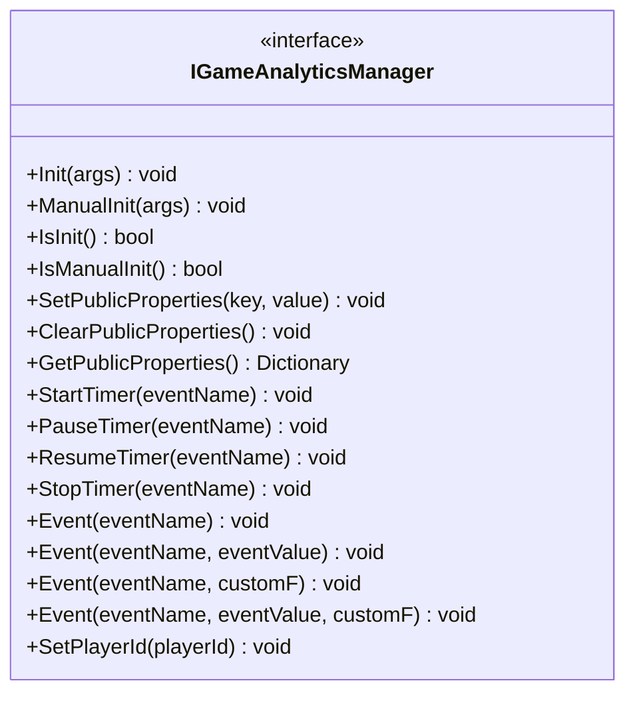
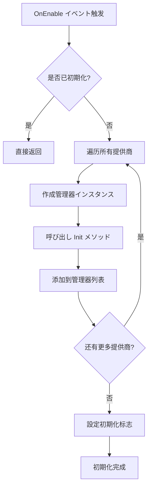
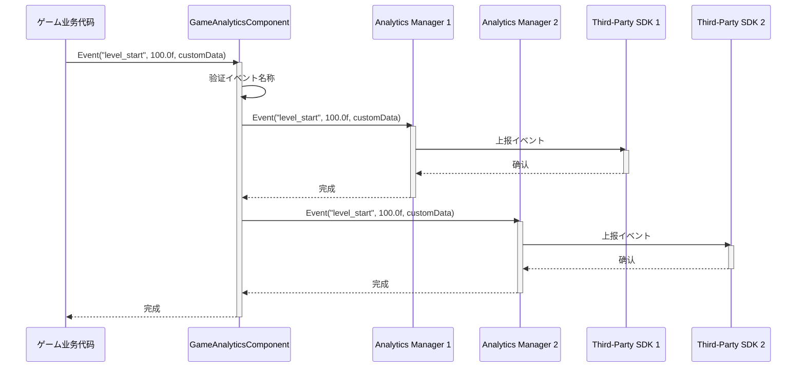
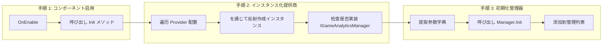

# コア架构

本文档详细介绍 GameFrameX ゲーム数据分析插件的コアアーキテクチャ設計，包括主要コンポーネント、数据流和设计模式。

## 概要

GameFrameX ゲーム数据分析插件（GameAnalytics）是 GameFrameX フレームワーク的コア模块之一，负责为 Unity ゲーム提供统一的イベント上报、タイマー和玩家数据分析機能。该插件采用モジュラー設計，サポート多种第三方分析服务集成，同时提供公共プロパティ管理机制，确保数据分析的一致性和可扩展性。

## アーキテクチャ設計

### 整体架构图

```mermaid
flowchart TD
    subgraph UnityLayer["Unity 引擎层"]
        GameObject[GameObject]
    end

    subgraph GameAnalyticsComponentLayer["コンポーネント层 (GameAnalyticsComponent)"]
        GAComponent[GameAnalyticsComponent]
        Providers[GameAnalyticsComponentProvider]
    end

    subgraph ManagerLayer["管理器层"]
        IManager[IGameAnalyticsManager]
        BaseManager[BaseGameAnalyticsManager]
    end

    subgraph ImplementationLayer["実装层"]
        ImplA[Analytics Provider A]
        ImplB[Analytics Provider B]
        ImplC[Analytics Provider N]
    end

    GameObject --> GAComponent
    GAComponent --> Providers
    Providers -.->|配置| IManager
    IManager <|..| BaseManager
    BaseManager -->|继承| ImplA
    BaseManager -->|继承| ImplB
    BaseManager -->|继承| ImplC
```

### 架构分层説明

| 层级 | コンポーネント | 职责 |
|------|------|------|
| **Unity 引擎层** | GameObject | Unity シーン中的ゲーム对象宿主 |
| **コンポーネント层** | GameAnalyticsComponent | 提供 Unity コンポーネントインターフェース，管理工作管理器生命周期 |
| **管理器层** | IGameAnalyticsManager / BaseGameAnalyticsManager | 定义统一 API，実装通用機能 |
| **実装层** | 具体分析服务実装 | 集成第三方分析 SDK（GameAnalytics、Firebase 等） |

## コアコンポーネント

### 1. IGameAnalyticsManager インターフェース

`IGameAnalyticsManager` 是插件的コアインターフェース，定义了所有分析機能的标准契约。该インターフェース采用面向抽象设计，使得上层代码无需关心具体実装细节。

> Source: [IGameAnalyticsManager.cs](https://github.com/GameFrameX/com.gameframex.unity.gameanalytics/blob/main/Runtime/GameAnalytics/IGameAnalyticsManager.cs#L1-L106)

**インターフェースメソッド分クラス：**



### 2. BaseGameAnalyticsManager 抽象基底クラス

`BaseGameAnalyticsManager` を継承 `GameFrameworkModule`，是所有分析管理器実装的基础クラス。它封装了通用機能，包括：

- **初期化ステータス管理** - 跟踪管理器是否已初期化
- **公共プロパティ管理** - 提供公共プロパティ的設定、取得和清除機能
- **设备信息采集** - 自动收集设备関連的公共プロパティ

```csharp
public abstract class BaseGameAnalyticsManager : GameFrameworkModule, IGameAnalyticsManager
{
    protected bool m_IsInit = false;
    protected readonly Dictionary<string, object> m_PublicProperties = new Dictionary<string, object>();
    
    protected virtual void AddDeviceInfoToPublicProperties()
    {
        // 设备基本信息
        m_PublicProperties["device_id"] = SystemInfo.deviceUniqueIdentifier;
        m_PublicProperties["device_model"] = SystemInfo.deviceModel;
        // ... 更多设备信息
    }
}
```

> Source: [BaseGameAnalyticsManager.cs](https://github.com/GameFrameX/com.gameframex.unity.gameanalytics/blob/main/Runtime/GameAnalytics/BaseGameAnalyticsManager.cs#L10-L203)

**设计意图：** 抽象基底クラス模式允许不同分析服务提供商继承该クラス并実装特定逻辑，同时复用公共プロパティ管理和设备信息采集等通用機能。

### 3. GameAnalyticsComponent Unity コンポーネント

`GameAnalyticsComponent` 是 Unity 引擎的コンポーネントクラス，负责在ゲームシーン中提供数据分析機能。它を継承 `GameFrameworkComponent`，是開発者主要交互的エントリーポイント点。

```csharp
[DisallowMultipleComponent]
[AddComponentMenu("Game Framework/GameAnalytics")]
public sealed class GameAnalyticsComponent : GameFrameworkComponent
{
    [SerializeField] private List<GameAnalyticsComponentProvider> m_gameAnalyticsComponentProviders = new List<GameAnalyticsComponentProvider>();
    private List<IGameAnalyticsManager> m_GameAnalyticsManager;
}
```

> Source: [GameAnalyticsComponent.cs](https://github.com/GameFrameX/com.gameframex.unity.gameanalytics/blob/main/Runtime/GameAnalytics/GameAnalyticsComponent.cs#L1-L386)

**コア职责：**

1. **多提供商サポート** - サポート同时配置多个分析服务提供商
2. **自动初期化** - 在 `OnEnable` 时自动初期化所有提供商
3. **手动初期化** - サポート延迟手动初期化以满足特殊需求
4. **イベント广播** - 将イベント同时发送给所有已配置的提供商



### 4. 配置模型

插件使用两个配置クラス来管理分析服务提供商的設定：

- **GameAnalyticsComponentProvider** - 提供商配置，包含コンポーネントタイプ和参数設定
- **GameAnalyticsComponentParamKV** - 键值对配置，に使用存储具体参数

```csharp
[Serializable]
public class GameAnalyticsComponentProvider
{
    public string ComponentType;
    public int ComponentTypeNameIndex;
    public List<GameAnalyticsComponentParamKV> Setting = new List<GameAnalyticsComponentParamKV>();
}

[Serializable]
public class GameAnalyticsComponentParamKV
{
    public string Key;
    public string Value;
}
```

> Source: [GameAnalyticsComponent.cs](https://github.com/GameFrameX/com.gameframex.unity.gameanalytics/blob/main/Runtime/GameAnalytics/GameAnalyticsComponent.cs#L361-L385)

## 数据流

### イベント上报フロー

当ゲーム代码呼び出し `GameAnalyticsComponent.Event()` メソッド时，イベント数据を通じて以下フロー传播：



### 初期化フロー



## 公共プロパティ机制

### 概要

公共プロパティ（Public Properties）是自动附加到所有イベント的上下文数据，に使用提供玩家会话的详细信息。这些プロパティ在 `BaseGameAnalyticsManager` 中自动采集，包括设备信息、操作系统信息、应用程序信息等。

### 自动采集的プロパティ

| 分クラス | プロパティ键名 | 説明 |
|------|----------|------|
| 设备信息 | `device_id` | 设备唯一标识符 |
| 设备信息 | `device_model` | 设备型号 |
| 设备信息 | `device_type` | 设备クラス型 |
| 操作系统 | `os` | 操作系统版本 |
| 应用程序 | `app_version` | 应用版本号 |
| 应用程序 | `unity_version` | Unity 引擎版本 |
| 应用程序 | `platform` | 运行平台 |
| 硬件信息 | `processor_type` | 处理器クラス型 |
| 硬件信息 | `processor_count` | 处理器コア数 |
| 硬件信息 | `system_memory_size` | 系统内存大小 |
| 图形信息 | `graphics_device_name` | 显卡名称 |
| 图形信息 | `graphics_memory_size` | 显存大小 |
| 屏幕信息 | `screen_width` | 屏幕宽度 |
| 屏幕信息 | `screen_height` | 屏幕高度 |
| 屏幕信息 | `screen_dpi` | 屏幕 DPI |
| 网络信息 | `network_type` | 网络クラス型 (WiFi/Mobile Data) |

> Source: [BaseGameAnalyticsManager.cs](https://github.com/GameFrameX/com.gameframex.unity.gameanalytics/blob/main/Runtime/GameAnalytics/BaseGameAnalyticsManager.cs#L88-L144)

### 自定义公共プロパティ

開発者可能を通じて `SetPublicProperties` メソッド添加自定义公共プロパティ，这些プロパティ会自动附加到后续所有イベント中：

```csharp
// 設定自定义公共プロパティ
gameAnalyticsComponent.SetPublicProperties("player_level", 10);
gameAnalyticsComponent.SetPublicProperties("player_name", "Hero");
```

### プロパティ优先级

公共プロパティ的优先级顺序为：
1. **系统自动采集** - 设备信息、操作系统等（最先添加）
2. **開発者自定义** - を通じて `SetPublicProperties` 設定（覆盖同名键）
3. **手动清除后重置** - 呼び出し `ClearPublicProperties` 后重新采集系统プロパティ

## 设计模式详解

### 1. インターフェース抽象模式

**应用シーン：** `IGameAnalyticsManager` インターフェース定义

**优势：**
- 解耦上层代码与具体実装
- サポート多提供商并行运行
- 便于单元测试（可使用 Mock）

### 2. 模板メソッド模式

**应用シーン：** `BaseGameAnalyticsManager` 基クラス

**优势：**
- 复用通用逻辑（初期化、公共プロパティ管理）
- サブクラス只需关注特定実装
- 统一代码结构

### 3. 提供商模式

**应用シーン：** `GameAnalyticsComponent` 管理多个 `IGameAnalyticsManager`

**优势：**
- サポート多分析服务同时使用
- 灵活的配置机制
- 便于扩展新服务商

### 4. 反射インスタンス化

**应用シーン：** Editor 中动态加载分析管理器クラス型

```csharp
var gameAnalyticsComponentType = Utility.Assembly.GetType(gameAnalyticsComponentProvider.ComponentType);
if (Activator.CreateInstance(gameAnalyticsComponentType) is IGameAnalyticsManager gameAnalyticsManager)
{
    gameAnalyticsManager.Init(args);
    m_GameAnalyticsManager.Add(gameAnalyticsManager);
}
```

**优势：**
- 运行时动态加载，无需编译时引用
- 插件化架构，易于扩展

## 関連リンク

- [插件介绍](./1-overview.index) - 插件概述和機能简介
- [快速开始](./3-getting-started.index) - 快速上手指南
- [API インターフェース](./5-api-reference.index) - 完整 API 参考文档
- [编辑器配置](./6-configuration.index) - 编辑器配置説明
- [故障排除](./7-troubleshooting.index) - 常见问题与解決策
