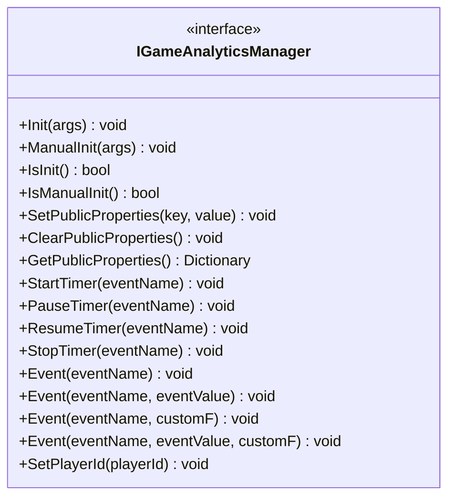
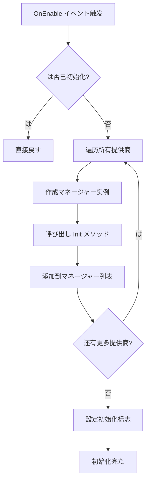
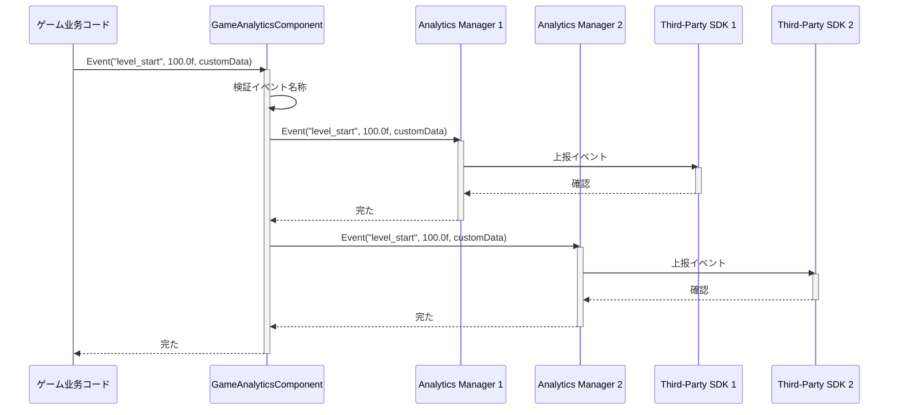
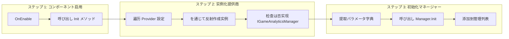

# コアアーキテクチャ

ドキュメント GameFrameX ゲームデータのコアアーキテクチャ，コンポーネント、データと。

## 

GameFrameX ゲームデータ（GameAnalytics）は GameFrameX フレームワークのコアモジュール， Unity ゲームのイベント、とデータ。モジュール，サポート，プロパティ，データのと。

## アーキテクチャ

### アーキテクチャ

```mermaid
flowchart TD
    subgraph UnityLayer["Unity 引擎层"]
        GameObject[GameObject]
    end

    subgraph GameAnalyticsComponentLayer["コンポーネント层 (GameAnalyticsComponent)"]
        GAComponent[GameAnalyticsComponent]
        Providers[GameAnalyticsComponentProvider]
    end

    subgraph ManagerLayer["マネージャー层"]
        IManager[IGameAnalyticsManager]
        BaseManager[BaseGameAnalyticsManager]
    end

    subgraph ImplementationLayer["实现层"]
        ImplA[Analytics Provider A]
        ImplB[Analytics Provider B]
        ImplC[Analytics Provider N]
    end

    GameObject --> GAComponent
    GAComponent --> Providers
    Providers -.->|設定| IManager
    IManager <|..| BaseManager
    BaseManager -->|继承| ImplA
    BaseManager -->|继承| ImplB
    BaseManager -->|继承| ImplC
```

### アーキテクチャ

|  | コンポーネント |  |
|------|------|------|
| **Unity ** | GameObject | Unity のゲームオブジェクト |
| **コンポーネント** | GameAnalyticsComponent |  Unity コンポーネントインターフェース，マネージャー |
| **マネージャー** | IGameAnalyticsManager / BaseGameAnalyticsManager |  API， |
| **** |  |  SDK（GameAnalytics、Firebase ） |

## コアコンポーネント

### 1. IGameAnalyticsManager インターフェース

`IGameAnalyticsManager` はのコアインターフェース，たの。インターフェース，コード。

> Source: [IGameAnalyticsManager.cs](https://github.com/GameFrameX/com.gameframex.unity.gameanalytics/blob/main/Runtime/GameAnalytics/IGameAnalyticsManager.cs#L1-L106)

**インターフェースメソッドクラス：**



### 2. BaseGameAnalyticsManager クラス

`BaseGameAnalyticsManager`  `GameFrameworkModule`，はマネージャーのクラス。た，：

- **** - マネージャーは
- **プロパティ** - プロパティの、と
- **** - のプロパティ

```csharp
public abstract class BaseGameAnalyticsManager : GameFrameworkModule, IGameAnalyticsManager
{
    protected bool m_IsInit = false;
    protected readonly Dictionary<string, object> m_PublicProperties = new Dictionary<string, object>();
    
    protected virtual void AddDeviceInfoToPublicProperties()
    {
        // 设备基本信息
        m_PublicProperties["device_id"] = SystemInfo.deviceUniqueIdentifier;
        m_PublicProperties["device_model"] = SystemInfo.deviceModel;
        // ... 更多设备信息
    }
}
```

> Source: [BaseGameAnalyticsManager.cs](https://github.com/GameFrameX/com.gameframex.unity.gameanalytics/blob/main/Runtime/GameAnalytics/BaseGameAnalyticsManager.cs#L10-L203)

**：** クラスクラス，プロパティと。

### 3. GameAnalyticsComponent Unity コンポーネント

`GameAnalyticsComponent` は Unity のコンポーネントクラス，にゲームデータ。 `GameFrameworkComponent`，はの。

```csharp
[DisallowMultipleComponent]
[AddComponentMenu("Game Framework/GameAnalytics")]
public sealed class GameAnalyticsComponent : GameFrameworkComponent
{
    [SerializeField] private List<GameAnalyticsComponentProvider> m_gameAnalyticsComponentProviders = new List<GameAnalyticsComponentProvider>();
    private List<IGameAnalyticsManager> m_GameAnalyticsManager;
}
```

> Source: [GameAnalyticsComponent.cs](https://github.com/GameFrameX/com.gameframex.unity.gameanalytics/blob/main/Runtime/GameAnalytics/GameAnalyticsComponent.cs#L1-L386)

**コア：**

1. **サポート** - サポート
2. **** - に `OnEnable` 
3. **** - サポート
4. **イベント** - イベントの



### 4. 

クラスの：

- **GameAnalyticsComponentProvider** - ，むコンポーネントタイプとパラメータ
- **GameAnalyticsComponentParamKV** - ，にパラメータ

```csharp
[Serializable]
public class GameAnalyticsComponentProvider
{
    public string ComponentType;
    public int ComponentTypeNameIndex;
    public List<GameAnalyticsComponentParamKV> Setting = new List<GameAnalyticsComponentParamKV>();
}

[Serializable]
public class GameAnalyticsComponentParamKV
{
    public string Key;
    public string Value;
}
```

> Source: [GameAnalyticsComponent.cs](https://github.com/GameFrameX/com.gameframex.unity.gameanalytics/blob/main/Runtime/GameAnalytics/GameAnalyticsComponent.cs#L361-L385)

## データ

### イベントフロー

ゲームコードびし `GameAnalyticsComponent.Event()` メソッド，イベントデータをじてフロー：



### フロー



## プロパティ

### 

プロパティ（Public Properties）はイベントのデータ，にの。プロパティに `BaseGameAnalyticsManager` ，、、。

### のプロパティ

| クラス | プロパティ |  |
|------|----------|------|
|  | `device_id` |  |
|  | `device_model` |  |
|  | `device_type` | タイプ |
|  | `os` | バージョン |
|  | `app_version` | バージョン |
|  | `unity_version` | Unity バージョン |
|  | `platform` | プラットフォーム |
|  | `processor_type` | タイプ |
|  | `processor_count` | コア |
|  | `system_memory_size` |  |
|  | `graphics_device_name` |  |
|  | `graphics_memory_size` |  |
|  | `screen_width` |  |
|  | `screen_height` |  |
|  | `screen_dpi` |  DPI |
| ネットワーク | `network_type` | ネットワークタイプ (WiFi/Mobile Data) |

> Source: [BaseGameAnalyticsManager.cs](https://github.com/GameFrameX/com.gameframex.unity.gameanalytics/blob/main/Runtime/GameAnalytics/BaseGameAnalyticsManager.cs#L88-L144)

### カスタマイズプロパティ

をじて `SetPublicProperties` メソッドカスタマイズプロパティ，プロパティイベント：

```csharp
// 設定カスタマイズ公共プロパティ
gameAnalyticsComponent.SetPublicProperties("player_level", 10);
gameAnalyticsComponent.SetPublicProperties("player_name", "Hero");
```

### プロパティ

プロパティの：
1. **** - 、（）
2. **カスタマイズ** - をじて `SetPublicProperties` （）
3. **** - びし `ClearPublicProperties` プロパティ

## 

### 1. インターフェース

**：** `IGameAnalyticsManager` インターフェース

**：**
- コードと
- サポート
- テスト（ Mock）

### 2. メソッド

**：** `BaseGameAnalyticsManager` クラス

**：**
- （、プロパティ）
- クラス
- コード

### 3. 

**：** `GameAnalyticsComponent`  `IGameAnalyticsManager`

**：**
- サポート
- の
- 

### 4. 

**：** Editor ロードマネージャータイプ

```csharp
var gameAnalyticsComponentType = Utility.Assembly.GetType(gameAnalyticsComponentProvider.ComponentType);
if (Activator.CreateInstance(gameAnalyticsComponentType) is IGameAnalyticsManager gameAnalyticsManager)
{
    gameAnalyticsManager.Init(args);
    m_GameAnalyticsManager.Add(gameAnalyticsManager);
}
```

**：**
- ロード，コンパイル
- アーキテクチャ，

## リンク

- [](./1-overview.index) - と
- [クイックスタート](./3-getting-started.index) - ガイド
- [API インターフェース](./5-api-reference.index) -  API リファレンスドキュメント
- [エディター](./6-configuration.index) - エディター
- [](./7-troubleshooting.index) - よくあると
