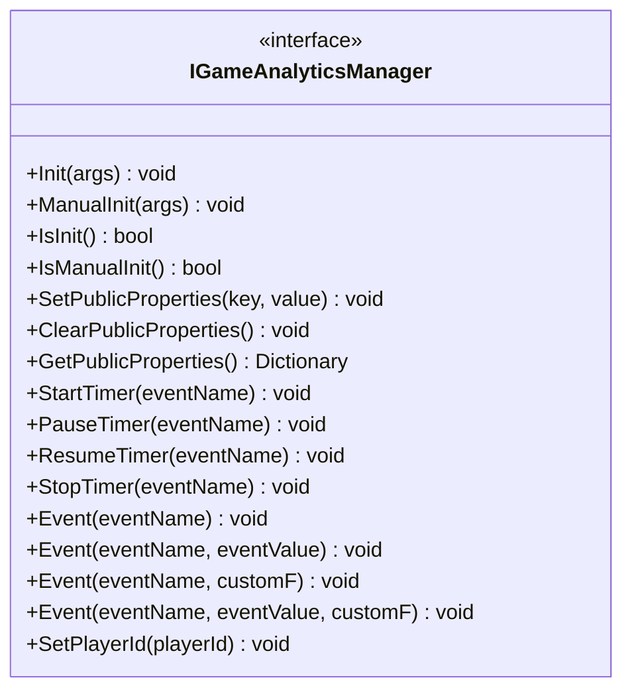
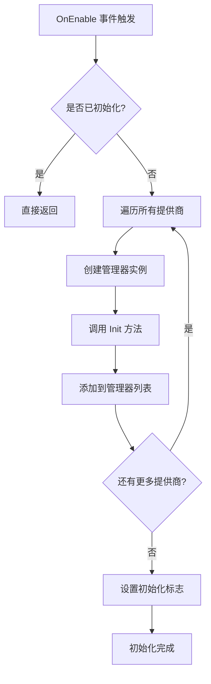
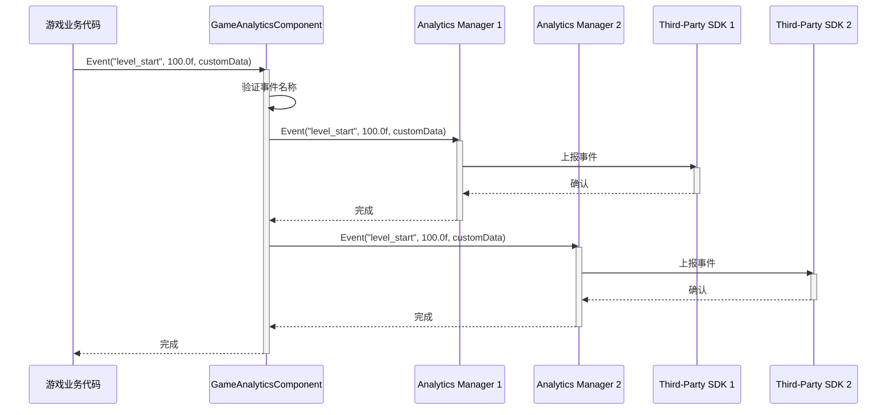
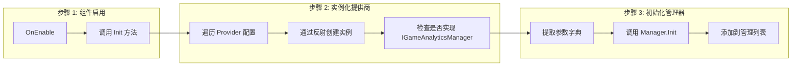

# コアアーキテクチャ

このドキュメント詳細介绍 GameFrameX 游戏数据分析プラグイン的コアアーキテクチャ設計，含みます主なコンポーネント、数据流和設計モード。

## 概要

GameFrameX 游戏数据分析プラグイン（GameAnalytics）是 GameFrameX フレームワーク的コアモジュール之一，负责为 Unity 游戏提供統一された的イベント上报、计时器和プレイヤー数据分析機能。该プラグイン采用モジュール化設計，サポート多种第3方分析服务集成，同時に提供公共プロパティ管理机制，確認してください数据分析的一致性和可拡張性。

## アーキテクチャ設計

### 整体アーキテクチャ图

```mermaid
flowchart TD
    subgraph UnityLayer["Unity 引擎层"]
        GameObject[GameObject]
    end

    subgraph GameAnalyticsComponentLayer["组件层 (GameAnalyticsComponent)"]
        GAComponent[GameAnalyticsComponent]
        Providers[GameAnalyticsComponentProvider]
    end

    subgraph ManagerLayer["管理器层"]
        IManager[IGameAnalyticsManager]
        BaseManager[BaseGameAnalyticsManager]
    end

    subgraph ImplementationLayer["实现层"]
        ImplA[Analytics Provider A]
        ImplB[Analytics Provider B]
        ImplC[Analytics Provider N]
    end

    GameObject --> GAComponent
    GAComponent --> Providers
    Providers -.->|配置| IManager
    IManager <|..| BaseManager
    BaseManager -->|继承| ImplA
    BaseManager -->|继承| ImplB
    BaseManager -->|继承| ImplC
```

### アーキテクチャ分层説明

| 层级 | コンポーネント | 职责 |
|------|------|------|
| **Unity 引擎层** | GameObject | Unity シーン中的游戏对象宿主 |
| **コンポーネント層** | GameAnalyticsComponent | 提供 Unity コンポーネントインターフェース，管理工作マネージャーライフサイクル |
| **マネージャー层** | IGameAnalyticsManager / BaseGameAnalyticsManager | 定義統一された API，実装汎用機能 |
| **実装層** | 具体分析服务実装 | 集成第3方分析 SDK（GameAnalytics、Firebase 等） |

## コアコンポーネント

### 1. IGameAnalyticsManager インターフェース

`IGameAnalyticsManager` 是プラグイン的コアインターフェース，定義了所有分析機能的標準契约。该インターフェース采用面向抽象設計，使得上层コード无需关心具体実装细节。

> Source: [IGameAnalyticsManager.cs](https://github.com/GameFrameX/com.gameframex.unity.gameanalytics/blob/main/Runtime/GameAnalytics/IGameAnalyticsManager.cs#L1-L106)

**インターフェースメソッド分类：**



### 2. BaseGameAnalyticsManager 抽象基底クラス

`BaseGameAnalyticsManager` 継承自 `GameFrameworkModule`，是所有分析マネージャー実装的基本类。它カプセル化了汎用機能，含みます：

- **初期化ステータス管理** - 跟踪マネージャー是否已初期化
- **公共プロパティ管理** - 提供公共プロパティ的設定、取得和清除機能
- **设备情報采集** - 自动收集设备相关的公共プロパティ

```csharp
public abstract class BaseGameAnalyticsManager : GameFrameworkModule, IGameAnalyticsManager
{
    protected bool m_IsInit = false;
    protected readonly Dictionary<string, object> m_PublicProperties = new Dictionary<string, object>();
    
    protected virtual void AddDeviceInfoToPublicProperties()
    {
        // 设备基本信息
        m_PublicProperties["device_id"] = SystemInfo.deviceUniqueIdentifier;
        m_PublicProperties["device_model"] = SystemInfo.deviceModel;
        // ... 更多设备信息
    }
}
```

> Source: [BaseGameAnalyticsManager.cs](https://github.com/GameFrameX/com.gameframex.unity.gameanalytics/blob/main/Runtime/GameAnalytics/BaseGameAnalyticsManager.cs#L10-L203)

**設計意图：** 抽象基底クラスモード允许不同分析服务提供商継承このクラス并実装特定逻辑，同時に复用公共プロパティ管理和设备情報采集等汎用機能。

### 3. GameAnalyticsComponent Unity コンポーネント

`GameAnalyticsComponent` 是 Unity 引擎的コンポーネント类，负责在游戏シーン中提供数据分析機能。它継承自 `GameFrameworkComponent`，是開発者主な交互的入口点。

```csharp
[DisallowMultipleComponent]
[AddComponentMenu("Game Framework/GameAnalytics")]
public sealed class GameAnalyticsComponent : GameFrameworkComponent
{
    [SerializeField] private List<GameAnalyticsComponentProvider> m_gameAnalyticsComponentProviders = new List<GameAnalyticsComponentProvider>();
    private List<IGameAnalyticsManager> m_GameAnalyticsManager;
}
```

> Source: [GameAnalyticsComponent.cs](https://github.com/GameFrameX/com.gameframex.unity.gameanalytics/blob/main/Runtime/GameAnalytics/GameAnalyticsComponent.cs#L1-L386)

**コア职责：**

1. **多提供商サポート** - サポート同時に設定多个分析服务提供商
2. **自动初期化** - 在 `OnEnable` 时自动初期化所有提供商
3. **手动初期化** - サポート延迟手动初期化以满足特殊需求
4. **イベント广播** - 将イベント同時に发送给所有已設定的提供商



### 4. 設定模型

プラグイン使用两个設定类来管理分析服务提供商的設定：

- **GameAnalyticsComponentProvider** - 提供商設定，パッケージ含コンポーネントタイプ和パラメータ設定
- **GameAnalyticsComponentParamKV** - 键值对設定，用于存储具体パラメータ

```csharp
[Serializable]
public class GameAnalyticsComponentProvider
{
    public string ComponentType;
    public int ComponentTypeNameIndex;
    public List<GameAnalyticsComponentParamKV> Setting = new List<GameAnalyticsComponentParamKV>();
}

[Serializable]
public class GameAnalyticsComponentParamKV
{
    public string Key;
    public string Value;
}
```

> Source: [GameAnalyticsComponent.cs](https://github.com/GameFrameX/com.gameframex.unity.gameanalytics/blob/main/Runtime/GameAnalytics/GameAnalyticsComponent.cs#L361-L385)

## 数据流

### イベント上报フロー

当游戏コード呼び出し `GameAnalyticsComponent.Event()` メソッド时，イベント数据通过以下フロー传播：



### 初期化フロー



## 公共プロパティ机制

### 概要

公共プロパティ（Public Properties）是自动附加到所有イベント的上下文数据，用于提供プレイヤー会话的詳細情報。这些プロパティ在 `BaseGameAnalyticsManager` 中自动采集，含みます设备情報、操作系统情報、应用程序情報等。

### 自动采集的プロパティ

| 分类 | プロパティ键名 | 説明 |
|------|----------|------|
| 设备情報 | `device_id` | 设备唯一标识符 |
| 设备情報 | `device_model` | 设备型号 |
| 设备情報 | `device_type` | 设备タイプ |
| 操作系统 | `os` | 操作系统バージョン |
| 应用程序 | `app_version` | 应用バージョン号 |
| 应用程序 | `unity_version` | Unity 引擎バージョン |
| 应用程序 | `platform` | 运行プラットフォーム |
| 硬件情報 | `processor_type` | 処理器タイプ |
| 硬件情報 | `processor_count` | 処理器コア数 |
| 硬件情報 | `system_memory_size` | 系统内存大小 |
| 图形情報 | `graphics_device_name` | 显卡名称 |
| 图形情報 | `graphics_memory_size` | 显存大小 |
| 屏幕情報 | `screen_width` | 屏幕宽度 |
| 屏幕情報 | `screen_height` | 屏幕高度 |
| 屏幕情報 | `screen_dpi` | 屏幕 DPI |
| 网络情報 | `network_type` | 网络タイプ (WiFi/Mobile Data) |

> Source: [BaseGameAnalyticsManager.cs](https://github.com/GameFrameX/com.gameframex.unity.gameanalytics/blob/main/Runtime/GameAnalytics/BaseGameAnalyticsManager.cs#L88-L144)

### 自定義公共プロパティ

開発者〜できます通过 `SetPublicProperties` メソッド追加自定義公共プロパティ，这些プロパティ会自动附加到后续所有イベント中：

```csharp
// 设置自定义公共属性
gameAnalyticsComponent.SetPublicProperties("player_level", 10);
gameAnalyticsComponent.SetPublicProperties("player_name", "Hero");
```

### プロパティ优先级

公共プロパティ的优先级顺序为：
1. **系统自动采集** - 设备情報、操作系统等（最先追加）
2. **開発者自定義** - 通过 `SetPublicProperties` 設定（覆盖同名键）
3. **手动清除后重置** - 呼び出し `ClearPublicProperties` 后重新采集系统プロパティ

## デザインパターン详解

### 1. インターフェース抽象モード

**应用シーン：** `IGameAnalyticsManager` インターフェース定義

**优势：**
- 解耦上层コード与具体実装
- サポート多提供商并行运行
- 便于单元テスト（可使用 Mock）

### 2. テンプレートメソッドパターン

**应用シーン：** `BaseGameAnalyticsManager` 基底クラス

**优势：**
- 复用汎用逻辑（初期化、公共プロパティ管理）
- サブクラス只需关注特定実装
- 統一されたコード结构

### 3. 提供商モード

**应用シーン：** `GameAnalyticsComponent` 管理多个 `IGameAnalyticsManager`

**优势：**
- サポート多分析服务同時に使用
- 柔軟的設定机制
- 便于拡張新服务商

### 4. 反射インスタンス化

**应用シーン：** Editor 中动态ロード分析マネージャータイプ

```csharp
var gameAnalyticsComponentType = Utility.Assembly.GetType(gameAnalyticsComponentProvider.ComponentType);
if (Activator.CreateInstance(gameAnalyticsComponentType) is IGameAnalyticsManager gameAnalyticsManager)
{
    gameAnalyticsManager.Init(args);
    m_GameAnalyticsManager.Add(gameAnalyticsManager);
}
```

**优势：**
- ランタイム动态ロード，无需コンパイル时参照
- プラグイン化アーキテクチャ，易于拡張

## 関連リンク

- [プラグイン介绍](./1-overview.index) - プラグイン概要和機能紹介
- [快速开始](./3-getting-started.index) - 快速上手ガイド
- [API インターフェース](./5-api-reference.index) - 完全な API リファレンスドキュメント
- [エディタ設定](./6-configuration.index) - エディタ設定説明
- [故障排除](./7-troubleshooting.index) - 常见問題与解決策
