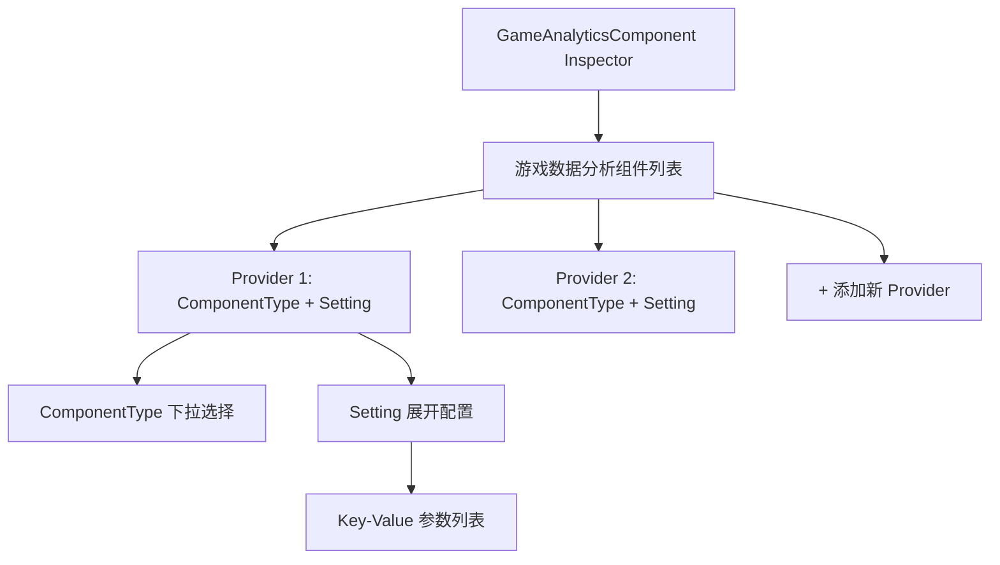
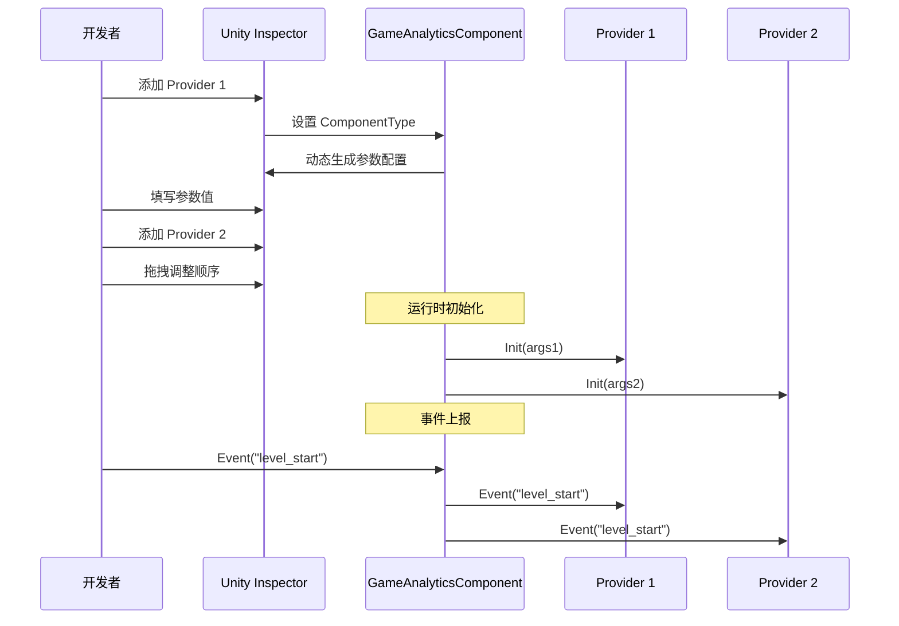

# エディタ設定

このドキュメント詳細介绍如何在 Unity エディタ中設定 GameAnalytics プラグイン，含みますコンポーネント追加、 Provider 設定和パラメータ設定。

## 概要

GameAnalytics プラグイン采用基于 Provider 的可拡張アーキテクチャ，允许在同一个プロジェクト中設定多个数据分析服务提供商。エディタ設定主な通过 Unity Inspector パネル完成，コアコンポーネント为 `GameAnalyticsComponent`。通过自定義 Inspector 界面，開発者〜できます可视化地追加、排序和設定多个分析服务提供商。

> 詳細的コアアーキテクチャ設計请リファレンス [コアアーキテクチャ](./04.features.md) ドキュメント。

## 設定フロー

### 追加コンポーネント

在 Unity シーン中作成或选择〜する必要があります追加数据分析的 GameObject，次に通过以下方法追加 `GameAnalyticsComponent`：

1. 在 Inspector パネル中点击 **Add Component** ボタン
2. 検索 "GameAnalytics" 或 "游戏数据分析"
3. 选择 **Game Framework/GameAnalytics** コンポーネント

```csharp
// 组件定义 - GameAnalyticsComponent.cs
[DisallowMultipleComponent]
[AddComponentMenu("Game Framework/GameAnalytics")]
public sealed class GameAnalyticsComponent : GameFrameworkComponent
{
    [SerializeField] private List<GameAnalyticsComponentProvider> m_gameAnalyticsComponentProviders = new List<GameAnalyticsComponentProvider>();
    // ... 事件上报方法
}
```
> Source: [GameAnalyticsComponent.cs](https://github.com/GameFrameX/com.gameframex.unity.gameanalytics/blob/main/Runtime/GameAnalytics/GameAnalyticsComponent.cs#L12-L17)

### Inspector 界面説明

追加コンポーネント后，Inspector パネル将显示自定義的設定界面，主なパッケージ含以下区域：



**主な UI 元素：**

| 元素 | 説明 |
|------|------|
| コンポーネント列表 | 显示已設定的所有数据分析 Provider |
| 追加ボタン | 在列表末尾追加新的 Provider |
| 削除ボタン | 移除指定位置的 Provider |
| 拖拽手柄 | 调整 Provider 的上报顺序 |
| ComponentType | 选择具体的数据分析服务実装类 |
| Setting | 展开設定该服务所需的パラメータ |

## Provider 設定详解

### コンポーネントタイプ选择

每个 Provider 〜する必要があります选择実装 `IGameAnalyticsManager` インターフェース的具体タイプ。Inspector 会自动扫描所有可用的分析服务実装类并显示在下拉メニュー中：

```csharp
// Inspector 代码 - 类型刷新逻辑
protected override void RefreshTypeNames()
{
    List<string> managerTypeNameList = new List<string> { NoneOptionName };
    managerTypeNameList.AddRange(Type.GetRuntimeTypeNames(typeof(IGameAnalyticsManager)));
    m_ManagerTypeNames = managerTypeNameList.ToArray();
}
```
> Source: [GameAnalyticsComponentInspector.cs](https://github.com/GameFrameX/com.gameframex.unity.gameanalytics/blob/main/Editor/Inspector/GameAnalyticsComponentInspector.cs#L42-L50)

**选择逻辑説明：**
- デフォルトオプション为 "None"（无）
- 下拉メニュー自动列出所有継承自 `IGameAnalyticsManager` 的タイプ
- 选择タイプ后，Inspector 会动态生成对应的パラメータ設定界面

### パラメータ設定

当选择具体的 ComponentType 后，Inspector 会自动读取该実装类的フィールド定義，并生成对应的パラメータ設定项：

```csharp
// Provider 数据结构
[Serializable]
public class GameAnalyticsComponentProvider
{
    /// <summary>
    /// 实现组件类型
    /// </summary>
    public string ComponentType;

    /// <summary>
    /// 这个是给编辑器用的
    /// </summary>
    public int ComponentTypeNameIndex = 0;

    /// <summary>
    /// 参数
    /// </summary>
    public List<GameAnalyticsComponentParamKV> Setting = new List<GameAnalyticsComponentParamKV>();
}

[Serializable]
public class GameAnalyticsComponentParamKV
{
    public string Key;
    public string Value;
}
```
> Source: [GameAnalyticsComponent.cs](https://github.com/GameFrameX/com.gameframex.unity.gameanalytics/blob/main/Runtime/GameAnalytics/GameAnalyticsComponent.cs#L361-L385)

### Provider 上报顺序

多个 Provider 存在时，イベント会按列表顺序依次上报。〜できます通过拖拽调整顺序，確認してください数据按预期优先级发送。

## 設定例

### 基本設定ステップ

1. **作成游戏对象**：在シーン中作成空对象或选择现有对象
2. **追加コンポーネント**：Add Component → Game Framework/GameAnalytics
3. **設定 Provider**：
   - 点击列表下方的 "+" ボタン追加 Provider
   - 在 ComponentType 下拉框中选择分析服务実装类
   - 展开 Setting 填写所需的パラメータ（如 AppId、AppKey 等）

```csharp
// 初始化时的参数传递
public void Init()
{
    foreach (var gameAnalyticsComponentProvider in m_gameAnalyticsComponentProviders)
    {
        if (gameAnalyticsComponentProvider.ComponentType.IsNotNullOrWhiteSpace())
        {
            var gameAnalyticsComponentType = Utility.Assembly.GetType(gameAnalyticsComponentProvider.ComponentType);
            if (Activator.CreateInstance(gameAnalyticsComponentType) is IGameAnalyticsManager gameAnalyticsManager)
            {
                Dictionary<string, string> args = new Dictionary<string, string>();
                foreach (var param in gameAnalyticsComponentProvider.Setting)
                {
                    args[param.Key] = param.Value;
                }
                gameAnalyticsManager.Init(args);
                m_GameAnalyticsManager.Add(gameAnalyticsManager);
            }
        }
    }
}
```
> Source: [GameAnalyticsComponent.cs](https://github.com/GameFrameX/com.gameframex.unity.gameanalytics/blob/main/Runtime/GameAnalytics/GameAnalyticsComponent.cs#L47-L80)

### 多 Provider 設定

サポート同時に設定多个分析服务，イベント会依次发送到所有已設定的 Provider：



## 常见設定問題

### Provider 未显示在列表中

もし下拉メニュー中没有显示所需的分析服务実装类，请確認：

1. **アセンブリ定義**：確認してください実装类所在的アセンブリ已正确参照
2. **インターフェース継承**：確認実装类正确継承自 `BaseGameAnalyticsManager` 并実装了 `IGameAnalyticsManager`
3. **アセンブリ扫描**：Editor アセンブリ〜の可能性があります〜する必要があります刷新才能检测到新的タイプ

### パラメータ設定无效

もし設定パラメータ后ランタイム未生效：

1. **確認フィールド名称**：パラメータ Key 〜しなければなりません与実装类中的フィールド名称完全匹配
2. **確認初期化**：確認 `Init()` メソッド被正确呼び出し
3. **確認ログ**：確認 Unity Console 中是否有エラー情報

### 重复コンポーネント警告

追加コンポーネント时出现重复警告：

```csharp
[DisallowMultipleComponent]  // 此属性防止在同一 GameObject 上添加多个实例
public sealed class GameAnalyticsComponent : GameFrameworkComponent
```

> 这是预期行为，確認してください每个シーン中只有一个 GameAnalyticsComponent インスタンス。

## 関連リンク

- [快速开始](./3-getting-started.index) - 理解する如何快速集成
- [コアアーキテクチャ](./04.features.md) - 深入理解する系统設計
- [API インターフェース](./5-api-reference.index) - 完全な的 API リファレンスドキュメント
- [故障排除](./7-troubleshooting.index) - 常见問題与解決策
