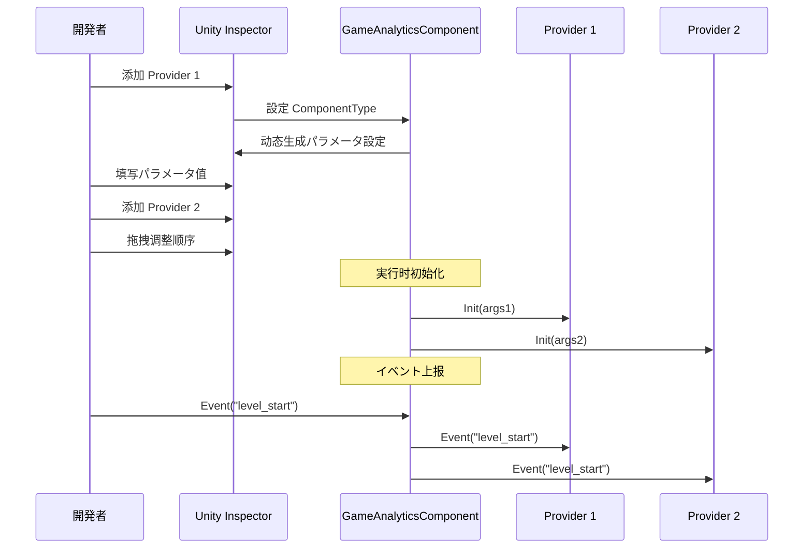

# エディター

ドキュメントに Unity エディター GameAnalytics ，コンポーネント、 Provider とパラメータ。

## 

GameAnalytics にづく Provider のアーキテクチャ，にプロジェクトデータ。エディターをじて Unity Inspector た，コアコンポーネント `GameAnalyticsComponent`。をじてカスタマイズ Inspector ，、と。

> のコアアーキテクチャリファレンス [コアアーキテクチャ](./04.features.md) ドキュメント。

## フロー

### コンポーネント

に Unity データの GameObject，をじて `GameAnalyticsComponent`：

1. に Inspector  **Add Component** 
2.  "GameAnalytics"  "ゲームデータ"
3.  **Game Framework/GameAnalytics** コンポーネント

```csharp
// コンポーネント定义 - GameAnalyticsComponent.cs
[DisallowMultipleComponent]
[AddComponentMenu("Game Framework/GameAnalytics")]
public sealed class GameAnalyticsComponent : GameFrameworkComponent
{
    [SerializeField] private List<GameAnalyticsComponentProvider> m_gameAnalyticsComponentProviders = new List<GameAnalyticsComponentProvider>();
    // ... イベント上报メソッド
}
```
> Source: [GameAnalyticsComponent.cs](https://github.com/GameFrameX/com.gameframex.unity.gameanalytics/blob/main/Runtime/GameAnalytics/GameAnalyticsComponent.cs#L12-L17)

### Inspector 

コンポーネント，Inspector カスタマイズの，む：


** UI ：**

|  |  |
|------|------|
| コンポーネント | のデータ Provider |
|  | にの Provider |
|  | の Provider |
|  |  Provider の |
| ComponentType | のデータクラス |
| Setting | のパラメータ |

## Provider 

### コンポーネントタイプ

 Provider  `IGameAnalyticsManager` インターフェースのタイプ。Inspector のクラスに：

```csharp
// Inspector コード - タイプ刷新逻辑
protected override void RefreshTypeNames()
{
    List<string> managerTypeNameList = new List<string> { NoneOptionName };
    managerTypeNameList.AddRange(Type.GetRuntimeTypeNames(typeof(IGameAnalyticsManager)));
    m_ManagerTypeNames = managerTypeNameList.ToArray();
}
```
> Source: [GameAnalyticsComponentInspector.cs](https://github.com/GameFrameX/com.gameframex.unity.gameanalytics/blob/main/Editor/Inspector/GameAnalyticsComponentInspector.cs#L42-L50)

**：**
- デフォルトオプション "None"（）
-  `IGameAnalyticsManager` のタイプ
- タイプ，Inspector のパラメータ

### パラメータ

の ComponentType ，Inspector クラスの，のパラメータ：

```csharp
// Provider データ構造
[Serializable]
public class GameAnalyticsComponentProvider
{
    /// <summary>
    /// 实现コンポーネントタイプ
    /// </summary>
    public string ComponentType;

    /// <summary>
    /// 这个は给エディター用の
    /// </summary>
    public int ComponentTypeNameIndex = 0;

    /// <summary>
    /// パラメータ
    /// </summary>
    public List<GameAnalyticsComponentParamKV> Setting = new List<GameAnalyticsComponentParamKV>();
}

[Serializable]
public class GameAnalyticsComponentParamKV
{
    public string Key;
    public string Value;
}
```
> Source: [GameAnalyticsComponent.cs](https://github.com/GameFrameX/com.gameframex.unity.gameanalytics/blob/main/Runtime/GameAnalytics/GameAnalyticsComponent.cs#L361-L385)

### Provider 

 Provider に，イベント。をじて，データ。

## 

### ステップ

1. **ゲームオブジェクト**：に
2. **コンポーネント**：Add Component → Game Framework/GameAnalytics
3. ** Provider**：
   - の "+"  Provider
   - に ComponentType クラス
   -  Setting のパラメータ（ AppId、AppKey ）

```csharp
// 初始化时のパラメータ传递
public void Init()
{
    foreach (var gameAnalyticsComponentProvider in m_gameAnalyticsComponentProviders)
    {
        if (gameAnalyticsComponentProvider.ComponentType.IsNotNullOrWhiteSpace())
        {
            var gameAnalyticsComponentType = Utility.Assembly.GetType(gameAnalyticsComponentProvider.ComponentType);
            if (Activator.CreateInstance(gameAnalyticsComponentType) is IGameAnalyticsManager gameAnalyticsManager)
            {
                Dictionary<string, string> args = new Dictionary<string, string>();
                foreach (var param in gameAnalyticsComponentProvider.Setting)
                {
                    args[param.Key] = param.Value;
                }
                gameAnalyticsManager.Init(args);
                m_GameAnalyticsManager.Add(gameAnalyticsManager);
            }
        }
    }
}
```
> Source: [GameAnalyticsComponent.cs](https://github.com/GameFrameX/com.gameframex.unity.gameanalytics/blob/main/Runtime/GameAnalytics/GameAnalyticsComponent.cs#L47-L80)

###  Provider 

サポート，イベントの Provider：



## 

### Provider に

のクラス，：

1. ****：クラスにの
2. **インターフェース**：クラス `BaseGameAnalyticsManager` た `IGameAnalyticsManager`
3. ****：Editor のタイプ

### パラメータ

パラメータ：

1. ****：パラメータ Key とクラスの
2. ****： `Init()` メソッドびし
3. **ログ**： Unity Console はエラー

### コンポーネント

コンポーネント：

```csharp
[DisallowMultipleComponent]  // 此プロパティ防止に同一 GameObject 上添加多个实例
public sealed class GameAnalyticsComponent : GameFrameworkComponent
```

> は， GameAnalyticsComponent 。

## リンク

- [クイックスタート](./3-getting-started.index) - た
- [コアアーキテクチャ](./04.features.md) - た
- [API インターフェース](./5-api-reference.index) - の API リファレンスドキュメント
- [](./7-troubleshooting.index) - よくあると
