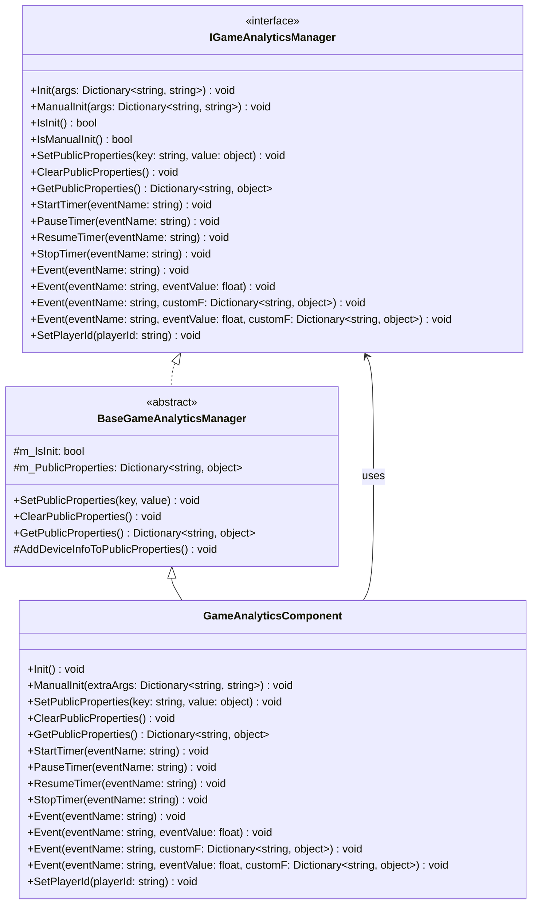
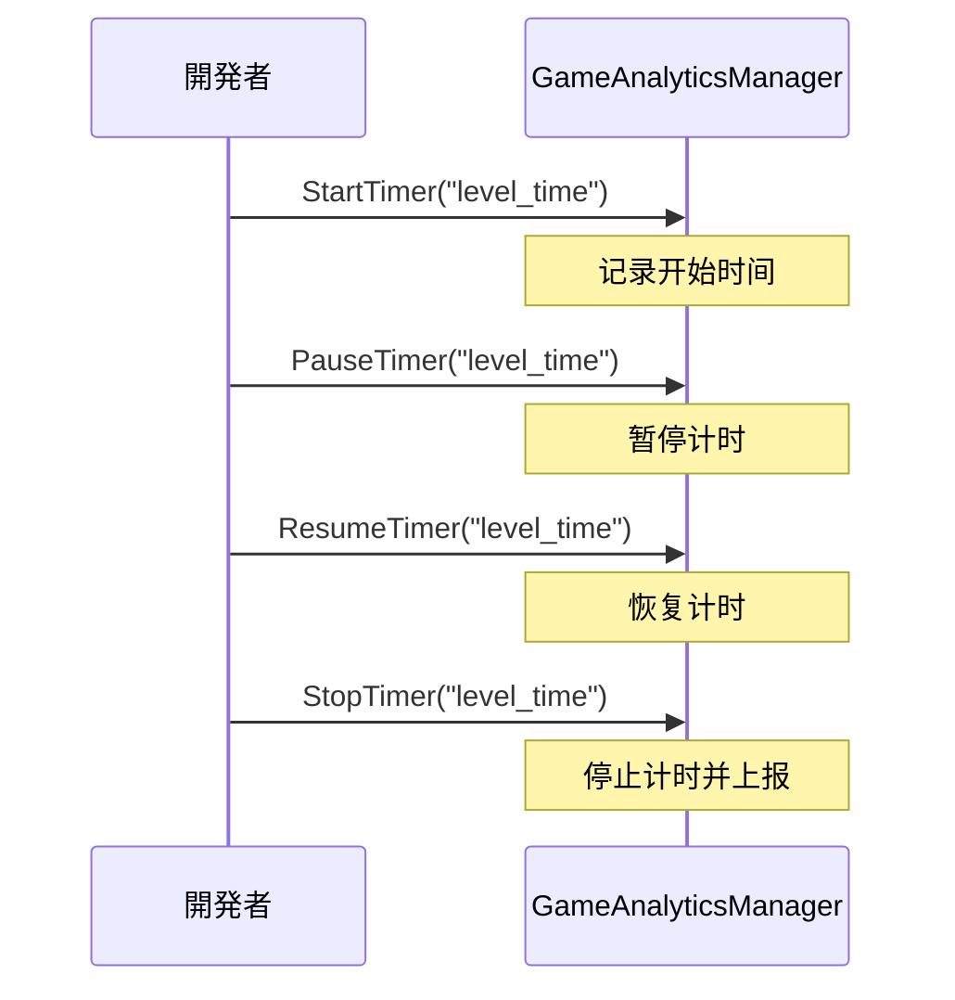

# API インターフェース

本文档详细介绍 GameAnalytics 插件提供的所有编程インターフェース，包括インターフェース定义、参数説明和使用方法。

## 概要

GameAnalytics 插件提供します完整的ゲーム数据分析機能インターフェース，を通じて `IGameAnalyticsManager` インターフェース定义标准化的分析メソッド。插件采用モジュラー設計，サポート多provider扩展，開発者可能を通じて `GameAnalyticsComponent` コンポーネント或直接呼び出し `IGameAnalyticsManager` インターフェース来使用機能。

> 名前空間：`GameFrameX.GameAnalytics.Runtime`

## 架构



### コンポーネント层级説明

| 层级 | コンポーネント | 説明 |
|------|------|------|
| インターフェース层 | `IGameAnalyticsManager` | 定义所有数据分析機能的抽象インターフェース |
| 基クラス层 | `BaseGameAnalyticsManager` | 実装公共逻辑和设备信息收集 |
| コンポーネント层 | `GameAnalyticsComponent` | Unityコンポーネント，暴露给開発者使用的エントリーポイント |

## 初期化インターフェース

### `Init(args: Dictionary<string, string>): void`

自动初期化メソッド，在コンポーネント启用时自动呼び出し，に使用配置ゲーム数据分析服务。

**参数：**
- `args` (Dictionary<string, string>): 初期化参数键值对，包含服务配置信息

**示例：**
```csharp
var args = new Dictionary<string, string>
{
    { "AppId", "your_app_id" },
    { "ChannelId", "your_channel_id" }
};
gameAnalyticsManager.Init(args);
```
> Source: [IGameAnalyticsManager.cs](https://github.com/GameFrameX/com.gameframex.unity.gameanalytics/blob/main/Runtime/GameAnalytics/IGameAnalyticsManager.cs#L10-L13)

---

### `ManualInit(args: Dictionary<string, string>): void`

手动初期化メソッド，允许開発者在特定时机手动触发初期化过程。

**参数：**
- `args` (Dictionary<string, string>): 初期化参数键值对

**设计意图：**
此メソッド适に使用必要延迟初期化或に基づいて特定条件触发的シーン，提供更灵活的控制方法。

> Source: [IGameAnalyticsManager.cs](https://github.com/GameFrameX/com.gameframex.unity.gameanalytics/blob/main/Runtime/GameAnalytics/IGameAnalyticsManager.cs#L15-L18)

---

### `IsInit(): bool`

检查コンポーネント是否已完成初期化。

**返回：**
- `bool`: 返回 true 表示已初期化，false 表示未初期化

**示例：**
```csharp
if (gameAnalyticsManager.IsInit())
{
    gameAnalyticsManager.Event("level_complete");
}
```
> Source: [IGameAnalyticsManager.cs](https://github.com/GameFrameX/com.gameframex.unity.gameanalytics/blob/main/Runtime/GameAnalytics/IGameAnalyticsManager.cs#L20-L23)

---

### `IsManualInit(): bool`

检查コンポーネント是否配置为手动初期化模式。

**返回：**
- `bool`: 返回 true 表示使用手动初期化，false 表示自动初期化

> Source: [IGameAnalyticsManager.cs](https://github.com/GameFrameX/com.gameframex.unity.gameanalytics/blob/main/Runtime/GameAnalytics/IGameAnalyticsManager.cs#L25-L28)

## 公共プロパティインターフェース

公共プロパティに使用設定跟随所有イベント一起上报的通用数据，减少重复数据的发送。

### `SetPublicProperties(key: string, value: object): void`

設定公共プロパティ，该プロパティ会自动附加到所有后续上报的イベント中。

**参数：**
- `key` (string): プロパティ键名，不能为空
- `value` (object): プロパティ值

**示例：**
```csharp
gameAnalyticsManager.SetPublicProperties("player_level", 10);
gameAnalyticsManager.SetPlayerId("player_123");
```
> Source: [IGameAnalyticsManager.cs](https://github.com/GameFrameX/com.gameframex.unity.gameanalytics/blob/main/Runtime/GameAnalytics/IGameAnalyticsManager.cs#L30-L35)

---

### `ClearPublicProperties(): void`

清除所有公共プロパティ。清除后会自动重新添加设备信息。

> Source: [IGameAnalyticsManager.cs](https://github.com/GameFrameX/com.gameframex.unity.gameanalytics/blob/main/Runtime/GameAnalytics/IGameAnalyticsManager.cs#L37-L40)

---

### `GetPublicProperties(): Dictionary<string, object>`

取得当前所有公共プロパティ的副本。

**返回：**
- `Dictionary<string, object>`: 包含所有公共プロパティ的字典

**示例：**
```csharp
var properties = gameAnalyticsManager.GetPublicProperties();
foreach (var prop in properties)
{
    Debug.Log($"{prop.Key}: {prop.Value}");
}
```
> Source: [IGameAnalyticsManager.cs](https://github.com/GameFrameX/com.gameframex.unity.gameanalytics/blob/main/Runtime/GameAnalytics/IGameAnalyticsManager.cs#L42-L46)

### 设备信息自动收集

`BaseGameAnalyticsManager` 会自动收集以下设备信息作为公共プロパティ：

| プロパティ键 | 説明 | 数据来源 |
|--------|------|----------|
| device_id | 设备唯一标识符 | SystemInfo.deviceUniqueIdentifier |
| device_model | 设备型号 | SystemInfo.deviceModel |
| device_type | 设备クラス型 | SystemInfo.deviceType |
| os | 操作系统 | SystemInfo.operatingSystem |
| app_version | 应用版本 | Application.version |
| unity_version | Unity版本 | Application.unityVersion |
| platform | 运行平台 | Application.platform |
| processor_type | 处理器クラス型 | SystemInfo.processorType |
| processor_count | 处理器コア数 | SystemInfo.processorCount |
| system_memory_size | 系统内存大小 | SystemInfo.systemMemorySize |
| graphics_device_name | 图形设备名称 | SystemInfo.graphicsDeviceName |
| graphics_memory_size | 显存大小 | SystemInfo.graphicsMemorySize |
| screen_width | 屏幕宽度 | Screen.width |
| screen_height | 屏幕高度 | Screen.height |
| screen_dpi | 屏幕DPI | Screen.dpi |
| network_type | 网络クラス型 | Application.internetReachability |
| system_language | 系统语言 | Application.systemLanguage |
> Source: [BaseGameAnalyticsManager.cs](https://github.com/GameFrameX/com.gameframex.unity.gameanalytics/blob/main/Runtime/GameAnalytics/BaseGameAnalyticsManager.cs#L85-L143)

## タイマーインターフェース

タイマー機能に使用测量ゲーム内特定操作所花费的时间，适に使用关卡通关时间、加载时间等シーン。

### `StartTimer(eventName: string): void`

开始计时，为指定イベント启动タイマー。

**参数：**
- `eventName` (string): イベント名称，に使用标识タイマー，不能为空

**示例：**
```csharp
// 玩家开始进入新关卡时开始计时
gameAnalyticsManager.StartTimer("level_loading_time");
```
> Source: [IGameAnalyticsManager.cs](https://github.com/GameFrameX/com.gameframex.unity.gameanalytics/blob/main/Runtime/GameAnalytics/IGameAnalyticsManager.cs#L48-L52)

---

### `PauseTimer(eventName: string): void`

暂停指定イベント的タイマー。

**参数：**
- `eventName` (string): 要暂停的タイマーイベント名称

> Source: [IGameAnalyticsManager.cs](https://github.com/GameFrameX/com.gameframex.unity.gameanalytics/blob/main/Runtime/GameAnalytics/IGameAnalyticsManager.cs#L54-L58)

---

### `ResumeTimer(eventName: string): void`

恢复指定イベント的タイマー。

**参数：**
- `eventName` (string): 要恢复的タイマーイベント名称

> Source: [IGameAnalyticsManager.cs](https://github.com/GameFrameX/com.gameframex.unity.gameanalytics/blob/main/Runtime/GameAnalytics/IGameAnalyticsManager.cs#L60-L64)

---

### `StopTimer(eventName: string): void`

停止指定イベント的タイマー并上报计时结果。

**参数：**
- `eventName` (string): 要停止的タイマーイベント名称

**示例：**
```csharp
// 关卡加载完成后停止计时并上报
gameAnalyticsManager.StopTimer("level_loading_time");
```
> Source: [IGameAnalyticsManager.cs](https://github.com/GameFrameX/com.gameframex.unity.gameanalytics/blob/main/Runtime/GameAnalytics/IGameAnalyticsManager.cs#L66-L70)

### タイマー使用フロー



## イベント上报インターフェース

イベント上报是ゲーム数据分析的コア機能，に使用收集玩家行为数据。

### `Event(eventName: string): void`

上报简单イベント，仅包含イベント名称，不携带任何数据。

**参数：**
- `eventName` (string): イベント名称，不能为空

**示例：**
```csharp
// 玩家完成新手引导
gameAnalyticsManager.Event("tutorial_complete");

// 玩家打开設定界面
gameAnalyticsManager.Event("open_settings");
```
> Source: [IGameAnalyticsManager.cs](https://github.com/GameFrameX/com.gameframex.unity.gameanalytics/blob/main/Runtime/GameAnalytics/IGameAnalyticsManager.cs#L72-L76)

---

### `Event(eventName: string, eventValue: float): void`

上报带有数值的イベント，に使用统计数值的シーン。

**参数：**
- `eventName` (string): イベント名称
- `eventValue` (float): イベント数值

**示例：**
```csharp
// 上报得分
gameAnalyticsManager.Event("score", 1500.5f);

// 上报金币数量
gameAnalyticsManager.Event("coins_earned", 100f);
```
> Source: [IGameAnalyticsManager.cs](https://github.com/GameFrameX/com.gameframex.unity.gameanalytics/blob/main/Runtime/GameAnalytics/IGameAnalyticsManager.cs#L78-L83)

---

### `Event(eventName: string, customF: Dictionary<string, object>): void`

上报带有自定义字段的イベント，に使用记录丰富的上下文信息。

**参数：**
- `eventName` (string): イベント名称
- `customF` (Dictionary<string, object>): 自定义字段字典

**示例：**
```csharp
// 上报关卡完成イベント，包含额外信息
var customFields = new Dictionary<string, object>
{
    { "level_id", 5 },
    { "difficulty", "hard" },
    { "stars_earned", 3 },
    { "time_taken", 120.5 }
};
gameAnalyticsManager.Event("level_complete", customFields);
```
> Source: [IGameAnalyticsManager.cs](https://github.com/GameFrameX/com.gameframex.unity.gameanalytics/blob/main/Runtime/GameAnalytics/IGameAnalyticsManager.cs#L85-L90)

---

### `Event(eventName: string, eventValue: float, customF: Dictionary<string, object>): void`

上报同时带有数值和自定义字段的イベント，适に使用必要同时记录数值和上下文的シーン。

**参数：**
- `eventName` (string): イベント名称
- `eventValue` (float): イベント数值
- `customF` (Dictionary<string, object>): 自定义字段字典

**示例：**
```csharp
// 上报付费购买イベント
var purchaseData = new Dictionary<string, object>
{
    { "item_id", "gem_pack_100" },
    { "payment_method", "alipay" },
    { "region", "CN" }
};
gameAnalyticsManager.Event("purchase", 9.99f, purchaseData);
```
> Source: [IGameAnalyticsManager.cs](https://github.com/GameFrameX/com.gameframex.unity.gameanalytics/blob/main/Runtime/GameAnalytics/IGameAnalyticsManager.cs#L92-L98)

### イベント上报クラス型选择

```mermaid
flowchart TD
    A[必要上报イベント?] --> B{必要附带数据?}
    B -->|否| C[Event(eventName)]
    B -->|是| D{数据クラス型?}
    D -->|仅数值| E[Event(eventName, eventValue)]
    D -->|仅自定义字段| F[Event(eventName, customF)]
    D -->|数值+自定义字段| G[Event(eventName, eventValue, customF)]
    
    C --> H[上报完成]
    E --> H
    F --> H
    G --> H
```

## 玩家标识インターフェース

### `SetPlayerId(playerId: string): void`

設定当前玩家的唯一标识符，に使用关联玩家行为数据。

**参数：**
- `playerId` (string): 玩家唯一标识符

**示例：**
```csharp
// 玩家登录后設定玩家ID
gameAnalyticsManager.SetPlayerId("player_882347");
```
> Source: [IGameAnalyticsManager.cs](https://github.com/GameFrameX/com.gameframex.unity.gameanalytics/blob/main/Runtime/GameAnalytics/IGameAnalyticsManager.cs#L100-L104)

## 完整使用示例

以下示例展示了一个典型的ゲーム分析集成フロー：

```csharp
using GameFrameX.GameAnalytics.Runtime;
using UnityEngine;

public class GameAnalyticsExample : MonoBehaviour
{
    private IGameAnalyticsManager _gameAnalyticsManager;

    private void Start()
    {
        // を通じてUnityコンポーネント取得管理器
        var component = GetComponent<GameAnalyticsComponent>();
        
        // 設定玩家ID
        component.SetPlayerId("player_882347");
        
        // 設定公共プロパティ
        component.SetPublicProperties("server_id", "server_01");
        component.SetPublicProperties("game_mode", " PvP");
    }

    private void OnLevelStart(int levelId)
    {
        // 开始关卡计时
        GetComponent<GameAnalyticsComponent>().StartTimer($"level_{levelId}");
        
        // 上报关卡开始イベント
        GetComponent<GameAnalyticsComponent>().Event("level_start", new Dictionary<string, object>
        {
            { "level_id", levelId },
            { "difficulty", "normal" }
        });
    }

    private void OnLevelComplete(int levelId, float timeTaken, int stars)
    {
        // 停止关卡计时
        GetComponent<GameAnalyticsComponent>().StopTimer($"level_{levelId}");
        
        // 上报关卡完成イベント
        GetComponent<GameAnalyticsComponent>().Event("level_complete", timeTaken, new Dictionary<string, object>
        {
            { "level_id", levelId },
            { "stars", stars },
            { "time_taken", timeTaken }
        });
    }

    private void OnPurchase(string itemId, float price)
    {
        // 上报付费イベント
        GetComponent<GameAnalyticsComponent>().Event("purchase", price, new Dictionary<string, object>
        {
            { "item_id", itemId },
            { "currency", "USD" }
        });
    }
}
```
> Source: [GameAnalyticsComponent.cs](https://github.com/GameFrameX/com.gameframex.unity.gameanalytics/blob/main/Runtime/GameAnalytics/GameAnalyticsComponent.cs#L36-L42)

## Unityコンポーネントインターフェース

`GameAnalyticsComponent` 是 Unity コンポーネント，提供します与 `IGameAnalyticsManager` インターフェース相同的メソッド，可直接在 Unity シーン中使用。

### コンポーネントメソッド列表

| メソッド | 説明 |
|------|------|
| `Init()` | 初期化コンポーネント |
| `ManualInit(extraArgs)` | 手动初期化 |
| `SetPlayerId(playerId)` | 設定玩家ID |
| `SetPublicProperties(key, value)` | 設定公共プロパティ |
| `ClearPublicProperties()` | 清除公共プロパティ |
| `GetPublicProperties()` | 取得公共プロパティ |
| `StartTimer(eventName)` | 开始计时 |
| `PauseTimer(eventName)` | 暂停计时 |
| `ResumeTimer(eventName)` | 恢复计时 |
| `StopTimer(eventName)` | 停止计时 |
| `Event(eventName)` | 上报简单イベント |
| `Event(eventName, eventValue)` | 上报数值イベント |
| `Event(eventName, customF)` | 上报自定义字段イベント |
| `Event(eventName, eventValue, customF)` | 上报完整イベント |

> Source: [GameAnalyticsComponent.cs](https://github.com/GameFrameX/com.gameframex.unity.gameanalytics/blob/main/Runtime/GameAnalytics/GameAnalyticsComponent.cs#L27-L358)

## 関連リンク

- [コア架构](./04.features.md) - 了解插件的整体アーキテクチャ設計
- [快速开始](./3-getting-started.index) - 快速集成插件
- [编辑器配置](./6-configuration.index) - 配置 GameAnalytics コンポーネント
- [故障排除](./7-troubleshooting.index) - 常见问题与解決策
