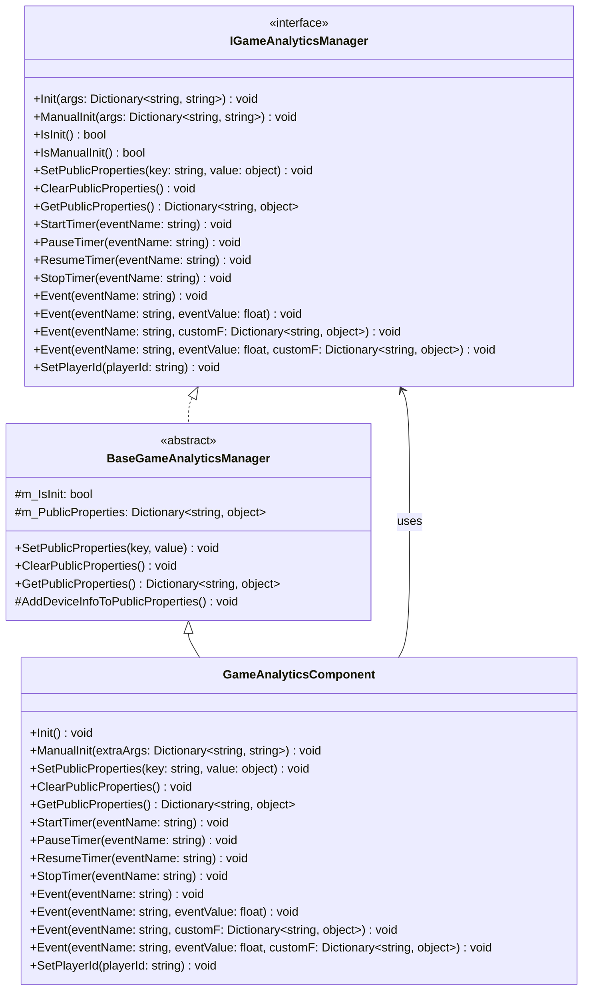

# API インターフェース

このドキュメント詳細介绍 GameAnalytics プラグイン提供的所有编程インターフェース，含みますインターフェース定義、パラメータ説明和使用方法。

## 概要

GameAnalytics プラグイン提供します完全な的游戏数据分析機能インターフェース，通过 `IGameAnalyticsManager` インターフェース定義標準化的分析メソッド。プラグイン采用モジュール化設計，サポート多provider拡張，開発者〜できます通过 `GameAnalyticsComponent` コンポーネント或直接呼び出し `IGameAnalyticsManager` インターフェース来使用機能。

> 名前空間：`GameFrameX.GameAnalytics.Runtime`

## アーキテクチャ



### コンポーネント層级説明

| 层级 | コンポーネント | 説明 |
|------|------|------|
| インターフェース層 | `IGameAnalyticsManager` | 定義所有数据分析機能的抽象インターフェース |
| 基底クラス层 | `BaseGameAnalyticsManager` | 実装公共逻辑和设备情報收集 |
| コンポーネント層 | `GameAnalyticsComponent` | Unityコンポーネント，暴露给開発者使用的入口 |

## 初期化インターフェース

### `Init(args: Dictionary<string, string>): void`

自动初期化メソッド，在コンポーネント启用时自动呼び出し，用于設定游戏数据分析服务。

**パラメータ：**
- `args` (Dictionary<string, string>): 初期化パラメータ键值对，パッケージ含服务設定情報

**例：**
```csharp
var args = new Dictionary<string, string>
{
    { "AppId", "your_app_id" },
    { "ChannelId", "your_channel_id" }
};
gameAnalyticsManager.Init(args);
```
> Source: [IGameAnalyticsManager.cs](https://github.com/GameFrameX/com.gameframex.unity.gameanalytics/blob/main/Runtime/GameAnalytics/IGameAnalyticsManager.cs#L10-L13)

---

### `ManualInit(args: Dictionary<string, string>): void`

手动初期化メソッド，允许開発者在特定时机手动トリガー初期化过程。

**パラメータ：**
- `args` (Dictionary<string, string>): 初期化パラメータ键值对

**設計意图：**
此メソッド適しています〜する必要があります延迟初期化或根据特定条件トリガー的シーン，提供更柔軟的控制方法。

> Source: [IGameAnalyticsManager.cs](https://github.com/GameFrameX/com.gameframex.unity.gameanalytics/blob/main/Runtime/GameAnalytics/IGameAnalyticsManager.cs#L15-L18)

---

### `IsInit(): bool`

確認コンポーネント是否已完成初期化。

**返す：**
- `bool`: 返す true 表示已初期化，false 表示未初期化

**例：**
```csharp
if (gameAnalyticsManager.IsInit())
{
    gameAnalyticsManager.Event("level_complete");
}
```
> Source: [IGameAnalyticsManager.cs](https://github.com/GameFrameX/com.gameframex.unity.gameanalytics/blob/main/Runtime/GameAnalytics/IGameAnalyticsManager.cs#L20-L23)

---

### `IsManualInit(): bool`

確認コンポーネント是否設定为手动初期化モード。

**返す：**
- `bool`: 返す true 表示使用手动初期化，false 表示自动初期化

> Source: [IGameAnalyticsManager.cs](https://github.com/GameFrameX/com.gameframex.unity.gameanalytics/blob/main/Runtime/GameAnalytics/IGameAnalyticsManager.cs#L25-L28)

## 公共プロパティインターフェース

公共プロパティ用于設定跟随所有イベント一起上报的汎用数据，减少重复数据的发送。

### `SetPublicProperties(key: string, value: object): void`

設定公共プロパティ，该プロパティ会自动附加到所有后续上报的イベント中。

**パラメータ：**
- `key` (string): プロパティ键名，不能为空
- `value` (object): プロパティ值

**例：**
```csharp
gameAnalyticsManager.SetPublicProperties("player_level", 10);
gameAnalyticsManager.SetPlayerId("player_123");
```
> Source: [IGameAnalyticsManager.cs](https://github.com/GameFrameX/com.gameframex.unity.gameanalytics/blob/main/Runtime/GameAnalytics/IGameAnalyticsManager.cs#L30-L35)

---

### `ClearPublicProperties(): void`

清除所有公共プロパティ。清除后会自动重新追加设备情報。

> Source: [IGameAnalyticsManager.cs](https://github.com/GameFrameX/com.gameframex.unity.gameanalytics/blob/main/Runtime/GameAnalytics/IGameAnalyticsManager.cs#L37-L40)

---

### `GetPublicProperties(): Dictionary<string, object>`

取得当前所有公共プロパティ的副本。

**返す：**
- `Dictionary<string, object>`: パッケージ含所有公共プロパティ的字典

**例：**
```csharp
var properties = gameAnalyticsManager.GetPublicProperties();
foreach (var prop in properties)
{
    Debug.Log($"{prop.Key}: {prop.Value}");
}
```
> Source: [IGameAnalyticsManager.cs](https://github.com/GameFrameX/com.gameframex.unity.gameanalytics/blob/main/Runtime/GameAnalytics/IGameAnalyticsManager.cs#L42-L46)

### 设备情報自动收集

`BaseGameAnalyticsManager` 会自动收集以下设备情報作为公共プロパティ：

| プロパティ键 | 説明 | 数据来源 |
|--------|------|----------|
| device_id | 设备唯一标识符 | SystemInfo.deviceUniqueIdentifier |
| device_model | 设备型号 | SystemInfo.deviceModel |
| device_type | 设备タイプ | SystemInfo.deviceType |
| os | 操作系统 | SystemInfo.operatingSystem |
| app_version | 应用バージョン | Application.version |
| unity_version | Unityバージョン | Application.unityVersion |
| platform | 运行プラットフォーム | Application.platform |
| processor_type | 処理器タイプ | SystemInfo.processorType |
| processor_count | 処理器コア数 | SystemInfo.processorCount |
| system_memory_size | 系统内存大小 | SystemInfo.systemMemorySize |
| graphics_device_name | 图形设备名称 | SystemInfo.graphicsDeviceName |
| graphics_memory_size | 显存大小 | SystemInfo.graphicsMemorySize |
| screen_width | 屏幕宽度 | Screen.width |
| screen_height | 屏幕高度 | Screen.height |
| screen_dpi | 屏幕DPI | Screen.dpi |
| network_type | 网络タイプ | Application.internetReachability |
| system_language | 系统语言 | Application.systemLanguage |
> Source: [BaseGameAnalyticsManager.cs](https://github.com/GameFrameX/com.gameframex.unity.gameanalytics/blob/main/Runtime/GameAnalytics/BaseGameAnalyticsManager.cs#L85-L143)

## 计时器インターフェース

计时器機能用于测量游戏内特定操作所花费的时间，適しています关卡通关时间、ロード时间等シーン。

### `StartTimer(eventName: string): void`

开始计时，为指定イベント启动计时器。

**パラメータ：**
- `eventName` (string): イベント名称，用于标识计时器，不能为空

**例：**
```csharp
// 玩家开始进入新关卡时开始计时
gameAnalyticsManager.StartTimer("level_loading_time");
```
> Source: [IGameAnalyticsManager.cs](https://github.com/GameFrameX/com.gameframex.unity.gameanalytics/blob/main/Runtime/GameAnalytics/IGameAnalyticsManager.cs#L48-L52)

---

### `PauseTimer(eventName: string): void`

暂停指定イベント的计时器。

**パラメータ：**
- `eventName` (string): 要暂停的计时器イベント名称

> Source: [IGameAnalyticsManager.cs](https://github.com/GameFrameX/com.gameframex.unity.gameanalytics/blob/main/Runtime/GameAnalytics/IGameAnalyticsManager.cs#L54-L58)

---

### `ResumeTimer(eventName: string): void`

恢复指定イベント的计时器。

**パラメータ：**
- `eventName` (string): 要恢复的计时器イベント名称

> Source: [IGameAnalyticsManager.cs](https://github.com/GameFrameX/com.gameframex.unity.gameanalytics/blob/main/Runtime/GameAnalytics/IGameAnalyticsManager.cs#L60-L64)

---

### `StopTimer(eventName: string): void`

停止指定イベント的计时器并上报计时結果。

**パラメータ：**
- `eventName` (string): 要停止的计时器イベント名称

**例：**
```csharp
// 关卡加载完成后停止计时并上报
gameAnalyticsManager.StopTimer("level_loading_time");
```
> Source: [IGameAnalyticsManager.cs](https://github.com/GameFrameX/com.gameframex.unity.gameanalytics/blob/main/Runtime/GameAnalytics/IGameAnalyticsManager.cs#L66-L70)

### 计时器使用フロー


## イベント上报インターフェース

イベント上报是游戏数据分析的コア機能，用于收集プレイヤー行为数据。

### `Event(eventName: string): void`

上报シンプルイベント，仅パッケージ含イベント名称，不携带任何数据。

**パラメータ：**
- `eventName` (string): イベント名称，不能为空

**例：**
```csharp
// 玩家完成新手引导
gameAnalyticsManager.Event("tutorial_complete");

// 玩家打开设置界面
gameAnalyticsManager.Event("open_settings");
```
> Source: [IGameAnalyticsManager.cs](https://github.com/GameFrameX/com.gameframex.unity.gameanalytics/blob/main/Runtime/GameAnalytics/IGameAnalyticsManager.cs#L72-L76)

---

### `Event(eventName: string, eventValue: float): void`

上报带有数值的イベント，用于统计数值的シーン。

**パラメータ：**
- `eventName` (string): イベント名称
- `eventValue` (float): イベント数值

**例：**
```csharp
// 上报得分
gameAnalyticsManager.Event("score", 1500.5f);

// 上报金币数量
gameAnalyticsManager.Event("coins_earned", 100f);
```
> Source: [IGameAnalyticsManager.cs](https://github.com/GameFrameX/com.gameframex.unity.gameanalytics/blob/main/Runtime/GameAnalytics/IGameAnalyticsManager.cs#L78-L83)

---

### `Event(eventName: string, customF: Dictionary<string, object>): void`

上报带有自定義フィールド的イベント，用于记录丰富的上下文情報。

**パラメータ：**
- `eventName` (string): イベント名称
- `customF` (Dictionary<string, object>): 自定義フィールド字典

**例：**
```csharp
// 上报关卡完成事件，包含额外信息
var customFields = new Dictionary<string, object>
{
    { "level_id", 5 },
    { "difficulty", "hard" },
    { "stars_earned", 3 },
    { "time_taken", 120.5 }
};
gameAnalyticsManager.Event("level_complete", customFields);
```
> Source: [IGameAnalyticsManager.cs](https://github.com/GameFrameX/com.gameframex.unity.gameanalytics/blob/main/Runtime/GameAnalytics/IGameAnalyticsManager.cs#L85-L90)

---

### `Event(eventName: string, eventValue: float, customF: Dictionary<string, object>): void`

上报同時に带有数值和自定義フィールド的イベント，適しています〜する必要があります同時に记录数值和上下文的シーン。

**パラメータ：**
- `eventName` (string): イベント名称
- `eventValue` (float): イベント数值
- `customF` (Dictionary<string, object>): 自定義フィールド字典

**例：**
```csharp
// 上报付费购买事件
var purchaseData = new Dictionary<string, object>
{
    { "item_id", "gem_pack_100" },
    { "payment_method", "alipay" },
    { "region", "CN" }
};
gameAnalyticsManager.Event("purchase", 9.99f, purchaseData);
```
> Source: [IGameAnalyticsManager.cs](https://github.com/GameFrameX/com.gameframex.unity.gameanalytics/blob/main/Runtime/GameAnalytics/IGameAnalyticsManager.cs#L92-L98)

### イベント上报タイプ选择

```mermaid
flowchart TD
    A[需要上报事件?] --> B{需要附带数据?}
    B -->|否| C[Event(eventName)]
    B -->|是| D{数据类型?}
    D -->|仅数值| E[Event(eventName, eventValue)]
    D -->|仅自定义字段| F[Event(eventName, customF)]
    D -->|数值+自定义字段| G[Event(eventName, eventValue, customF)]
    
    C --> H[上报完成]
    E --> H
    F --> H
    G --> H
```

## プレイヤー标识インターフェース

### `SetPlayerId(playerId: string): void`

設定当前プレイヤー的唯一标识符，用于关联プレイヤー行为数据。

**パラメータ：**
- `playerId` (string): プレイヤー唯一标识符

**例：**
```csharp
// 玩家登录后设置玩家ID
gameAnalyticsManager.SetPlayerId("player_882347");
```
> Source: [IGameAnalyticsManager.cs](https://github.com/GameFrameX/com.gameframex.unity.gameanalytics/blob/main/Runtime/GameAnalytics/IGameAnalyticsManager.cs#L100-L104)

## 完全な使用例

以下例表示了一个典型的游戏分析集成フロー：

```csharp
using GameFrameX.GameAnalytics.Runtime;
using UnityEngine;

public class GameAnalyticsExample : MonoBehaviour
{
    private IGameAnalyticsManager _gameAnalyticsManager;

    private void Start()
    {
        // 通过Unity组件获取管理器
        var component = GetComponent<GameAnalyticsComponent>();
        
        // 设置玩家ID
        component.SetPlayerId("player_882347");
        
        // 设置公共属性
        component.SetPublicProperties("server_id", "server_01");
        component.SetPublicProperties("game_mode", " PvP");
    }

    private void OnLevelStart(int levelId)
    {
        // 开始关卡计时
        GetComponent<GameAnalyticsComponent>().StartTimer($"level_{levelId}");
        
        // 上报关卡开始事件
        GetComponent<GameAnalyticsComponent>().Event("level_start", new Dictionary<string, object>
        {
            { "level_id", levelId },
            { "difficulty", "normal" }
        });
    }

    private void OnLevelComplete(int levelId, float timeTaken, int stars)
    {
        // 停止关卡计时
        GetComponent<GameAnalyticsComponent>().StopTimer($"level_{levelId}");
        
        // 上报关卡完成事件
        GetComponent<GameAnalyticsComponent>().Event("level_complete", timeTaken, new Dictionary<string, object>
        {
            { "level_id", levelId },
            { "stars", stars },
            { "time_taken", timeTaken }
        });
    }

    private void OnPurchase(string itemId, float price)
    {
        // 上报付费事件
        GetComponent<GameAnalyticsComponent>().Event("purchase", price, new Dictionary<string, object>
        {
            { "item_id", itemId },
            { "currency", "USD" }
        });
    }
}
```
> Source: [GameAnalyticsComponent.cs](https://github.com/GameFrameX/com.gameframex.unity.gameanalytics/blob/main/Runtime/GameAnalytics/GameAnalyticsComponent.cs#L36-L42)

## Unityコンポーネントインターフェース

`GameAnalyticsComponent` 是 Unity コンポーネント，提供します与 `IGameAnalyticsManager` インターフェース相同的メソッド，可直接在 Unity シーン中使用。

### コンポーネントメソッド列表

| メソッド | 説明 |
|------|------|
| `Init()` | 初期化コンポーネント |
| `ManualInit(extraArgs)` | 手动初期化 |
| `SetPlayerId(playerId)` | 設定プレイヤーID |
| `SetPublicProperties(key, value)` | 設定公共プロパティ |
| `ClearPublicProperties()` | 清除公共プロパティ |
| `GetPublicProperties()` | 取得公共プロパティ |
| `StartTimer(eventName)` | 开始计时 |
| `PauseTimer(eventName)` | 暂停计时 |
| `ResumeTimer(eventName)` | 恢复计时 |
| `StopTimer(eventName)` | 停止计时 |
| `Event(eventName)` | 上报シンプルイベント |
| `Event(eventName, eventValue)` | 上报数值イベント |
| `Event(eventName, customF)` | 上报自定義フィールドイベント |
| `Event(eventName, eventValue, customF)` | 上报完全なイベント |

> Source: [GameAnalyticsComponent.cs](https://github.com/GameFrameX/com.gameframex.unity.gameanalytics/blob/main/Runtime/GameAnalytics/GameAnalyticsComponent.cs#L27-L358)

## 関連リンク

- [コアアーキテクチャ](./04.features.md) - 理解するプラグイン的整体アーキテクチャ設計
- [快速开始](./3-getting-started.index) - 快速集成プラグイン
- [エディタ設定](./6-configuration.index) - 設定 GameAnalytics コンポーネント
- [故障排除](./7-troubleshooting.index) - 常见問題与解決策
