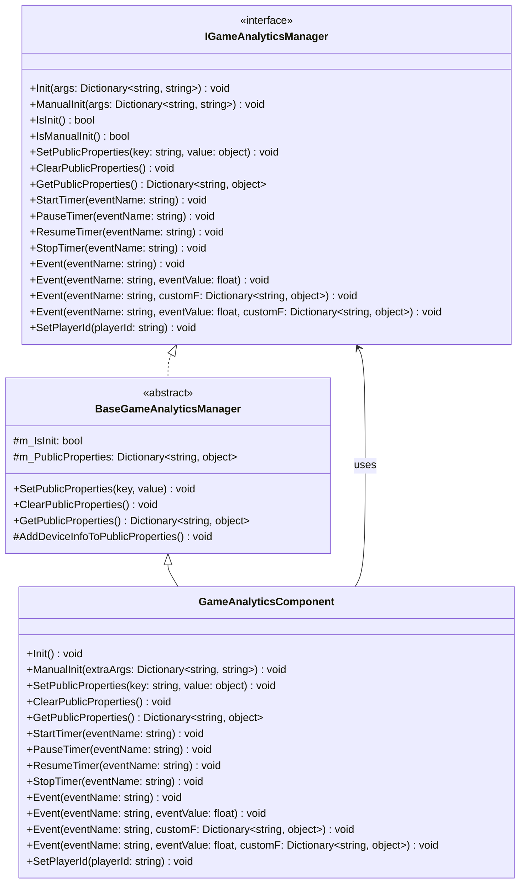
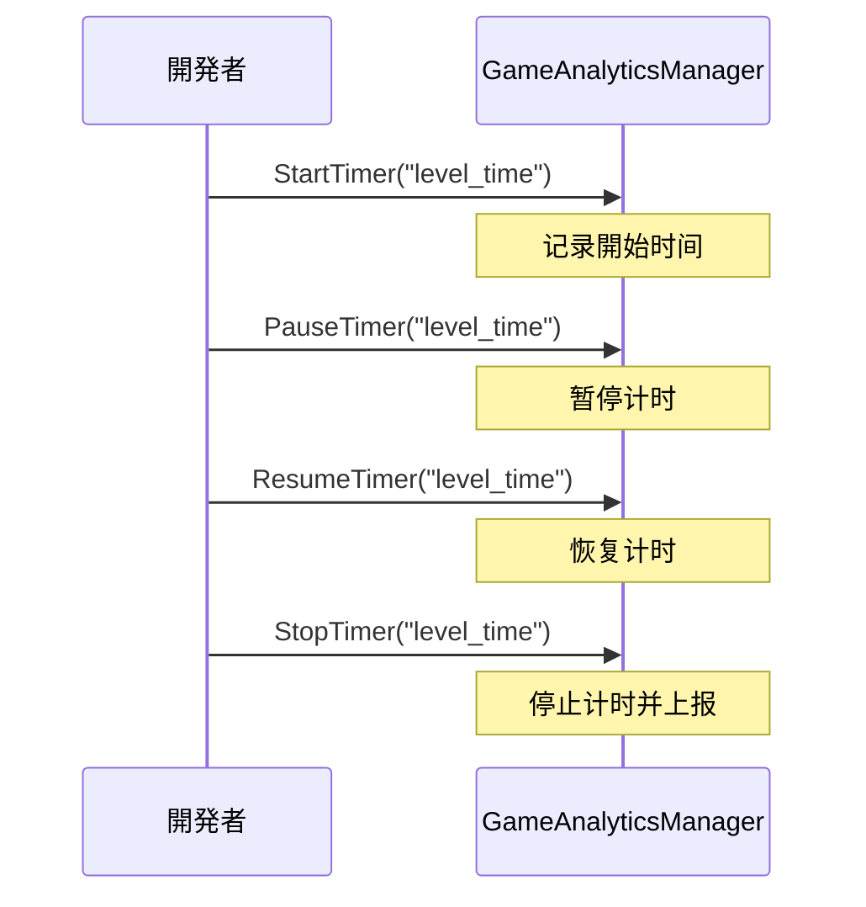

# API インターフェース

ドキュメント GameAnalytics のインターフェース，インターフェース、パラメータと。

## 

GameAnalytics たのゲームデータインターフェース，をじて `IGameAnalyticsManager` インターフェースのメソッド。モジュール，サポートprovider，をじて `GameAnalyticsComponent` コンポーネントびし `IGameAnalyticsManager` インターフェース。

> ：`GameFrameX.GameAnalytics.Runtime`

## アーキテクチャ



### コンポーネント

|  | コンポーネント |  |
|------|------|------|
| インターフェース | `IGameAnalyticsManager` | データのインターフェース |
| クラス | `BaseGameAnalyticsManager` | と |
| コンポーネント | `GameAnalyticsComponent` | Unityコンポーネント，の |

## インターフェース

### `Init(args: Dictionary<string, string>): void`

メソッド，にコンポーネントびし，にゲームデータ。

**パラメータ：**
- `args` (Dictionary<string, string>): パラメータ，む

**：**
```csharp
var args = new Dictionary<string, string>
{
    { "AppId", "your_app_id" },
    { "ChannelId", "your_channel_id" }
};
gameAnalyticsManager.Init(args);
```
> Source: [IGameAnalyticsManager.cs](https://github.com/GameFrameX/com.gameframex.unity.gameanalytics/blob/main/Runtime/GameAnalytics/IGameAnalyticsManager.cs#L10-L13)

---

### `ManualInit(args: Dictionary<string, string>): void`

メソッド，に。

**パラメータ：**
- `args` (Dictionary<string, string>): パラメータ

**：**
メソッドにの，の。

> Source: [IGameAnalyticsManager.cs](https://github.com/GameFrameX/com.gameframex.unity.gameanalytics/blob/main/Runtime/GameAnalytics/IGameAnalyticsManager.cs#L15-L18)

---

### `IsInit(): bool`

コンポーネントはた。

**す：**
- `bool`: す true ，false 

**：**
```csharp
if (gameAnalyticsManager.IsInit())
{
    gameAnalyticsManager.Event("level_complete");
}
```
> Source: [IGameAnalyticsManager.cs](https://github.com/GameFrameX/com.gameframex.unity.gameanalytics/blob/main/Runtime/GameAnalytics/IGameAnalyticsManager.cs#L20-L23)

---

### `IsManualInit(): bool`

コンポーネントは。

**す：**
- `bool`: す true ，false 

> Source: [IGameAnalyticsManager.cs](https://github.com/GameFrameX/com.gameframex.unity.gameanalytics/blob/main/Runtime/GameAnalytics/IGameAnalyticsManager.cs#L25-L28)

## プロパティインターフェース

プロパティにイベントのデータ，データの。

### `SetPublicProperties(key: string, value: object): void`

プロパティ，プロパティのイベント。

**パラメータ：**
- `key` (string): プロパティ，
- `value` (object): プロパティ

**：**
```csharp
gameAnalyticsManager.SetPublicProperties("player_level", 10);
gameAnalyticsManager.SetPlayerId("player_123");
```
> Source: [IGameAnalyticsManager.cs](https://github.com/GameFrameX/com.gameframex.unity.gameanalytics/blob/main/Runtime/GameAnalytics/IGameAnalyticsManager.cs#L30-L35)

---

### `ClearPublicProperties(): void`

プロパティ。。

> Source: [IGameAnalyticsManager.cs](https://github.com/GameFrameX/com.gameframex.unity.gameanalytics/blob/main/Runtime/GameAnalytics/IGameAnalyticsManager.cs#L37-L40)

---

### `GetPublicProperties(): Dictionary<string, object>`

プロパティの。

**す：**
- `Dictionary<string, object>`: むプロパティの

**：**
```csharp
var properties = gameAnalyticsManager.GetPublicProperties();
foreach (var prop in properties)
{
    Debug.Log($"{prop.Key}: {prop.Value}");
}
```
> Source: [IGameAnalyticsManager.cs](https://github.com/GameFrameX/com.gameframex.unity.gameanalytics/blob/main/Runtime/GameAnalytics/IGameAnalyticsManager.cs#L42-L46)

### 

`BaseGameAnalyticsManager` プロパティ：

| プロパティ |  | データ |
|--------|------|----------|
| device_id |  | SystemInfo.deviceUniqueIdentifier |
| device_model |  | SystemInfo.deviceModel |
| device_type | タイプ | SystemInfo.deviceType |
| os |  | SystemInfo.operatingSystem |
| app_version | バージョン | Application.version |
| unity_version | Unityバージョン | Application.unityVersion |
| platform | プラットフォーム | Application.platform |
| processor_type | タイプ | SystemInfo.processorType |
| processor_count | コア | SystemInfo.processorCount |
| system_memory_size |  | SystemInfo.systemMemorySize |
| graphics_device_name |  | SystemInfo.graphicsDeviceName |
| graphics_memory_size |  | SystemInfo.graphicsMemorySize |
| screen_width |  | Screen.width |
| screen_height |  | Screen.height |
| screen_dpi | DPI | Screen.dpi |
| network_type | ネットワークタイプ | Application.internetReachability |
| system_language |  | Application.systemLanguage |
> Source: [BaseGameAnalyticsManager.cs](https://github.com/GameFrameX/com.gameframex.unity.gameanalytics/blob/main/Runtime/GameAnalytics/BaseGameAnalyticsManager.cs#L85-L143)

## インターフェース

にゲームの，に、ロード。

### `StartTimer(eventName: string): void`

，イベント。

**パラメータ：**
- `eventName` (string): イベント，に，

**：**
```csharp
// 玩家開始进入新关卡时開始计时
gameAnalyticsManager.StartTimer("level_loading_time");
```
> Source: [IGameAnalyticsManager.cs](https://github.com/GameFrameX/com.gameframex.unity.gameanalytics/blob/main/Runtime/GameAnalytics/IGameAnalyticsManager.cs#L48-L52)

---

### `PauseTimer(eventName: string): void`

イベントの。

**パラメータ：**
- `eventName` (string): のイベント

> Source: [IGameAnalyticsManager.cs](https://github.com/GameFrameX/com.gameframex.unity.gameanalytics/blob/main/Runtime/GameAnalytics/IGameAnalyticsManager.cs#L54-L58)

---

### `ResumeTimer(eventName: string): void`

イベントの。

**パラメータ：**
- `eventName` (string): のイベント

> Source: [IGameAnalyticsManager.cs](https://github.com/GameFrameX/com.gameframex.unity.gameanalytics/blob/main/Runtime/GameAnalytics/IGameAnalyticsManager.cs#L60-L64)

---

### `StopTimer(eventName: string): void`

イベントの。

**パラメータ：**
- `eventName` (string): のイベント

**：**
```csharp
// 关卡ロード完た后停止计时并上报
gameAnalyticsManager.StopTimer("level_loading_time");
```
> Source: [IGameAnalyticsManager.cs](https://github.com/GameFrameX/com.gameframex.unity.gameanalytics/blob/main/Runtime/GameAnalytics/IGameAnalyticsManager.cs#L66-L70)

### フロー



## イベントインターフェース

イベントはゲームデータのコア，にデータ。

### `Event(eventName: string): void`

シンプルイベント，むイベント，データ。

**パラメータ：**
- `eventName` (string): イベント，

**：**
```csharp
// 玩家完た新手引导
gameAnalyticsManager.Event("tutorial_complete");

// 玩家打开設定界面
gameAnalyticsManager.Event("open_settings");
```
> Source: [IGameAnalyticsManager.cs](https://github.com/GameFrameX/com.gameframex.unity.gameanalytics/blob/main/Runtime/GameAnalytics/IGameAnalyticsManager.cs#L72-L76)

---

### `Event(eventName: string, eventValue: float): void`

のイベント，にの。

**パラメータ：**
- `eventName` (string): イベント
- `eventValue` (float): イベント

**：**
```csharp
// 上报得分
gameAnalyticsManager.Event("score", 1500.5f);

// 上报金币数量
gameAnalyticsManager.Event("coins_earned", 100f);
```
> Source: [IGameAnalyticsManager.cs](https://github.com/GameFrameX/com.gameframex.unity.gameanalytics/blob/main/Runtime/GameAnalytics/IGameAnalyticsManager.cs#L78-L83)

---

### `Event(eventName: string, customF: Dictionary<string, object>): void`

カスタマイズのイベント，にの。

**パラメータ：**
- `eventName` (string): イベント
- `customF` (Dictionary<string, object>): カスタマイズ

**：**
```csharp
// 上报关卡完たイベント，含む额外信息
var customFields = new Dictionary<string, object>
{
    { "level_id", 5 },
    { "difficulty", "hard" },
    { "stars_earned", 3 },
    { "time_taken", 120.5 }
};
gameAnalyticsManager.Event("level_complete", customFields);
```
> Source: [IGameAnalyticsManager.cs](https://github.com/GameFrameX/com.gameframex.unity.gameanalytics/blob/main/Runtime/GameAnalytics/IGameAnalyticsManager.cs#L85-L90)

---

### `Event(eventName: string, eventValue: float, customF: Dictionary<string, object>): void`

とカスタマイズのイベント，にとの。

**パラメータ：**
- `eventName` (string): イベント
- `eventValue` (float): イベント
- `customF` (Dictionary<string, object>): カスタマイズ

**：**
```csharp
// 上报付费购买イベント
var purchaseData = new Dictionary<string, object>
{
    { "item_id", "gem_pack_100" },
    { "payment_method", "alipay" },
    { "region", "CN" }
};
gameAnalyticsManager.Event("purchase", 9.99f, purchaseData);
```
> Source: [IGameAnalyticsManager.cs](https://github.com/GameFrameX/com.gameframex.unity.gameanalytics/blob/main/Runtime/GameAnalytics/IGameAnalyticsManager.cs#L92-L98)

### イベントタイプ

```mermaid
flowchart TD
    A[必要上报イベント?] --> B{必要附带データ?}
    B -->|否| C[Event(eventName)]
    B -->|は| D{データタイプ?}
    D -->|仅数值| E[Event(eventName, eventValue)]
    D -->|仅カスタマイズ字段| F[Event(eventName, customF)]
    D -->|数值+カスタマイズ字段| G[Event(eventName, eventValue, customF)]
    
    C --> H[上报完た]
    E --> H
    F --> H
    G --> H
```

## インターフェース

### `SetPlayerId(playerId: string): void`

の，にデータ。

**パラメータ：**
- `playerId` (string): 

**：**
```csharp
// 玩家登录后設定玩家ID
gameAnalyticsManager.SetPlayerId("player_882347");
```
> Source: [IGameAnalyticsManager.cs](https://github.com/GameFrameX/com.gameframex.unity.gameanalytics/blob/main/Runtime/GameAnalytics/IGameAnalyticsManager.cs#L100-L104)

## 

たのゲームフロー：

```csharp
using GameFrameX.GameAnalytics.Runtime;
using UnityEngine;

public class GameAnalyticsExample : MonoBehaviour
{
    private IGameAnalyticsManager _gameAnalyticsManager;

    private void Start()
    {
        // を通じてUnityコンポーネント获取マネージャー
        var component = GetComponent<GameAnalyticsComponent>();
        
        // 設定玩家ID
        component.SetPlayerId("player_882347");
        
        // 設定公共プロパティ
        component.SetPublicProperties("server_id", "server_01");
        component.SetPublicProperties("game_mode", " PvP");
    }

    private void OnLevelStart(int levelId)
    {
        // 開始关卡计时
        GetComponent<GameAnalyticsComponent>().StartTimer($"level_{levelId}");
        
        // 上报关卡開始イベント
        GetComponent<GameAnalyticsComponent>().Event("level_start", new Dictionary<string, object>
        {
            { "level_id", levelId },
            { "difficulty", "normal" }
        });
    }

    private void OnLevelComplete(int levelId, float timeTaken, int stars)
    {
        // 停止关卡计时
        GetComponent<GameAnalyticsComponent>().StopTimer($"level_{levelId}");
        
        // 上报关卡完たイベント
        GetComponent<GameAnalyticsComponent>().Event("level_complete", timeTaken, new Dictionary<string, object>
        {
            { "level_id", levelId },
            { "stars", stars },
            { "time_taken", timeTaken }
        });
    }

    private void OnPurchase(string itemId, float price)
    {
        // 上报付费イベント
        GetComponent<GameAnalyticsComponent>().Event("purchase", price, new Dictionary<string, object>
        {
            { "item_id", itemId },
            { "currency", "USD" }
        });
    }
}
```
> Source: [GameAnalyticsComponent.cs](https://github.com/GameFrameX/com.gameframex.unity.gameanalytics/blob/main/Runtime/GameAnalytics/GameAnalyticsComponent.cs#L36-L42)

## Unityコンポーネントインターフェース

`GameAnalyticsComponent` は Unity コンポーネント，たと `IGameAnalyticsManager` インターフェースのメソッド，に Unity 。

### コンポーネントメソッド

| メソッド |  |
|------|------|
| `Init()` | コンポーネント |
| `ManualInit(extraArgs)` |  |
| `SetPlayerId(playerId)` | ID |
| `SetPublicProperties(key, value)` | プロパティ |
| `ClearPublicProperties()` | プロパティ |
| `GetPublicProperties()` | プロパティ |
| `StartTimer(eventName)` |  |
| `PauseTimer(eventName)` |  |
| `ResumeTimer(eventName)` |  |
| `StopTimer(eventName)` |  |
| `Event(eventName)` | シンプルイベント |
| `Event(eventName, eventValue)` | イベント |
| `Event(eventName, customF)` | カスタマイズイベント |
| `Event(eventName, eventValue, customF)` | イベント |

> Source: [GameAnalyticsComponent.cs](https://github.com/GameFrameX/com.gameframex.unity.gameanalytics/blob/main/Runtime/GameAnalytics/GameAnalyticsComponent.cs#L27-L358)

## リンク

- [コアアーキテクチャ](./04.features.md) - たのアーキテクチャ
- [クイックスタート](./3-getting-started.index) - 
- [エディター](./6-configuration.index) -  GameAnalytics コンポーネント
- [](./7-troubleshooting.index) - よくあると
