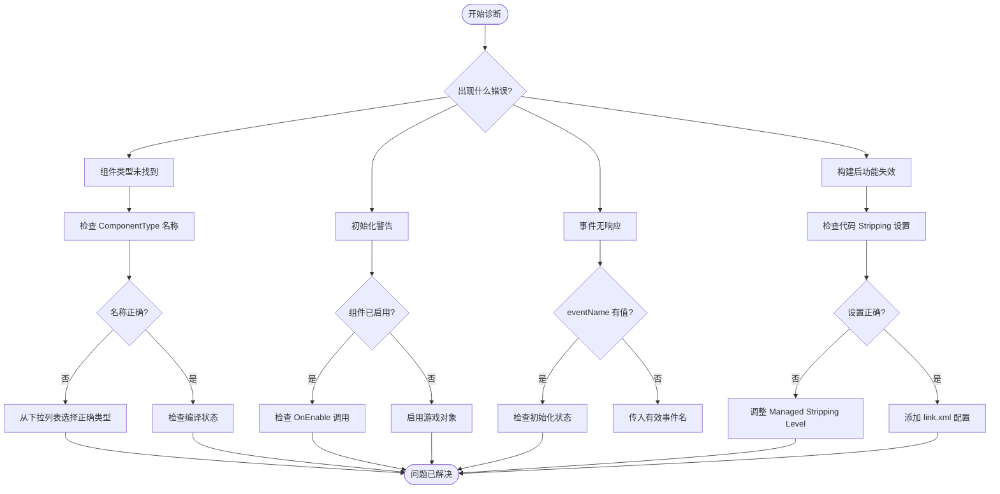

# 故障排除

このドキュメント提供 GameFrameX GameAnalytics プラグイン的常见問題排查ガイド，帮助開発者快速定位和解决集成过程中遇到的問題。

## 概要

GameAnalytics コンポーネント在 Unity プロジェクト中〜の可能性があります会遇到多种設定和ランタイム問題。このドキュメント涵盖从インストール設定到ランタイムエラー的各类常见問題，并提供詳細的診断ステップ和解決策。

## よくある問題与解決策

### 1. コンポーネントタイプ未找到

**エラー情報：**
```
Can not find component type 'XXX'.
```

**問題原因：**
- 在 Inspector パネル中設定的コンポーネントタイプ名称拼写エラー
- 指定的分析服务実装类不存在或未正确参照
- 名前空間不匹配

**解決策：**

1. 打开 Unity エディタ
2. 在シーン中选择挂载了 `GameAnalyticsComponent` 的游戏对象
3. 在 Inspector パネル中確認 **ComponentType** 下拉メニュー
4. 从下拉列表中选择正确的分析服务実装タイプ（不要手动输入）
5. 確認してください分析服务実装类已正确コンパイル且无语法エラー

> Source: [GameAnalyticsComponent.cs](https://github.com/GameFrameX/com.gameframex.unity.gameanalytics/blob/main/Runtime/GameAnalytics/GameAnalyticsComponent.cs#L58-L63)

### 2. 初期化相关警告

**警告情報：**
```
GameAnalyticsManager is not init.
```

**問題原因：**
- 在分析マネージャー初期化完成之前呼び出し了イベント上报或计时メソッド
- `GameAnalyticsComponent` 的 `Init()` メソッド尚未执行

**解決策：**

GameAnalyticsComponent 会在 `OnEnable()` 时自动初期化。もし您看到此警告，请確認：

1. 確認してください `GameAnalyticsComponent` 已正确追加到シーン中的游戏对象上
2. 游戏对象的 `OnEnable()` 已被 Unity 引擎呼び出し（游戏对象〜の可能性があります处于禁用ステータス）
3. もし〜する必要があります手动初期化，呼び出し `ManualInit()` メソッド之前確認してください已完成自动初期化

```csharp
// 正确的方式：确保组件已启用
var analytics = gameObject.GetComponent<GameAnalyticsComponent>();
// Component 会在 OnEnable 时自动初始化
```

> Source: [GameAnalyticsComponent.cs](https://github.com/GameFrameX/com.gameframex.unity.gameanalytics/blob/main/Runtime/GameAnalytics/GameAnalyticsComponent.cs#L170-L177)

### 3. 重复コンポーネント警告

**問題説明：**
Unity ヒント不能追加多个 GameAnalyticsComponent

**問題原因：**
- シーン中已存在 `GameAnalyticsComponent`，再次追加时会トリガー `[DisallowMultipleComponent]` 特性

**解決策：**

1. 確認シーン中是否已存在 GameAnalytics コンポーネント
2. 如需多个設定方案，使用コンポーネント列表機能（Inspector パネル中的 `游戏数据分析组件列表`）
3. 削除重复的コンポーネントインスタンス

```csharp
// 检查是否已存在组件
var existing = FindObjectsOfType<GameAnalyticsComponent>();
if (existing.Length > 0)
{
    // 使用现有组件，不要再次添加
}
```

> Source: [GameAnalyticsComponent.cs](https://github.com/GameFrameX/com.gameframex.unity.gameanalytics/blob/main/Runtime/GameAnalytics/GameAnalyticsComponent.cs#L12)

### 4. コード被 Strip 导致的問題

**問題説明：**
- 在ビルド IL2CPP プロジェクト后，分析服务機能失效
- ランタイム报错找不到特定タイプ

**問題原因：**
Unity 的コード stripping 机制〜の可能性があります会移除未直接参照的类

**解決策：**

プラグイン已パッケージ含 `GameFrameXGameAnalyticsCroppingHelper` 用于防止コード被裁剪。もし仍有問題：

1. 打开 `Project Settings > Player > Other Settings`
2. 設定 **Managed Stripping Level** 为 **Minimal**
3. 或在 `link.xml` ファイル中追加如下設定：

```xml
<linker>
    <assembly fullname="GameFrameX.GameAnalytics.Runtime" preserve="all"/>
</assembly>
```

> Source: [GameFrameXGameAnalyticsCroppingHelper.cs](https://github.com/GameFrameX/com.gameframex.unity.gameanalytics/blob/main/Runtime/GameFrameXGameAnalyticsCroppingHelper.cs#L1-L17)

### 5. パラメータ検証エラー

**エラー情報：**
- 传入空的イベント名称时メソッド无响应

**問題原因：**
- イベント名称パラメータ不能为空字符串或 null

**解決策：**

所有イベントメソッド和计时メソッド都使用 `GameFrameworkGuard.NotNullOrEmpty` 进行パラメータ検証。请確認してください传入有效的イベント名称：

```csharp
// ❌ 错误示例
analytics.Event("");
analytics.StartTimer(null);

// ✅ 正确示例
analytics.Event("player_login");
analytics.StartTimer("level_loading");
```

> Source: [GameAnalyticsComponent.cs](https://github.com/GameFrameX/com.gameframex.unity.gameanalytics/blob/main/Runtime/GameAnalytics/GameAnalyticsComponent.cs#L160-L166)

### 6. エディタ設定問題

**問題説明：**
- Inspector パネル中无法选择コンポーネントタイプ
- 設定パラメータ不显示

**解決策：**

1. 確認してください Unity 已コンパイル完成所有脚本（无コンパイルエラー）
2. 確認 Editor ファイル夹中的 Inspector コード是否正常工作
3. 刷新タイプ列表：閉じる并重新打开 Inspector パネル
4. 確認してください `GameAnalyticsComponentProvider` 类正确シリアライズ

> Source: [GameAnalyticsComponentInspector.cs](https://github.com/GameFrameX/com.gameframex.unity.gameanalytics/blob/main/Editor/Inspector/GameAnalyticsComponentInspector.cs#L42-L50)

## 診断フロー



## デバッグ技巧

### 启用デバッグログ

在 Unity 控制台中確認以下ログ分类：

- **Error**: コンポーネントタイプ未找到等严重エラー
- **Warning**: 初期化未完成等警告情報

### 確認初期化ステータス

```csharp
var analytics = gameObject.GetComponent<GameAnalyticsComponent>();
// 检查初始化状态
if (analytics.GetType().GetProperty("IsInit")?.GetValue(analytics) is bool isInit)
{
    Debug.Log($"Analytics initialized: {isInit}");
}
```

### 検証公共プロパティ

コンポーネント会自动收集设备情報。〜できます在ランタイム確認这些プロパティ是否正确設定：

```csharp
// 获取公共属性
var properties = analytics.GetPublicProperties();
foreach (var prop in properties)
{
    Debug.Log($"{prop.Key}: {prop.Value}");
}
```

> Source: [BaseGameAnalyticsManager.cs](https://github.com/GameFrameX/com.gameframex.unity.gameanalytics/blob/main/Runtime/GameAnalytics/BaseGameAnalyticsManager.cs#L88-L144)

## 関連リンク

- [快速开始](./3-getting-started) - 理解する如何快速集成
- [コアアーキテクチャ](./04.features.md) - 深入理解するコンポーネントアーキテクチャ
- [API インターフェース](./5-api-reference) - 完全な的 API リファレンスドキュメント
- [エディタ設定](./6-configuration) - 理解する如何在エディタ中設定コンポーネント
- [プラグイン介绍](./1-overview) - プラグイン概要与機能介绍
