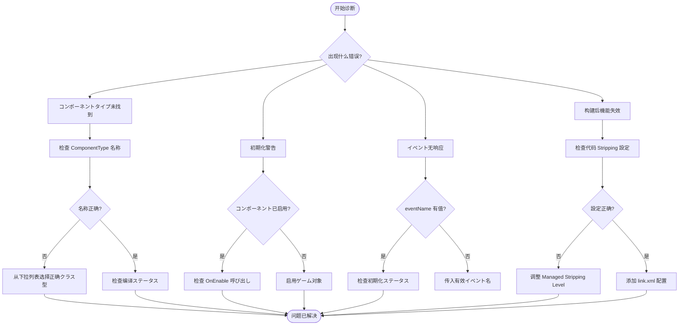

# 故障排除

本文档提供 GameFrameX GameAnalytics 插件的常见问题排查指南，帮助開発者快速定位和解决集成过程中遇到的问题。

## 概要

GameAnalytics コンポーネント在 Unity プロジェクト中可能会遇到多种配置和运行时问题。本文档涵盖从安装配置到运行时错误的各クラス常见问题，并提供详细的诊断手順和解決策。

## よくある質問与解決策

### 1. コンポーネントタイプ未找到

**错误信息：**
```
Can not find component type 'XXX'.
```

**问题原因：**
- 在 Inspector 面板中配置的コンポーネントタイプ名称拼写错误
- 指定的分析服务実装クラス不存在或未正确引用
- 名前空間不匹配

**解決策：**

1. 打开 Unity 编辑器
2. 在シーン中选择挂载了 `GameAnalyticsComponent` 的ゲーム对象
3. 在 Inspector 面板中检查 **ComponentType** 下拉菜单
4. 从下拉列表中选择正确的分析服务実装クラス型（不要手动输入）
5. 确保分析服务実装クラス已正确编译且无语法错误

> Source: [GameAnalyticsComponent.cs](https://github.com/GameFrameX/com.gameframex.unity.gameanalytics/blob/main/Runtime/GameAnalytics/GameAnalyticsComponent.cs#L58-L63)

### 2. 初期化関連警告

**警告信息：**
```
GameAnalyticsManager is not init.
```

**问题原因：**
- 在分析管理器初期化完成之前呼び出し了イベント上报或计时メソッド
- `GameAnalyticsComponent` 的 `Init()` メソッド尚未执行

**解決策：**

GameAnalyticsComponent 会在 `OnEnable()` 时自动初期化。如果您看到此警告，お願いします检查：

1. 确保 `GameAnalyticsComponent` 已正确添加到シーン中的ゲーム对象上
2. ゲーム对象的 `OnEnable()` 已被 Unity 引擎呼び出し（ゲーム对象可能处于禁用ステータス）
3. 如果必要手动初期化，呼び出し `ManualInit()` メソッド之前确保已完成自动初期化

```csharp
// 正确的方法：确保コンポーネント已启用
var analytics = gameObject.GetComponent<GameAnalyticsComponent>();
// Component 会在 OnEnable 时自动初期化
```

> Source: [GameAnalyticsComponent.cs](https://github.com/GameFrameX/com.gameframex.unity.gameanalytics/blob/main/Runtime/GameAnalytics/GameAnalyticsComponent.cs#L170-L177)

### 3. 重复コンポーネント警告

**问题説明：**
Unity ヒント不能添加多个 GameAnalyticsComponent

**问题原因：**
- シーン中已存在 `GameAnalyticsComponent`，再次添加时会触发 `[DisallowMultipleComponent]` 特性

**解決策：**

1. 检查シーン中是否已存在 GameAnalytics コンポーネント
2. 如需多个配置方案，使用コンポーネント列表機能（Inspector 面板中的 `ゲーム数据分析コンポーネント列表`）
3. 删除重复的コンポーネントインスタンス

```csharp
// 检查是否已存在コンポーネント
var existing = FindObjectsOfType<GameAnalyticsComponent>();
if (existing.Length > 0)
{
    // 使用现有コンポーネント，不要再次添加
}
```

> Source: [GameAnalyticsComponent.cs](https://github.com/GameFrameX/com.gameframex.unity.gameanalytics/blob/main/Runtime/GameAnalytics/GameAnalyticsComponent.cs#L12)

### 4. 代码被 Strip 导致的问题

**问题説明：**
- 在构建 IL2CPP プロジェクト后，分析服务機能失效
- 运行时报错找不到特定クラス型

**问题原因：**
Unity 的代码 stripping 机制可能会移除未直接引用的クラス

**解決策：**

插件已包含 `GameFrameXGameAnalyticsCroppingHelper` に使用防止代码被裁剪。如果仍有问题：

1. 打开 `Project Settings > Player > Other Settings`
2. 設定 **Managed Stripping Level** 为 **Minimal**
3. 或在 `link.xml` ファイル中添加如下配置：

```xml
<linker>
    <assembly fullname="GameFrameX.GameAnalytics.Runtime" preserve="all"/>
</assembly>
```

> Source: [GameFrameXGameAnalyticsCroppingHelper.cs](https://github.com/GameFrameX/com.gameframex.unity.gameanalytics/blob/main/Runtime/GameFrameXGameAnalyticsCroppingHelper.cs#L1-L17)

### 5. 参数验证错误

**错误信息：**
- 传入空的イベント名称时メソッド无响应

**问题原因：**
- イベント名称参数不能为空字符串或 null

**解決策：**

所有イベントメソッド和计时メソッド都使用 `GameFrameworkGuard.NotNullOrEmpty` 进行参数验证。必ず传入有效的イベント名称：

```csharp
// ❌ 错误示例
analytics.Event("");
analytics.StartTimer(null);

// ✅ 正确示例
analytics.Event("player_login");
analytics.StartTimer("level_loading");
```

> Source: [GameAnalyticsComponent.cs](https://github.com/GameFrameX/com.gameframex.unity.gameanalytics/blob/main/Runtime/GameAnalytics/GameAnalyticsComponent.cs#L160-L166)

### 6. 编辑器配置问题

**问题説明：**
- Inspector 面板中无法选择コンポーネントタイプ
- 配置参数不显示

**解決策：**

1. 确保 Unity 已编译完成所有脚本（无编译错误）
2. 检查 Editor ファイル夹中的 Inspector 代码正常に動作しているか
3. 刷新クラス型列表：关闭并重新打开 Inspector 面板
4. 确保 `GameAnalyticsComponentProvider` クラス正确序列化

> Source: [GameAnalyticsComponentInspector.cs](https://github.com/GameFrameX/com.gameframex.unity.gameanalytics/blob/main/Editor/Inspector/GameAnalyticsComponentInspector.cs#L42-L50)

## 诊断フロー



## 调试技巧

### 启用调试日志

在 Unity 控制台中查看以下日志分クラス：

- **Error**: コンポーネントタイプ未找到等严重错误
- **Warning**: 初期化未完成等警告信息

### 检查初期化ステータス

```csharp
var analytics = gameObject.GetComponent<GameAnalyticsComponent>();
// 检查初期化ステータス
if (analytics.GetType().GetProperty("IsInit")?.GetValue(analytics) is bool isInit)
{
    Debug.Log($"Analytics initialized: {isInit}");
}
```

### 验证公共プロパティ

コンポーネント会自动收集设备信息。可能在运行时检查这些プロパティ是否正确設定：

```csharp
// 取得公共プロパティ
var properties = analytics.GetPublicProperties();
foreach (var prop in properties)
{
    Debug.Log($"{prop.Key}: {prop.Value}");
}
```

> Source: [BaseGameAnalyticsManager.cs](https://github.com/GameFrameX/com.gameframex.unity.gameanalytics/blob/main/Runtime/GameAnalytics/BaseGameAnalyticsManager.cs#L88-L144)

## 関連リンク

- [快速开始](./3-getting-started) - 了解如何快速集成
- [コア架构](./04.features.md) - 深入了解コンポーネント架构
- [API インターフェース](./5-api-reference) - 完整的 API 参考文档
- [编辑器配置](./6-configuration) - 了解如何在编辑器中配置コンポーネント
- [插件介绍](./1-overview) - 插件概述与機能介绍
