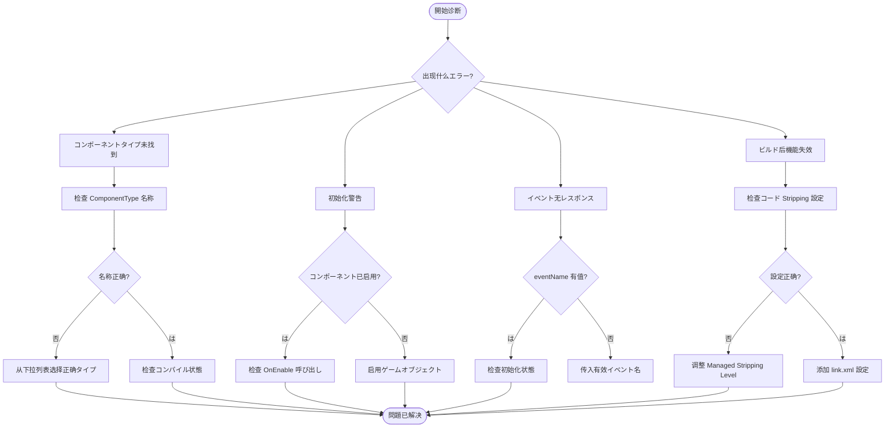

# 

ドキュメント GameFrameX GameAnalytics のよくあるガイド，との。

## 

GameAnalytics コンポーネントに Unity プロジェクトと。ドキュメントインストールエラーのクラスよくある，のステップと。

## よくあると

### 1. コンポーネントタイプ

**エラー：**
```
Can not find component type 'XXX'.
```

**：**
- に Inspector のコンポーネントタイプエラー
- のクラスに
- 

**：**

1.  Unity エディター
2. にた `GameAnalyticsComponent` のゲームオブジェクト
3. に Inspector  **ComponentType** 
4. のタイプ（）
5. クラスコンパイルエラー

> Source: [GameAnalyticsComponent.cs](https://github.com/GameFrameX/com.gameframex.unity.gameanalytics/blob/main/Runtime/GameAnalytics/GameAnalyticsComponent.cs#L58-L63)

### 2. 

**：**
```
GameAnalyticsManager is not init.
```

**：**
- にマネージャーたびしたイベントメソッド
- `GameAnalyticsComponent` の `Init()` メソッド

**：**

GameAnalyticsComponent に `OnEnable()` 。，：

1.  `GameAnalyticsComponent` のゲームオブジェクト
2. ゲームオブジェクトの `OnEnable()`  Unity びし（ゲームオブジェクト）
3. ，びし `ManualInit()` メソッドた

```csharp
// 正确の方式：确保コンポーネント已启用
var analytics = gameObject.GetComponent<GameAnalyticsComponent>();
// Component 会に OnEnable 时自动初始化
```

> Source: [GameAnalyticsComponent.cs](https://github.com/GameFrameX/com.gameframex.unity.gameanalytics/blob/main/Runtime/GameAnalytics/GameAnalyticsComponent.cs#L170-L177)

### 3. コンポーネント

**：**
Unity  GameAnalyticsComponent

**：**
- に `GameAnalyticsComponent`， `[DisallowMultipleComponent]` 

**：**

1. はに GameAnalytics コンポーネント
2. ，コンポーネント（Inspector の `ゲームデータコンポーネント`）
3. のコンポーネント

```csharp
// 检查は否已存にコンポーネント
var existing = FindObjectsOfType<GameAnalyticsComponent>();
if (existing.Length > 0)
{
    // 使用现有コンポーネント，不要再次添加
}
```

> Source: [GameAnalyticsComponent.cs](https://github.com/GameFrameX/com.gameframex.unity.gameanalytics/blob/main/Runtime/GameAnalytics/GameAnalyticsComponent.cs#L12)

### 4. コード Strip の

**：**
- にビルド IL2CPP プロジェクト，
- タイプ

**：**
Unity のコード stripping のクラス

**：**

む `GameFrameXGameAnalyticsCroppingHelper` にコード。：

1.  `Project Settings > Player > Other Settings`
2.  **Managed Stripping Level**  **Minimal**
3. に `link.xml` ファイル：

```xml
<linker>
    <assembly fullname="GameFrameX.GameAnalytics.Runtime" preserve="all"/>
</assembly>
```

> Source: [GameFrameXGameAnalyticsCroppingHelper.cs](https://github.com/GameFrameX/com.gameframex.unity.gameanalytics/blob/main/Runtime/GameFrameXGameAnalyticsCroppingHelper.cs#L1-L17)

### 5. パラメータエラー

**エラー：**
- のイベントメソッドレスポンス

**：**
- イベントパラメータ null

**：**

イベントメソッドとメソッド `GameFrameworkGuard.NotNullOrEmpty` パラメータ。のイベント：

```csharp
// ❌ エラー例
analytics.Event("");
analytics.StartTimer(null);

// ✅ 正确例
analytics.Event("player_login");
analytics.StartTimer("level_loading");
```

> Source: [GameAnalyticsComponent.cs](https://github.com/GameFrameX/com.gameframex.unity.gameanalytics/blob/main/Runtime/GameAnalytics/GameAnalyticsComponent.cs#L160-L166)

### 6. エディター

**：**
- Inspector コンポーネントタイプ
- パラメータ

**：**

1.  Unity コンパイルた（コンパイルエラー）
2.  Editor ファイルの Inspector コードは
3. タイプ： Inspector 
4.  `GameAnalyticsComponentProvider` クラス

> Source: [GameAnalyticsComponentInspector.cs](https://github.com/GameFrameX/com.gameframex.unity.gameanalytics/blob/main/Editor/Inspector/GameAnalyticsComponentInspector.cs#L42-L50)

## フロー



## デバッグ

### デバッグログ

に Unity ログクラス：

- **Error**: コンポーネントタイプエラー
- **Warning**: た

### 

```csharp
var analytics = gameObject.GetComponent<GameAnalyticsComponent>();
// 检查初始化状態
if (analytics.GetType().GetProperty("IsInit")?.GetValue(analytics) is bool isInit)
{
    Debug.Log($"Analytics initialized: {isInit}");
}
```

### プロパティ

コンポーネント。にプロパティは：

```csharp
// 获取公共プロパティ
var properties = analytics.GetPublicProperties();
foreach (var prop in properties)
{
    Debug.Log($"{prop.Key}: {prop.Value}");
}
```

> Source: [BaseGameAnalyticsManager.cs](https://github.com/GameFrameX/com.gameframex.unity.gameanalytics/blob/main/Runtime/GameAnalytics/BaseGameAnalyticsManager.cs#L88-L144)

## リンク

- [クイックスタート](./3-getting-started) - た
- [コアアーキテクチャ](./04.features.md) - たコンポーネントアーキテクチャ
- [API インターフェース](./5-api-reference) - の API リファレンスドキュメント
- [エディター](./6-configuration) - たにエディターコンポーネント
- [](./1-overview) - と
