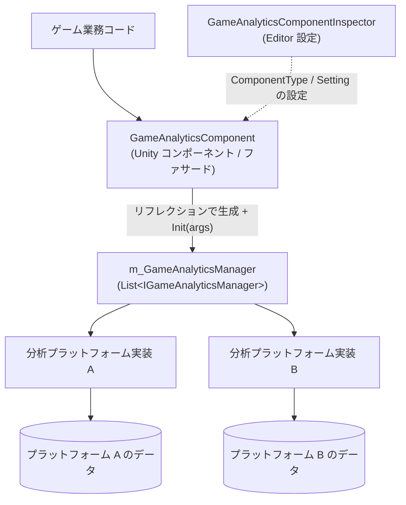

# ゲームデータ分析コンポーネントの紹介

GameAnalytics ゲームデータ分析コンポーネントは、Unity プロジェクトに統一されたゲームデータ分析の送信エントリポイントを提供します：Inspector で `GameAnalyticsComponent` をアタッチし、データ分析 Provider を設定するだけで、同一の API セットでイベントの送信やタイマーの管理を行い、データを複数のサードパーティ分析プラットフォームへ同時に送信できます。コンポーネントは外部依存がゼロで、Unity 2019.4 以降に対応しています（現在のパッケージバージョンは 1.2.1）。

## クイックスタート

### 1. パッケージのインストール

以下のいずれかの方法を選択してください（どれか一つを選ぶだけで構いません）：

**方法 1：scopedRegistries（推奨）** —— Unity プロジェクトの `Packages/manifest.json` を編集します：

```json
{
  "scopedRegistries": [
    {
      "name": "GameFrameX",
      "url": "https://gameframex.upm.alianblank.uk",
      "scopes": [
        "com.gameframex"
      ]
    }
  ],
  "dependencies": {
    "com.gameframex.unity.gameanalytics": "1.2.0"
  }
}
```

`scopes` はどのパッケージがこのレジストリ経由で解決されるかを制御します。`com.gameframex` で始まるパッケージのみがこのレジストリから取得されます。

Source: [README.zh-CN.md](https://github.com/GameFrameX/com.gameframex.unity.gameanalytics/blob/main/README.zh-CN.md#L34-L52)

**方法 2：Git URL** —— `manifest.json` の `dependencies` ノードの下に追加します：

```json
{
   "com.gameframex.unity.gameanalytics": "https://github.com/gameframex/com.gameframex.unity.gameanalytics.git"
}
```

また、Unity の `Package Manager` で `Git URL` 方式で追加することもできます。アドレスは `https://github.com/gameframex/com.gameframex.unity.gameanalytics.git` です。または、リポジトリを直接 Unity プロジェクトの `Packages` ディレクトリにダウンロードすると自動的に読み込まれます。

Source: [README.zh-CN.md](https://github.com/GameFrameX/com.gameframex.unity.gameanalytics/blob/main/README.zh-CN.md#L54-L61)

### 2. コンポーネントのアタッチと Provider の設定

シーン内に `Game Framework/GameAnalytics` コンポーネント（`GameAnalyticsComponent`）を作成します。コンポーネントは `Awake` で Provider を収集し、`OnEnable` 時に自動的に `Init()` を呼び出します：Inspector で設定された `ComponentType` に従い、リフレクションによって `IGameAnalyticsManager` を実装したインスタンスを生成し、各 Provider の `Setting` のキー・値のペアを初期化パラメータとして渡します。

```csharp
public void Init()
{
    if (m_IsInit)
    {
        return;
    }

    foreach (var gameAnalyticsComponentProvider in m_gameAnalyticsComponentProviders)
    {
        if (gameAnalyticsComponentProvider.ComponentType.IsNotNullOrWhiteSpace())
        {
            var gameAnalyticsComponentType = Utility.Assembly.GetType(gameAnalyticsComponentProvider.ComponentType);
            if (gameAnalyticsComponentType == null)
            {
                Log.Error($"Can not find component type '{gameAnalyticsComponentProvider.ComponentType}'.");
                continue;
            }

            if (Activator.CreateInstance(gameAnalyticsComponentType) is IGameAnalyticsManager gameAnalyticsManager)
            {
                Dictionary<string, string> args = new Dictionary<string, string>();
                foreach (var param in gameAnalyticsComponentProvider.Setting)
                {
                    args[param.Key] = param.Value;
                }

                gameAnalyticsManager.Init(args);
                m_GameAnalyticsManager.Add(gameAnalyticsManager);
            }
        }
    }

    m_IsInit = true;
}
```

Source: [GameAnalyticsComponent.cs](https://github.com/GameFrameX/com.gameframex.unity.gameanalytics/blob/main/Runtime/GameAnalytics/GameAnalyticsComponent.cs#L47-L80)

### 3. 最初のイベントを送信する

初期化が完了した後は、イベント送信およびタイマー API を呼び出すことができます：

```csharp
// シンプルなイベント送信
public void Event(string eventName)
{
    if (!_isInit) return;
    _gameAnalyticsManager.Event(eventName);
}

// 数値付きイベント送信
public void Event(string eventName, float eventValue)
{
    if (!_isInit) return;
    _gameAnalyticsManager.Event(eventName, eventValue);
}

// 計測開始 / 計測終了
public void StartTimer(string eventName)
{
    if (!_isInit) return;
    _gameAnalyticsManager.StartTimer(eventName);
}

public void StopTimer(string eventName)
{
    if (!_isInit) return;
    _gameAnalyticsManager.StopTimer(eventName);
}
```

Source: [README.zh-CN.md](https://github.com/GameFrameX/com.gameframex.unity.gameanalytics/blob/main/README.zh-CN.md#L76-L118)

注意：コンポーネントのいずれかのメソッドを使用する前に、コンポーネントが正しく初期化されていることを確認してください。データ分析の正確性を確保するため、送信するイベント名は代表性と一意性を持たせてください。

## 仕組みの概要

コンポーネントは「ファサード + 複数 Provider」構造を採用しています：`GameAnalyticsComponent` は外部への唯一のエントリポイント（`GameFrameworkComponent` を継承）であり、`IGameAnalyticsManager` を実装した 0 個以上のマネージャーインスタンスを保持します。すべての公開メソッドはリストを走査して、設定済みの各分析プラットフォームへブロードキャストされるため、一度の呼び出しで複数のプラットフォームへ同時に送信できます。



各型の役割は以下の通りです：

| 型 | 説明 |
|------|------|
| `GameAnalyticsComponent` | Unity コンポーネントのファサード。`Awake` で Provider を収集し、`OnEnable` で自動的に `Init()` を実行。すべてのメソッドを全 Manager へブロードキャスト |
| `IGameAnalyticsManager` | データ分析マネージャーインターフェース。初期化、共通プロパティ、タイマー、イベント送信、プレイヤー ID などの API を定義 |
| `BaseGameAnalyticsManager` | マネージャーの基底クラス。具象プラットフォーム実装が継承して再利用するためのもの |
| `GameAnalyticsComponentInspector` | Editor 拡張。Inspector で Provider と Setting を視覚的に設定するために使用 |
| `GameFrameXGameAnalyticsCroppingHelper` | クロップ（モジュール削除）用ヘルパークラス |

`IGameAnalyticsManager` が提供するコア API の概要（完全なシグネチャはインターフェースファイルを参照）：

| メソッド | シグネチャ | 説明 |
|------|------|------|
| 自動初期化 | `void Init(Dictionary<string, string> args)` | コンポーネント有効時に自動的に呼び出される |
| 手動初期化 | `void ManualInit(Dictionary<string, string> args)` | `IsManualInit()` が真の場合のみコンポーネントから転送される |
| 共通プロパティ設定 | `void SetPublicProperties(string key, object value)` | すべてのイベントに付随する共通フィールド |
| 共通プロパティのクリア/取得 | `void ClearPublicProperties()` / `Dictionary<string, object> GetPublicProperties()` | 共通プロパティを空にする、または読み取る |
| タイマー | `StartTimer` / `PauseTimer` / `ResumeTimer` / `StopTimer(string eventName)` | イベント所要時間の開始/一時停止/再開/終了 |
| イベント送信 | `Event(string eventName)` および `float` / `Dictionary<string, object>` 付きのオーバーロード | 全 4 つのオーバーロード |
| プレイヤー ID 設定 | `void SetPlayerId(string playerId)` | 現在のプレイヤーを識別 |

Source: [IGameAnalyticsManager.cs](https://github.com/GameFrameX/com.gameframex.unity.gameanalytics/blob/main/Runtime/GameAnalytics/IGameAnalyticsManager.cs#L8-L105)

## 次のステップ

- イベント送信とタイマーの具体的な使用方法については、『イベント送信とタイマー機能』タスクページを参照
- Inspector でのデータ分析 Provider と Setting の設定については、『データ分析 Provider の設定』タスクページを参照
- 初期化失敗や `Can not find component type` エラーなどの問題のトラブルシューティングについては、『初期化と送信失敗のトラブルシューティング』ページを参照
- バージョンの更新履歴については、リポジトリの [CHANGELOG.md](https://github.com/GameFrameX/com.gameframex.unity.gameanalytics/blob/main/CHANGELOG.md) を参照