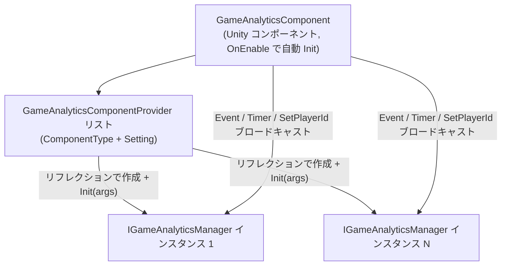

# インストールとクイックスタート

GameAnalytics ゲームデータ分析コンポーネントは、Unity プロジェクトに対してイベント送信とタイマー機能の統一インターフェースを提供します:パッケージをインストールし、シーンに `GameAnalyticsComponent` をアタッチして Provider を設定すれば、一行の `Event(...)` で任意のデータ分析 SDK にデータを送信できます。このページでは、インストールから最初のイベント送信までを案内します。

## 前提条件

- Unity `2019.4` 以上( [package.json](https://github.com/GameFrameX/com.gameframex.unity.gameanalytics/blob/main/package.json#L7) の `"unity": "2019.4"` を参照)。
- プロジェクトに GameFrameX フレームワークの基礎コンポーネントが既に存在すること:`GameAnalyticsComponent` は `GameFrameworkComponent` を継承し、`GameFrameX.Runtime` 名前空間の `Utility.Assembly`、`Log` などのインフラを使用します( [GameAnalyticsComponent.cs](https://github.com/GameFrameX/com.gameframex.unity.gameanalytics/blob/main/Runtime/GameAnalytics/GameAnalyticsComponent.cs#L1-L14) を参照)。
- 本パッケージ自体は `package.json` で `"dependencies": {}` を宣言しており、追加のサードパーティ依存関係はありません。

## クイックスタート

### ステップ 1:パッケージのインストール

以下のいずれかの方法を選択してください(現在のリポジトリのバージョンは `1.2.1` で、README の例に記載されている `1.2.0` は過去のバージョン番号です):

1. Unity プロジェクトの `Packages/manifest.json` を編集し、`scopedRegistries` セクションを追加します:

```json
{
  "scopedRegistries": [
    {
      "name": "GameFrameX",
      "url": "https://gameframex.upm.alianblank.uk",
      "scopes": [
        "com.gameframex"
      ]
    }
  ],
  "dependencies": {
    "com.gameframex.unity.gameanalytics": "1.2.0"
  }
}
```

`scopes` はどのパッケージがこのレジストリを通じて解決されるかを制御し、`com.gameframex` で始まるパッケージのみがこのレジストリから取得されます。

Source: [README.zh-CN.md](https://github.com/GameFrameX/com.gameframex.unity.gameanalytics/blob/main/README.zh-CN.md#L34-L52)

2. `manifest.json` の `dependencies` ノードの下に直接 Git アドレスを追加します:

```json
{
   "com.gameframex.unity.gameanalytics": "https://github.com/gameframex/com.gameframex.unity.gameanalytics.git"
}
```

Source: [README.zh-CN.md](https://github.com/GameFrameX/com.gameframex.unity.gameanalytics/blob/main/README.zh-CN.md#L54-L59)

3. Unity の `Package Manager` で `Add package from git URL` を選択し、`https://github.com/gameframex/com.gameframex.unity.gameanalytics.git` を入力します。
4. リポジトリを直接ダウンロードして Unity プロジェクトの `Packages` ディレクトリに配置すると、Unity が自動的に読み込んで認識します。

### ステップ 2:コンポーネントのアタッチ

Unity メニューで `Component → Game Framework → GameAnalytics` を選択し、シーン内の GameFrameX コンポーネントのホスト GameObject に `GameAnalyticsComponent` を追加します。コンポーネントには `[DisallowMultipleComponent]` が付与されているため、同一 GameObject にアタッチできるのは 1 つだけです。

```csharp
[DisallowMultipleComponent]
[AddComponentMenu("Game Framework/GameAnalytics")]
public sealed class GameAnalyticsComponent : GameFrameworkComponent
```

Source: [GameAnalyticsComponent.cs](https://github.com/GameFrameX/com.gameframex.unity.gameanalytics/blob/main/Runtime/GameAnalytics/GameAnalyticsComponent.cs#L12-L14)

### ステップ 3:データ分析 Provider の設定

Inspector(カスタムエディタは [GameAnalyticsComponentInspector.cs](https://github.com/GameFrameX/com.gameframex.unity.gameanalytics/blob/main/Editor/Inspector/GameAnalyticsComponentInspector.cs) を参照)でコンポーネントに Provider エントリを追加し、以下を入力します:

| フィールド | 説明 |
|------|------|
| `ComponentType` | `IGameAnalyticsManager` を実装する型の完全名(文字列) |
| `Setting` | 該当 SDK に渡すキーと値のペアの設定(AppKey、SecretKey など) |

コンポーネントが有効化されると、`OnEnable()` 内で自動的に `Init()` が実行されます:`ComponentType` に従ってリフレクションでインスタンスを作成し、`Setting` を `Dictionary<string, string>` にまとめて `gameAnalyticsManager.Init(args)` を呼び出した後、インスタンスを管理リストに追加します——以降のすべての送信呼び出しは、登録済みの各 Provider にブロードキャストされます。

```csharp
public void Init()
{
    if (m_IsInit)
    {
        return;
    }

    foreach (var gameAnalyticsComponentProvider in m_gameAnalyticsComponentProviders)
    {
        if (gameAnalyticsComponentProvider.ComponentType.IsNotNullOrWhiteSpace())
        {
            var gameAnalyticsComponentType = Utility.Assembly.GetType(gameAnalyticsComponentProvider.ComponentType);
            if (gameAnalyticsComponentType == null)
            {
                Log.Error($"Can not find component type '{gameAnalyticsComponentProvider.ComponentType}'.");
                continue;
            }

            if (Activator.CreateInstance(gameAnalyticsComponentType) is IGameAnalyticsManager gameAnalyticsManager)
            {
                Dictionary<string, string> args = new Dictionary<string, string>();
                foreach (var param in gameAnalyticsComponentProvider.Setting)
                {
                    args[param.Key] = param.Value;
                }

                gameAnalyticsManager.Init(args);
                m_GameAnalyticsManager.Add(gameAnalyticsManager);
            }
        }
    }

    m_IsInit = true;
}
```

Source: [GameAnalyticsComponent.cs](https://github.com/GameFrameX/com.gameframex.unity.gameanalytics/blob/main/Runtime/GameAnalytics/GameAnalyticsComponent.cs#L47-L80)

### ステップ 4:最初のイベントとタイマーの送信

初期化はコンポーネントによって自動的に行われるため、ビジネスコードから直接呼び出すだけです(名前空間 `GameFrameX.GameAnalytics.Runtime`):

```csharp
// タイマーの開始/終了
GameEntry.GameAnalytics.StartTimer("level_1");
GameEntry.GameAnalytics.StopTimer("level_1");

// シンプルなイベント送信
GameEntry.GameAnalytics.Event("level_complete");

// 数値付きのイベント送信
GameEntry.GameAnalytics.Event("coin_gain", 100f);

// カスタムフィールド付きのイベント送信
GameEntry.GameAnalytics.Event("purchase",
    new Dictionary<string, object> { { "sku", "gem_100" }, { "price", "0.99" } });

// 数値とカスタムフィールド付きのイベント送信
GameEntry.GameAnalytics.Event("boss_kill", 1f,
    new Dictionary<string, object> { { "boss_id", "b_003" } });
```

Source: [README.zh-CN.md](https://github.com/GameFrameX/com.gameframex.unity.gameanalytics/blob/main/README.zh-CN.md#L80-L148)

> **注意：** コンポーネントが初期化されていない場合(`m_IsInit == false`)、`Init()` 以外のすべてのメソッドは即座に `return` し、エラーも発生せず送信も行われません。データ分析の正確性を確保するため、イベント名は代表的かつ一意なものにしてください。

## 仕組みの概要

コンポーネントは「マルチキャスト」のシェルであり、実際のデータ分析ロジックはあなたが注入した `IGameAnalyticsManager` の実装が担います(例：GA、Firebase など複数のプラットフォームに同時に接続):



## よくあるエラー

| 症状 | 原因 | 修正方法 |
|------|------|------|
| `Event` / `StartTimer` を呼び出しても送信されず、エラーも出ない | コンポーネントが未初期化で、メソッド冒頭の `if (!_isInit) return;` で即座に返っている | コンポーネントが GameObject の有効化に伴って `OnEnable → Init()` がトリガーされていることを確認、または先に `Init()` を呼び出す |
| Console に `Can not find component type '...'.` が表示される | Provider の `ComponentType` の型名の誤り、または該当型が存在するアセンブリが参照されていない | 型の完全名を確認；実装クラスが `public` であり、アセンブリがロード済みであることを確認 |
| 同一 GameObject に 2 つ目のコンポーネントをアタッチできない | `[DisallowMultipleComponent]` の制限 | `GameAnalyticsComponent` は 1 つだけにし、マルチプラットフォームは複数の Provider で対応する |
| ログイン後にしか使えない SDK がパラメータを取得できない | 該当 Provider が手動初期化に設定されており、自動 `Init` 時にビジネスパラメータが渡されていない | ログイン成功後に `ManualInit(Dictionary<string, string> extraArgs)` を呼び出す( [GameAnalyticsComponent.cs](https://github.com/GameFrameX/com.gameframex.unity.gameanalytics/blob/main/Runtime/GameAnalytics/GameAnalyticsComponent.cs#L86-L100) を参照) |

## 次のステップ

- 完全なインターフェース一覧と各メソッドのシグネチャは、 [IGameAnalyticsManager.cs](https://github.com/GameFrameX/com.gameframex.unity.gameanalytics/blob/main/Runtime/GameAnalytics/IGameAnalyticsManager.cs#L8-L105) を参照してください(`PauseTimer` / `ResumeTimer` / `SetPublicProperties` / `SetPlayerId` などが含まれます)。
- 基底クラスのデフォルト実装は [BaseGameAnalyticsManager.cs](https://github.com/GameFrameX/com.gameframex.unity.gameanalytics/blob/main/Runtime/GameAnalytics/BaseGameAnalyticsManager.cs) を参照してください。
- Inspector のカスタムエディタは [GameAnalyticsComponentInspector.cs](https://github.com/GameFrameX/com.gameframex.unity.gameanalytics/blob/main/Editor/Inspector/GameAnalyticsComponentInspector.cs) を参照してください。
- バージョン履歴はリポジトリの [CHANGELOG.md](https://github.com/GameFrameX/com.gameframex.unity.gameanalytics/blob/main/CHANGELOG.md) を参照してください。
- 公式ドキュメントサイト:https://gameframex.doc.alianblank.com ;コミュニティ QQ グループ:467608841 / 233840761。

## 背景

コンポーネントは `Awake` で `IsAutoRegister = false` を設定し、空の `IGameAnalyticsManager` リストを新規作成します。実際のインスタンス化は `OnEnable` によってトリガーされる `Init()` まで遅延されるため、Provider の型はコンポーネントの有効化時に `Utility.Assembly.GetType` で解決できる必要があります。この「リフレクション + 文字列設定」の設計により、本パッケージのソースコードを変更することなく、`IGameAnalyticsManager` を実装した任意のデータ分析 SDK を接続できます。

Source: [GameAnalyticsComponent.cs](https://github.com/GameFrameX/com.gameframex.unity.gameanalytics/blob/main/Runtime/GameAnalytics/GameAnalyticsComponent.cs#L20-L30)