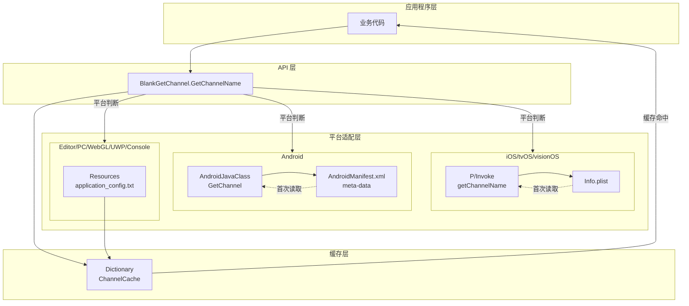
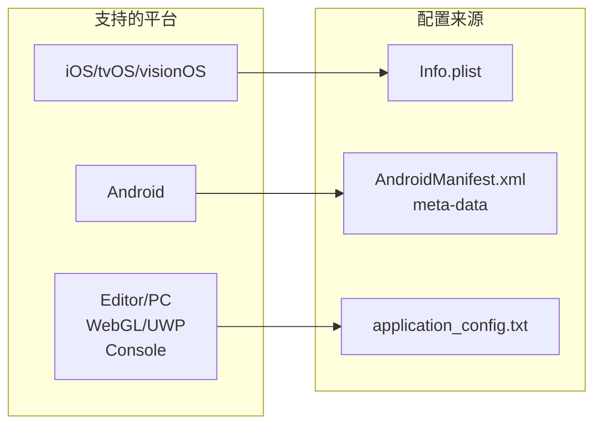
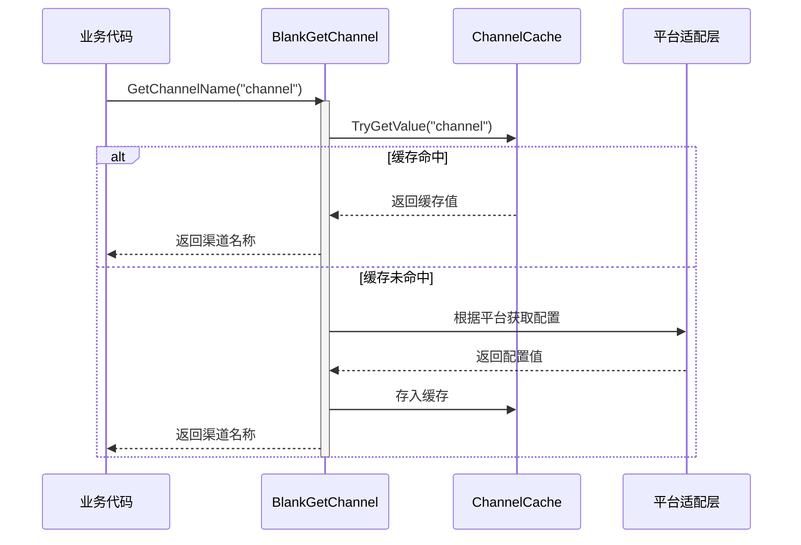

# 概要

Unity Get Channel は用于在 Unity プロジェクト中取得多プラットフォーム分发渠道号的プラグイン，サポート iOS、tvOS、visionOS、Android、Editor、PC（Windows/Mac/Linux）、WebGL、UWP および主流游戏主机プラットフォーム（PS4、PS5、Xbox One、Nintendo Switch）。该プラグイン是 GameFrameX プロジェクト的重要な组成部分，为游戏開発者提供します統一された的渠道情報取得解決策。

## プロジェクト背景

在游戏分发过程中，開発者通常〜する必要があります针对不同的发行渠道（如 App Store、Google Play、国内安卓市场等）設定不同的渠道标识符。传统做法是为每个プラットフォーム编写独立的渠道取得逻辑，导致コード重复和维护困难。Unity Get Channel プラグイン通过抽象化的設計，将各プラットフォーム的渠道取得逻辑統一されたカプセル化，開発者只需呼び出し一个シンプル的 API つまり可取得当前プラットフォーム的渠道情報，大大簡素化了多渠道游戏設定的工作量。

## コア機能

本プラグイン提供以下コア機能：

- **多プラットフォーム統一されたインターフェース**：通过 `BlankGetChannel.GetChannelName()` メソッド，在任何サポート的プラットフォーム上取得渠道情報，无需编写プラットフォーム特定コード。
- **多渠道サポート**：サポート取得主渠道和子渠道情報，可根据业务需求柔軟設定多个渠道键。
- **自动設定**：iOS ビルド时自动在 Info.plist 中追加デフォルト渠道設定，无需手动操作。
- **缓存机制**：内置缓存機能，避免重复读取設定ファイル，提高ランタイム性能。
- **コード裁剪保护**：提供 link.xml ファイル，防止关键コード被 Unity コード裁剪機能移除。

## アーキテクチャ設計



如上图所示，该プラグイン采用分层アーキテクチャ設計。应用程序层通过呼び出し API 层的統一されたインターフェース取得渠道情報，プラットフォーム适配层根据当前运行的 Unity プラットフォーム自动选择合适的設定读取方法，缓存层则负责存储已读取的渠道情報以提高后续访问的性能。

## プラットフォーム設定方法

不同プラットフォーム取得渠道情報的設定方法各不相同，以下是各プラットフォーム的設定概要：



### iOS/tvOS/visionOS プラットフォーム

在 iOS、tvOS 和 visionOS プラットフォーム上，渠道情報存储在应用的 Info.plist ファイル中。プラグイン通过 P/Invoke 呼び出し原生 Objective-C メソッド来读取設定值。ビルド时，もし检测到 Info.plist 中尚未設定渠道情報，系统会自动追加键为 "channel"、值为 "default" 的デフォルト条目。

### Android プラットフォーム

在 Android プラットフォーム上，渠道情報通过 AndroidManifest.xml ファイル中的 `<meta-data>` 标签定義。プラグイン使用 Unity 的 AndroidJavaClass 呼び出し Android 原生メソッド取得这些設定值。

### Editor/PC/WebGL/UWP/主机プラットフォーム

对于 Editor、PC、WebGL、UWP および游戏主机プラットフォーム，プラグイン从 Unity プロジェクト Resources ファイル夹下的 `application_config.txt` 文本ファイル中读取渠道設定。这种設計允许開発者在エディタ環境和其他デスクトッププラットフォーム上进行テスト和デバッグ。

## ワークフロー



首次呼び出し渠道取得メソッド时，プラグイン会確認缓存是否存在对应键名。もし缓存命中，直接返す缓存值以提高性能；もし缓存未命中，则根据当前 Unity プラットフォーム呼び出し相应的プラットフォーム适配层取得設定，并将結果存入缓存供后续使用。

## 快速使用

在您的 C# 脚本中，只需一行コードつまり可取得渠道情報：

```csharp
using UnityEngine;

public class GameStartup : MonoBehaviour
{
    void Start()
    {
        // 获取默认渠道（键名为 "channel"）
        string channel = BlankGetChannel.GetChannelName();
        Debug.Log("当前渠道: " + channel);

        // 获取自定义键名的渠道
        string customChannel = BlankGetChannel.GetChannelName("channelName");
        Debug.Log("自定义渠道: " + customChannel);

        // 获取渠道并指定默认值
        string subChannel = BlankGetChannel.GetChannelName("sub_channel", "unknown");
        Debug.Log("子渠道: " + subChannel);
    }
}
```

> Source: [BlankGetChannel.cs](https://github.com/GameFrameX/com.gameframex.unity.getchannel/blob/main/Runtime/BlankGetChannel.cs#L84-L96)

## プロジェクト结构

```
com.gameframex.unity.getchannel/
├── Editor/
│   └── PostProcessBuildHandler.cs    # iOS 构建后处理器
├── Runtime/
│   └── BlankGetChannel.cs            # 核心渠道获取类
├── Sample~/
│   └── BlankGetChannelExample.cs     # 使用示例
├── README.md                          # 英文文档
├── README.zh-CN.md                    # 简体中文文档
└── LICENSE.md                        # 许可证
```

コアコード位于 `Runtime/BlankGetChannel.cs` ファイル中，パッケージ含静态メソッド `GetChannelName()` 的完全な実装。`Editor/PostProcessBuildHandler.cs` 负责 iOS ビルド时的自动設定，而 `Sample~/BlankGetChannelExample.cs` 提供しますシンプル的使用例。

## 関連リンク

- [インストールガイド](./2-installation) - 理解する如何将プラグイン追加到您的 Unity プロジェクト
- [快速开始](./3-getting-started) - 快速上手使用本プラグイン
- [プラットフォーム設定](./4-platform-configuration) - 各プラットフォーム的詳細設定メソッド
- [例コード](./5-samples) - 更多使用例
- [API リファレンス](./6-api-reference) - 完全な的 API メソッド説明
- [常见問題](./7-troubleshooting) - 常见問題解答
- [GitHub リポジトリ](https://github.com/GameFrameX/com.gameframex.unity.getchannel) - 確認最新バージョン
