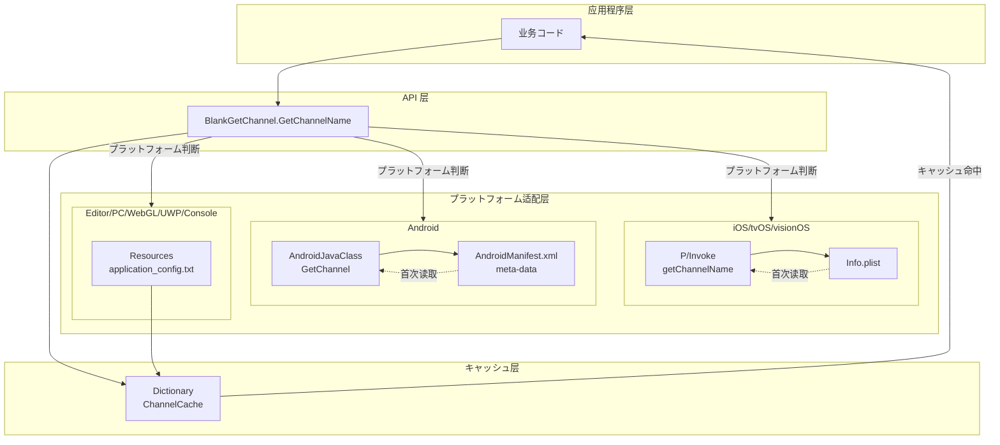
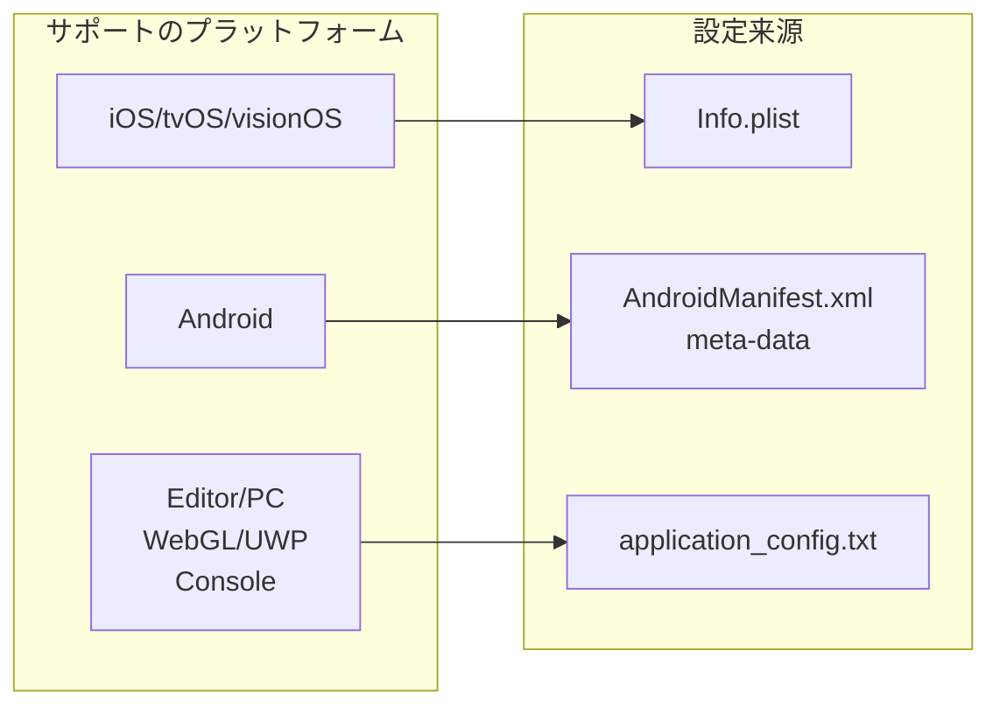
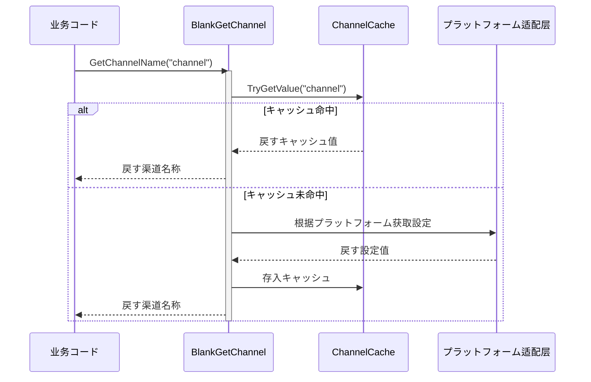

# 

Unity Get Channel はにに Unity プロジェクトプラットフォームの，サポート iOS、tvOS、visionOS、Android、Editor、PC（Windows/Mac/Linux）、WebGL、UWP ゲームプラットフォーム（PS4、PS5、Xbox One、Nintendo Switch）。は GameFrameX プロジェクトの，ゲームたの。

## プロジェクト

にゲーム，の（ App Store、Google Play、）の。はプラットフォームの，コードと。Unity Get Channel をじての，プラットフォームの，びしシンプルの API プラットフォームの，たゲームの。

## コア

コア：

- **プラットフォームインターフェース**：をじて `BlankGetChannel.GetChannelName()` メソッド，にサポートのプラットフォーム，プラットフォームコード。
- **サポート**：サポートと，。
- ****：iOS ビルドに Info.plist デフォルト，。
- **キャッシュ**：キャッシュ，ファイル，。
- **コード**： link.xml ファイル，コード Unity コード。

## アーキテクチャ



，アーキテクチャ。をじてびし API のインターフェース，プラットフォームの Unity プラットフォームの，キャッシュのの。

## プラットフォーム

プラットフォームの，はプラットフォームの：



### iOS/tvOS/visionOS プラットフォーム

に iOS、tvOS と visionOS プラットフォーム，にの Info.plist ファイル。をじて P/Invoke びし Objective-C メソッド。ビルド， Info.plist ， "channel"、 "default" のデフォルト。

### Android プラットフォーム

に Android プラットフォーム，をじて AndroidManifest.xml ファイルの `<meta-data>` 。 Unity の AndroidJavaClass びし Android メソッド。

### Editor/PC/WebGL/UWP/プラットフォーム

 Editor、PC、WebGL、UWP ゲームプラットフォーム， Unity プロジェクト Resources ファイルの `application_config.txt` ファイル。にエディターとプラットフォームテストとデバッグ。

## フロー



びしメソッド，キャッシュはに。キャッシュ，すキャッシュ；キャッシュ， Unity プラットフォームびしのプラットフォーム，キャッシュ。

## 

にの C# ，コード：

```csharp
using UnityEngine;

public class GameStartup : MonoBehaviour
{
    void Start()
    {
        // 获取デフォルト渠道（键名为 "channel"）
        string channel = BlankGetChannel.GetChannelName();
        Debug.Log("当前渠道: " + channel);

        // 获取カスタマイズ键名の渠道
        string customChannel = BlankGetChannel.GetChannelName("channelName");
        Debug.Log("カスタマイズ渠道: " + customChannel);

        // 获取渠道并指定デフォルト值
        string subChannel = BlankGetChannel.GetChannelName("sub_channel", "unknown");
        Debug.Log("子渠道: " + subChannel);
    }
}
```

> Source: [BlankGetChannel.cs](https://github.com/GameFrameX/com.gameframex.unity.getchannel/blob/main/Runtime/BlankGetChannel.cs#L84-L96)

## プロジェクト

```
com.gameframex.unity.getchannel/
├── Editor/
│   └── PostProcessBuildHandler.cs    # iOS ビルド后处理器
├── Runtime/
│   └── BlankGetChannel.cs            # コア渠道获取クラス
├── Sample~/
│   └── BlankGetChannelExample.cs     # 使用例
├── README.md                          # 英文ドキュメント
├── README.zh-CN.md                    # 简体中文ドキュメント
└── LICENSE.md                        # 许可证
```

コアコード `Runtime/BlankGetChannel.cs` ファイル，むメソッド `GetChannelName()` の。`Editor/PostProcessBuildHandler.cs`  iOS ビルドの， `Sample~/BlankGetChannelExample.cs` たシンプルの。

## リンク

- [インストールガイド](./2-installation) - たの Unity プロジェクト
- [クイックスタート](./3-getting-started) - 
- [プラットフォーム](./4-platform-configuration) - プラットフォームのメソッド
- [サンプルコード](./5-samples) - 
- [API リファレンス](./6-api-reference) - の API メソッド
- [よくある](./7-troubleshooting) - よくある
- [GitHub リポジトリ](https://github.com/GameFrameX/com.gameframex.unity.getchannel) - バージョン
