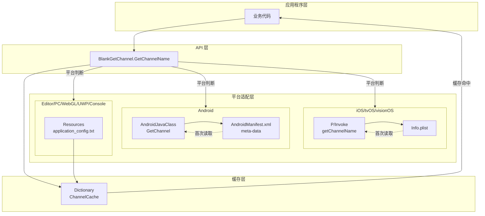
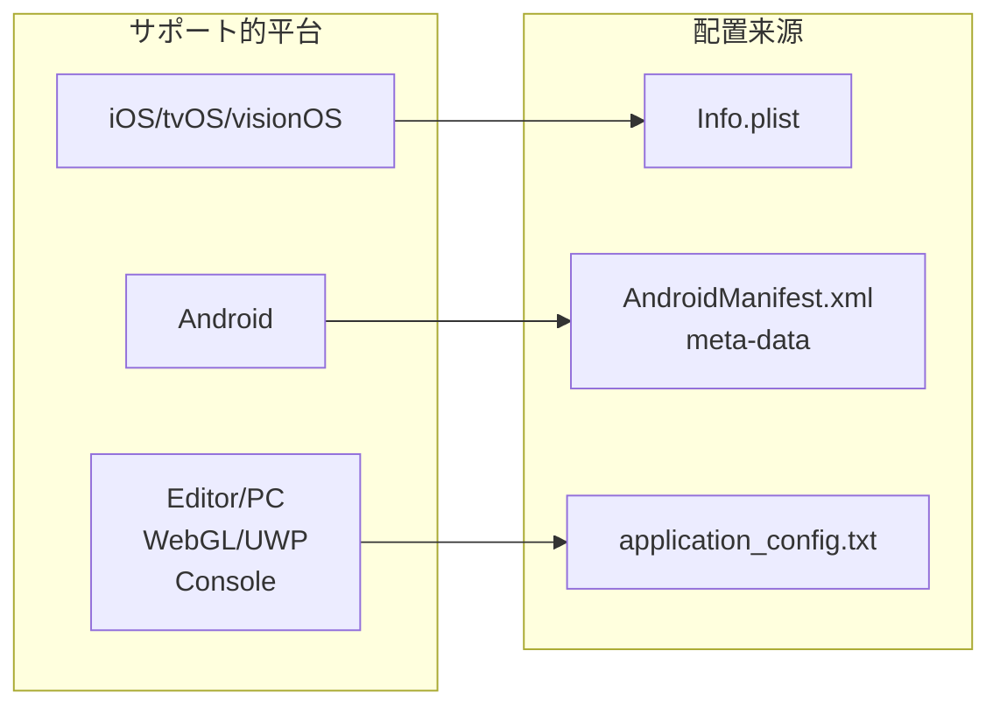
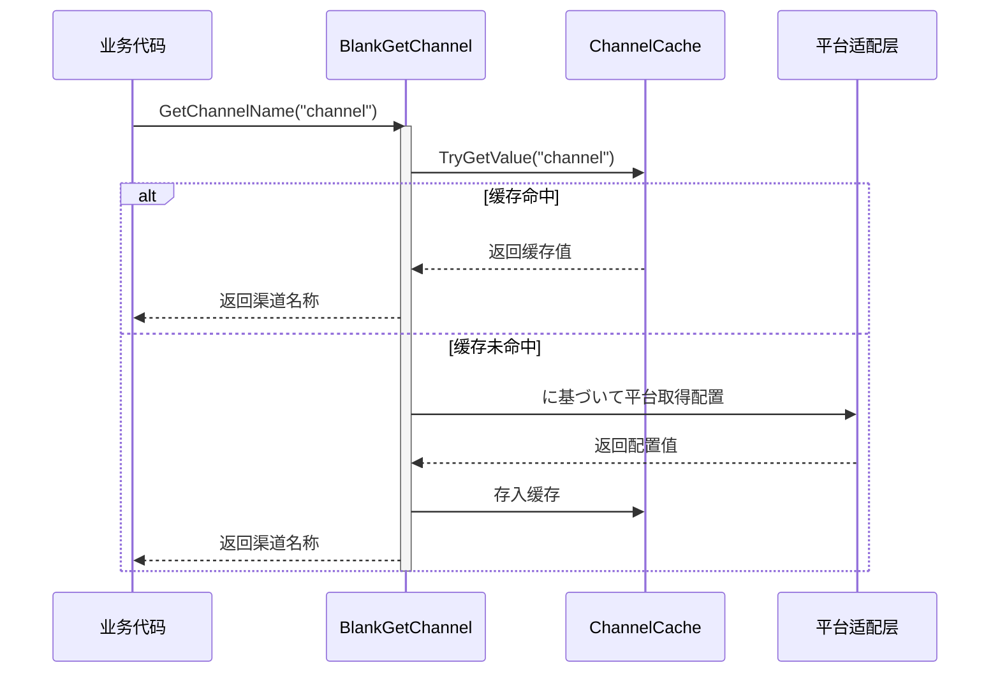

# 概要

Unity Get Channel はに使用在 Unity プロジェクト中取得多平台分发渠道号的插件，サポート iOS、tvOS、visionOS、Android、Editor、PC（Windows/Mac/Linux）、WebGL、UWP 以及主流ゲーム主机平台（PS4、PS5、Xbox One、Nintendo Switch）。该插件是 GameFrameX プロジェクト的重要组成部分，为ゲーム開発者提供します统一的渠道信息取得解決策。

## プロジェクト背景

在ゲーム分发过程中，開発者通常必要针对不同的发行渠道（如 App Store、Google Play、国内安卓市场等）配置不同的渠道标识符。传统做法是为每个平台编写独立的渠道取得逻辑，导致代码重复和维护困难。Unity Get Channel 插件を通じて抽象化的设计，将各平台的渠道取得逻辑统一封装，開発者只需呼び出し一个简单的 API 即可取得当前平台的渠道信息，大大简化了多渠道ゲーム配置的工作量。

## コア機能

本插件提供以下コア機能：

- **多平台统一インターフェース**：を通じて `BlankGetChannel.GetChannelName()` メソッド，在任何サポート的平台上取得渠道信息，无需编写平台特定代码。
- **多渠道サポート**：サポート取得主渠道和子渠道信息，可に基づいてビジネス要件灵活配置多个渠道键。
- **自动配置**：iOS 构建时自动在 Info.plist 中添加默认渠道配置，无需手动操作。
- **缓存机制**：内置缓存機能，避免重复读取配置ファイル，提高运行时性能。
- **代码裁剪保护**：提供 link.xml ファイル，防止关键代码被 Unity 代码裁剪機能移除。

## アーキテクチャ設計



如上图所示，该插件采用分层アーキテクチャ設計。应用程序层を通じて呼び出し API 层的统一インターフェース取得渠道信息，平台适配层に基づいて当前运行的 Unity 平台自动选择合适的配置读取方法，缓存层则负责存储已读取的渠道信息以提高后续访问的性能。

## 平台配置方法

不同平台取得渠道信息的配置方法各不相同，以下是各平台的配置概述：



### iOS/tvOS/visionOS 平台

在 iOS、tvOS 和 visionOS 平台上，渠道信息存储在应用的 Info.plist ファイル中。插件を通じて P/Invoke 呼び出し原生 Objective-C メソッド来读取配置值。构建时，如果检测到 Info.plist 中尚未配置渠道信息，系统会自动添加键为 "channel"、值为 "default" 的默认条目。

### Android 平台

在 Android 平台上，渠道信息を通じて AndroidManifest.xml ファイル内の `<meta-data>` 标签定义。插件使用 Unity 的 AndroidJavaClass 呼び出し Android 原生メソッド取得这些配置值。

### Editor/PC/WebGL/UWP/主机平台

对于 Editor、PC、WebGL、UWP 以及ゲーム主机平台，插件从 Unity プロジェクト Resources ファイル夹下的 `application_config.txt` 文本ファイル中读取渠道配置。这种设计允许開発者在编辑器环境和其他桌面平台上进行测试和调试。

## 工作フロー



首次呼び出し渠道取得メソッド时，插件会检查缓存是否存在对应键名。如果缓存命中，直接返回缓存值以提高性能；如果缓存未命中，则に基づいて当前 Unity 平台呼び出し相应的平台适配层取得配置，并将结果存入缓存供后续使用。

## 快速使用

在您的 C# 脚本中，只需一行代码即可取得渠道信息：

```csharp
using UnityEngine;

public class GameStartup : MonoBehaviour
{
    void Start()
    {
        // 取得默认渠道（键名为 "channel"）
        string channel = BlankGetChannel.GetChannelName();
        Debug.Log("当前渠道: " + channel);

        // 取得自定义键名的渠道
        string customChannel = BlankGetChannel.GetChannelName("channelName");
        Debug.Log("自定义渠道: " + customChannel);

        // 取得渠道并指定默认值
        string subChannel = BlankGetChannel.GetChannelName("sub_channel", "unknown");
        Debug.Log("子渠道: " + subChannel);
    }
}
```

> Source: [BlankGetChannel.cs](https://github.com/GameFrameX/com.gameframex.unity.getchannel/blob/main/Runtime/BlankGetChannel.cs#L84-L96)

## プロジェクト结构

```
com.gameframex.unity.getchannel/
├── Editor/
│   └── PostProcessBuildHandler.cs    # iOS 构建后处理器
├── Runtime/
│   └── BlankGetChannel.cs            # コア渠道取得クラス
├── Sample~/
│   └── BlankGetChannelExample.cs     # 使用例
├── README.md                          # 英文文档
├── README.zh-CN.md                    # 简体中文文档
└── LICENSE.md                        # 许可证
```

コア代码位于 `Runtime/BlankGetChannel.cs` ファイル中，包含静态メソッド `GetChannelName()` 的完整実装。`Editor/PostProcessBuildHandler.cs` 负责 iOS 构建时的自动配置，而 `Sample~/BlankGetChannelExample.cs` 提供します简单的使用示例。

## 関連リンク

- [安装指南](./2-installation) - 了解如何将插件添加到您的 Unity プロジェクト
- [快速开始](./3-getting-started) - 快速上手使用本插件
- [平台配置](./4-platform-configuration) - 各平台的详细配置メソッド
- [示例代码](./5-samples) - 更多使用示例
- [API 参考](./6-api-reference) - 完整的 API メソッド説明
- [常见问题](./7-troubleshooting) - 常见问题解答
- [GitHub 仓库](https://github.com/GameFrameX/com.gameframex.unity.getchannel) - 查看最新版本
