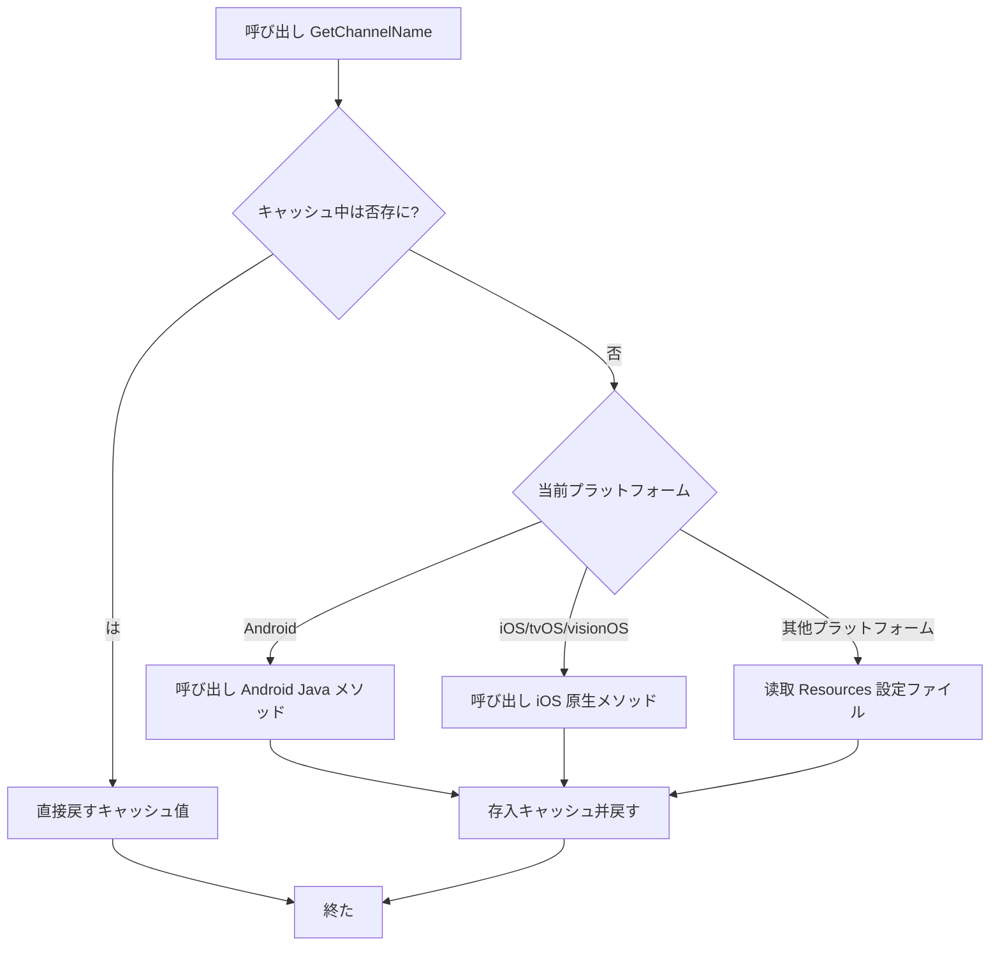

# クイックスタート

 GameFrameX Get Channel ，に Unity プロジェクトプラットフォーム。

## 

GameFrameX Get Channel はの Unity ，ににゲーム。のプロジェクトは iOS、Android，は PC、WebGL プラットフォーム，の API ，プラットフォームのコード。

**シーン：**
- の
- のゲームリソース
- 、テスト、
- データプラットフォーム

## コア

コア：

|  |  |
|------|------|
| プラットフォーム API | ，プラットフォーム |
| キャッシュ | キャッシュ， IO |
| iOS  | ビルドデフォルト（） |
| コード | む link.xml， Unity コード |

## 

### ：インストール

プロジェクトの `Packages/manifest.json` ：

```json
{
  "dependencies": {
    "com.gameframex.unity.getchannel": "https://github.com/gameframex/com.gameframex.unity.getchannel.git"
  }
}
```

> ****：のインストール [インストール](./2-installation) ドキュメント。

### ：

のプラットフォーム，に：

| プラットフォーム | ファイル |  |
|----------|----------|----------|
| iOS / tvOS / visionOS | Info.plist |  `channel`  |
| Android | AndroidManifest.xml | に application  meta-data |
| Editor / PC / WebGL / UWP | Resources/application_config.txt | ファイル， `key=value` |

**メソッド [プラットフォーム](./4-platform-configuration) ドキュメント。**

### ：びし API 

に C# びし `BlankGetChannel.GetChannelName()` メソッド：

```csharp
using UnityEngine;

public class ChannelDemo : MonoBehaviour
{
    void Start()
    {
        // 使用デフォルトパラメータ（key="channel"，デフォルト值="default"）
        string channel = BlankGetChannel.GetChannelName();
        Debug.Log("当前渠道号: " + channel);

        // カスタマイズ键名
        string customChannel = BlankGetChannel.GetChannelName("channelName");
        Debug.Log("カスタマイズ渠道号: " + customChannel);

        // 指定デフォルト值（当設定不存に时戻す）
        string subChannel = BlankGetChannel.GetChannelName("sub_channel", "unknown");
        Debug.Log("子渠道号: " + subChannel);
    }
}
```
> Source: [Runtime/BlankGetChannel.cs](https://github.com/GameFrameX/com.gameframex.unity.getchannel/blob/main/Runtime/BlankGetChannel.cs#L88-L96)

### ：

に Unity エディターゲーム（ Editor プラットフォーム），ビルドプラットフォーム，ログは。

## 

びし `GetChannelName()` メソッド，フロー：



**：**
- **キャッシュ**： `Dictionary<string, string>` の，びしファイル，
- **プラットフォーム**：をじて Unity （`UNITY_ANDROID`、`UNITY_IOS` ）プラットフォーム
- **デフォルト**：のに，すびしのデフォルト，

## 

はの MonoBehaviour ，にゲーム：

```csharp
using UnityEngine;

public class GameInitializer : MonoBehaviour
{
    private string channelId;
    private string subChannel;

    void Awake()
    {
        // 获取主渠道
        channelId = BlankGetChannel.GetChannelName("channel", "default");

        // 获取子渠道（オプション）
        subChannel = BlankGetChannel.GetChannelName("sub_channel", "none");

        Debug.Log($"[GameInitializer] 渠道: {channelId}, 子渠道: {subChannel}");

        // 根据渠道ロード不同設定
        InitializeForChannel(channelId);
    }

    void InitializeForChannel(string channel)
    {
        // 这里可能根据渠道做不同の初始化逻辑
        switch (channel)
        {
            case "ios_cn_taptap":
                Debug.Log("检测到 TapTap iOS 渠道");
                break;
            case "android_cn_taptap":
                Debug.Log("检测到 TapTap Android 渠道");
                break;
            default:
                Debug.Log($"检测到デフォルト/其他渠道: {channel}");
                break;
        }
    }
}
```
> Source: [Sample~/BlankGetChannelExample.cs](https://github.com/GameFrameX/com.gameframex.unity.getchannel/blob/main/Sample~/BlankGetChannelExample.cs#L1-L15)

## 

1. ****：コードのとプラットフォームファイルの
2. **Android コード**：Android プラットフォームプロジェクト `com.alianhome.getchannel` モジュール（む）
3. **iOS Info.plist**：ビルド iOS ，，デフォルト `channel=default`

## リンク

- [インストールガイド](./2-installation) - のインストールメソッド
- [プラットフォーム](./4-platform-configuration) - プラットフォーム
- [プロジェクト](./5-samples) - 
- [API リファレンス](./6-api-reference) - の API メソッド
- [よくある](./7-troubleshooting) - よくあると
