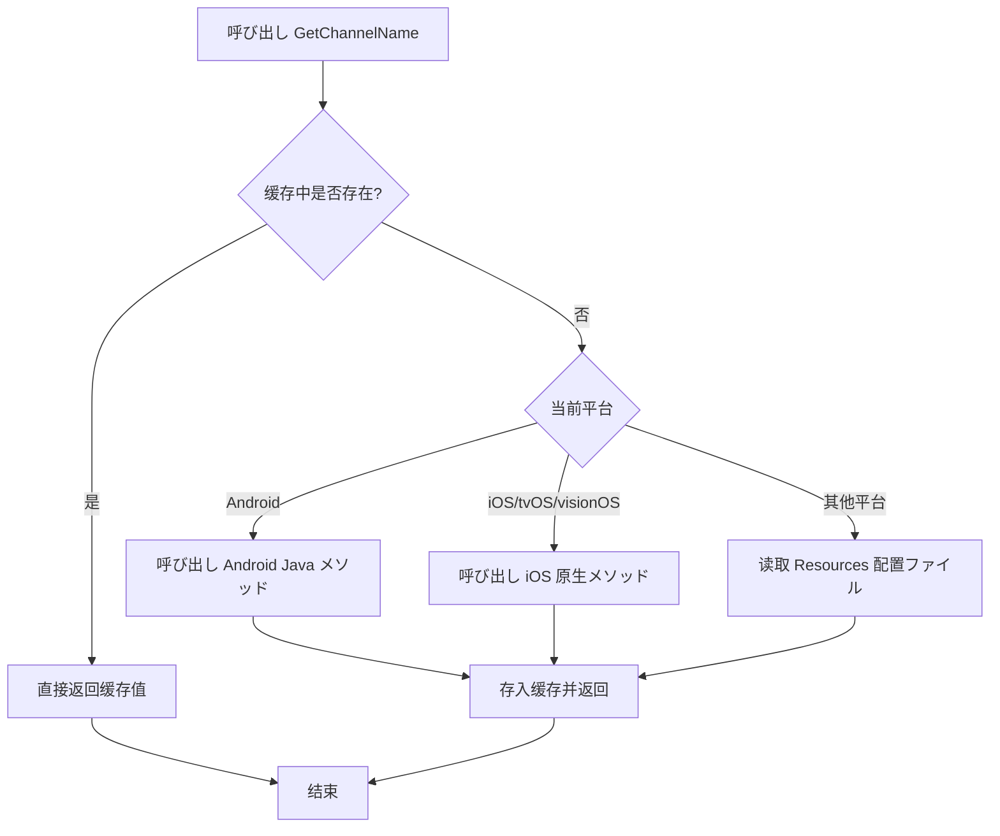

# 快速开始

本节将帮助您快速上手使用 GameFrameX Get Channel 插件，在 Unity プロジェクト中取得多平台渠道号。

## 概要

GameFrameX Get Channel は轻量级的 Unity 插件，专门に使用在ゲーム或应用分发时取得渠道标识信息。无论您的プロジェクト是发布到 iOS、Android，还是 PC、WebGL 等平台，都可能使用统一的 API 取得渠道号，无需编写平台特定的代码。

**典型使用シーン：**
- 统计不同应用商店渠道的用户数量
- 针对不同渠道配置不同的ゲームリソース
- 区分正式服、测试服、内部渠道
- 接入第三方数据分析平台时传递渠道信息

## コア機能

该插件提供以下コア能力：

| 機能 | 説明 |
|------|------|
| 多平台统一 API | 一次编写，多平台运行 |
| 自动缓存机制 | 首次读取后缓存结果，避免重复 IO |
| iOS 自动配置 | 构建时自动添加默认渠道（若未配置） |
| 代码裁剪保护 | 包含 link.xml，防止 Unity 代码裁剪 |

## 基本用法

### 第一步：安装插件

将以下依赖添加到您プロジェクト的 `Packages/manifest.json` 中：

```json
{
  "dependencies": {
    "com.gameframex.unity.getchannel": "https://github.com/gameframex/com.gameframex.unity.getchannel.git"
  }
}
```

> **ヒント**：详细的安装説明お願いします参阅 [安装](./2-installation) 文档。

### 第二步：配置渠道信息

に基づいて您的目标平台，在对应位置配置渠道信息：

| 目标平台 | 配置ファイル | 配置方法 |
|----------|----------|----------|
| iOS / tvOS / visionOS | Info.plist | 添加 `channel` 键值对 |
| Android | AndroidManifest.xml | 在 application 标签添加 meta-data |
| Editor / PC / WebGL / UWP | Resources/application_config.txt | 作成文本ファイル，每行 `key=value` |

**详细配置メソッドお願いします参阅 [平台配置](./4-platform-configuration) 文档。**

### 第三步：呼び出し API 取得渠道号

在任意 C# 脚本中呼び出し `BlankGetChannel.GetChannelName()` メソッド：

```csharp
using UnityEngine;

public class ChannelDemo : MonoBehaviour
{
    void Start()
    {
        // 使用默认参数（key="channel"，默认值="default"）
        string channel = BlankGetChannel.GetChannelName();
        Debug.Log("当前渠道号: " + channel);

        // 自定义键名
        string customChannel = BlankGetChannel.GetChannelName("channelName");
        Debug.Log("自定义渠道号: " + customChannel);

        // 指定默认值（当配置不存在时返回）
        string subChannel = BlankGetChannel.GetChannelName("sub_channel", "unknown");
        Debug.Log("子渠道号: " + subChannel);
    }
}
```
> Source: [Runtime/BlankGetChannel.cs](https://github.com/GameFrameX/com.gameframex.unity.getchannel/blob/main/Runtime/BlankGetChannel.cs#L88-L96)

### 第四步：运行并验证

在 Unity 编辑器中运行ゲーム（使用 Editor 平台），或者构建到目标平台，检查日志输出是否正确显示渠道号。

## 工作原理

当您呼び出し `GetChannelName()` メソッド时，插件会按照以下フロー取得渠道信息：



**关键设计説明：**
- **缓存机制**：使用 `Dictionary<string, string>` 存储已读取的渠道信息，避免每次呼び出し都读取配置ファイル，提高性能
- **平台判断**：を通じて Unity 预处理器指令（`UNITY_ANDROID`、`UNITY_IOS` 等）判断当前平台
- **默认值保护**：当指定的键不存在时，返回呼び出し方指定的默认值，确保程序正常运行

## 完整示例

以下は完整的 MonoBehaviour 示例，展示如何在ゲーム启动时取得并使用渠道信息：

```csharp
using UnityEngine;

public class GameInitializer : MonoBehaviour
{
    private string channelId;
    private string subChannel;

    void Awake()
    {
        // 取得主渠道
        channelId = BlankGetChannel.GetChannelName("channel", "default");

        // 取得子渠道（可选）
        subChannel = BlankGetChannel.GetChannelName("sub_channel", "none");

        Debug.Log($"[GameInitializer] 渠道: {channelId}, 子渠道: {subChannel}");

        // に基づいて渠道加载不同配置
        InitializeForChannel(channelId);
    }

    void InitializeForChannel(string channel)
    {
        // 这里可能に基づいて渠道做不同の初期化論理
        switch (channel)
        {
            case "ios_cn_taptap":
                Debug.Log("检测到 TapTap iOS 渠道");
                break;
            case "android_cn_taptap":
                Debug.Log("检测到 TapTap Android 渠道");
                break;
            default:
                Debug.Log($"检测到默认/其他渠道: {channel}");
                break;
        }
    }
}
```
> Source: [Sample~/BlankGetChannelExample.cs](https://github.com/GameFrameX/com.gameframex.unity.getchannel/blob/main/Sample~/BlankGetChannelExample.cs#L1-L15)

## 注意事项

1. **键名一致性**：确保代码中使用的键名与平台配置ファイル内の键名完全一致
2. **Android 原生代码**：Android 平台必要确保プロジェクト中已集成 `com.alianhome.getchannel` 原生模块（插件包中已包含）
3. **iOS Info.plist**：首次构建 iOS 时，若未手动配置，插件会自动添加默认渠道 `channel=default`

## 関連リンク

- [安装指南](./2-installation) - 详细的插件安装メソッド
- [平台配置](./4-platform-configuration) - 各平台详细配置説明
- [示例プロジェクト](./5-samples) - 更多使用示例
- [API 参考](./6-api-reference) - 完整的 API メソッド説明
- [常见问题](./7-troubleshooting) - 常见问题与解決策
