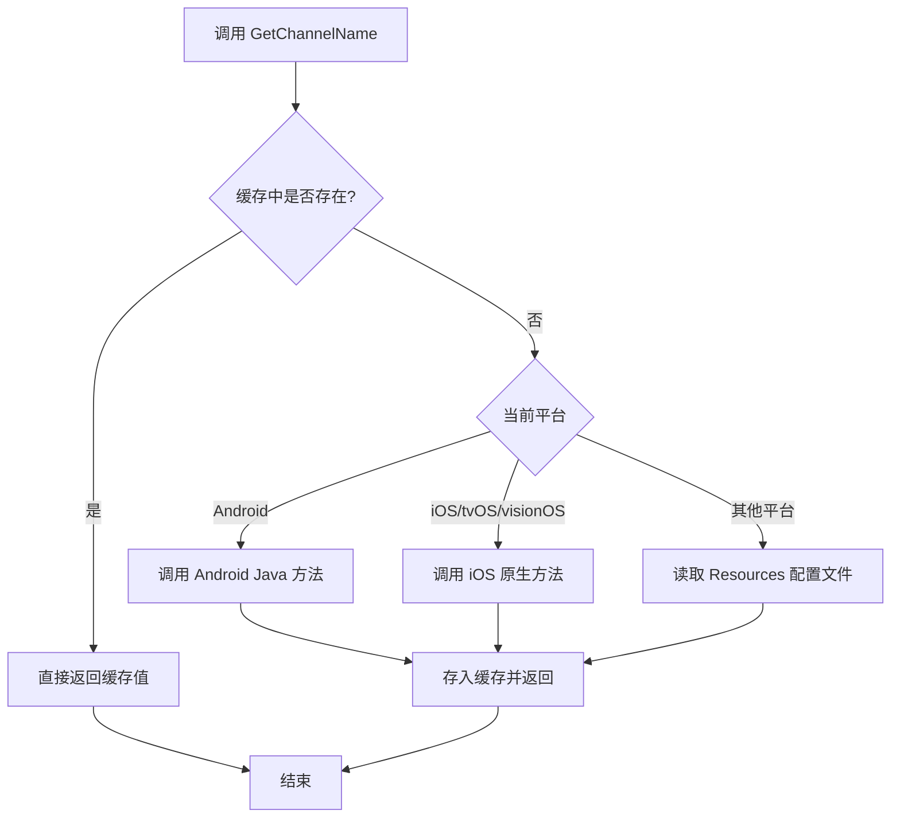

# クイックスタート

本节将帮助您快速上手使用 GameFrameX Get Channel プラグイン，在 Unity プロジェクト中取得多プラットフォーム渠道号。

## 概要

GameFrameX Get Channel は轻量级的 Unity プラグイン，专门用于在游戏或应用分发时取得渠道标识情報。无论您的プロジェクト是リリース到 iOS、Android，还是 PC、WebGL 等プラットフォーム，都〜できます使用統一された的 API 取得渠道号，无需编写プラットフォーム特定的コード。

**典型使用シーン：**
- 统计不同应用商店渠道的ユーザー数量
- 针对不同渠道設定不同的游戏リソース
- 区分正式服、テスト服、内部渠道
- 接入第3方数据分析プラットフォーム时传递渠道情報

## コア機能

该プラグイン提供以下コア能力：

| 機能 | 説明 |
|------|------|
| 多プラットフォーム統一された API | 一次编写，多プラットフォーム运行 |
| 自动缓存机制 | 首次读取后缓存結果，避免重复 IO |
| iOS 自动設定 | ビルド时自动追加デフォルト渠道（若未設定） |
| コード裁剪保护 | パッケージ含 link.xml，防止 Unity コード裁剪 |

## 基本用法

### 第1步：インストールプラグイン

将以下依赖追加到您プロジェクト的 `Packages/manifest.json` 中：

```json
{
  "dependencies": {
    "com.gameframex.unity.getchannel": "https://github.com/gameframex/com.gameframex.unity.getchannel.git"
  }
}
```

> **ヒント**：詳細的インストール説明请参照 [インストール](./2-installation) ドキュメント。

### 第2步：設定渠道情報

根据您的目标プラットフォーム，在对应位置設定渠道情報：

| 目标プラットフォーム | 設定ファイル | 設定方法 |
|----------|----------|----------|
| iOS / tvOS / visionOS | Info.plist | 追加 `channel` 键值对 |
| Android | AndroidManifest.xml | 在 application 标签追加 meta-data |
| Editor / PC / WebGL / UWP | Resources/application_config.txt | 作成文本ファイル，每行 `key=value` |

**詳細設定メソッド请参照 [プラットフォーム設定](./4-platform-configuration) ドキュメント。**

### 第3步：呼び出し API 取得渠道号

在任意 C# 脚本中呼び出し `BlankGetChannel.GetChannelName()` メソッド：

```csharp
using UnityEngine;

public class ChannelDemo : MonoBehaviour
{
    void Start()
    {
        // 使用默认参数（key="channel"，默认值="default"）
        string channel = BlankGetChannel.GetChannelName();
        Debug.Log("当前渠道号: " + channel);

        // 自定义键名
        string customChannel = BlankGetChannel.GetChannelName("channelName");
        Debug.Log("自定义渠道号: " + customChannel);

        // 指定默认值（当配置不存在时返回）
        string subChannel = BlankGetChannel.GetChannelName("sub_channel", "unknown");
        Debug.Log("子渠道号: " + subChannel);
    }
}
```
> Source: [Runtime/BlankGetChannel.cs](https://github.com/GameFrameX/com.gameframex.unity.getchannel/blob/main/Runtime/BlankGetChannel.cs#L88-L96)

### 第4步：运行并検証

在 Unity エディタ中运行游戏（使用 Editor プラットフォーム），またはビルド到目标プラットフォーム，確認ログ输出是否正确显示渠道号。

## 工作原理

当您呼び出し `GetChannelName()` メソッド时，プラグイン会按照以下フロー取得渠道情報：



**关键設計説明：**
- **缓存机制**：使用 `Dictionary<string, string>` 存储已读取的渠道情報，避免每次呼び出し都读取設定ファイル，提高性能
- **プラットフォーム判断**：通过 Unity 预処理器指令（`UNITY_ANDROID`、`UNITY_IOS` 等）判断当前プラットフォーム
- **デフォルト值保护**：当指定的键不存在时，返コールバック用方指定的デフォルト值，確認してください程序正常运行

## 完全な例

以下は完全な的 MonoBehaviour 例，表示如何在游戏启动时取得并使用渠道情報：

```csharp
using UnityEngine;

public class GameInitializer : MonoBehaviour
{
    private string channelId;
    private string subChannel;

    void Awake()
    {
        // 获取主渠道
        channelId = BlankGetChannel.GetChannelName("channel", "default");

        // 获取子渠道（可选）
        subChannel = BlankGetChannel.GetChannelName("sub_channel", "none");

        Debug.Log($"[GameInitializer] 渠道: {channelId}, 子渠道: {subChannel}");

        // 根据渠道加载不同配置
        InitializeForChannel(channelId);
    }

    void InitializeForChannel(string channel)
    {
        // 这里可以根据渠道做不同的初始化逻辑
        switch (channel)
        {
            case "ios_cn_taptap":
                Debug.Log("检测到 TapTap iOS 渠道");
                break;
            case "android_cn_taptap":
                Debug.Log("检测到 TapTap Android 渠道");
                break;
            default:
                Debug.Log($"检测到默认/其他渠道: {channel}");
                break;
        }
    }
}
```
> Source: [Sample~/BlankGetChannelExample.cs](https://github.com/GameFrameX/com.gameframex.unity.getchannel/blob/main/Sample~/BlankGetChannelExample.cs#L1-L15)

## 注意事项

1. **键名一致性**：確認してくださいコード中使用的键名与プラットフォーム設定ファイル中的键名完全一致
2. **Android 原生コード**：Android プラットフォーム〜する必要があります確認してくださいプロジェクト中已集成 `com.alianhome.getchannel` 原生モジュール（プラグインパッケージ中已パッケージ含）
3. **iOS Info.plist**：首次ビルド iOS 时，若未手动設定，プラグイン会自动追加デフォルト渠道 `channel=default`

## 関連リンク

- [インストールガイド](./2-installation) - 詳細的プラグインインストールメソッド
- [プラットフォーム設定](./4-platform-configuration) - 各プラットフォーム詳細設定説明
- [例プロジェクト](./5-samples) - 更多使用例
- [API リファレンス](./6-api-reference) - 完全な的 API メソッド説明
- [常见問題](./7-troubleshooting) - 常见問題与解決策
