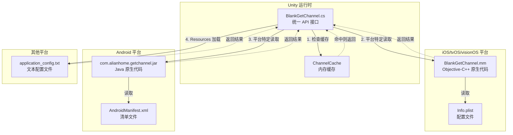
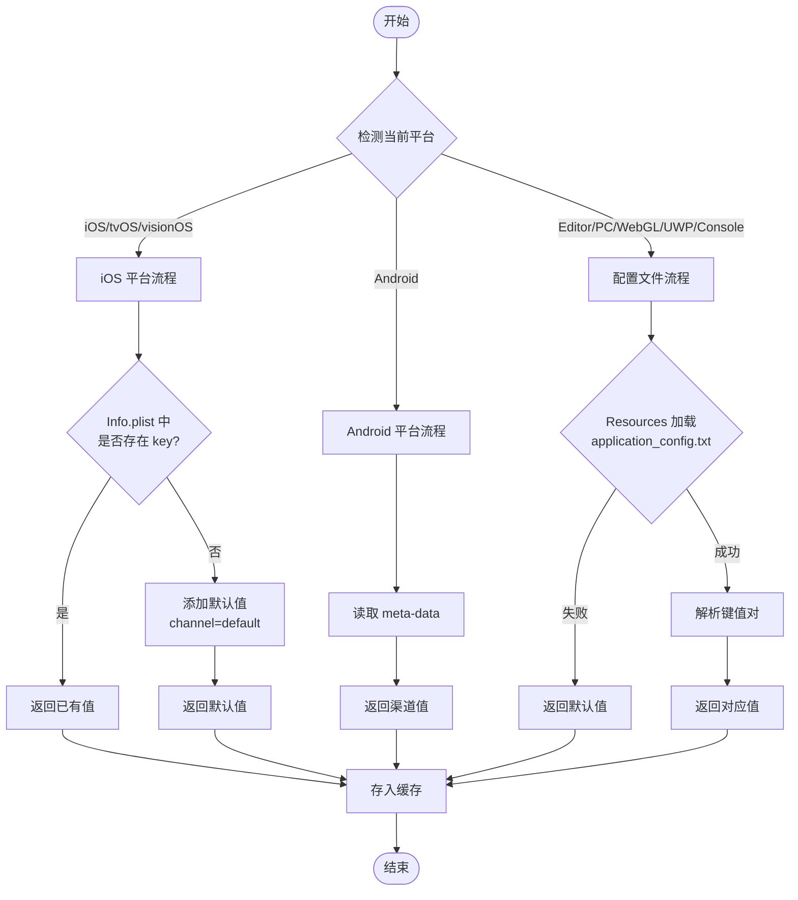
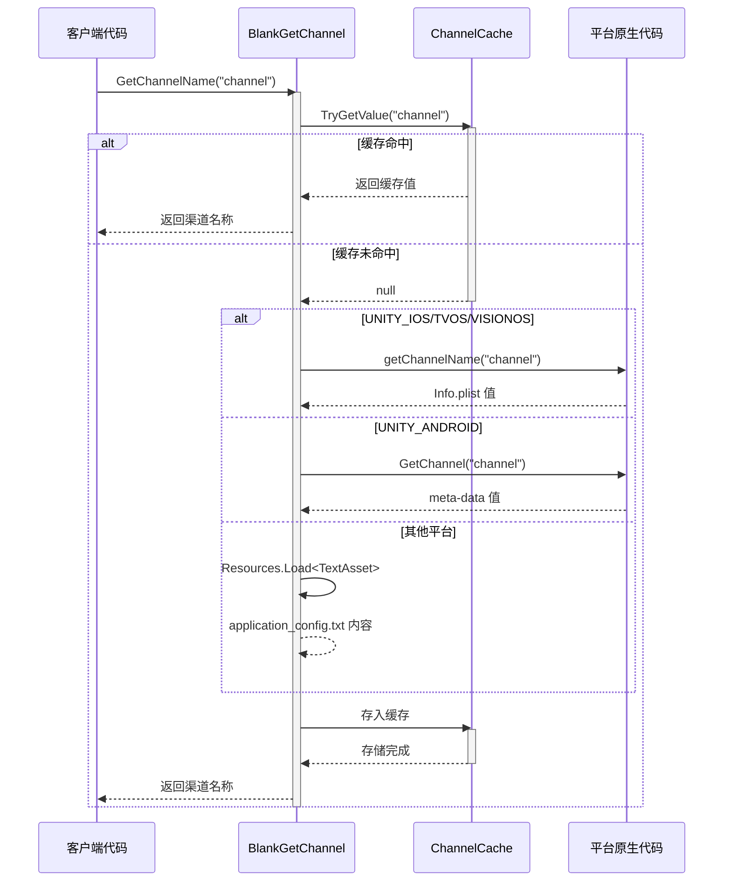

# プラットフォーム設定

本章节詳細介绍 GameFrameX GetChannel プラグイン在不同プラットフォーム上的設定メソッド，含みます iOS/tvOS/visionOS、Android、Editor、PC、WebGL、UWP 和主机プラットフォーム（PS4、PS5、Xbox One、Nintendo Switch）的設定ファイル設定。

## 概要

GameFrameX GetChannel プラグイン通过統一された的 API インターフェース取得各プラットフォーム的渠道情報。为了実装跨プラットフォームサポート，每个プラットフォーム都有其特定的数据来源和读取方法：

| プラットフォーム | 設定源 | 读取方法 |
|------|--------|----------|
| iOS/tvOS/visionOS | Info.plist | 原生 Objective-C++ メソッド呼び出し |
| Android | AndroidManifest.xml | Android Java 反射呼び出し |
| Editor/PC/WebGL/UWP/Console | application_config.txt | Unity Resources ロード |

## アーキテクチャ設計



### コンポーネント説明

| コンポーネント | 位置 | 职责 |
|------|------|------|
| BlankGetChannel | Runtime/BlankGetChannel.cs | 提供統一された的 C# API，管理缓存和プラットフォームブランチ |
| PostProcessBuildHandler | Editor/PostProcessBuildHandler.cs | iOS ビルド后自动追加デフォルト渠道設定 |
| BlankGetChannel.mm | Plugins/iOS/BlankGetChannel/ | iOS プラットフォーム原生実装，读取 Info.plist |
| com.alianhome.getchannel.jar | Plugins/Android/ | Android プラットフォーム原生実装，读取 meta-data |

## iOS/tvOS/visionOS プラットフォーム設定

### Info.plist 設定

在 Xcode プロジェクト的 `Info.plist` ファイル中追加渠道情報。使用 **String** タイプ键值对：

```xml
<!-- 必选：主渠道 -->
<key>channel</key>
<string>ios_cn_taptap</string>

<!-- 可选：子渠道 -->
<key>sub_channel</key>
<string>beta</string>

<!-- 可选：其他自定义键 -->
<key>app_id</key>
<string>123456789</string>
```
> Source: [README.md](https://github.com/GameFrameX/com.gameframex.unity.getchannel/blob/main/README.md#L96-L104)

### 自动デフォルト設定

プラグインパッケージ含ビルド后処理器 `PostProcessBuildHandler.cs`，会在 iOS ビルド时自动执行以下逻辑：

```csharp
// PostProcessBuildHandler.cs 核心逻辑
const string channelKey = "channel";
const string channelValue = "default";

string plistPath = path + "/Info.plist";
PlistDocument plist = new PlistDocument();
plist.ReadFromString(File.ReadAllText(plistPath));
if (!plist.root.values.TryGetValue(channelKey, out var value))
{
    plist.root.SetString(channelKey, channelValue);
    plist.WriteToFile(plistPath);
    Debug.Log("配置渠道成功=>" + channelValue);
}
```
> Source: [PostProcessBuildHandler.cs](https://github.com/GameFrameX/com.gameframex.unity.getchannel/blob/main/Editor/PostProcessBuildHandler.cs#L31-L48)

**自动設定规则：**
- もし `Info.plist` 中**不存在** `channel` 键 → 自动追加 `channel = "default"`
- もし `Info.plist` 中**已存在** `channel` 键 → 跳过変更，保留原值

### iOS 原生実装

iOS プラットフォーム通过 Objective-C++ 実装渠道读取：

```cpp
// Plugins/iOS/BlankGetChannel/BlankGetChannel.mm
char * getChannelName(char * channel_name) {
    NSString* channel_name_String = [NSString stringWithUTF8String:channel_name];
    NSString* File = [[NSBundle mainBundle] pathForResource:@"Info" ofType:@"plist"];
    NSMutableDictionary* dict = [[NSMutableDictionary alloc] initWithContentsOfFile:File];
    NSString * channel_value = [dict objectForKey:channel_name_String];
    if (channel_value != nil) {
        return StringToCharArray(channel_value);
    }
    channel_value = @"unknown";
    return StringToCharArray(channel_value);
}
```
> Source: [BlankGetChannel.mm](https://github.com/GameFrameX/com.gameframex.unity.getchannel/blob/main/Plugins/iOS/BlankGetChannel/BlankGetChannel.mm#L25-L35)

## Android プラットフォーム設定

### AndroidManifest.xml 設定

在 `AndroidManifest.xml` 的 `<application>` 标签内追加 `<meta-data>` 标签：

```xml
<application ...>
    <activity ...>
        <!-- 活动配置 -->
    </activity>

    <!-- 必选：主渠道 -->
    <meta-data
        android:name="channel"
        android:value="android_cn_taptap" />

    <!-- 可选：子渠道 -->
    <meta-data
        android:name="sub_channel"
        android:value="beta" />

    <!-- 可选：其他自定义键 -->
    <meta-data
        android:name="app_id"
        android:value="123456789" />
</application>
```
> Source: [README.md](https://github.com/GameFrameX/com.gameframex.unity.getchannel/blob/main/README.md#L112-L128)

### Android 原生実装

プラグイン内置了 Android 原生 JAR パッケージ (`com.alianhome.getchannel.jar`)，通过 Android Java 反射呼び出し：

```csharp
// BlankGetChannel.cs 中的 Android 读取逻辑
#if UNITY_ANDROID
using (AndroidJavaClass androidJavaClass = new AndroidJavaClass("com.alianhome.getchannel.MainActivity"))
{
    channelName = androidJavaClass.CallStatic<string>("GetChannel", channelKey);
}
#endif
```
> Source: [BlankGetChannel.cs](https://github.com/GameFrameX/com.gameframex.unity.getchannel/blob/main/Runtime/BlankGetChannel.cs#L131-L135)

## Editor/PC/WebGL/UWP/主机プラットフォーム設定

### 設定ファイル作成

在 Unity プロジェクト的 `Assets/Resources` ファイル夹下作成 `application_config.txt` ファイル：

**ファイル位置：** `Assets/Resources/application_config.txt`

**ファイルフォーマット：**
```
# 每行一个键值对，格式为 key=value
# # 开头为注释

# 必选：主渠道
channel=editor_cn_test

# 可选：子渠道
sub_channel=beta

# 可选：其他自定义键
app_id=123456789
```
> Source: [README.md](https://github.com/GameFrameX/com.gameframex.unity.getchannel/blob/main/README.md#L136-L142)

### 读取実装

```csharp
// BlankGetChannel.cs 中的文本配置读取逻辑
var textAsset = Resources.Load<TextAsset>("application_config");
if (textAsset != null)
{
    var lines = textAsset.text.Split(new string[] { "\n", "\r", "\r\n" }, StringSplitOptions.RemoveEmptyEntries);
    foreach (var line in lines)
    {
        var split = line.Split(new string[] { "=" }, StringSplitOptions.RemoveEmptyEntries);
        if (split.Length > 1)
        {
            var key = split[0].Trim();
            var channelValue = split[1].Trim();
            ChannelCache[key] = channelValue;
        }
    }
}
```
> Source: [BlankGetChannel.cs](https://github.com/GameFrameX/com.gameframex.unity.getchannel/blob/main/Runtime/BlankGetChannel.cs#L106-L121)

### サポート的プラットフォーム

此設定方法適しています以下プラットフォーム：

| プラットフォーム | 宏定義 |
|------|--------|
| Unity Editor | `UNITY_EDITOR` |
| Windows PC | `UNITY_STANDALONE_WIN` |
| macOS PC | `UNITY_STANDALONE_OSX` |
| Linux PC | `UNITY_STANDALONE_LINUX` |
| WebGL | `UNITY_WEBGL` |
| UWP/WSA | `UNITY_WSA` |
| PlayStation 4 | `UNITY_PS4` |
| PlayStation 5 | `UNITY_PS5` |
| Xbox One | `UNITY_XBOXONE` |
| Nintendo Switch | `UNITY_SWITCH` |

## 設定フロー图



## 渠道取得フロー



## 設定注意事项

### 键名一致性

**重要な：** 呼び出し `BlankGetChannel.GetChannelName(string key)` 时使用的键名〜しなければなりません与对应プラットフォーム設定ファイル中設定的键名完全一致。

| プラットフォーム | 設定键名 | 读取方法 |
|------|----------|----------|
| iOS/tvOS/visionOS | 区分大小写 | 直接匹配 |
| Android | 区分大小写 | 直接匹配 |
| 文本ファイル | 区分大小写 | 直接匹配 |

### デフォルト值処理

当指定键名不存在时，API 会返すデフォルト值：

```csharp
// 默认参数
BlankGetChannel.GetChannelName();  // key="channel", defaultValue="default"

// 指定默认值
BlankGetChannel.GetChannelName("sub_channel", "unknown");
```
> Source: [BlankGetChannel.cs](https://github.com/GameFrameX/com.gameframex.unity.getchannel/blob/main/Runtime/BlankGetChannel.cs#L98)

### 缓存机制

プラグイン使用内存缓存避免重复读取設定ファイル：

```csharp
private static readonly Dictionary<string, string> ChannelCache = new Dictionary<string, string>(32);
```
> Source: [BlankGetChannel.cs](https://github.com/GameFrameX/com.gameframex.unity.getchannel/blob/main/Runtime/BlankGetChannel.cs#L57)

**缓存特点：**
- 首次呼び出し时读取設定ファイル
- 后续呼び出し直接从内存返す
- 进程结束时缓存破棄
- 不同 key 分别缓存

## プラットフォーム設定快速リファレンス表

| プラットフォーム | 設定ファイル | 键タイプ | 例键值 |
|------|-----------|--------|----------|
| iOS/tvOS/visionOS | Info.plist | String | `<key>channel</key><string>ios_cn_taptap</string>` |
| Android | AndroidManifest.xml | meta-data | `android:name="channel" android:value="android_cn_taptap"` |
| 其他プラットフォーム | application_config.txt | key=value | `channel=editor_cn_test` |

## よくある問題

### Q1: Android プラットフォーム返す "default" 而非实际設定值

**原因：** Android 原生 JAR パッケージ的 Java 类路径〜の可能性があります与实际プロジェクト不匹配。

**解決策：**
- 確認 AndroidManifest.xml 中的 `<meta-data>` 标签是否正确設定在 `<application>` 标签内
- 確認してください `android:name` プロパティ值与コード中传入的键名一致
- 可在 Android Studio 中確認 Logcat 输出確認呼び出し結果

### Q2: iOS ビルド后渠道值为 "unknown"

**原因：** iOS 原生コード读取 Info.plist 失敗或键名不匹配。

**解決策：**
- 確認 Info.plist 中存在对应的键名
- 確認键名大小写是否完全匹配
- 確認 Info.plist 已正确打パッケージ到 Xcode プロジェクト中

### Q3: Editor モード下读取不到設定

**原因：** application_config.txt ファイル位置或フォーマット不正确。

**解決策：**
- 確認してくださいファイル位于 `Assets/Resources/application_config.txt`
- 確認してくださいファイル拡張名为 `.txt` 而非 `.json` 或其他
- 確認ファイル编码，お勧め使用 UTF-8 无 BOM フォーマット
- ファイルフォーマット〜しなければなりません为標準的 `key=value` フォーマット

### Q4: Unity コード裁剪导致取得不到渠道

**原因：** Unity 的 IL2CPP コード裁剪〜の可能性があります移除了プラグイン相关コード。

**解決策：**
- プラグイン已パッケージ含 `link.xml` ファイル防止コード被裁剪
- 如仍有問題，可在プロジェクト的 `link.xml` 中追加：
```xml
<linker>
    <assembly fullname="BlankGetChannel.Runtime" preserve="all"/>
</linker>
```

## 関連リンク

- [快速开始](./3-getting-started) - 快速集成ガイド
- [例](./5-samples) - コード例
- [API リファレンス](./6-api-reference) - 完全な API ドキュメント
- [常见問題](./7-troubleshooting) - 故障排除
- [GitHub リポジトリ](https://github.com/GameFrameX/com.gameframex.unity.getchannel) - 官方リポジトリ
