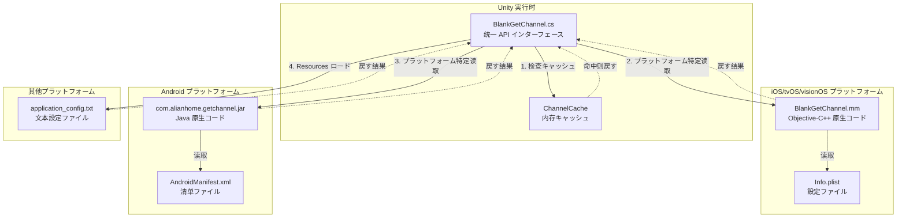
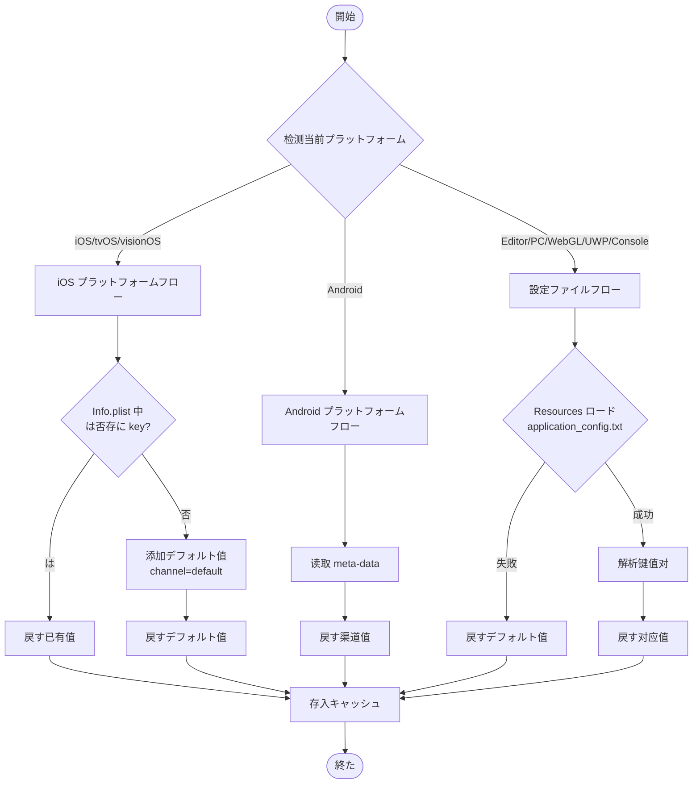
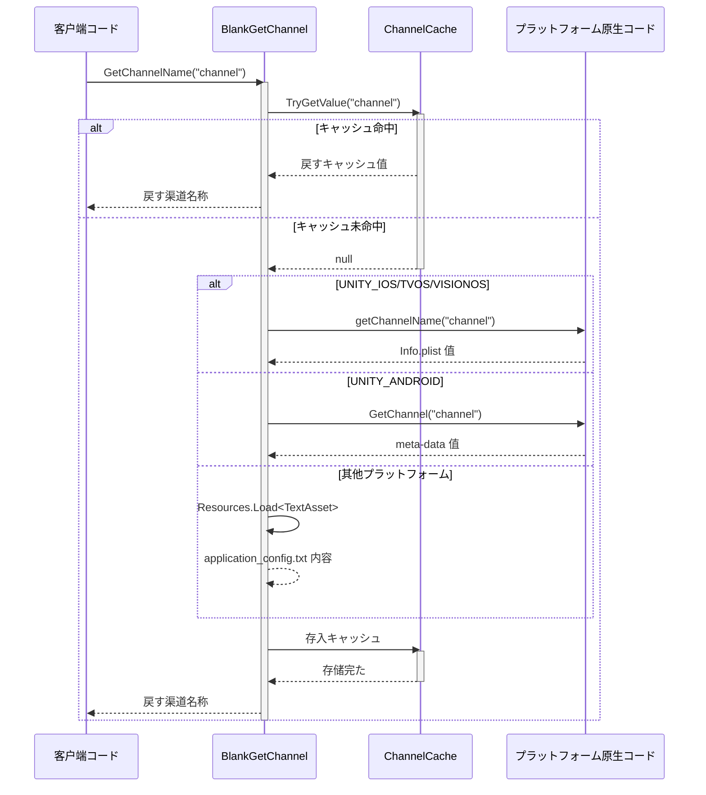

# プラットフォーム

 GameFrameX GetChannel にプラットフォームのメソッド， iOS/tvOS/visionOS、Android、Editor、PC、WebGL、UWP とプラットフォーム（PS4、PS5、Xbox One、Nintendo Switch）のファイル。

## 

GameFrameX GetChannel をじての API インターフェースプラットフォームの。たプラットフォームサポート，プラットフォームのデータと：

| プラットフォーム |  |  |
|------|--------|----------|
| iOS/tvOS/visionOS | Info.plist |  Objective-C++ メソッドびし |
| Android | AndroidManifest.xml | Android Java びし |
| Editor/PC/WebGL/UWP/Console | application_config.txt | Unity Resources ロード |

## アーキテクチャ



### コンポーネント

| コンポーネント |  |  |
|------|------|------|
| BlankGetChannel | Runtime/BlankGetChannel.cs | の C# API，キャッシュとプラットフォーム |
| PostProcessBuildHandler | Editor/PostProcessBuildHandler.cs | iOS ビルドデフォルト |
| BlankGetChannel.mm | Plugins/iOS/BlankGetChannel/ | iOS プラットフォーム， Info.plist |
| com.alianhome.getchannel.jar | Plugins/Android/ | Android プラットフォーム， meta-data |

## iOS/tvOS/visionOS プラットフォーム

### Info.plist 

に Xcode プロジェクトの `Info.plist` ファイル。 **String** タイプ：

```xml
<!-- 必选：主渠道 -->
<key>channel</key>
<string>ios_cn_taptap</string>

<!-- オプション：子渠道 -->
<key>sub_channel</key>
<string>beta</string>

<!-- オプション：其他カスタマイズ键 -->
<key>app_id</key>
<string>123456789</string>
```
> Source: [README.md](https://github.com/GameFrameX/com.gameframex.unity.getchannel/blob/main/README.md#L96-L104)

### デフォルト

むビルド `PostProcessBuildHandler.cs`，に iOS ビルド：

```csharp
// PostProcessBuildHandler.cs コア逻辑
const string channelKey = "channel";
const string channelValue = "default";

string plistPath = path + "/Info.plist";
PlistDocument plist = new PlistDocument();
plist.ReadFromString(File.ReadAllText(plistPath));
if (!plist.root.values.TryGetValue(channelKey, out var value))
{
    plist.root.SetString(channelKey, channelValue);
    plist.WriteToFile(plistPath);
    Debug.Log("設定渠道成功=>" + channelValue);
}
```
> Source: [PostProcessBuildHandler.cs](https://github.com/GameFrameX/com.gameframex.unity.getchannel/blob/main/Editor/PostProcessBuildHandler.cs#L31-L48)

**：**
-  `Info.plist` **に** `channel`  →  `channel = "default"`
-  `Info.plist` **に** `channel`  → ，

### iOS 

iOS プラットフォームをじて Objective-C++ ：

```cpp
// Plugins/iOS/BlankGetChannel/BlankGetChannel.mm
char * getChannelName(char * channel_name) {
    NSString* channel_name_String = [NSString stringWithUTF8String:channel_name];
    NSString* File = [[NSBundle mainBundle] pathForResource:@"Info" ofType:@"plist"];
    NSMutableDictionary* dict = [[NSMutableDictionary alloc] initWithContentsOfFile:File];
    NSString * channel_value = [dict objectForKey:channel_name_String];
    if (channel_value != nil) {
        return StringToCharArray(channel_value);
    }
    channel_value = @"unknown";
    return StringToCharArray(channel_value);
}
```
> Source: [BlankGetChannel.mm](https://github.com/GameFrameX/com.gameframex.unity.getchannel/blob/main/Plugins/iOS/BlankGetChannel/BlankGetChannel.mm#L25-L35)

## Android プラットフォーム

### AndroidManifest.xml 

に `AndroidManifest.xml` の `<application>`  `<meta-data>` ：

```xml
<application ...>
    <activity ...>
        <!-- 活动設定 -->
    </activity>

    <!-- 必选：主渠道 -->
    <meta-data
        android:name="channel"
        android:value="android_cn_taptap" />

    <!-- オプション：子渠道 -->
    <meta-data
        android:name="sub_channel"
        android:value="beta" />

    <!-- オプション：其他カスタマイズ键 -->
    <meta-data
        android:name="app_id"
        android:value="123456789" />
</application>
```
> Source: [README.md](https://github.com/GameFrameX/com.gameframex.unity.getchannel/blob/main/README.md#L112-L128)

### Android 

た Android  JAR  (`com.alianhome.getchannel.jar`)，をじて Android Java びし：

```csharp
// BlankGetChannel.cs 中の Android 读取逻辑
#if UNITY_ANDROID
using (AndroidJavaClass androidJavaClass = new AndroidJavaClass("com.alianhome.getchannel.MainActivity"))
{
    channelName = androidJavaClass.CallStatic<string>("GetChannel", channelKey);
}
#endif
```
> Source: [BlankGetChannel.cs](https://github.com/GameFrameX/com.gameframex.unity.getchannel/blob/main/Runtime/BlankGetChannel.cs#L131-L135)

## Editor/PC/WebGL/UWP/プラットフォーム

### ファイル

に Unity プロジェクトの `Assets/Resources` ファイル `application_config.txt` ファイル：

**ファイル：** `Assets/Resources/application_config.txt`

**ファイル：**
```
# 每行一个键值对，格式为 key=value
# # 开头为注释

# 必选：主渠道
channel=editor_cn_test

# オプション：子渠道
sub_channel=beta

# オプション：其他カスタマイズ键
app_id=123456789
```
> Source: [README.md](https://github.com/GameFrameX/com.gameframex.unity.getchannel/blob/main/README.md#L136-L142)

### 

```csharp
// BlankGetChannel.cs 中の文本設定读取逻辑
var textAsset = Resources.Load<TextAsset>("application_config");
if (textAsset != null)
{
    var lines = textAsset.text.Split(new string[] { "\n", "\r", "\r\n" }, StringSplitOptions.RemoveEmptyEntries);
    foreach (var line in lines)
    {
        var split = line.Split(new string[] { "=" }, StringSplitOptions.RemoveEmptyEntries);
        if (split.Length > 1)
        {
            var key = split[0].Trim();
            var channelValue = split[1].Trim();
            ChannelCache[key] = channelValue;
        }
    }
}
```
> Source: [BlankGetChannel.cs](https://github.com/GameFrameX/com.gameframex.unity.getchannel/blob/main/Runtime/BlankGetChannel.cs#L106-L121)

### サポートのプラットフォーム

にプラットフォーム：

| プラットフォーム |  |
|------|--------|
| Unity Editor | `UNITY_EDITOR` |
| Windows PC | `UNITY_STANDALONE_WIN` |
| macOS PC | `UNITY_STANDALONE_OSX` |
| Linux PC | `UNITY_STANDALONE_LINUX` |
| WebGL | `UNITY_WEBGL` |
| UWP/WSA | `UNITY_WSA` |
| PlayStation 4 | `UNITY_PS4` |
| PlayStation 5 | `UNITY_PS5` |
| Xbox One | `UNITY_XBOXONE` |
| Nintendo Switch | `UNITY_SWITCH` |

## フローチャート



## フロー



## 

### 

**：** びし `BlankGetChannel.GetChannelName(string key)` のとプラットフォームファイルの。

| プラットフォーム |  |  |
|------|----------|----------|
| iOS/tvOS/visionOS |  |  |
| Android |  |  |
| ファイル |  |  |

### デフォルト

に，API すデフォルト：

```csharp
// デフォルトパラメータ
BlankGetChannel.GetChannelName();  // key="channel", defaultValue="default"

// 指定デフォルト值
BlankGetChannel.GetChannelName("sub_channel", "unknown");
```
> Source: [BlankGetChannel.cs](https://github.com/GameFrameX/com.gameframex.unity.getchannel/blob/main/Runtime/BlankGetChannel.cs#L98)

### キャッシュ

キャッシュファイル：

```csharp
private static readonly Dictionary<string, string> ChannelCache = new Dictionary<string, string>(32);
```
> Source: [BlankGetChannel.cs](https://github.com/GameFrameX/com.gameframex.unity.getchannel/blob/main/Runtime/BlankGetChannel.cs#L57)

**キャッシュ：**
- びしファイル
- びしす
- たキャッシュ
-  key キャッシュ

## プラットフォームリファレンス

| プラットフォーム | ファイル | タイプ |  |
|------|-----------|--------|----------|
| iOS/tvOS/visionOS | Info.plist | String | `<key>channel</key><string>ios_cn_taptap</string>` |
| Android | AndroidManifest.xml | meta-data | `android:name="channel" android:value="android_cn_taptap"` |
| プラットフォーム | application_config.txt | key=value | `channel=editor_cn_test` |

## よくある

### Q1: Android プラットフォームす "default" 

**：** Android  JAR の Java クラスパスとプロジェクト。

**：**
-  AndroidManifest.xml の `<meta-data>` はに `<application>` 
-  `android:name` プロパティとコードの
- に Android Studio  Logcat びし

### Q2: iOS ビルド "unknown"

**：** iOS コード Info.plist 。

**：**
-  Info.plist にの
- は
-  Info.plist  Xcode プロジェクト

### Q3: Editor 

**：** application_config.txt ファイル。

**：**
- ファイル `Assets/Resources/application_config.txt`
- ファイル `.txt`  `.json` 
- ファイル， UTF-8  BOM 
- ファイルの `key=value` 

### Q4: Unity コード

**：** Unity の IL2CPP コードたコード。

**：**
- む `link.xml` ファイルコード
- ，にプロジェクトの `link.xml` ：
```xml
<linker>
    <assembly fullname="BlankGetChannel.Runtime" preserve="all"/>
</linker>
```

## リンク

- [クイックスタート](./3-getting-started) - ガイド
- [](./5-samples) - コード
- [API リファレンス](./6-api-reference) -  API ドキュメント
- [よくある](./7-troubleshooting) - 
- [GitHub リポジトリ](https://github.com/GameFrameX/com.gameframex.unity.getchannel) - リポジトリ
