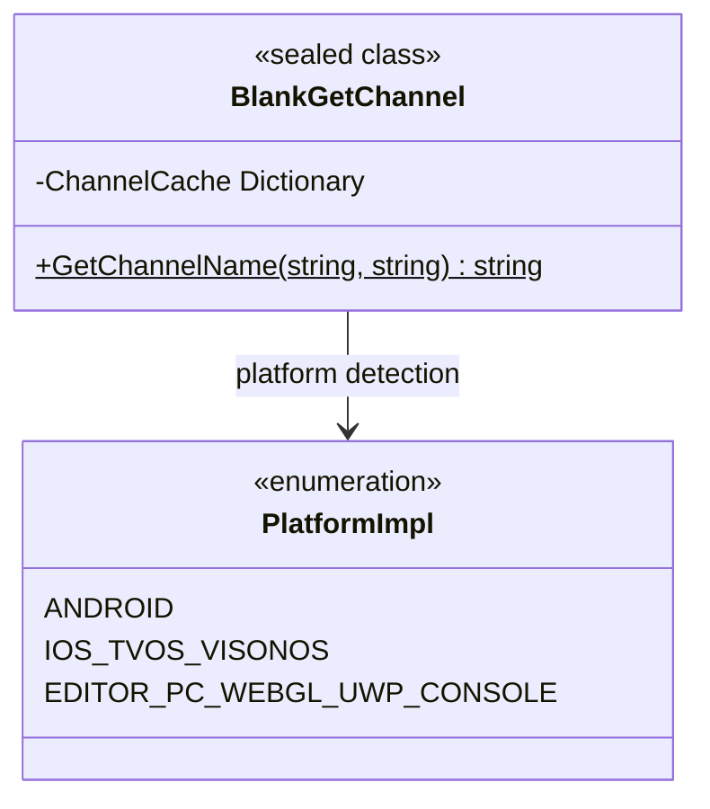

# API リファレンス

このドキュメント詳細介绍 `BlankGetChannel` 类提供的所有公共 API メソッド，含みますメソッド签名、パラメータ説明、戻り値およびプラットフォーム行为差异。

## 概要

`BlankGetChannel` は跨プラットフォーム的渠道情報取得工具类，为 Unity プロジェクト提供統一された的インターフェース来取得不同プラットフォーム的渠道标识符。このクラスサポート iOS、tvOS、visionOS、Android、Editor、PC、WebGL、UWP および多种主机プラットフォーム（PS4、PS5、Xbox One、Nintendo Switch）。

**設計意图**：通过統一された的 API 抽象底层プラットフォーム差异，開発者只需呼び出し同一メソッドつまり可取得渠道情報，无需关心各プラットフォーム的具体実装细节。



## API Reference

### `BlankGetChannel.GetChannelName(string channelKey = "channel", string defaultValue = "default"): string`

取得指定渠道键对应的渠道名称。

**メソッド签名：**
```csharp
[UnityEngine.Scripting.Preserve]
public static string GetChannelName(string channelKey = "channel", string defaultValue = "default")
```
> Source: [Runtime/BlankGetChannel.cs](https://github.com/GameFrameX/com.gameframex.unity.getchannel/blob/main/Runtime/BlankGetChannel.cs#L98-L141)

**機能説明：**
根据当前运行プラットフォーム从对应的設定源读取渠道情報，并返す指定键名对应的值。该メソッド内部実装了缓存机制，首次读取后会缓存結果，后续呼び出し直接返す缓存值，避免重复读取設定ファイル带来的性能开销。

**パラメータ説明：**

| パラメータ名 | タイプ | デフォルト值 | 必填 | 説明 |
|--------|------|--------|------|------|
| `channelKey` | `string` | `"channel"` | 否 | 渠道键名，用于标识要取得的渠道設定项。デフォルト值为 `"channel"`，对应各プラットフォーム的主渠道設定。 |
| `defaultValue` | `string` | `"default"` | 否 | 当未找到渠道設定时返す的デフォルト值。当プラットフォーム設定ファイル中不存在指定的键时，会返す此デフォルト值。 |

**戻り値：**

| タイプ | 説明 |
|------|------|
| `string` | 渠道名称字符串。もし在設定源中找到了 `channelKey` 对应的值，则返す该值；否则返す `defaultValue`。 |

**プラットフォーム行为差异：**

| プラットフォーム | 設定源 | 读取方法 |
|------|--------|----------|
| Android | `AndroidManifest.xml` 中的 `<meta-data>` 标签 | 通过 `AndroidJavaClass` 呼び出し Java 原生メソッド `GetChannel()` |
| iOS/tvOS/visionOS | `Info.plist` 中的键值对 | 通过 P/Invoke 呼び出し原生メソッド `getChannelName()` |
| Editor/PC/WebGL/UWP/Console | `Resources/application_config.txt` ファイル | 通过 `Resources.Load<TextAsset>()` 读取文本ファイル并解析 |

**内部実装细节：**

1. **缓存机制**：メソッド内部使用静态字典 `ChannelCache` 存储已读取的渠道情報，避免重复读取設定ファイル。

```csharp
private static readonly Dictionary<string, string> ChannelCache = new Dictionary<string, string>(32);
```
> Source: [Runtime/BlankGetChannel.cs](https://github.com/GameFrameX/com.gameframex.unity.getchannel/blob/main/Runtime/BlankGetChannel.cs#L57)

2. **条件コンパイル**：不同プラットフォーム使用 `#if UNITY_ANDROID`、`#if UNITY_IOS || UNITY_TVOS || UNITY_VISIONOS` 等预処理指令进行プラットフォームブランチ処理。

3. **設定解析**：对于 Editor/PC/WebGL/UWP/Console プラットフォーム，設定ファイル解析逻辑如下：

```csharp
var lines = textAsset.text.Split(new string[] { "\n", "\r", "\r\n" }, StringSplitOptions.RemoveEmptyEntries);
foreach (var line in lines)
{
    var split = line.Split(new string[] { "=" }, StringSplitOptions.RemoveEmptyEntries);
    if (split.Length > 1)
    {
        var key = split[0].Trim();
        var channelValue = split[1].Trim();
        ChannelCache[key] = channelValue;
    }
}
```
> Source: [Runtime/BlankGetChannel.cs](https://github.com/GameFrameX/com.gameframex.unity.getchannel/blob/main/Runtime/BlankGetChannel.cs#L110-L120)

**使用例：**

```csharp
// 使用默认参数获取主渠道
string channel = BlankGetChannel.GetChannelName();
```
> Source: [Runtime/BlankGetChannel.cs](https://github.com/GameFrameX/com.gameframex.unity.getchannel/blob/main/Runtime/BlankGetChannel.cs#L91)

```csharp
// 获取指定键的渠道，并设置默认值
string subChannel = BlankGetChannel.GetChannelName("sub_channel", "unknown");
```
> Source: [Runtime/BlankGetChannel.cs](https://github.com/GameFrameX/com.gameframex.unity.getchannel/blob/main/Runtime/BlankGetChannel.cs#L94)

```csharp
// 在实际项目中的使用示例
string appChannel = BlankGetChannel.GetChannelName("appchannel");
Debug.Log("Current channel: " + appChannel);
```
> Source: [Sample~/BlankGetChannelExample.cs](https://github.com/GameFrameX/com.gameframex.unity.getchannel/blob/main/Sample~/BlankGetChannelExample.cs#L12)

**例外情况：**

| シーン | 行为 |
|------|------|
| 設定ファイル中未找到指定键 | 返す `defaultValue` パラメータ值 |
| Android プラットフォーム Java 类呼び出し失敗 | 返す `defaultValue`（由 Java 层処理） |
| iOS/tvOS/visionOS プラットフォーム原生メソッド呼び出し失敗 | 返す `defaultValue`（由原生层処理） |
| Resources ファイル不存在 | 返す `defaultValue`，并将 `defaultValue` 存入缓存 |

## 内部メソッド

### iOS/tvOS/visionOS 原生メソッドインターフェース

```csharp
#if UNITY_IOS || UNITY_TVOS || UNITY_VISIONOS
[DllImport("__Internal")]
private static extern string getChannelName(string channelKey);
#endif
```
> Source: [Runtime/BlankGetChannel.cs](https://github.com/GameFrameX/com.gameframex.unity.getchannel/blob/main/Runtime/BlankGetChannel.cs#L47-L48)

**説明：** 此メソッド为私有メソッド，通过 P/Invoke 呼び出し iOS/tvOS/visionOS プラットフォーム的原生コード，从 `Info.plist` 中读取渠道情報。開発者无需直接呼び出し此メソッド，应使用 `GetChannelName()` 公有メソッド。

## 設定要求汇总

| プラットフォーム | 設定ファイル | 键名設定方法 |
|------|----------|--------------|
| Android | `AndroidManifest.xml` | `<meta-data android:name="channel" android:value="xxx" />` |
| iOS/tvOS/visionOS | `Info.plist` | `<key>channel</key><string>xxx</string>` |
| Editor/PC/WebGL/UWP/Console | `Resources/application_config.txt` | `channel=xxx` |

> 詳細設定説明请参照 [プラットフォーム設定](./4-platform-configuration) ドキュメント。

## 関連リンク

- [概要](./1-overview) - プロジェクト整体介绍与機能概要
- [インストール](./2-installation) - パッケージインストール与環境設定
- [快速开始](./3-getting-started) - 快速上手ガイド
- [プラットフォーム設定](./4-platform-configuration) - 各プラットフォーム詳細設定説明
- [例](./5-samples) - 完全なコード例
- [常见問題](./7-troubleshooting) - 常见問題与解決策
