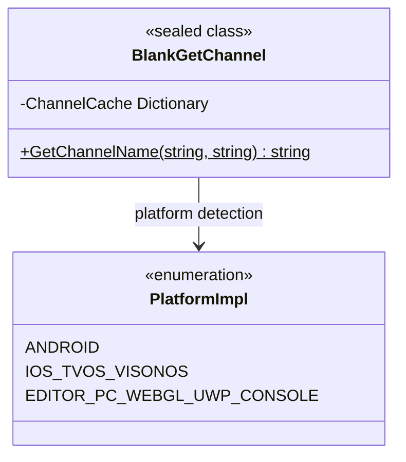

# API リファレンス

ドキュメント `BlankGetChannel` クラスの API メソッド，メソッド、パラメータ、すプラットフォーム。

## 

`BlankGetChannel` はプラットフォームのクラス， Unity プロジェクトのインターフェースプラットフォームの。クラスサポート iOS、tvOS、visionOS、Android、Editor、PC、WebGL、UWP プラットフォーム（PS4、PS5、Xbox One、Nintendo Switch）。

****：をじての API プラットフォーム，びしメソッド，プラットフォームの。



## API Reference

### `BlankGetChannel.GetChannelName(string channelKey = "channel", string defaultValue = "default"): string`

の。

**メソッド：**
```csharp
[UnityEngine.Scripting.Preserve]
public static string GetChannelName(string channelKey = "channel", string defaultValue = "default")
```
> Source: [Runtime/BlankGetChannel.cs](https://github.com/GameFrameX/com.gameframex.unity.getchannel/blob/main/Runtime/BlankGetChannel.cs#L98-L141)

**：**
プラットフォームの，すの。メソッドたキャッシュ，キャッシュ，びしすキャッシュ，ファイルの。

**パラメータ：**

| パラメータ | タイプ | デフォルト |  |  |
|--------|------|--------|------|------|
| `channelKey` | `string` | `"channel"` |  | ，にの。デフォルト `"channel"`，プラットフォームの。 |
| `defaultValue` | `string` | `"default"` |  | すのデフォルト。プラットフォームファイルにの，すデフォルト。 |

**す：**

| タイプ |  |
|------|------|
| `string` | 。にた `channelKey` の，す；す `defaultValue`。 |

**プラットフォーム：**

| プラットフォーム |  |  |
|------|--------|----------|
| Android | `AndroidManifest.xml` の `<meta-data>`  | をじて `AndroidJavaClass` びし Java メソッド `GetChannel()` |
| iOS/tvOS/visionOS | `Info.plist` の | をじて P/Invoke びしメソッド `getChannelName()` |
| Editor/PC/WebGL/UWP/Console | `Resources/application_config.txt` ファイル | をじて `Resources.Load<TextAsset>()` ファイル |

**：**

1. **キャッシュ**：メソッド `ChannelCache` の，ファイル。

```csharp
private static readonly Dictionary<string, string> ChannelCache = new Dictionary<string, string>(32);
```
> Source: [Runtime/BlankGetChannel.cs](https://github.com/GameFrameX/com.gameframex.unity.getchannel/blob/main/Runtime/BlankGetChannel.cs#L57)

2. **コンパイル**：プラットフォーム `#if UNITY_ANDROID`、`#if UNITY_IOS || UNITY_TVOS || UNITY_VISIONOS` プラットフォーム。

3. ****： Editor/PC/WebGL/UWP/Console プラットフォーム，ファイル：

```csharp
var lines = textAsset.text.Split(new string[] { "\n", "\r", "\r\n" }, StringSplitOptions.RemoveEmptyEntries);
foreach (var line in lines)
{
    var split = line.Split(new string[] { "=" }, StringSplitOptions.RemoveEmptyEntries);
    if (split.Length > 1)
    {
        var key = split[0].Trim();
        var channelValue = split[1].Trim();
        ChannelCache[key] = channelValue;
    }
}
```
> Source: [Runtime/BlankGetChannel.cs](https://github.com/GameFrameX/com.gameframex.unity.getchannel/blob/main/Runtime/BlankGetChannel.cs#L110-L120)

**：**

```csharp
// 使用デフォルトパラメータ获取主渠道
string channel = BlankGetChannel.GetChannelName();
```
> Source: [Runtime/BlankGetChannel.cs](https://github.com/GameFrameX/com.gameframex.unity.getchannel/blob/main/Runtime/BlankGetChannel.cs#L91)

```csharp
// 获取指定键の渠道，并設定デフォルト值
string subChannel = BlankGetChannel.GetChannelName("sub_channel", "unknown");
```
> Source: [Runtime/BlankGetChannel.cs](https://github.com/GameFrameX/com.gameframex.unity.getchannel/blob/main/Runtime/BlankGetChannel.cs#L94)

```csharp
// に实际プロジェクト中の使用例
string appChannel = BlankGetChannel.GetChannelName("appchannel");
Debug.Log("Current channel: " + appChannel);
```
> Source: [Sample~/BlankGetChannelExample.cs](https://github.com/GameFrameX/com.gameframex.unity.getchannel/blob/main/Sample~/BlankGetChannelExample.cs#L12)

**：**

|  |  |
|------|------|
| ファイル | す `defaultValue` パラメータ |
| Android プラットフォーム Java クラスびし | す `defaultValue`（ Java ） |
| iOS/tvOS/visionOS プラットフォームメソッドびし | す `defaultValue`（） |
| Resources ファイルに | す `defaultValue`， `defaultValue` キャッシュ |

## メソッド

### iOS/tvOS/visionOS メソッドインターフェース

```csharp
#if UNITY_IOS || UNITY_TVOS || UNITY_VISIONOS
[DllImport("__Internal")]
private static extern string getChannelName(string channelKey);
#endif
```
> Source: [Runtime/BlankGetChannel.cs](https://github.com/GameFrameX/com.gameframex.unity.getchannel/blob/main/Runtime/BlankGetChannel.cs#L47-L48)

**：** メソッドメソッド，をじて P/Invoke びし iOS/tvOS/visionOS プラットフォームのコード， `Info.plist` 。びしメソッド， `GetChannelName()` メソッド。

## 

| プラットフォーム | ファイル |  |
|------|----------|--------------|
| Android | `AndroidManifest.xml` | `<meta-data android:name="channel" android:value="xxx" />` |
| iOS/tvOS/visionOS | `Info.plist` | `<key>channel</key><string>xxx</string>` |
| Editor/PC/WebGL/UWP/Console | `Resources/application_config.txt` | `channel=xxx` |

>  [プラットフォーム](./4-platform-configuration) ドキュメント。

## リンク

- [](./1-overview) - プロジェクトと
- [インストール](./2-installation) - インストールと
- [クイックスタート](./3-getting-started) - ガイド
- [プラットフォーム](./4-platform-configuration) - プラットフォーム
- [](./5-samples) - コード
- [よくある](./7-troubleshooting) - よくあると
