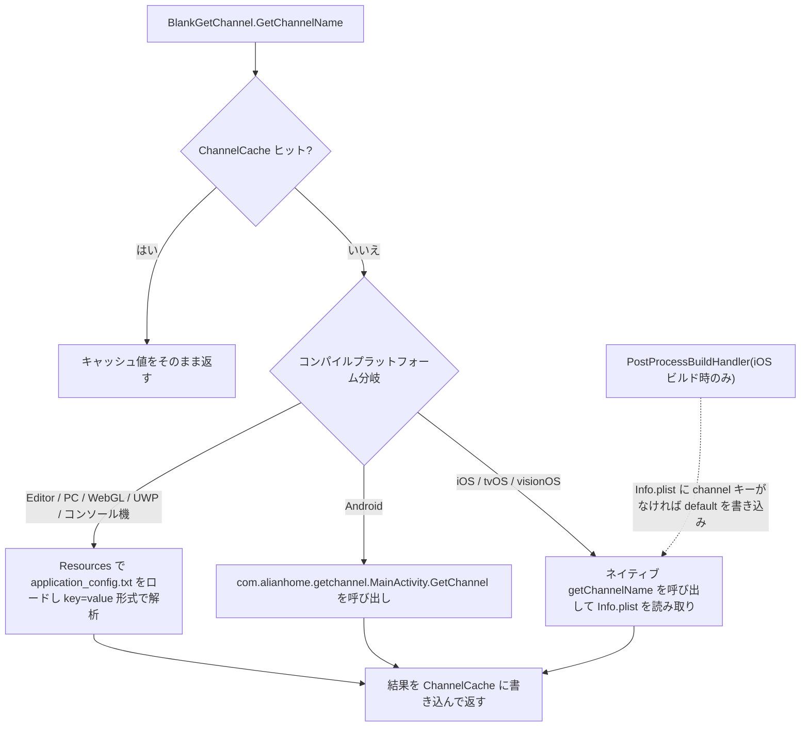

# 動作原理：チャネル読み取りフロー

`BlankGetChannel.GetChannelName()` を呼び出すと、コンポーネントはまずプロセス内キャッシュ `ChannelCache` を検索し、ヒットしなければ現在のコンパイルプラットフォームに応じて 3 つの異なる読み取りパス(Android ネイティブ jar、iOS ネイティブ Info.plist、Editor/PC は `Resources/application_config.txt` を読み取り)のいずれかを実行し、結果をキャッシュに書き戻してから返します。エントリポイントは静的メソッド 1 つだけで、[Runtime/BlankGetChannel.cs](https://github.com/GameFrameX/com.gameframex.unity.getchannel/blob/main/Runtime/BlankGetChannel.cs#L98-L141) で定義されています。

## 読み取りフロー概要



## プラットフォーム別の読み取りソース

| プラットフォーム(コンパイルマクロ) | 設定ソース | コードエントリ |
|------|------|------|
| `UNITY_ANDROID` | AndroidManifest.xml のメイン起動 Activity の `meta-data android:name="channel"` | `new AndroidJavaClass("com.alianhome.getchannel.MainActivity")` で静的メソッド `GetChannel` を呼び出し。ネイティブ実装は [Plugins/Android/com.alianhome.getchannel.jar](https://github.com/GameFrameX/com.gameframex.unity.getchannel/blob/main/Plugins/Android/com.alianhome.getchannel.jar) に同梱 |
| `UNITY_IOS` / `UNITY_TVOS` / `UNITY_VISIONOS` | Info.plist の String 型キー `channel` | `[DllImport("__Internal")] getChannelName(channelKey)`。ネイティブ実装は [Plugins/iOS/BlankGetChannel/BlankGetChannel.mm](https://github.com/GameFrameX/com.gameframex.unity.getchannel/blob/main/Plugins/iOS/BlankGetChannel/BlankGetChannel.mm) を参照 |
| `UNITY_STANDALONE` / `UNITY_EDITOR` / `UNITY_WEBGL` / `UNITY_WSA` / `UNITY_PS4` / `UNITY_PS5` / `UNITY_XBOXONE` / `UNITY_SWITCH` | `Resources/application_config.txt`(各行 `key=value`) | `Resources.Load<TextAsset>("application_config")` を行ごとに解析 |

メソッドシグネチャのデフォルト値：第 1 パラメータは `channelKey = "channel"`、第 2 パラメータは `defaultValue = "default"` で、チャネルが未設定の場合は文字列 `"default"` を返します。

## ステップ1:キャッシュヒット確認

メソッドの入口ではまず静的ディクショナリ `ChannelCache`(初期容量 32)を検索し、ヒットすればそのまま返し、いかなるプラットフォームの読み取りも行いません:

```csharp
private static readonly Dictionary<string, string> ChannelCache = new Dictionary<string, string>(32);

public static string GetChannelName(string channelKey = "channel", string defaultValue = "default")
{
    if (ChannelCache.TryGetValue(channelKey, out var value))
    {
        return value;
    }

    string channelName = defaultValue;
```

Source: [Runtime/BlankGetChannel.cs](https://github.com/GameFrameX/com.gameframex.unity.getchannel/blob/main/Runtime/BlankGetChannel.cs#L57-L105)

注意：キャッシュに無効化機構はないため、プロセスのライフサイクル内で最初に読み取った値が以降ずっと使用されます。

## ステップ2:Editor/PC パス――application_config.txt の解析

Editor、Standalone、WebGL、UWP および各コンソールプラットフォームは `Resources.Load` ブランチを通ります。ファイル全体を行ごとに解析し、**すべてのキーと値**をキャッシュに書き込みます(現在リクエスト中のキーだけではありません)。そのため、続けて別のキー(例： `sub_channel`)を読み取る場合も直接キャッシュが使われます:

```csharp
var textAsset = Resources.Load<TextAsset>("application_config");
if (textAsset != null)
{
    var lines = textAsset.text.Split(new string[] { "\n", "\r", "\r\n" }, StringSplitOptions.RemoveEmptyEntries);
    foreach (var line in lines)
    {
        var split = line.Split(new string[] { "=" }, StringSplitOptions.RemoveEmptyEntries);
        if (split.Length > 1)
        {
            var key = split[0].Trim();
            var channelValue = split[1].Trim();
            ChannelCache[key] = channelValue;
        }
    }
}
else
{
    ChannelCache[channelKey] = defaultValue;
}
```

Source: [Runtime/BlankGetChannel.cs](https://github.com/GameFrameX/com.gameframex.unity.getchannel/blob/main/Runtime/BlankGetChannel.cs#L106-L125)

ファイルが存在しない、または該当キーが未設定の場合は、`defaultValue` をキャッシュに書き込んで返します。解析は最初の `=` で分割し、イコール記号より後の内容全体を Trim したものを値とするため、値には `=` 以外の通常の文字を含めることができます。

## ステップ3:Android パス――ネイティブ jar の呼び出し

```csharp
using (AndroidJavaClass androidJavaClass = new AndroidJavaClass("com.alianhome.getchannel.MainActivity"))
{
    channelName = androidJavaClass.CallStatic<string>("GetChannel", channelKey);
}
```

Source: [Runtime/BlankGetChannel.cs](https://github.com/GameFrameX/com.gameframex.unity.getchannel/blob/main/Runtime/BlankGetChannel.cs#L131-L135)

C# 側は `channelKey` をそのまま渡すだけで、値の取得ロジックは jar 内にあります(Manifest の meta-data を読み取り)。

## ステップ4:iOS/tvOS/visionOS パス――P/Invoke によるネイティブメソッドの呼び出し

```csharp
[DllImport("__Internal")]
private static extern string getChannelName(string channelKey);
```

Source: [Runtime/BlankGetChannel.cs](https://github.com/GameFrameX/com.gameframex.unity.getchannel/blob/main/Runtime/BlankGetChannel.cs#L47-L48)

## ステップ5:結果のキャッシュ書き戻し

3 つのブランチの戻り値はすべてメソッド末尾のこの 2 行に集約され、以後同じキーで呼び出してもプラットフォームの読み取りが再度トリガーされることはありません:

```csharp
ChannelCache[channelKey] = channelName;
return channelName;
```

Source: [Runtime/BlankGetChannel.cs](https://github.com/GameFrameX/com.gameframex.unity.getchannel/blob/main/Runtime/BlankGetChannel.cs#L139-L140)

## 付随するビルド後処理：iOS のフォールバック書き込み

iOS ビルド完了後、エディタスクリプト `PostProcessBuildHandler`(`[PostProcessBuild(99)]`、`BuildTarget.iOS` のみ)が生成された Info.plist を読み取ります:`channel` キーが存在しない場合は `"default"` を書き込んでファイルに書き戻し、すでに存在する場合はスキップしてログ `已有渠道,跳过设置=>` を出力します:

```csharp
string plistPath = path + "/Info.plist";
PlistDocument plist = new PlistDocument();
plist.ReadFromString(File.ReadAllText(plistPath));
if (!plist.root.values.TryGetValue(channelKey, out var value))
{
    plist.root.SetString(channelKey, channelValue);
    plist.WriteToFile(plistPath);
    Debug.Log("配置渠道成功=>" + channelValue);
}
else
{
    Debug.Log("已有渠道,跳过设置=>" + value);
}
```

Source: [Editor/PostProcessBuildHandler.cs](https://github.com/GameFrameX/com.gameframex.unity.getchannel/blob/main/Editor/PostProcessBuildHandler.cs#L31-L49)

つまり、iOS 実機で実行時に読み取られる `channel` キーは必ず存在することになります(手動で Info.plist に設定した値が優先)。例外は `try/catch` でラップされており、失敗しても `Debug.LogException` が出力されるだけでビルドは中断されません。

## 呼び出し例

サンプルコンポーネントは、ボタンクリック時にカスタムキー `appchannel` でチャネルを読み取ります:

```csharp
public class BlankGetChannelExample : MonoBehaviour
{
    private string value;
    void OnGUI()
    {
        GUILayout.Label(value);
        if (GUILayout.Button("GET", GUILayout.Width(200), GUILayout.Height(100)))
        {
            value = BlankGetChannel.GetChannelName("appchannel");
        }
    }
}
```

Source: [Sample~/BlankGetChannelExample.cs](https://github.com/GameFrameX/com.gameframex.unity.getchannel/blob/main/Sample~/BlankGetChannelExample.cs#L4-L15)

## よくあるエラー

| 症状 | 原因 | 回避策 |
|------|------|------|
| 常に `"default"` が返される | Editor/PC で Resources ディレクトリに `application_config.txt` が存在しない、またはファイル内に該当キーがない | `Assets/Resources/` にファイルを配置して `channel=xxx` を記述。ファイル名は拡張子なしでロードされ、実際のファイルは `.txt` である点に注意 |
| Android で値が取得できない | Manifest のメイン起動 Activity に `meta-data android:name="channel"` が設定されていない | メイン Activity 内に `<meta-data android:name="channel" android:value="android_cn_taptap" />` を追加 |
| iOS で値が取得できない | Info.plist に `channel` キーがない場合、ビルド後処理によって `"default"` が書き込まれ、以降の実行時には常に `default` が読み取られる | ビルド前に Xcode プロジェクトの Info.plist に String 型の `channel` キーを設定する |
| 設定変更が実行時に反映されない | `ChannelCache` にはプロセス内の無効化機構がなく、初回読み取り後はずっと再利用される | アプリの再起動/Play Mode の入り直し |

## 関連リンク

- 各プラットフォームのチャネル設定の具体的な手順:リポジトリ内 [README.zh-CN.md](https://github.com/GameFrameX/com.gameframex.unity.getchannel/blob/main/README.zh-CN.md)
- バージョン履歴:[CHANGELOG.md](https://github.com/GameFrameX/com.gameframex.unity.getchannel/blob/main/CHANGELOG.md)