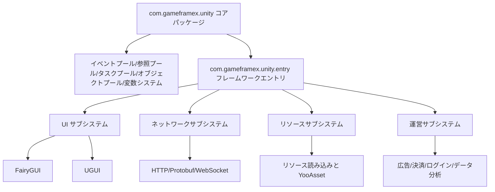

# プロジェクト紹介と特徴

GameFrameX Unity は GameFrameX 総合ソリューションの Unity クライアント実装であり、90以上のモジュール式コンポーネントを提供し、コアフレームワーク、リソース管理、UI システム、ネットワーク通信から広告、決済、ログイン、データ分析まで、ゲーム開発と運営のフルチェーンをカバーしています。本フレームワークは Unity 2019.4 以降のバージョンに対応しており、「独立ゲーム向けのフロントエンド・バックエンド統合ソリューション」として位置付けられています。

## コア特徴

- **モジュール式設計** — 各コンポーネントは独立したパッケージとして存在し、必要に応じて Unity プロジェクトの `Packages/manifest.json` に追加できます。互いに干渉しません
- **ホットアップデート対応** — HybridCLR を統合し、C# のホットアップデートをサポート。同時に XLua アダプタパッケージも提供
- **複数 UI ソリューション** — FairyGUI と UGUI の両方に対応しており、チームの技術スタックに応じて自由に選択可能
- **非同期優先** — UniTask ベースの async/await 非同期プログラミングモデルを採用
- **全プラットフォーム対応** — iOS、Android、WebGL、WeChat/TikTok/Alipay ミニゲーム
- **豊富な運営コンポーネント** — 広告（穿山甲、TopOn）、決済（Alipay、Apple、Google）、ログイン（QQ、WeChat、Apple、Facebook、Google）、データ分析、オブジェクトストレージなどをすぐに利用可能な状態で提供

## クイックスタート

### 1. Scoped Registry の設定

Unity プロジェクトの `Packages/manifest.json` に GameFrameX の scoped registry を追加します：

```json
{
  "scopedRegistries": [
    {
      "name": "GameFrameX",
      "url": "https://gameframex.upm.alianblank.uk",
      "scopes": [
        "com.gameframex"
      ]
    }
  ],
  "dependencies": {
    "com.gameframex.unity": "1.11.0"
  }
}
```

出典: [README.zh-CN.md](https://github.com/GameFrameX/GameFrameX.Unity/blob/main/README.zh-CN.md#L38-L57)

### 2. 必要なコンポーネントの追加

`dependencies` に必要に応じてコンポーネントパッケージを追加します。バージョン番号は [Releases](https://github.com/GameFrameX/GameFrameX.Unity/releases) ページで確認できます。一般的な組み合わせの例：

```json
{
  "dependencies": {
    "com.gameframex.unity": "1.11.0",
    "com.gameframex.unity.asset": "2.0.0",
    "com.gameframex.unity.ui": "2.1.1",
    "com.gameframex.unity.ui.fairygui": "3.0.0",
    "com.gameframex.unity.procedure": "1.0.4",
    "com.gameframex.unity.event": "1.0.2",
    "com.gameframex.unity.fsm": "1.0.3",
    "com.gameframex.unity.network": "2.5.1",
    "com.gameframex.unity.sound": "1.0.6",
    "com.gameframex.unity.localization": "2.0.0"
  }
}
```

出典: [README.zh-CN.md](https://github.com/GameFrameX/GameFrameX.Unity/blob/main/README.zh-CN.md#L59-L82)

## 仕組みの概要

GameFrameX のコアパッケージ `com.gameframex.unity` は、フレームワークのランタイムとエディタの基本機能を提供し、イベントプール、参照プール、タスクプール、オブジェクトプール、変数システムを網羅しています。その他のコンポーネント（UI、ネットワーク、リソース管理等）はこれらを基盤として独立したパッケージの形で存在し、Unity Package Manager の scoped registry 机制により必要に応じて配布されます。



出典: [README.zh-CN.md](https://github.com/GameFrameX/GameFrameX.Unity/blob/main/README.zh-CN.md#L85-L113)

## コンポーネント一覧

バージョン番号は [GameFrameX UPM Registry](https://gameframex.upm.alianblank.uk) から自動的に取得されます。下記の表は各グループの主要コンポーネントをまとめたものです。完全なリストは [README.zh-CN.md](https://github.com/GameFrameX/GameFrameX.Unity/blob/main/README.zh-CN.md) を参照してください。

| グループ | 代表コンポーネント | 役割 |
|------|---------|------|
| コアフレームワーク | com.gameframex.unity、entry、event、fsm、procedure | ランタイム骨格、イベントシステム、状態機械、フロー管理 |
| リソース管理 | com.gameframex.unity.asset、download、builder | リソース読み込み、ファイルダウンロード、ビルドパイプライン |
| UI フレームワーク | com.gameframex.unity.ui、ui.fairygui、ui.ugui | UI 基盤と FairyGUI/UGUI アダプタ |
| ネットワーク通信 | com.gameframex.unity.web、web.protobuff、psygames.unitywebsocket、webview | HTTP、Protobuf、WebSocket、WebView |
| データと設定 | com.gameframex.unity.config、localization、focus-creative-games.luban | 設定管理、ローカライズ、Luban 設定生成 |
| オーディオとアニメーション | com.gameframex.unity.sound、demigiant.dotween、esotericsoftware.spine | オーディオ、DoTween アニメーション、Spine ボーンアニメーション |
| シーンと設定 | com.gameframex.unity.scene、setting | シーン切り替え、プレイヤー設定 |
| ホットアップデート | com.gameframex.unity.tencent.xlua、xlua | XLua ホットアップデートソリューション |
| 広告 | advertisement、advertisement.csj、advertisement.topon およびミニゲーム広告 | 穿山甲、TopOn、WeChat/TikTok/Alipay/Kuaishou ミニゲーム広告 |
| 決済 | com.gameframex.unity.payment、payment.alipay、payment.apple、payment.google | 統一決済インターフェースと各プラットフォーム向け実装 |
| ログイン | login.apple、login.facebook、login.google、login.qq、login.wechat | 各プラットフォーム向けログイン SDK |
| データ分析 | gameanalytics、sentry、adjust など | データ統計、エラートラッキング、アトリビューション分析 |
| オブジェクトストレージ | objectstorage、objectstorage.aliyun、objectstorage.qiniu、objectstorage.tencent | Alibaba Cloud OSS、Qiniu、Tencent Cloud COS |
| ミニゲーム | minigame.wechat、tuyoogame.yooasset.minigame.* | WeChat/YooAsset ミニゲームアダプタ |
| プラットフォームツール | getchannel、operationclipboard、systeminfo、sharesdk など | チャネル ID、クリップボード、デバイス識別子、シェア |

出典: [README.zh-CN.md](https://github.com/GameFrameX/GameFrameX.Unity/blob/main/README.zh-CN.md#L85-L239)

## 次にやること

- 完全なコンポーネントバージョンと説明を確認：[README.zh-CN.md](https://github.com/GameFrameX/GameFrameX.Unity/blob/main/README.zh-CN.md)
- フロー管理を統合：[フロー（Procedure）コンポーネント](https://github.com/GameFrameX/GameFrameX.Unity/blob/main/README.zh-CN.md)
- イベントシステムを統合：[イベント（Event）コンポーネント](https://github.com/GameFrameX/GameFrameX.Unity/blob/main/README.zh-CN.md)
- ネットワーク通信を統合：[ネットワーク（Network/Web）コンポーネント](https://github.com/GameFrameX/GameFrameX.Unity/blob/main/README.zh-CN.md)
- 公式ドキュメントサイト：[GameFrameX ドキュメント](https://gameframex.doc.alianblank.com)
- コミュニティサポート：QQ グループ 467608841