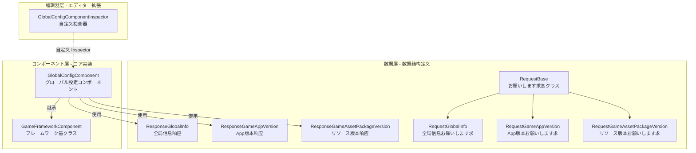

# GlobalConfig コンポーネント简介

GlobalConfig コンポーネント是 GameFrameX フレームワーク的コア组成部分，提供 Unity ゲームプロジェクト中的グローバル設定管理能力。该コンポーネント集中管理应用程序版本检查、リソース版本检查、AOT 代码列表等グローバル設定信息，サポートを通じて编辑器可视化配置和代码动态設定两种方法。

## 概要

GlobalConfig コンポーネント设计に使用解决ゲームプロジェクト中グローバル設定分散、难以管理的问题。在ゲーム开发过程中，存在许多必要全局访问的配置数据，例如服务器地址、版本检查インターフェース、应用商店链接等。传统的做法是将这些配置硬编码或分散在多个配置ファイル中，导致维护困难且容易出错。

GlobalConfig コンポーネントを通じて统一的インターフェース和标准化的数据模型，将所有グローバル設定集中管理。该コンポーネントを継承 `GameFrameworkComponent`，可能直接作为 Unity コンポーネント添加到シーン中，并を通じて GameFrameX フレームワーク的コンポーネント管理系统进行全局访问。这种设计使得配置数据的設定和取得变得简单统一，同时サポート编辑器配置和运行时动态設定两种模式。

コンポーネント的コア機能包括四个方面：首先，`CheckAppVersionUrl` プロパティに使用存储应用程序版本检查的 URL 地址，使ゲーム能够查询是否有新版本可用；其次，`CheckResourceVersionUrl` プロパティに使用存储リソース版本检查的 URL 地址，サポートホットアップデート機能的リソース管理；第三，`AOTCodeList` 和 `AOTCodeLists` プロパティに使用配置 AOT 补充元数据列表，解决 IL2CPP 构建模式下的泛型问题；最后，`Content` プロパティ允许存储任意附加内容，满足业务扩展需求。

## アーキテクチャ設計

GlobalConfig コンポーネント采用分层アーキテクチャ設計，分为数据层、コンポーネント层和编辑器层三个部分。数据层包含お願いします求クラス和响应クラス，に使用定义与服务器通信的数据结构；コンポーネント层是コア的 `GlobalConfigComponent` クラス，负责配置数据的存储和访问；编辑器层提供自定义 Inspector，简化编辑器中的配置工作。

数据层采用继承结构组织お願いします求クラス。`RequestBase` 是所有お願いします求クラス的基クラス，定义了通用的プロパティ包括语言（Language）、程序版本（AppVersion）、运行平台（Platform）、包名（PackageName）、渠道（Channel）和子渠道（SubChannel）。具体的お願いします求クラス如 `RequestGlobalInfo`、`RequestGameAppVersion` 和 `RequestGameAssetPackageVersion` を継承该基クラス，可能に基づいて必要扩展各自的业务字段。

响应クラス同样采用クラス似的设计模式。`ResponseGlobalInfo` 包含 CheckAppVersionUrl、CheckResourceVersionUrl、AOTCodeList 和 Content 等配置信息；`ResponseGameAppVersion` 包含应用版本检查结果，包括是否强制升级、ダウンロード地址、是否必要更新、更新公告和更新标题；`ResponseGameAssetPackageVersion` 包含リソース版本信息，包括语言、版本号、リソース包名称、路径、平台、ダウンロード根路径、包名、ゲーム版本和渠道名称。

コンポーネント层的 `GlobalConfigComponent` クラスを継承 `GameFrameworkComponent`，使用 `[DisallowMultipleComponent]` 和 `[AddComponentMenu("Game Framework/Global Config")]` プロパティ进行标记，确保シーン中只有一个インスタンス并方便在编辑器菜单中查找。该クラスを通じて序列化字段存储配置数据，并提供プロパティ访问器サポート运行时修改。

编辑器层的 `GlobalConfigComponentInspector` を継承 `GameFrameworkInspector`，为コンポーネント提供自定义的 Inspector 界面。该检查器将配置项分クラス展示，サポート在编辑模式下可视化配置各项プロパティ，同时在运行时禁止编辑以保证数据一致性。

## コア機能特性

GlobalConfig コンポーネント提供以下コア機能特性：

**版本检查インターフェース管理** — コンポーネント提供 `CheckAppVersionUrl` 和 `CheckResourceVersionUrl` 两个プロパティ，分别に使用配置应用程序版本检查インターフェース和リソース版本检查インターフェース。这两个インターフェース是ゲームホットアップデート系统的关键组成部分，ゲーム启动时を通じて这些インターフェース取得最新版本信息，判断是否必要更新应用程序或ダウンロード新的リソース包。

**AOT 代码列表配置** — 在使用 IL2CPP 进行 Unity プロジェクト构建时，由于 AOT 编译的限制，某些泛型クラス型可能无法正常使用。コンポーネント提供 `AOTCodeList` 和 `AOTCodeLists` プロパティ，允许開発者配置必要补充的 AOT 元数据列表，确保运行时的泛型インスタンス化正常工作。

**运行时配置更新** — コンポーネントサポートを通じて代码动态更新配置数据。を通じて `SetOriginalData` メソッド可能設定原始数据字符串，を通じて `SetGlobalConfig` メソッド可能設定完整的 `ResponseGlobalInfo` 对象。这使得ゲーム可能从服务器取得最新的グローバル設定，実装配置的动态更新而无需重新发布。

**グローバル設定访问** — を継承 GameFrameworkComponent 的コンポーネント可能を通じてフレームワーク的コンポーネント管理系统在ゲーム的任何位置方便地访问。这确保了配置数据的一致性和可管理性，避免了を通じて单例或静态变量访问带来的耦合问题。

## 使用シーン

GlobalConfig コンポーネント适に使用以下典型使用シーン：

**ゲーム启动配置** — ゲーム启动时必要取得服务器地址、版本检查インターフェース等基础配置信息。将这些配置存储在 GlobalConfig コンポーネント中，其他系统（如网络模块、更新模块）可能直接从コンポーネント取得所需信息。

**ホットアップデート系统集成** — ホットアップデート系统必要知道リソース版本检查的 URL 地址。を通じて GlobalConfig コンポーネント集中管理这些 URL，使得ホットアップデート系统可能灵活地从配置中读取，而无需硬编码。

**多渠道打包** — 不同渠道可能必要不同的服务器地址或配置参数。を通じて GlobalConfig コンポーネント可能に基づいて渠道动态設定相应的配置值，実装一套代码サポート多渠道。

**动态配置更新** — ゲーム上线后可能必要调整某些配置参数。を通じて `SetGlobalConfig` メソッド从服务器取得最新配置，実装配置的动态更新，无需玩家重新ダウンロード安装包。

## 関連リンク

- [安装方法](../2-installation.1-install-methods) - 了解如何安装 GlobalConfig コンポーネント
- [添加到シーン](../3-getting-started.1-add-to-scene) - 了解如何在 Unity シーン中使用コンポーネント
- [配置プロパティ](../3-getting-started.2-configure-properties) - 详细了解各配置プロパティ的作用
- [代码访问](../3-getting-started.3-code-access) - 了解如何在代码中访问グローバル設定
- [GlobalConfigComponent 详解](../4-core-component.1-global-config-component) - コアコンポーネント完整 API 参考
- [お願いします求クラス详解](../5-data-structures.1-request-classes) - お願いします求数据结构説明
- [响应クラス详解](../5-data-structures.2-response-classes) - 响应数据结构説明
- [自定义 Inspector](../6-editor-configuration.1-custom-inspector) - 编辑器配置详情
- [AOT 代码列表配置](../7-aot-configuration.1-aot-code-list) - AOT 配置説明
- [FAQ](../8-troubleshooting.1-faq) - 常见问题解答
