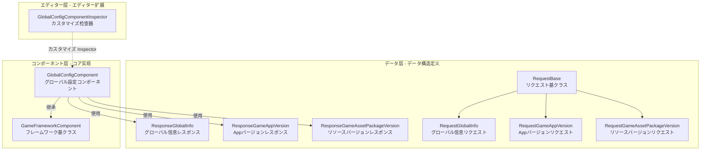

# GlobalConfig コンポーネント

GlobalConfig コンポーネントは GameFrameX フレームワークのコア， Unity ゲームプロジェクトのグローバル。コンポーネントバージョン、リソースバージョン、AOT コードグローバル，サポートをじてエディターとコード。

## 

GlobalConfig コンポーネントにゲームプロジェクトグローバル、の。にゲーム，にグローバルのデータ，、バージョンインターフェース、リンク。のはにファイル，。

GlobalConfig コンポーネントをじてのインターフェースとのデータ，グローバル。コンポーネント `GameFrameworkComponent`， Unity コンポーネント，をじて GameFrameX フレームワークのコンポーネントグローバル。データのとシンプル，サポートエディターと。

コンポーネントのコア：，`CheckAppVersionUrl` プロパティにバージョンの URL ，ゲームはバージョン；，`CheckResourceVersionUrl` プロパティにリソースバージョンの URL ，サポートホットアップデートのリソース；，`AOTCodeList` と `AOTCodeLists` プロパティに AOT データ， IL2CPP ビルドの；，`Content` プロパティ，。

## アーキテクチャ

GlobalConfig コンポーネントアーキテクチャ，データ、コンポーネントとエディター。データむリクエストクラスとレスポンスクラス，にとのデータ；コンポーネントはコアの `GlobalConfigComponent` クラス，データのと；エディターカスタマイズ Inspector，エディターの。

データリクエストクラス。`RequestBase` はリクエストクラスのクラス，たのプロパティ（Language）、バージョン（AppVersion）、プラットフォーム（Platform）、（PackageName）、（Channel）と（SubChannel）。のリクエストクラス `RequestGlobalInfo`、`RequestGameAppVersion` と `RequestGameAssetPackageVersion` クラス，の。

レスポンスクラスクラスの。`ResponseGlobalInfo` む CheckAppVersionUrl、CheckResourceVersionUrl、AOTCodeList と Content ；`ResponseGameAppVersion` むバージョン，は、、は、と；`ResponseGameAssetPackageVersion` むリソースバージョン，、バージョン、リソース、パス、プラットフォーム、パス、、ゲームバージョンと。

コンポーネントの `GlobalConfigComponent` クラス `GameFrameworkComponent`， `[DisallowMultipleComponent]` と `[AddComponentMenu("Game Framework/Global Config")]` プロパティ，にエディター。クラスをじてデータ，プロパティサポート。

エディターの `GlobalConfigComponentInspector`  `GameFrameworkInspector`，コンポーネントカスタマイズの Inspector 。クラス，サポートにプロパティ，にデータ。

## コア

GlobalConfig コンポーネントコア：

**バージョンインターフェース** — コンポーネント `CheckAppVersionUrl` と `CheckResourceVersionUrl` プロパティ，にバージョンインターフェースとリソースバージョンインターフェース。インターフェースはゲームホットアップデートの，ゲームをじてインターフェースバージョン，はのリソース。

**AOT コード** — に IL2CPP  Unity プロジェクトビルド， AOT コンパイルの，タイプ。コンポーネント `AOTCodeList` と `AOTCodeLists` プロパティ，の AOT データ，の。

**** — コンポーネントサポートをじてコードデータ。をじて `SetOriginalData` メソッドデータ，をじて `SetGlobalConfig` メソッドの `ResponseGlobalInfo` 。ゲームのグローバル，の。

**グローバル** —  GameFrameworkComponent のコンポーネントをじてフレームワークのコンポーネントにゲームの。たデータのと，たをじてシングルトンの。

## シーン

GlobalConfig コンポーネントにシーン：

**ゲーム** — ゲーム、バージョンインターフェース。に GlobalConfig コンポーネント，（ネットワークモジュール、モジュール）コンポーネント。

**ホットアップデート** — ホットアップデートリソースバージョンの URL 。をじて GlobalConfig コンポーネント URL，ホットアップデート，。

**** — のパラメータ。をじて GlobalConfig コンポーネントの，コードサポート。

**** — ゲームパラメータ。をじて `SetGlobalConfig` メソッド，の，インストール。

## リンク

- [インストールメソッド](../2-installation.1-install-methods) - たインストール GlobalConfig コンポーネント
-  - たに Unity コンポーネント
- [プロパティ](../3-getting-started.2-configure-properties) - たプロパティの
- [コード](../3-getting-started.3-code-access) - たにコードグローバル
- [GlobalConfigComponent ](../4-core-component.1-global-config-component) - コアコンポーネント API リファレンス
- [リクエストクラス](../5-data-structures.1-request-classes) - リクエストデータ
- [レスポンスクラス](../5-data-structures.2-response-classes) - レスポンスデータ
- [カスタマイズ Inspector](../6-editor-configuration.1-custom-inspector) - エディター
- [AOT コード](../7-aot-configuration.1-aot-code-list) - AOT 
- [FAQ](../8-troubleshooting.1-faq) - よくある
