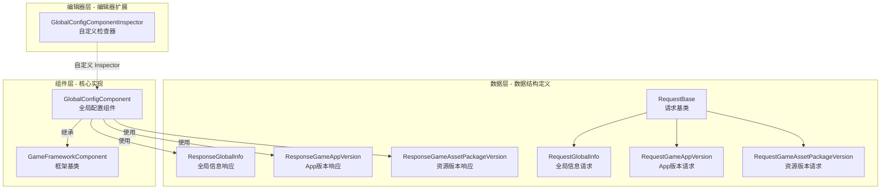

# GlobalConfig コンポーネント紹介

GlobalConfig コンポーネント是 GameFrameX フレームワーク的コア组成部分，提供 Unity 游戏プロジェクト中的全局設定管理能力。该コンポーネント集中管理应用程序バージョン確認、リソースバージョン確認、AOT コード列表等全局設定情報，サポート通过エディタ可视化設定和コード动态設定两种方法。

## 概要

GlobalConfig コンポーネント設計用于解决游戏プロジェクト中全局設定分散、难以管理的問題。在游戏开发过程中，存在许多〜する必要があります全局访问的設定数据，例えば服务器地址、バージョン確認インターフェース、应用商店链接等。传统的做法是将这些設定硬编码或分散在多个設定ファイル中，导致维护困难且容易出错。

GlobalConfig コンポーネント通过統一された的インターフェース和標準化的数据模型，将所有全局設定集中管理。该コンポーネント継承自 `GameFrameworkComponent`，〜できます直接作为 Unity コンポーネント追加到シーン中，并通过 GameFrameX フレームワーク的コンポーネント管理系统进行全局访问。这种設計使得設定数据的設定和取得变得シンプル統一された，同時にサポートエディタ設定和ランタイム动态設定两种モード。

コンポーネント的コア機能含みます四个方面：まず，`CheckAppVersionUrl` プロパティ用于存储应用程序バージョン確認的 URL 地址，使游戏能够查询是否有新バージョン可用；其次，`CheckResourceVersionUrl` プロパティ用于存储リソースバージョン確認的 URL 地址，サポートホットアップデート機能的リソース管理；第3，`AOTCodeList` 和 `AOTCodeLists` プロパティ用于設定 AOT 补充元数据列表，解决 IL2CPP ビルドモード下的ジェネリック問題；最後に，`Content` プロパティ允许存储任意附加内容，满足业务拡張需求。

## アーキテクチャ設計

GlobalConfig コンポーネント采用分层アーキテクチャ設計，分为数据层、コンポーネント層和エディタ层三个部分。数据层パッケージ含请求类和响应类，用于定義与服务器通信的数据结构；コンポーネント層是コア的 `GlobalConfigComponent` 类，负责設定数据的存储和访问；エディタ层提供自定義 Inspector，簡素化エディタ中的設定工作。

数据层采用継承结构组织请求类。`RequestBase` 是所有请求类的基底クラス，定義了汎用的プロパティ含みます语言（Language）、程序バージョン（AppVersion）、运行プラットフォーム（Platform）、パッケージ名（PackageName）、渠道（Channel）和子渠道（SubChannel）。具体的请求类如 `RequestGlobalInfo`、`RequestGameAppVersion` 和 `RequestGameAssetPackageVersion` 継承自该基底クラス，〜できます根据〜する必要があります拡張各自的业务フィールド。

响应类同样采用类似的設計モード。`ResponseGlobalInfo` パッケージ含 CheckAppVersionUrl、CheckResourceVersionUrl、AOTCodeList 和 Content 等設定情報；`ResponseGameAppVersion` パッケージ含应用バージョン確認結果，含みます是否强制升级、下载地址、是否〜する必要がありますアップデート、アップデート公告和アップデート标题；`ResponseGameAssetPackageVersion` パッケージ含リソースバージョン情報，含みます语言、バージョン号、リソースパッケージ名称、路径、プラットフォーム、下载根路径、パッケージ名、游戏バージョン和渠道名称。

コンポーネント層的 `GlobalConfigComponent` 类継承自 `GameFrameworkComponent`，使用 `[DisallowMultipleComponent]` 和 `[AddComponentMenu("Game Framework/Global Config")]` プロパティ进行标记，確認してくださいシーン中只有一个インスタンス并方便在エディタメニュー中查找。このクラス通过シリアライズフィールド存储設定数据，并提供プロパティ访问器サポートランタイム変更。

エディタ层的 `GlobalConfigComponentInspector` 継承自 `GameFrameworkInspector`，为コンポーネント提供自定義的 Inspector 界面。该確認器将設定项分类表示，サポート在编辑モード下可视化設定各项プロパティ，同時に在ランタイム禁止编辑以保证数据一致性。

## コア機能特性

GlobalConfig コンポーネント提供以下コア機能特性：

**バージョン確認インターフェース管理** — コンポーネント提供 `CheckAppVersionUrl` 和 `CheckResourceVersionUrl` 两个プロパティ，分别用于設定应用程序バージョン確認インターフェース和リソースバージョン確認インターフェース。这两个インターフェース是游戏ホットアップデート系统的关键组成部分，游戏启动时通过这些インターフェース取得最新バージョン情報，判断是否〜する必要がありますアップデート应用程序或下载新的リソースパッケージ。

**AOT コード列表設定** — 在使用 IL2CPP 进行 Unity プロジェクトビルド时，由于 AOT コンパイル的限制，某些ジェネリックタイプ〜の可能性があります无法正常使用。コンポーネント提供 `AOTCodeList` 和 `AOTCodeLists` プロパティ，允许開発者設定〜する必要があります补充的 AOT 元数据列表，確認してくださいランタイム的ジェネリックインスタンス化正常工作。

**ランタイム設定アップデート** — コンポーネントサポート通过コード动态アップデート設定数据。通过 `SetOriginalData` メソッド〜できます設定原始数据字符串，通过 `SetGlobalConfig` メソッド〜できます設定完全な的 `ResponseGlobalInfo` 对象。这使得游戏〜できます从服务器取得最新的全局設定，実装設定的动态アップデート而无需重新リリース。

**全局設定访问** — 継承自 GameFrameworkComponent 的コンポーネント〜できます通过フレームワーク的コンポーネント管理系统在游戏的任何位置方便地访问。这確認してください了設定数据的一致性和可管理性，避免了通过单例或静态变量访问带来的耦合問題。

## 使用シーン

GlobalConfig コンポーネント適しています以下典型使用シーン：

**游戏启动設定** — 游戏启动时〜する必要があります取得服务器地址、バージョン確認インターフェース等基本設定情報。将这些設定存储在 GlobalConfig コンポーネント中，其他系统（如网络モジュール、アップデートモジュール）〜できます直接从コンポーネント取得所需情報。

**ホットアップデート系统集成** — ホットアップデート系统〜する必要があります知道リソースバージョン確認的 URL 地址。通过 GlobalConfig コンポーネント集中管理这些 URL，使得ホットアップデート系统〜できます柔軟地从設定中读取，而无需硬编码。

**多渠道打パッケージ** — 不同渠道〜の可能性があります〜する必要があります不同的服务器地址或設定パラメータ。通过 GlobalConfig コンポーネント〜できます根据渠道动态設定相应的設定值，実装一套コードサポート多渠道。

**动态設定アップデート** — 游戏上线后〜の可能性があります〜する必要があります调整某些設定パラメータ。通过 `SetGlobalConfig` メソッド从服务器取得最新設定，実装設定的动态アップデート，无需プレイヤー重新下载インストールパッケージ。

## 関連リンク

- [インストール方法](../2-installation.1-install-methods) - 理解する如何インストール GlobalConfig コンポーネント
- [追加到シーン](../3-getting-started.1-add-to-scene) - 理解する如何在 Unity シーン中使用コンポーネント
- [設定プロパティ](../3-getting-started.2-configure-properties) - 詳細理解する各設定プロパティ的作用
- [コード访问](../3-getting-started.3-code-access) - 理解する如何在コード中访问全局設定
- [GlobalConfigComponent 详解](../4-core-component.1-global-config-component) - コアコンポーネント完全な API リファレンス
- [请求类详解](../5-data-structures.1-request-classes) - 请求数据结构説明
- [响应类详解](../5-data-structures.2-response-classes) - 响应数据结构説明
- [自定義 Inspector](../6-editor-configuration.1-custom-inspector) - エディタ設定详情
- [AOT コード列表設定](../7-aot-configuration.1-aot-code-list) - AOT 設定説明
- [FAQ](../8-troubleshooting.1-faq) - 常见問題解答
