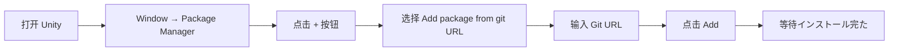
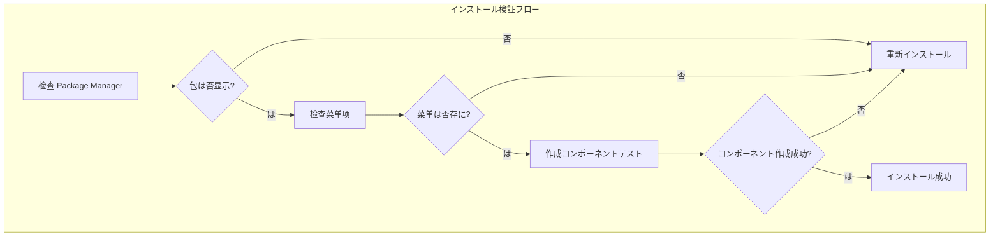

# インストールメソッド

ドキュメントに Unity プロジェクトインストール GlobalConfig グローバルコンポーネント。

## 

GlobalConfig は GameFrameX フレームワークのコアコンポーネント，にゲームのグローバル，バージョン、リソースバージョン、。コンポーネント Unity Package Manager (UPM) ，サポートインストールの。

## インストール

にインストール GlobalConfig コンポーネント，の：

|  | バージョン |  |
|------|----------|------|
| Unity エディター | 2017.1 | サポートの Unity バージョン |
| マネージャー |  | Unity 2017.1+  |

### 

GlobalConfig コンポーネント GameFrameX コア：

|  | バージョン |  |
|--------|----------|------|
| com.gameframex.unity | 1.1.1 | GameFrameX コアフレームワーク |
| com.gameframex.unity.web | 1.1.2 | Web ネットワークリクエストコンポーネント |

> ****： UPM インストール，インストール。。

## インストールメソッド

GlobalConfig コンポーネントインストールメソッド，プロジェクトの：

### ：をじて manifest.json インストール（）

はのインストールメソッド，バージョンと。にプロジェクトの `Packages/manifest.json` ファイル。

**ステップ：**

1.  Unity プロジェクトの `Packages` ファイル
2. エディター `manifest.json` ファイル
3. に `dependencies` ：

```json
{
  "dependencies": {
    "com.gameframex.unity.globalconfig": "https://github.com/GameFrameX/com.gameframex.unity.globalconfig.git"
  }
}
```

> ****：のはバージョンの Git URL (`https://github.com/GameFrameX/com.gameframex.unity.globalconfig.git`)，，のリポジトリ。

**の manifest.json：**

```json
{
  "dependencies": {
    "com.gameframex.unity.globalconfig": "https://github.com/GameFrameX/com.gameframex.unity.globalconfig.git",
    "com.unity.collab-proxy": "1.15.18",
    "com.unity.ide.rider": "3.0.15",
    "com.unity.ide.visualstudio": "2.0.16",
    "com.unity.ide.vscode": "1.2.5",
    "com.unity.test-framework": "1.1.31",
    "com.unity.textmeshpro": "3.0.6",
    "com.unity.timeline": "1.6.4",
    "com.unity.ugui": "1.0.0",
    "com.unity.modules.ai": "1.0.0",
    "com.unity.modules.androidjni": "1.0.0",
    "com.unity.modules.animation": "1.0.0",
    "com.unity.modules.assetbundle": "1.0.0",
    "com.unity.modules.audio": "1.0.0",
    "com.unity.modules.cloth": "1.0.0",
    "com.unity.modules.director": "1.0.0",
    "com.unity.modules.imageconversion": "1.0.0",
    "com.unity.modules.imgui": "1.0.0",
    "com.unity.modules.jsonserialize": "1.0.0",
    "com.unity.modules.particlesystem": "1.0.0",
    "com.unity.modules.physics": "1.0.0",
    "com.unity.modules.physics2d": "1.0.0",
    "com.unity.modules.screencapture": "1.0.0",
    "com.unity.modules.terrain": "1.0.0",
    "com.unity.modules.terrainphysics": "1.0.0",
    "com.unity.modules.tilemap": "1.0.0",
    "com.unity.modules.ui": "1.0.0",
    "com.unity.modules.uielements": "1.0.0",
    "com.unity.modules.umbra": "1.0.0",
    "com.unity.modules.unityanalytics": "1.0.0",
    "com.unity.modules.unitywebrequest": "1.0.0",
    "com.unity.modules.unitywebrequestassetbundle": "1.0.0",
    "com.unity.modules.unitywebrequestaudio": "1.0.0",
    "com.unity.modules.unitywebrequesttexture": "1.0.0",
    "com.unity.modules.unitywebrequestwww": "1.0.0",
    "com.unity.modules.vehicles": "1.0.0",
    "com.unity.modules.video": "1.0.0",
    "com.unity.modules.vr": "1.0.0",
    "com.unity.modules.wind": "1.0.0",
    "com.unity.modules.xr": "1.0.0"
  }
}
```

4. ファイルす Unity エディター
5. マネージャー

### ：をじて Unity Package Manager インストール

，をじて Unity の Package Manager インストール。

**ステップ：**

1.  Unity エディター
2. ：**Window** → **Package Manager**
3. に Package Manager ，の **+** 
4.  **Add package from git URL...** オプション
5. に Git URL：

```
https://github.com/GameFrameX/com.gameframex.unity.globalconfig.git
```

6.  **Add** インストール
7. とた



### ：インストール（ローカル）

ローカルバージョンネットワーク，インストールメソッド。

**ステップ：**

1.  GitHub リポジトリコード：

   ```
   https://github.com/GameFrameX/com.gameframex.unity.globalconfig.git
   ```

2. のファイル Unity プロジェクトの `Packages` ディレクトリ
3. Unity ロードの
4. バージョン，ファイル

**：**
- ファイルむ `package.json` ファイル Unity 
- のファイル，：`Packages/com.gameframex.unity.globalconfig/`

## インストール

インストールた，をじては：

1. ** Package Manager**：に Package Manager  `Game Frame X Global Config` 
2. ****：に Unity  **Game Framework** → **Global Config** 
3. **コンポーネント**：に， **Add Component**， "Global Config"，コンポーネント



## よくある

### Q1: インストール，ネットワークエラー

****：
- ネットワークは
-  VPN
- インストール

### Q2: バージョン

****：
-  `com.gameframex.unity` のバージョン
- に manifest.json のバージョン

### Q3: バージョン

****：
- Git URL インストールメソッドデフォルトバージョン
- バージョン，に URL バージョン，：
  ```
  https://github.com/GameFrameX/com.gameframex.unity.globalconfig.git#1.3.0
  ```

## リンク

- [GitHub リポジトリ](https://github.com/GameFrameX/com.gameframex.unity.globalconfig.git)
- [GameFrameX ドキュメント](https://gameframex.doc.alianblank.com)
- [](./3-getting-started.1-add-to-scene)
- [プロパティ](./3-getting-started.2-configure-properties)
- [コード](./3-getting-started.3-code-access)
