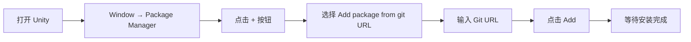
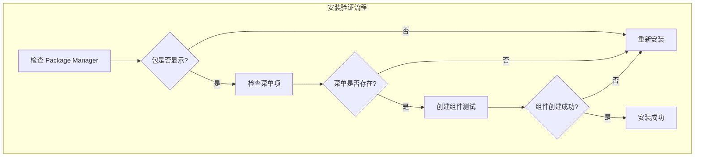

# インストールメソッド

このドキュメント介绍如何在 Unity プロジェクト中インストール GlobalConfig 全局設定コンポーネント。

## 概要

GlobalConfig 是 GameFrameX フレームワーク的コアコンポーネント之一，用于管理游戏的全局設定情報，含みます应用程序バージョン確認地址、リソースバージョン確認地址、服务器地址等。该コンポーネント采用 Unity Package Manager (UPM) 方法进行管理，サポート多种インストール途径以适应不同的开发工作流。

## インストール前提条件

在インストール GlobalConfig コンポーネント之前，请確認してください您的开发環境满足以下要求：

| 需求 | 最低バージョン | 説明 |
|------|----------|------|
| Unity エディタ | 2017.1 | サポート的 Unity バージョン |
| パッケージマネージャー | 内置 | Unity 2017.1+ 内置 |

### 依赖项説明

GlobalConfig コンポーネント依赖于以下 GameFrameX コアパッケージ：

| 依赖パッケージ | バージョン要求 | 説明 |
|--------|----------|------|
| com.gameframex.unity | 1.1.1 | GameFrameX コアフレームワーク |
| com.gameframex.unity.web | 1.1.2 | Web 网络请求コンポーネント |

> **注意**：当使用 UPM 方法インストール时，依赖项会自动解析并インストール。您无需手动処理依赖关系。

## インストールメソッド

GlobalConfig コンポーネント提供三种インストール方法，您〜できます根据プロジェクト需求选择最适合的一种：

### 方法一：通过 manifest.json インストール（推奨）

这是最推奨的インストール方法，便于バージョン管理和团队协作。您〜する必要があります在プロジェクト的 `Packages/manifest.json` ファイル中追加パッケージ依赖。

**操作ステップ：**

1. 找到您 Unity プロジェクト的 `Packages` ファイル夹
2. 使用文本エディタ打开 `manifest.json` ファイル
3. 在 `dependencies` 节点下追加以下内容：

```json
{
  "dependencies": {
    "com.gameframex.unity.globalconfig": "https://github.com/GameFrameX/com.gameframex.unity.globalconfig.git"
  }
}
```

> **注意**：もし您使用的是旧バージョン的 Git URL (`https://github.com/GameFrameX/com.gameframex.unity.globalconfig.git`)，仍可继续使用，但お勧めアップデート为新的官方リポジトリ地址。

**例完全な的 manifest.json：**

```json
{
  "dependencies": {
    "com.gameframex.unity.globalconfig": "https://github.com/GameFrameX/com.gameframex.unity.globalconfig.git",
    "com.unity.collab-proxy": "1.15.18",
    "com.unity.ide.rider": "3.0.15",
    "com.unity.ide.visualstudio": "2.0.16",
    "com.unity.ide.vscode": "1.2.5",
    "com.unity.test-framework": "1.1.31",
    "com.unity.textmeshpro": "3.0.6",
    "com.unity.timeline": "1.6.4",
    "com.unity.ugui": "1.0.0",
    "com.unity.modules.ai": "1.0.0",
    "com.unity.modules.androidjni": "1.0.0",
    "com.unity.modules.animation": "1.0.0",
    "com.unity.modules.assetbundle": "1.0.0",
    "com.unity.modules.audio": "1.0.0",
    "com.unity.modules.cloth": "1.0.0",
    "com.unity.modules.director": "1.0.0",
    "com.unity.modules.imageconversion": "1.0.0",
    "com.unity.modules.imgui": "1.0.0",
    "com.unity.modules.jsonserialize": "1.0.0",
    "com.unity.modules.particlesystem": "1.0.0",
    "com.unity.modules.physics": "1.0.0",
    "com.unity.modules.physics2d": "1.0.0",
    "com.unity.modules.screencapture": "1.0.0",
    "com.unity.modules.terrain": "1.0.0",
    "com.unity.modules.terrainphysics": "1.0.0",
    "com.unity.modules.tilemap": "1.0.0",
    "com.unity.modules.ui": "1.0.0",
    "com.unity.modules.uielements": "1.0.0",
    "com.unity.modules.umbra": "1.0.0",
    "com.unity.modules.unityanalytics": "1.0.0",
    "com.unity.modules.unitywebrequest": "1.0.0",
    "com.unity.modules.unitywebrequestassetbundle": "1.0.0",
    "com.unity.modules.unitywebrequestaudio": "1.0.0",
    "com.unity.modules.unitywebrequesttexture": "1.0.0",
    "com.unity.modules.unitywebrequestwww": "1.0.0",
    "com.unity.modules.vehicles": "1.0.0",
    "com.unity.modules.video": "1.0.0",
    "com.unity.modules.vr": "1.0.0",
    "com.unity.modules.wind": "1.0.0",
    "com.unity.modules.xr": "1.0.0"
  }
}
```

4. 保存ファイル并返す Unity エディタ
5. 等待パッケージマネージャー自动下载并导入依赖パッケージ

### 方法二：通过 Unity Package Manager インストール

もし您更喜欢使用图形界面，〜できます通过 Unity 内置的 Package Manager インストール。

**操作ステップ：**

1. 打开 Unity エディタ
2. ナビゲーション到メニュー：**Window** → **Package Manager**
3. 在 Package Manager ウィンドウ中，点击左上角的 **+** ボタン
4. 选择 **Add package from git URL...** オプション
5. 在输入框中粘贴以下 Git URL：

```
https://github.com/GameFrameX/com.gameframex.unity.globalconfig.git
```

6. 点击 **Add** ボタン开始インストール
7. 等待下载和导入完成



### 方法三：手动インストール（本地开发）

もし您〜する必要があります使用本地开发バージョン或无法访问网络，〜できます采用手动インストール方法。

**操作ステップ：**

1. 访问 GitHub リポジトリ下载ソースコード：

   ```
   https://github.com/GameFrameX/com.gameframex.unity.globalconfig.git
   ```

2. 将下载的ファイル夹内容复制到 Unity プロジェクト的 `Packages` ディレクトリ下
3. Unity 会自动识别并ロード符合规范的パッケージ
4. もし〜する必要がありますアップデートバージョン，只需置換ファイル夹内容

**注意事项：**
- パッケージファイル夹〜する必要がありますパッケージ含 `package.json` ファイル才能被 Unity 正确识别
- お勧め使用有意义的ファイル夹名称，例えば：`Packages/com.gameframex.unity.globalconfig/`

## インストールの確認

インストール完成后，〜できます通过以下方法検証是否成功：

1. **確認 Package Manager**：在 Package Manager ウィンドウ中確認 `Game Frame X Global Config` パッケージ已显示
2. **確認メニュー项**：在 Unity メニュー栏中確認出现 **Game Framework** → **Global Config** メニュー项
3. **作成コンポーネント**：在シーン中作成空物体，右键点击 **Add Component**，検索 "Global Config"，確認コンポーネント可正常追加



## よくある問題

### Q1: インストール失敗，ヒント网络エラー

**解決策**：
- 確認网络连接是否正常
- 尝试使用代理或 VPN
- 使用方法三进行手动インストール

### Q2: 依赖项バージョン冲突

**解決策**：
- 確認其他パッケージ对 `com.gameframex.unity` 的バージョン要求
- 在 manifest.json 中明确指定兼容的バージョン号

### Q3: パッケージバージョン过旧

**解決策**：
- Git URL インストール方法デフォルト取得最新バージョン
- 如需特定バージョン，可在 URL 后追加バージョン标签，例えば：
  ```
  https://github.com/GameFrameX/com.gameframex.unity.globalconfig.git#1.3.0
  ```

## 関連リンク

- [GitHub リポジトリ](https://github.com/GameFrameX/com.gameframex.unity.globalconfig.git)
- [GameFrameX 官方ドキュメント](https://gameframex.doc.alianblank.com)
- [追加到シーン](./3-getting-started.1-add-to-scene)
- [設定プロパティ](./3-getting-started.2-configure-properties)
- [コード访问](./3-getting-started.3-code-access)
