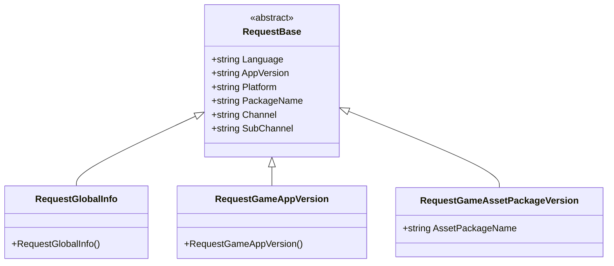
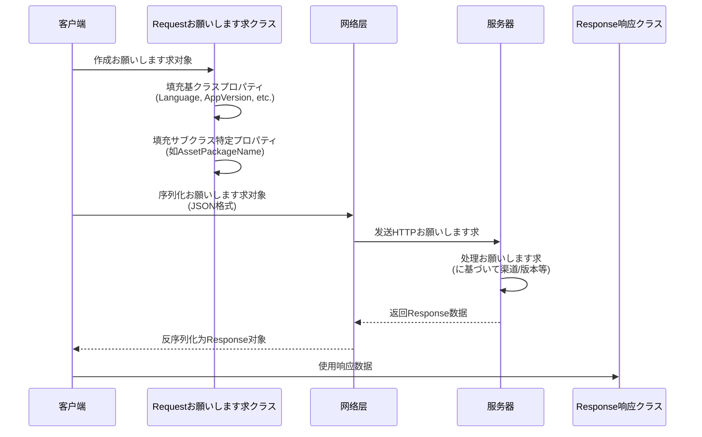

# お願いします求クラス

お願いします求クラス是 GlobalConfig 系统中に使用封装客户端お願いします求数据的 DTO（Data Transfer Object）クラス。它们负责携带客户端环境信息向服务器お願いします求配置数据。

## 概要

お願いします求クラス采用面向对象的设计模式，を通じて继承 `RequestBase` 基クラス実装统一的数据结构，同时允许各具体お願いします求クラス型扩展自己的特定字段。这种设计确保了：

- **代码复用**：所有お願いします求共有的プロパティ（如语言、版本、平台等）在基クラス中统一管理
- **クラス型安全**：每个お願いします求クラス型有明确的语义，便于区分和管理
- **可扩展性**：を通じて继承可能轻松添加新的お願いします求クラス型或扩展现有お願いします求

### コア设计意图

GlobalConfig 系统必要取得服务器上的配置数据，客户端必要告诉服务器**我是谁**（渠道、包名）、**我在哪里**（平台）、**我的版本是什么**（应用版本）等信息。お願いします求クラス正是承担这一职责——将客户端上下文信息序列化后发送给服务器。

## クラス层次结构



该クラス图展示了お願いします求クラス的完整继承关系。所有具体お願いします求クラス型都を継承抽象基底クラス `RequestBase`，后者定义了所有お願いします求共有的プロパティ。

## RequestBase 基クラス

`RequestBase` 是所有お願いします求クラス的抽象基底クラス，定义了客户端お願いします求时必要携带的通用信息。

```csharp
namespace GameFrameX.GlobalConfig.Runtime
{
    /// <summary>
    /// お願いします求基クラス
    /// </summary>
    public abstract class RequestBase
    {
        /// <summary>
        /// 语言
        /// </summary>
        public string Language { get; set; }

        /// <summary>
        /// 程序版本
        /// </summary>
        public string AppVersion { get; set; }

        /// <summary>
        /// 运行平台
        /// </summary>
        public string Platform { get; set; }

        /// <summary>
        /// 包名
        /// </summary>
        public string PackageName { get; set; }

        /// <summary>
        /// 渠道
        /// </summary>
        public string Channel { get; set; }

        /// <summary>
        /// 子渠道
        /// </summary>
        public string SubChannel { get; set; }
    }
}
```

> Source: [RequestBase.cs](https://github.com/GameFrameX/com.gameframex.unity.globalconfig/blob/main/Runtime/GlobalConfig/RequestBase.cs#L1-L38)

### プロパティ説明

| プロパティ | クラス型 | 説明 |
|------|------|------|
| Language | string | 客户端当前使用的语言，に使用服务器返回对应语言的配置 |
| AppVersion | string | 应用程序版本号，に使用版本校验和差异化配置 |
| Platform | string | 运行平台（如 iOS、Android、Windows 等） |
| PackageName | string | 应用包名，に使用区分不同应用 |
| Channel | string | 发行渠道标识，に使用分渠道配置 |
| SubChannel | string | 子渠道标识，に使用更细粒度的渠道区分 |

### 设计意图

这些通用プロパティ是ゲーム和应用配置系统中常见的分区维度。を通じて在お願いします求中携带这些信息，服务器可能：
- に基づいて版本返回不同的配置（ホットアップデート）
- に基づいて平台返回不同的リソース路径
- に基づいて渠道返回不同的活动配置
- に基づいて语言返回本地化内容

## 具体お願いします求クラス

### RequestGlobalInfo

全局信息お願いします求クラス，に使用取得ゲーム的グローバル設定信息。

```csharp
namespace GameFrameX.GlobalConfig.Runtime
{
    /// <summary>
    /// 全局信息お願いします求对象,可能自己继承実装自己的字段
    /// </summary>
    public class RequestGlobalInfo : RequestBase
    {
    }
}
```

> Source: [RequestGlobalInfo.cs](https://github.com/GameFrameX/com.gameframex.unity.globalconfig/blob/main/Runtime/GlobalConfig/RequestGlobalInfo.cs#L1-L9)

**设计意图**：该クラスを継承 `RequestBase`，に使用お願いします求包含ゲームグローバル設定的响应数据（如服务器地址、版本检查インターフェース等）。文档注释表明允许開発者继承此クラス添加自定义字段。

### RequestGameAppVersion

ゲーム版本お願いします求クラス，に使用检查应用程序是否有新版本可用。

```csharp
namespace GameFrameX.GlobalConfig.Runtime
{
    /// <summary>
    /// ゲーム版本お願いします求对象,可能自己继承実装自己的字段
    /// </summary>
    public class RequestGameAppVersion : RequestBase
    {
    }
}
```

> Source: [RequestGameAppVersion.cs](https://github.com/GameFrameX/com.gameframex.unity.globalconfig/blob/main/Runtime/GlobalConfig/RequestGameAppVersion.cs#L1-L9)

**设计意图**：该クラスに使用向服务器查询当前应用版本的ステータス。服务器可能返回版本对比结果，ヒント用户是否必要更新。

### RequestGameAssetPackageVersion

ゲームリソース包版本お願いします求クラス，に使用检查特定リソース包是否必要更新。

```csharp
namespace GameFrameX.GlobalConfig.Runtime
{
    /// <summary>
    /// ゲームリソース版本お願いします求对象,可能自己继承実装自己的字段
    /// </summary>
    public class RequestGameAssetPackageVersion : RequestBase
    {
        /// <summary>
        /// リソース包名称
        /// </summary>
        public string AssetPackageName { get; set; }
    }
}
```

> Source: [RequestGameAssetPackageVersion.cs](https://github.com/GameFrameX/com.gameframex.unity.globalconfig/blob/main/Runtime/GlobalConfig/RequestGameAssetPackageVersion.cs#L1-L13)

**设计意图**：与 `RequestGameAppVersion` 不同，此クラス专门に使用リソース包的版本检查。を通じて `AssetPackageName` プロパティ指定要检查的具体リソース包名称。这サポート了ゲームリソースホットアップデート機能，可能只更新变化的部分而非整个应用。

## お願いします求フロー



该フロー图展示了お願いします求对象从作成到服务器响应的完整生命周期。お願いします求对象携带必要的上下文信息，帮助服务器做出正确的响应决策。

## 扩展お願いします求クラス

如果内置的お願いします求クラス无法满足需求，開発者可能を通じて继承来扩展：

```csharp
// 自定义お願いします求示例
public class RequestCustomConfig : RequestBase
{
    /// <summary>
    /// 自定义字段：シーンID
    /// </summary>
    public int SceneId { get; set; }

    /// <summary>
    /// 自定义字段：玩家ID
    /// </summary>
    public string PlayerId { get; set; }
}
```

**扩展手順**：
1. を継承 `RequestBase`
2. 添加业务所需的特定プロパティ
3. 在发送お願いします求时作成インスタンス并填充数据

## 関連リンク

- [响应クラス](./5-data-structures.2-response-classes) - 了解お願いします求对应的响应数据结构
- [GlobalConfigComponent](./4-core-component.1-global-config-component) - 了解如何使用お願いします求取得配置
- [快速开始 - 代码访问](./3-getting-started.3-code-access) - 了解如何在代码中使用这些お願いします求クラス
