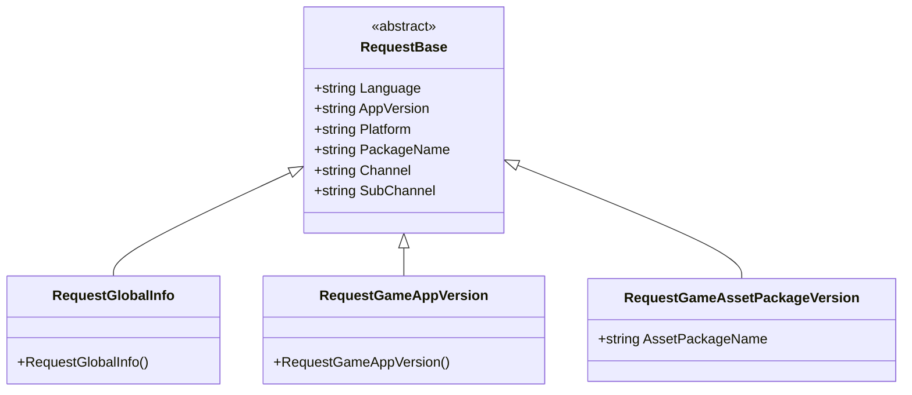
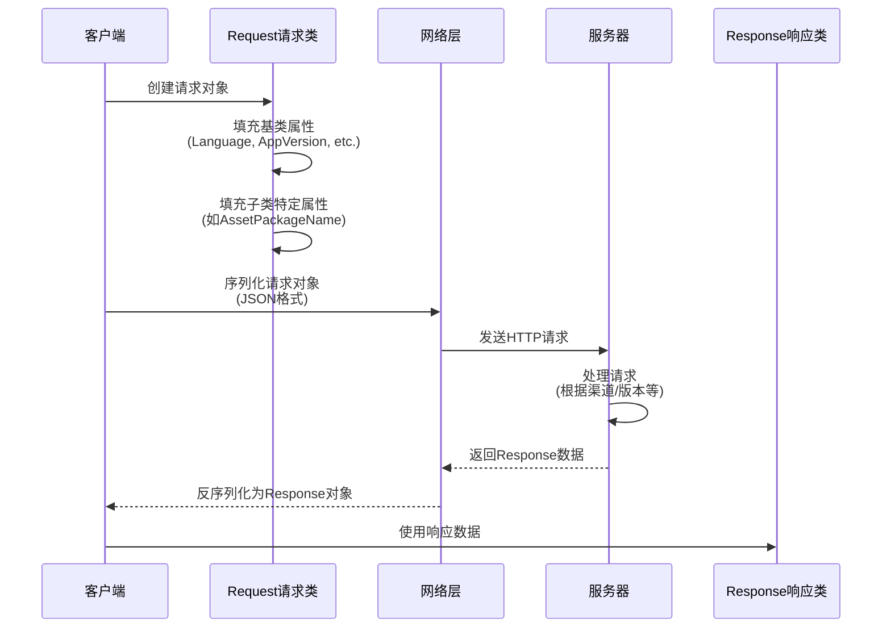

# 请求类

请求类是 GlobalConfig 系统中用于カプセル化客户端请求数据的 DTO（Data Transfer Object）类。它们负责携带客户端環境情報向服务器请求設定数据。

## 概要

请求类采用面向对象的設計モード，通过継承 `RequestBase` 基底クラス実装統一された的数据结构，同時に允许各具体请求タイプ拡張自己的特定フィールド。这种設計確認してください了：

- **コード复用**：所有请求共有的プロパティ（如语言、バージョン、プラットフォーム等）在基底クラス中統一された管理
- **タイプ安全**：每个请求タイプ有明确的语义，便于区分和管理
- **可拡張性**：通过継承〜できます轻松追加新的请求タイプ或拡張现有请求

### コア設計意图

GlobalConfig 系统〜する必要があります取得服务器上的設定数据，客户端〜する必要があります告诉服务器**我是谁**（渠道、パッケージ名）、**我在哪里**（プラットフォーム）、**我的バージョン是什么**（应用バージョン）等情報。请求类正是承担这一职责——将客户端上下文情報シリアライズ后发送给服务器。

## 类层次结构



このクラス图表示了请求类的完全な継承关系。所有具体请求タイプ都継承自抽象基底クラス `RequestBase`，后者定義了所有请求共有的プロパティ。

## RequestBase 基底クラス

`RequestBase` 是所有请求类的抽象基底クラス，定義了客户端请求时〜する必要があります携带的汎用情報。

```csharp
namespace GameFrameX.GlobalConfig.Runtime
{
    /// <summary>
    /// 请求基类
    /// </summary>
    public abstract class RequestBase
    {
        /// <summary>
        /// 语言
        /// </summary>
        public string Language { get; set; }

        /// <summary>
        /// 程序版本
        /// </summary>
        public string AppVersion { get; set; }

        /// <summary>
        /// 运行平台
        /// </summary>
        public string Platform { get; set; }

        /// <summary>
        /// 包名
        /// </summary>
        public string PackageName { get; set; }

        /// <summary>
        /// 渠道
        /// </summary>
        public string Channel { get; set; }

        /// <summary>
        /// 子渠道
        /// </summary>
        public string SubChannel { get; set; }
    }
}
```

> Source: [RequestBase.cs](https://github.com/GameFrameX/com.gameframex.unity.globalconfig/blob/main/Runtime/GlobalConfig/RequestBase.cs#L1-L38)

### プロパティ説明

| プロパティ | タイプ | 説明 |
|------|------|------|
| Language | string | 客户端当前使用的语言，用于服务器返す对应语言的設定 |
| AppVersion | string | 应用程序バージョン号，用于バージョン校验和差异化設定 |
| Platform | string | 运行プラットフォーム（如 iOS、Android、Windows 等） |
| PackageName | string | 应用パッケージ名，用于区分不同应用 |
| Channel | string | 发行渠道标识，用于分渠道設定 |
| SubChannel | string | 子渠道标识，用于更细粒度的渠道区分 |

### 設計意图

这些汎用プロパティ是游戏和应用設定系统中常见的分区维度。通过在请求中携带这些情報，服务器〜できます：
- 根据バージョン返す不同的設定（ホットアップデート）
- 根据プラットフォーム返す不同的リソースパス
- 根据渠道返す不同的活动設定
- 根据语言返す本地化内容

## 具体请求类

### RequestGlobalInfo

全局情報请求类，用于取得游戏的全局設定情報。

```csharp
namespace GameFrameX.GlobalConfig.Runtime
{
    /// <summary>
    /// 全局信息请求对象,可以自己继承实现自己的字段
    /// </summary>
    public class RequestGlobalInfo : RequestBase
    {
    }
}
```

> Source: [RequestGlobalInfo.cs](https://github.com/GameFrameX/com.gameframex.unity.globalconfig/blob/main/Runtime/GlobalConfig/RequestGlobalInfo.cs#L1-L9)

**設計意图**：このクラス継承自 `RequestBase`，用于请求パッケージ含游戏全局設定的响应数据（如服务器地址、バージョン確認インターフェース等）。ドキュメント注释表明允许開発者継承此类追加自定義フィールド。

### RequestGameAppVersion

游戏バージョン请求类，用于確認应用程序是否有新バージョン可用。

```csharp
namespace GameFrameX.GlobalConfig.Runtime
{
    /// <summary>
    /// 游戏版本请求对象,可以自己继承实现自己的字段
    /// </summary>
    public class RequestGameAppVersion : RequestBase
    {
    }
}
```

> Source: [RequestGameAppVersion.cs](https://github.com/GameFrameX/com.gameframex.unity.globalconfig/blob/main/Runtime/GlobalConfig/RequestGameAppVersion.cs#L1-L9)

**設計意图**：このクラス用于向服务器查询当前应用バージョン的ステータス。服务器〜できます返すバージョン对比結果，ヒントユーザー是否〜する必要がありますアップデート。

### RequestGameAssetPackageVersion

游戏リソースパッケージバージョン请求类，用于確認特定リソースパッケージ是否〜する必要がありますアップデート。

```csharp
namespace GameFrameX.GlobalConfig.Runtime
{
    /// <summary>
    /// 游戏资源版本请求对象,可以自己继承实现自己的字段
    /// </summary>
    public class RequestGameAssetPackageVersion : RequestBase
    {
        /// <summary>
        /// 资源包名称
        /// </summary>
        public string AssetPackageName { get; set; }
    }
}
```

> Source: [RequestGameAssetPackageVersion.cs](https://github.com/GameFrameX/com.gameframex.unity.globalconfig/blob/main/Runtime/GlobalConfig/RequestGameAssetPackageVersion.cs#L1-L13)

**設計意图**：与 `RequestGameAppVersion` 不同，此类专门用于リソースパッケージ的バージョン確認。通过 `AssetPackageName` プロパティ指定要確認的具体リソースパッケージ名称。这サポート了游戏リソースホットアップデート機能，〜できます只アップデート变化的部分而非整个应用。

## 请求フロー



このフロー图表示了请求对象从作成到服务器响应的完全なライフサイクル。请求对象携带必要的上下文情報，帮助服务器做出正确的响应决策。

## 拡張请求类

もし内置的请求类无法满足需求，開発者〜できます通过継承来拡張：

```csharp
// 自定义请求示例
public class RequestCustomConfig : RequestBase
{
    /// <summary>
    /// 自定义字段：场景ID
    /// </summary>
    public int SceneId { get; set; }

    /// <summary>
    /// 自定义字段：玩家ID
    /// </summary>
    public string PlayerId { get; set; }
}
```

**拡張ステップ**：
1. 継承自 `RequestBase`
2. 追加业务所需的特定プロパティ
3. 在发送请求时作成インスタンス并填充数据

## 関連リンク

- [响应类](./5-data-structures.2-response-classes) - 理解する请求对应的响应数据结构
- [GlobalConfigComponent](./4-core-component.1-global-config-component) - 理解する如何使用请求取得設定
- [快速开始 - コード访问](./3-getting-started.3-code-access) - 理解する如何在コード中使用这些请求类
