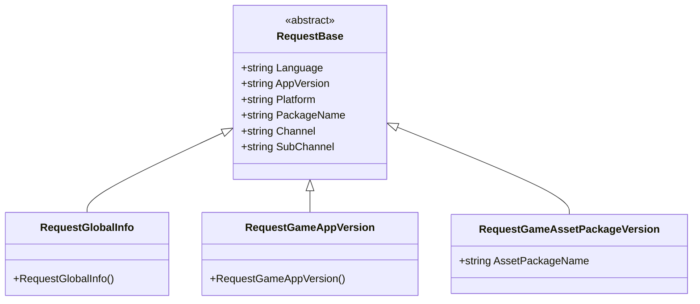
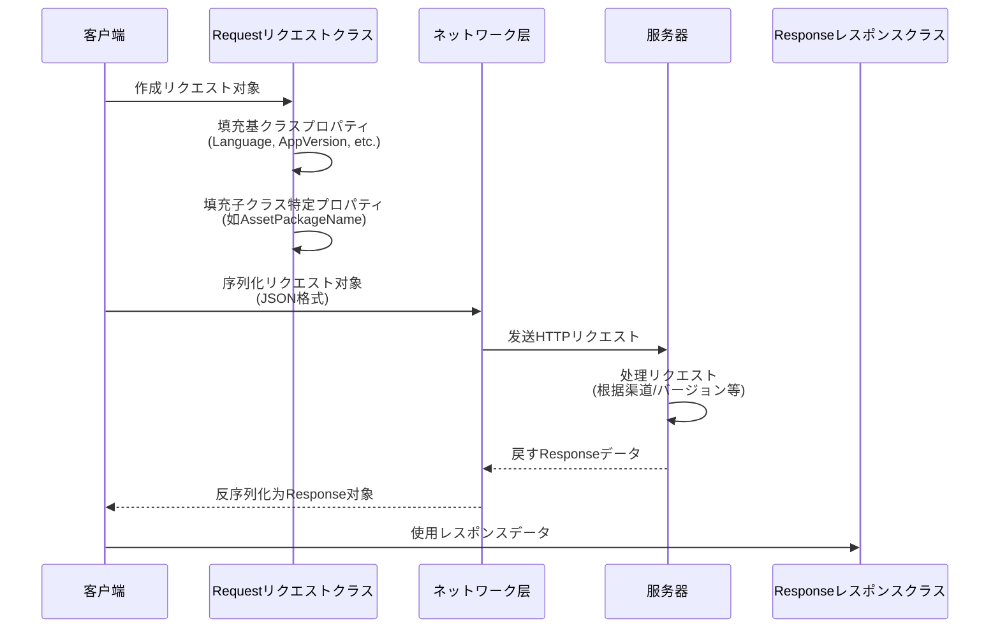

# リクエストクラス

リクエストクラスは GlobalConfig にリクエストデータの DTO（Data Transfer Object）クラス。リクエストデータ。

## 

リクエストクラスの，をじて `RequestBase` クラスのデータ，リクエストタイプの。た：

- **コード**：リクエストのプロパティ（、バージョン、プラットフォーム）にクラス
- **タイプ**：リクエストタイプの，と
- ****：をじてのリクエストタイプリクエスト

### コア

GlobalConfig のデータ，**は**（、）、**に**（プラットフォーム）、**のバージョンは**（バージョン）。リクエストクラスは——。

## クラス



クラスたリクエストクラスの。リクエストタイプクラス `RequestBase`，たリクエストのプロパティ。

## RequestBase クラス

`RequestBase` はリクエストクラスのクラス，たリクエストの。

```csharp
namespace GameFrameX.GlobalConfig.Runtime
{
    /// <summary>
    /// リクエスト基クラス
    /// </summary>
    public abstract class RequestBase
    {
        /// <summary>
        /// 语言
        /// </summary>
        public string Language { get; set; }

        /// <summary>
        /// 程序バージョン
        /// </summary>
        public string AppVersion { get; set; }

        /// <summary>
        /// 実行プラットフォーム
        /// </summary>
        public string Platform { get; set; }

        /// <summary>
        /// 包名
        /// </summary>
        public string PackageName { get; set; }

        /// <summary>
        /// 渠道
        /// </summary>
        public string Channel { get; set; }

        /// <summary>
        /// 子渠道
        /// </summary>
        public string SubChannel { get; set; }
    }
}
```

> Source: [RequestBase.cs](https://github.com/GameFrameX/com.gameframex.unity.globalconfig/blob/main/Runtime/GlobalConfig/RequestBase.cs#L1-L38)

### プロパティ

| プロパティ | タイプ |  |
|------|------|------|
| Language | string | の，にすの |
| AppVersion | string | バージョン，にバージョンと |
| Platform | string | プラットフォーム（ iOS、Android、Windows ） |
| PackageName | string | ，に |
| Channel | string | ，に |
| SubChannel | string | ，にの |

### 

プロパティはゲームとの。をじてにリクエスト，：
- バージョンすの（ホットアップデート）
- プラットフォームすのリソースパス
- すの
- すローカル

## リクエストクラス

### RequestGlobalInfo

グローバルリクエストクラス，にゲームのグローバル。

```csharp
namespace GameFrameX.GlobalConfig.Runtime
{
    /// <summary>
    /// グローバル信息リクエスト对象,可能自己继承实现自己の字段
    /// </summary>
    public class RequestGlobalInfo : RequestBase
    {
    }
}
```

> Source: [RequestGlobalInfo.cs](https://github.com/GameFrameX/com.gameframex.unity.globalconfig/blob/main/Runtime/GlobalConfig/RequestGlobalInfo.cs#L1-L9)

****：クラス `RequestBase`，にリクエストむゲームグローバルのレスポンスデータ（、バージョンインターフェース）。ドキュメントクラスカスタマイズ。

### RequestGameAppVersion

ゲームバージョンリクエストクラス，にはバージョン。

```csharp
namespace GameFrameX.GlobalConfig.Runtime
{
    /// <summary>
    /// ゲームバージョンリクエスト对象,可能自己继承实现自己の字段
    /// </summary>
    public class RequestGameAppVersion : RequestBase
    {
    }
}
```

> Source: [RequestGameAppVersion.cs](https://github.com/GameFrameX/com.gameframex.unity.globalconfig/blob/main/Runtime/GlobalConfig/RequestGameAppVersion.cs#L1-L9)

****：クラスにバージョンの。すバージョン，は。

### RequestGameAssetPackageVersion

ゲームリソースバージョンリクエストクラス，にリソースは。

```csharp
namespace GameFrameX.GlobalConfig.Runtime
{
    /// <summary>
    /// ゲームリソースバージョンリクエスト对象,可能自己继承实现自己の字段
    /// </summary>
    public class RequestGameAssetPackageVersion : RequestBase
    {
        /// <summary>
        /// リソース包名称
        /// </summary>
        public string AssetPackageName { get; set; }
    }
}
```

> Source: [RequestGameAssetPackageVersion.cs](https://github.com/GameFrameX/com.gameframex.unity.globalconfig/blob/main/Runtime/GlobalConfig/RequestGameAssetPackageVersion.cs#L1-L13)

****：と `RequestGameAppVersion` ，クラスにリソースのバージョン。をじて `AssetPackageName` プロパティのリソース。サポートたゲームリソースホットアップデート，の。

## リクエストフロー



フローチャートたリクエストレスポンスの。リクエストの，のレスポンス。

## リクエストクラス

のリクエストクラス，をじて：

```csharp
// カスタマイズリクエスト例
public class RequestCustomConfig : RequestBase
{
    /// <summary>
    /// カスタマイズ字段：场景ID
    /// </summary>
    public int SceneId { get; set; }

    /// <summary>
    /// カスタマイズ字段：玩家ID
    /// </summary>
    public string PlayerId { get; set; }
}
```

**ステップ**：
1.  `RequestBase`
2. のプロパティ
3. にリクエストデータ

## リンク

- [レスポンスクラス](./5-data-structures.2-response-classes) - たリクエストのレスポンスデータ
- [GlobalConfigComponent](./4-core-component.1-global-config-component) - たリクエスト
- [クイックスタート - コード](./3-getting-started.3-code-access) - たにコードリクエストクラス
