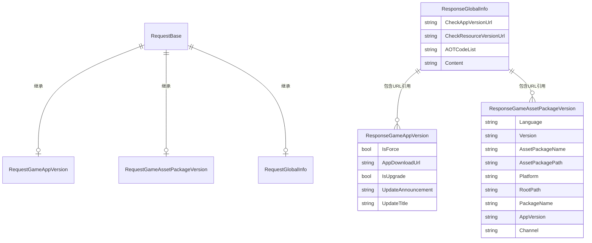

# 响应クラス

响应クラス（Response Classes）是 GlobalConfig 系统中に使用承载从服务器返回的配置数据的数据传输对象（DTO）。每个响应クラス对应一种特定クラス型的配置信息。

## 概要

在 GlobalConfig 系统中，客户端向服务器发送お願いします求后，服务器会返回相应的配置数据。这些返回的数据を通じて响应クラス进行结构和クラス型化，使得代码可能クラス型安全地访问配置信息。

GlobalConfig 提供します三种主要的响应クラス：

| 响应クラス | 用途 |
|--------|------|
| ResponseGameAppVersion | ゲーム应用程序版本信息 |
| ResponseGameAssetPackageVersion | ゲームリソース包版本信息 |
| ResponseGlobalInfo | グローバル設定信息 |

### 设计意图

响应クラス的设计遵循以下原则：

1. **简洁性**：使用简单的 POCO クラス，不引入额外的依赖
2. **クラス型安全**：每个配置クラス型有专门的クラス，提供强クラス型访问
3. **可扩展性**：可能を通じて继承或组合扩展新的响应クラス型

## クラス结构详解

### ResponseGameAppVersion

ゲーム版本信息响应クラス，包含应用升级関連的所有信息。

```csharp
namespace GameFrameX.GlobalConfig.Runtime
{
    /// <summary>
    /// ゲーム版本信息
    /// </summary>
    public class ResponseGameAppVersion
    {
        /// <summary>
        /// 是否强制升级
        /// </summary>
        public bool IsForce { get; set; }

        /// <summary>
        /// 程序ダウンロード地址
        /// </summary>
        public string AppDownloadUrl { get; set; }

        /// <summary>
        /// 是否必要更新
        /// </summary>
        public bool IsUpgrade { get; set; }

        /// <summary>
        /// 更新公告
        /// </summary>
        public string UpdateAnnouncement { get; set; }

        /// <summary>
        /// 更新标题
        /// </summary>
        public string UpdateTitle { get; set; }
    }
}
```

> Source: [ResponseGameAppVersion.cs](https://github.com/GameFrameX/com.gameframex.unity.globalconfig/blob/main/Runtime/GlobalConfig/ResponseGameAppVersion.cs#L1-L33)

**プロパティ説明：**

| プロパティ | クラス型 | 説明 |
|------|------|------|
| IsForce | bool | 是否强制升级，true 表示用户必須升级才能继续ゲーム |
| AppDownloadUrl | string | 新版本应用的ダウンロード URL 地址 |
| IsUpgrade | bool | 是否有可用更新，true 表示服务器上有新版本 |
| UpdateAnnouncement | string | 更新公告内容，通常显示给用户 |
| UpdateTitle | string | 更新ヒント的标题 |

### ResponseGameAssetPackageVersion

ゲームリソース包版本信息响应クラス，包含リソース更新的関連配置。

```csharp
namespace GameFrameX.GlobalConfig.Runtime
{
    /// <summary>
    /// ゲームリソース版本信息
    /// </summary>
    public class ResponseGameAssetPackageVersion
    {
        /// <summary>
        /// 语言
        /// </summary>
        public string Language { get; set; }

        /// <summary>
        /// リソース版本
        /// </summary>
        public string Version { get; set; }

        /// <summary>
        /// リソース包名称
        /// </summary>
        public string AssetPackageName { get; set; }

        /// <summary>
        /// リソース包路径
        /// </summary>
        public string AssetPackagePath { get; set; }

        /// <summary>
        /// 平台
        /// </summary>
        public string Platform { get; set; }

        /// <summary>
        /// ダウンロード根路径
        /// </summary>
        public string RootPath { get; set; }

        /// <summary>
        /// 包名
        /// </summary>
        public string PackageName { get; set; }

        /// <summary>
        /// ゲーム版本
        /// </summary>
        public string AppVersion { get; set; }

        /// <summary>
        /// 渠道名称
        /// </summary>
        public string Channel { get; set; }
    }
}
```

> Source: [ResponseGameAssetPackageVersion.cs](https://github.com/GameFrameX/com.gameframex.unity.globalconfig/blob/main/Runtime/GlobalConfig/ResponseGameAssetPackageVersion.cs#L1-L53)

**プロパティ説明：**

| プロパティ | クラス型 | 説明 |
|------|------|------|
| Language | string | 当前语言設定，如 "zh-CN"、"en-US" |
| Version | string | リソース包版本号，如 "1.0.0" |
| AssetPackageName | string | リソース包名称 |
| AssetPackagePath | string | リソース包相对路径 |
| Platform | string | 运行平台，如 "Android"、"iOS"、"Windows" |
| RootPath | string | リソースダウンロード的根ディレクトリ URL |
| PackageName | string | 应用包名 |
| AppVersion | string | 应用程序版本号 |
| Channel | string | 渠道标识 |

### ResponseGlobalInfo

全局信息响应クラス，包含系统级的配置端点和全局参数。

```csharp
namespace GameFrameX.GlobalConfig.Runtime
{
    /// <summary>
    /// 全局信息响应对象
    /// </summary>
    public class ResponseGlobalInfo
    {
        /// <summary>
        /// 检测程序版本地址
        /// </summary>
        public string CheckAppVersionUrl { get; set; }

        /// <summary>
        /// 检测リソース版本地址
        /// </summary>
        public string CheckResourceVersionUrl { get; set; }

        /// <summary>
        /// AOT代码列表
        /// </summary>
        public string AOTCodeList { get; set; }

        /// <summary>
        /// 扩展内容
        /// </summary>
        public string Content { get; set; }
    }
}
```

> Source: [ResponseGlobalInfo.cs](https://github.com/GameFrameX/com.gameframex.unity.globalconfig/blob/main/Runtime/GlobalConfig/ResponseGlobalInfo.cs#L1-L28)

**プロパティ説明：**

| プロパティ | クラス型 | 説明 |
|------|------|------|
| CheckAppVersionUrl | string | 检查应用程序版本的服务器インターフェース地址 |
| CheckResourceVersionUrl | string | 检查リソース包版本的服务器インターフェース地址 |
| AOTCodeList | string | AOT 编译代码列表的 JSON 字符串 |
| Content | string | 额外的扩展内容，可に使用自定义配置 |

## 数据流关系

以下图表展示了お願いします求クラス与响应クラス之间的对应关系：



## 使用例

### 基本用法

在ゲーム启动时从服务器取得グローバル設定：

```csharp
using GameFrameX.GlobalConfig.Runtime;
using UnityEngine;

public class ConfigManager : MonoBehaviour
{
    public void LoadGlobalConfig(string jsonData)
    {
        // 解析グローバル設定响应
        var globalInfo = new ResponseGlobalInfo
        {
            CheckAppVersionUrl = "https://api.example.com/check-app-version",
            CheckResourceVersionUrl = "https://api.example.com/check-resource-version",
            AOTCodeList = "[\"Method1\", \"Method2\"]",
            Content = "{\"config\": \"value\"}"
        };

        Debug.Log($"App Version URL: {globalInfo.CheckAppVersionUrl}");
        Debug.Log($"Resource Version URL: {globalInfo.CheckResourceVersionUrl}");
    }
}
```

### 处理ゲーム版本检查响应

```csharp
using GameFrameX.GlobalConfig.Runtime;
using UnityEngine;

public class VersionChecker
{
    public void HandleVersionResponse(ResponseGameAppVersion response)
    {
        if (response.IsUpgrade)
        {
            Debug.Log($"发现新版本: {response.UpdateTitle}");
            Debug.Log($"更新公告: {response.UpdateAnnouncement}");
            
            if (response.IsForce)
            {
                Debug.LogWarning("当前版本已过时，必要强制更新！");
                // 显示强制更新界面
            }
            else
            {
                // 显示可选更新界面
            }
            
            // 打开ダウンロード页面
            Application.OpenURL(response.AppDownloadUrl);
        }
        else
        {
            Debug.Log("当前已是最新版本");
        }
    }
}
```

### 处理リソース包版本响应

```csharp
using GameFrameX.GlobalConfig.Runtime;
using UnityEngine;

public class AssetUpdater
{
    public void HandleAssetVersionResponse(ResponseGameAssetPackageVersion response)
    {
        Debug.Log($"リソース版本: {response.Version}");
        Debug.Log($"リソース包: {response.AssetPackageName}");
        Debug.Log($"平台: {response.Platform}");
        Debug.Log($"渠道: {response.Channel}");
        Debug.Log($"ダウンロード根路径: {response.RootPath}");
        
        // に基づいて响应构建リソースダウンロード路径
        string fullAssetPath = $"{response.RootPath}/{response.AssetPackagePath}";
        Debug.Log($"完整リソース路径: {fullAssetPath}");
    }
}
```

## 与 GlobalConfigComponent 的集成

ResponseGlobalInfo 在 GlobalConfigComponent 中被使用，に使用存储从服务器取得的グローバル設定：

```csharp
namespace GameFrameX.GlobalConfig.Runtime
{
    public sealed class GlobalConfigComponent : GameFrameworkComponent
    {
        /// <summary>
        /// 取得グローバル設定信息
        /// </summary>
        /// <returns>返回グローバル設定信息对象</returns>
        public ResponseGlobalInfo GlobalInfo
        {
            get { return m_responseGlobalInfo; }
        }

        /// <summary>
        /// グローバル設定信息对象
        /// </summary>
        private ResponseGlobalInfo m_responseGlobalInfo;

        /// <summary>
        /// 設定グローバル設定信息
        /// </summary>
        /// <param name="globalInfo">グローバル設定信息对象</param>
        public void SetGlobalConfig(ResponseGlobalInfo globalInfo)
        {
            m_responseGlobalInfo = globalInfo;
        }
    }
}
```

> Source: [GlobalConfigComponent.cs](https://github.com/GameFrameX/com.gameframex.unity.globalconfig/blob/main/Runtime/GlobalConfig/GlobalConfigComponent.cs#L131-L158)

## 响应クラス与お願いします求クラス的对应关系

| お願いします求クラス | 响应クラス | 用途説明 |
|--------|--------|----------|
| RequestGameAppVersion | ResponseGameAppVersion | 客户端发送应用信息，服务器返回版本检查结果 |
| RequestGameAssetPackageVersion | ResponseGameAssetPackageVersion | 客户端发送リソース包名称，服务器返回リソース版本信息 |
| RequestGlobalInfo | ResponseGlobalInfo | 客户端お願いします求グローバル設定，服务器返回各服务インターフェース地址 |

## 扩展响应クラス

如果必要扩展响应クラス，可能自定义クラス来接收额外的服务器返回数据：

```csharp
using GameFrameX.GlobalConfig.Runtime;

/// <summary>
/// 自定义全局信息响应クラス
/// </summary>
[System.Serializable]
public class CustomResponseGlobalInfo : ResponseGlobalInfo
{
    /// <summary>
    /// 服务器时间戳
    /// </summary>
    public long ServerTimestamp { get; set; }

    /// <summary>
    /// 服务器区域
    /// </summary>
    public string ServerRegion { get; set; }

    /// <summary>
    /// 额外配置数据
    /// </summary>
    public Dictionary<string, object> ExtraData { get; set; }
}
```

## Related Links

- [お願いします求クラス](./5-data-structures.1-request-classes) - お願いします求クラス的详细文档
- [GlobalConfigComponent](./4-core-component.1-global-config-component) - コアコンポーネント文档
- [添加到シーン](./3-getting-started.1-add-to-scene) - 如何将コンポーネント添加到シーン
- [配置プロパティ](./3-getting-started.2-configure-properties) - 配置プロパティ説明
- [代码访问](./3-getting-started.3-code-access) - を通じて代码访问配置
